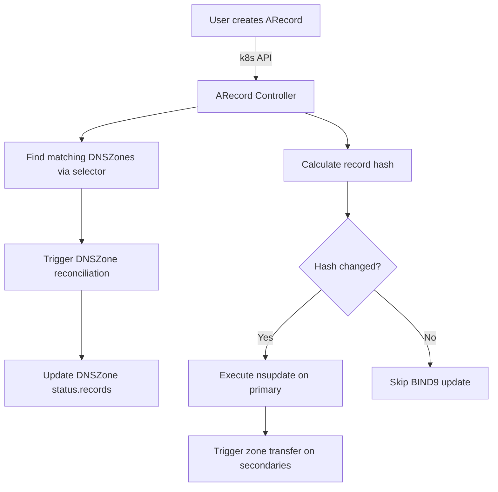

# Label Selector Watch Implementation Plan

**Author:** Erick Bourgeois
**Date:** 2025-12-26
**Status:** Design Phase

---

## Executive Summary

This document outlines a comprehensive plan to implement true Kubernetes API watches for DNSZone resources, enabling event-driven reconciliation when DNS records matching label selectors are created, updated, or deleted. The implementation will:

1. Enable DNSZones to watch for records matching their label selectors
2. Automatically tag matched records with zone ownership information
3. Track ready records in DNSZone status
4. Use dynamic DNS (nsupdate) for record updates
5. Trigger zone transfers only when records actually change

---

## Current Architecture Analysis

### Current State

**Controller Pattern:**
- DNSZone controller uses periodic reconciliation (30s when not ready, 5 minutes when ready)
- No `.watches()` configured for child record resources
- Individual record controllers watch their own types independently

**Limitations:**
```rust
// From src/main.rs:520-541
// Challenge: kube-rs `.watches()` requires synchronous mappers, but looking up
// which zones selected a record requires an async API call to check zone status.
//
// Solution: We maintain the existing periodic reconciliation for discovery,
// and rely on the DNSZone reconciler's built-in record discovery logic.
```

**Current Record Status Schema:**
```rust
pub struct RecordStatus {
    pub conditions: Vec<Condition>,
    pub observed_generation: Option<i64>,
    pub zone: Option<String>,  // ✅ Already exists!
}
```

**What's Missing:**
- Event-driven watch pattern for records → zones
- Record hash tracking for change detection
- Dynamic DNS integration
- Zone transfer triggering on record changes
- DNSZone tracking of selected records

---

## Requirements Review

### 1. Tag Records with Zone Information ✅ Partially Complete

**Current State:**
- `RecordStatus.zone` field already exists in schema
- Needs to be populated by reconcilers

**Required Changes:**
- Add annotation `bindy.firestoned.io/zone` to record metadata
- Populate `status.zone` in record reconcilers when matched

### 2. Track Ready Records in DNSZone Status

**Current State:**
- No `status.records` field in DNSZone

**Required Changes:**
- Add `status.records: Vec<RecordReference>` to DNSZoneStatus
- Update DNSZone reconciler to populate this list

### 3. Use Dynamic DNS for Record Updates

**Current State:**
- Records are added to zone files during zone creation
- No dynamic DNS (nsupdate) integration

**Required Changes:**
- Implement nsupdate commands in record reconcilers
- Add pod exec capability to run nsupdate on primary instances
- Hash-based change detection to avoid unnecessary updates

---

## Implementation Plan

### Phase 1: CRD Schema Updates

**Files to Modify:**
- `src/crd.rs` - Add new fields to CRD types
- `deploy/crds/*.crd.yaml` - Auto-generated via `cargo run --bin crdgen`

#### 1.1 Add RecordReference Type

```rust
/// Reference to a DNS record resource.
///
/// Used in `DNSZoneStatus.records` to track which records are currently
/// selected and ready for this zone.
#[derive(Clone, Debug, Serialize, Deserialize, JsonSchema, PartialEq, Eq)]
#[serde(rename_all = "camelCase")]
pub struct RecordReference {
    /// API version of the record (e.g., "bindy.firestoned.io/v1beta1")
    pub api_version: String,

    /// Kind of the record (e.g., "ARecord", "AAAARecord")
    pub kind: String,

    /// Name of the record resource
    pub name: String,

    /// Namespace of the record resource
    pub namespace: String,
}
```

#### 1.2 Update DNSZoneStatus

```rust
#[derive(Clone, Debug, Serialize, Deserialize, JsonSchema, Default)]
#[serde(rename_all = "camelCase")]
pub struct DNSZoneStatus {
    #[serde(default)]
    pub conditions: Vec<Condition>,

    #[serde(skip_serializing_if = "Option::is_none")]
    pub observed_generation: Option<i64>,

    /// List of DNS records currently selected by this zone's label selector
    /// and in Ready status.
    ///
    /// This list is updated by the DNSZone controller during reconciliation.
    /// Records appear here only if:
    /// 1. They match the zone's `recordsFrom.selector`
    /// 2. They have status.conditions[type=Ready].status == "True"
    #[serde(skip_serializing_if = "Option::is_none")]
    pub records: Option<Vec<RecordReference>>,
}
```

#### 1.3 Add Record Hash to RecordStatus

```rust
pub struct RecordStatus {
    #[serde(default)]
    pub conditions: Vec<Condition>,

    #[serde(skip_serializing_if = "Option::is_none")]
    pub observed_generation: Option<i64>,

    #[serde(skip_serializing_if = "Option::is_none")]
    pub zone: Option<String>,

    /// SHA-256 hash of the record's spec data.
    ///
    /// Used to detect when a record's data has actually changed, avoiding
    /// unnecessary BIND9 updates and zone transfers.
    ///
    /// The hash is calculated from all fields in the record's spec that affect
    /// the DNS record data (name, addresses, TTL, etc.).
    #[serde(skip_serializing_if = "Option::is_none")]
    pub record_hash: Option<String>,

    /// Timestamp of the last successful update to BIND9.
    ///
    /// This is updated after a successful nsupdate operation.
    #[serde(skip_serializing_if = "Option::is_none")]
    pub last_updated: Option<String>,  // ISO 8601 timestamp
}
```

**Action Items:**
- [ ] Add `RecordReference` type to `src/crd.rs`
- [ ] Update `DNSZoneStatus` with `records` field
- [ ] Update `RecordStatus` with `record_hash` and `last_updated`
- [ ] Run `cargo run --bin crdgen` to regenerate CRD YAMLs
- [ ] Run `cargo fmt`, `cargo clippy`, `cargo test`
- [ ] Update examples in `/examples/`
- [ ] Validate examples: `./scripts/validate-examples.sh`

**Estimated Complexity:** Low
**Estimated Time:** 1-2 hours

---

### Phase 2: Reflector/Store Pattern Implementation

**Files to Modify:**
- `src/main.rs` - Add reflector setup and watch mappings
- `Cargo.toml` - Ensure kube features include "reflector"

#### 2.1 Add Dependencies

Verify `Cargo.toml` has required features:

```toml
[dependencies]
kube = { version = "0.97", features = ["runtime", "derive", "client", "reflector"] }
```

#### 2.2 Create DNSZone Store

Add to `src/main.rs`:

```rust
use kube::runtime::reflector::{reflector, Store};
use kube::runtime::watcher;

/// Context for DNSZone controller with in-memory store
struct DNSZoneContext {
    client: Client,
    bind9_manager: Arc<Bind9Manager>,
    dnszone_store: Store<DNSZone>,
}
```

#### 2.3 Implement Label Selector Matching

Create new module `src/selector.rs`:

```rust
//! Label selector matching utilities.
//!
//! This module provides functions to match Kubernetes resources against
//! label selectors, used for DNSZone → Record watching.

use crate::crd::{LabelSelector, LabelSelectorRequirement};
use kube::runtime::reflector::{ObjectRef, Store};
use kube::Resource;
use std::collections::BTreeMap;

/// Find all DNSZones in the store that select this record via label selectors.
///
/// # Arguments
///
/// * `store` - In-memory cache of DNSZones
/// * `record` - The record to match against zone selectors
///
/// # Returns
///
/// A vector of ObjectRefs to DNSZones that selected this record
pub fn find_zones_for_record<K>(
    store: &Store<DNSZone>,
    record: &K,
) -> Vec<ObjectRef<DNSZone>>
where
    K: Resource<DynamicType = ()> + kube::core::Metadata,
{
    let record_labels = record.labels();
    let record_namespace = record.namespace().unwrap_or_default();

    store
        .state()
        .iter()
        .filter(|zone| {
            // Only consider zones in the same namespace
            let zone_namespace = zone.namespace().unwrap_or_default();
            if zone_namespace != record_namespace {
                return false;
            }

            // Check if any recordsFrom selector matches this record
            if let Some(ref records_from) = zone.spec.records_from {
                records_from.iter().any(|source| {
                    source.selector.matches(&record_labels)
                })
            } else {
                false
            }
        })
        .map(ObjectRef::from_obj)
        .collect()
}

/// Helper function for testing if selector matches labels (already exists in LabelSelector)
/// This is just a reference to the existing implementation.
```

#### 2.4 Update DNSZone Controller Setup

Modify `run_dnszone_controller()` in `src/main.rs`:

```rust
async fn run_dnszone_controller(
    client: Client,
    bind9_manager: Arc<Bind9Manager>,
) -> Result<()> {
    info!("Starting DNSZone controller with label selector watches");

    let api = Api::<DNSZone>::all(client.clone());

    // Create reflector and store for DNSZones
    let (store_reader, store_writer) = reflector::store();
    let reflector_stream = reflector(
        store_writer,
        watcher(api.clone(), Config::default())
    );

    // Spawn reflector task to maintain the store
    tokio::spawn(async move {
        reflector_stream
            .for_each(|_| futures::future::ready(()))
            .await;
    });

    // Give reflector time to populate initial cache
    tokio::time::sleep(Duration::from_secs(2)).await;

    let ctx = Arc::new(DNSZoneContext {
        client: client.clone(),
        bind9_manager: bind9_manager.clone(),
        dnszone_store: store_reader,
    });

    // Build controller with watches for all record types
    Controller::new(api, Config::default())
        .watches(
            Api::<ARecord>::all(client.clone()),
            Config::default().any_semantic(),
            move |record| {
                crate::selector::find_zones_for_record(&ctx.dnszone_store, &record)
            }
        )
        .watches(
            Api::<AAAARecord>::all(client.clone()),
            Config::default().any_semantic(),
            move |record| {
                crate::selector::find_zones_for_record(&ctx.dnszone_store, &record)
            }
        )
        .watches(
            Api::<TXTRecord>::all(client.clone()),
            Config::default().any_semantic(),
            move |record| {
                crate::selector::find_zones_for_record(&ctx.dnszone_store, &record)
            }
        )
        .watches(
            Api::<CNAMERecord>::all(client.clone()),
            Config::default().any_semantic(),
            move |record| {
                crate::selector::find_zones_for_record(&ctx.dnszone_store, &record)
            }
        )
        .watches(
            Api::<MXRecord>::all(client.clone()),
            Config::default().any_semantic(),
            move |record| {
                crate::selector::find_zones_for_record(&ctx.dnszone_store, &record)
            }
        )
        .watches(
            Api::<NSRecord>::all(client.clone()),
            Config::default().any_semantic(),
            move |record| {
                crate::selector::find_zones_for_record(&ctx.dnszone_store, &record)
            }
        )
        .watches(
            Api::<SRVRecord>::all(client.clone()),
            Config::default().any_semantic(),
            move |record| {
                crate::selector::find_zones_for_record(&ctx.dnszone_store, &record)
            }
        )
        .watches(
            Api::<CAARecord>::all(client.clone()),
            Config::default().any_semantic(),
            move |record| {
                crate::selector::find_zones_for_record(&ctx.dnszone_store, &record)
            }
        )
        .run(reconcile_dnszone_wrapper, error_policy, ctx)
        .for_each(|_| futures::future::ready(()))
        .await;

    Ok(())
}
```

**Action Items:**
- [ ] Create `src/selector.rs` module
- [ ] Implement `find_zones_for_record()` function
- [ ] Update `src/main.rs` with reflector setup
- [ ] Update `reconcile_dnszone_wrapper()` signature for new context type
- [ ] Update all controller context references
- [ ] Run `cargo fmt`, `cargo clippy`, `cargo test`
- [ ] Add unit tests for selector matching logic

**Estimated Complexity:** Medium
**Estimated Time:** 4-6 hours

---

### Phase 3: Dynamic DNS Integration

**Files to Modify:**
- `src/reconcilers/records.rs` - Add nsupdate logic
- `src/bind9.rs` or new `src/ddns.rs` - Dynamic DNS utilities

#### 3.1 Create Dynamic DNS Utility Module

Create `src/ddns.rs`:

```rust
//! Dynamic DNS update utilities using nsupdate.
//!
//! This module provides functions to update BIND9 zones using dynamic DNS
//! (RFC 2136) via the nsupdate command.

use anyhow::{anyhow, Context, Result};
use k8s_openapi::api::core::v1::Pod;
use kube::{api::Api, Client};
use tracing::{debug, info};

/// Execute nsupdate commands on a BIND9 pod.
///
/// # Arguments
///
/// * `client` - Kubernetes client for pod exec
/// * `pod` - The BIND9 pod to execute nsupdate on
/// * `namespace` - Namespace of the pod
/// * `commands` - nsupdate command script
///
/// # Returns
///
/// * `Ok(())` - If nsupdate succeeded
/// * `Err(_)` - If nsupdate failed or pod exec failed
pub async fn exec_nsupdate(
    client: &Client,
    pod_name: &str,
    namespace: &str,
    commands: &str,
) -> Result<String> {
    use kube::api::AttachedProcess;

    let pods: Api<Pod> = Api::namespaced(client.clone(), namespace);

    // Execute nsupdate via stdin
    let mut attached = pods
        .exec(
            pod_name,
            vec!["nsupdate", "-"],
            &kube::api::ExecParams::default()
                .stdin(true)
                .stdout(true)
                .stderr(true),
        )
        .await
        .context("Failed to exec nsupdate on pod")?;

    // Send commands to stdin
    if let Some(mut stdin) = attached.stdin() {
        use tokio::io::AsyncWriteExt;
        stdin
            .write_all(commands.as_bytes())
            .await
            .context("Failed to write nsupdate commands")?;
    }

    // Read output
    let output = attached.join().await?;
    let stdout = String::from_utf8_lossy(&output.stdout);
    let stderr = String::from_utf8_lossy(&output.stderr);

    if !stderr.is_empty() {
        return Err(anyhow!("nsupdate failed: {}", stderr));
    }

    Ok(stdout.to_string())
}

/// Generate nsupdate commands to add an A record.
///
/// # Example Output
///
/// ```text
/// server 10.244.0.5
/// zone example.com
/// update delete www.example.com A
/// update add www.example.com 300 A 192.0.2.1
/// send
/// ```
pub fn generate_a_record_update(
    server_ip: &str,
    zone_name: &str,
    record_name: &str,
    ttl: i32,
    ipv4_address: &str,
) -> String {
    let fqdn = if record_name == "@" {
        zone_name.to_string()
    } else {
        format!("{}.{}", record_name, zone_name)
    };

    format!(
        "server {}\n\
         zone {}\n\
         update delete {} A\n\
         update add {} {} A {}\n\
         send\n",
        server_ip, zone_name, fqdn, fqdn, ttl, ipv4_address
    )
}

// Similar functions for other record types:
// - generate_aaaa_record_update()
// - generate_txt_record_update()
// - generate_cname_record_update()
// - generate_mx_record_update()
// - generate_ns_record_update()
// - generate_srv_record_update()
// - generate_caa_record_update()
```

#### 3.2 Implement Record Hash Calculation

Add to `src/reconcilers/records.rs`:

```rust
use sha2::{Sha256, Digest};
use serde::Serialize;

/// Calculate SHA-256 hash of a record's spec.
///
/// This hash is used to detect when a record's data has actually changed,
/// avoiding unnecessary BIND9 updates.
///
/// # Arguments
///
/// * `spec` - The record spec to hash
///
/// # Returns
///
/// * Hex-encoded SHA-256 hash string
pub fn calculate_record_hash<T: Serialize>(spec: &T) -> Result<String> {
    let json = serde_json::to_string(spec)
        .context("Failed to serialize record spec")?;

    let mut hasher = Sha256::new();
    hasher.update(json.as_bytes());
    let hash = hasher.finalize();

    Ok(format!("{:x}", hash))
}
```

#### 3.3 Update Record Reconcilers

Modify each record reconciler (example for ARecord):

```rust
pub async fn reconcile_a_record(
    client: Client,
    record: ARecord,
) -> Result<()> {
    let namespace = record.namespace().ok_or_else(|| anyhow!("No namespace"))?;
    let name = record.name_any();

    // 1. Calculate current hash
    let current_hash = calculate_record_hash(&record.spec)?;

    // 2. Check if record actually changed
    let previous_hash = record.status.as_ref()
        .and_then(|s| s.record_hash.as_ref());
    let record_changed = previous_hash.map_or(true, |prev| prev != &current_hash);

    // 3. Find the zone that selected this record
    let zone_fqdn = find_zone_for_record(&client, &namespace, &record).await?
        .ok_or_else(|| anyhow!("No DNSZone selects this record"))?;

    if record_changed {
        info!("Record {} changed, updating BIND9 via nsupdate", name);

        // 4. Find primary instance(s)
        let primaries = find_primary_instances(&client, &namespace, &zone_fqdn).await?;

        if primaries.is_empty() {
            return Err(anyhow!("No primary instances found for zone {}", zone_fqdn));
        }

        // 5. Update each primary via nsupdate
        for primary in &primaries {
            let pod_ip = primary.status.as_ref()
                .and_then(|s| s.pod_ip.as_ref())
                .ok_or_else(|| anyhow!("Primary instance has no pod IP"))?;

            let nsupdate_cmds = crate::ddns::generate_a_record_update(
                pod_ip,
                &zone_fqdn,
                &record.spec.name,
                record.spec.ttl.unwrap_or(3600),
                &record.spec.ipv4_address,
            );

            let pod_name = primary.metadata.name.as_ref()
                .ok_or_else(|| anyhow!("Instance has no name"))?;

            crate::ddns::exec_nsupdate(&client, pod_name, &namespace, &nsupdate_cmds)
                .await
                .context("Failed to execute nsupdate on primary")?;

            info!("Updated primary {} with new A record", pod_name);
        }

        // 6. Trigger zone transfer on secondaries
        trigger_zone_transfer(&client, &namespace, &zone_fqdn).await?;
    } else {
        debug!("Record {} unchanged, skipping BIND9 update", name);
    }

    // 7. Update record status
    let api: Api<ARecord> = Api::namespaced(client.clone(), &namespace);
    let status = RecordStatus {
        conditions: vec![ready_condition()],
        observed_generation: record.metadata.generation,
        zone: Some(zone_fqdn.clone()),
        record_hash: Some(current_hash),
        last_updated: Some(Utc::now().to_rfc3339()),
    };

    // 8. Add annotation with zone FQDN
    let patch = json!({
        "metadata": {
            "annotations": {
                "bindy.firestoned.io/zone": zone_fqdn,
            }
        },
        "status": status
    });

    api.patch_status(&name, &PatchParams::default(), &Patch::Merge(patch))
        .await
        .context("Failed to update record status")?;

    Ok(())
}

/// Find the DNSZone that selects this record via label selector.
async fn find_zone_for_record(
    client: &Client,
    namespace: &str,
    record: &ARecord,
) -> Result<Option<String>> {
    let zones: Api<DNSZone> = Api::namespaced(client.clone(), namespace);
    let zone_list = zones.list(&ListParams::default()).await?;

    let record_labels = record.labels();

    for zone in zone_list {
        if let Some(ref records_from) = zone.spec.records_from {
            for source in records_from {
                if source.selector.matches(&record_labels) {
                    return Ok(Some(zone.spec.zone_name.clone()));
                }
            }
        }
    }

    Ok(None)
}

/// Trigger zone transfer (AXFR/IXFR) on secondary instances.
async fn trigger_zone_transfer(
    client: &Client,
    namespace: &str,
    zone_fqdn: &str,
) -> Result<()> {
    // Find secondary instances for this zone
    let secondaries = find_secondary_instances(client, namespace, zone_fqdn).await?;

    for secondary in secondaries {
        let pod_name = secondary.metadata.name.as_ref()
            .ok_or_else(|| anyhow!("Secondary instance has no name"))?;

        // Use rndc retransfer to trigger immediate zone transfer
        let rndc_cmd = format!("rndc retransfer {}", zone_fqdn);

        // Execute rndc command on secondary pod
        let pods: Api<Pod> = Api::namespaced(client.clone(), namespace);
        pods.exec(
            pod_name,
            vec!["sh", "-c", &rndc_cmd],
            &kube::api::ExecParams::default().stdout(true).stderr(true),
        )
        .await
        .context("Failed to trigger zone transfer")?;

        info!("Triggered zone transfer on secondary {}", pod_name);
    }

    Ok(())
}
```

**Action Items:**
- [ ] Create `src/ddns.rs` module
- [ ] Implement `exec_nsupdate()` function
- [ ] Implement nsupdate command generators for all record types
- [ ] Update `src/reconcilers/records.rs` with hash calculation
- [ ] Update all record reconcilers with dynamic DNS logic
- [ ] Add unit tests for hash calculation
- [ ] Add integration tests for nsupdate execution
- [ ] Run `cargo fmt`, `cargo clippy`, `cargo test`

**Estimated Complexity:** High
**Estimated Time:** 8-12 hours

---

### Phase 4: DNSZone Status Updates

**Files to Modify:**
- `src/reconcilers/dnszone.rs` - Update status with selected records

#### 4.1 Implement Record Discovery

Add to `src/reconcilers/dnszone.rs`:

```rust
/// Discovered record with readiness status.
struct DiscoveredRecord {
    api_version: String,
    kind: String,
    name: String,
    namespace: String,
    is_ready: bool,
}

/// Discover all records matching this zone's label selector.
async fn discover_selected_records(
    client: &Client,
    zone: &DNSZone,
) -> Result<Vec<DiscoveredRecord>> {
    let namespace = zone.namespace().ok_or_else(|| anyhow!("No namespace"))?;
    let records_from = zone.spec.records_from.as_ref()
        .ok_or_else(|| anyhow!("No recordsFrom selector defined"))?;

    let mut discovered = Vec::new();

    for source in records_from {
        let selector = &source.selector;

        // Query each record type
        discovered.extend(
            list_matching_records::<ARecord>(client, &namespace, selector).await?
        );
        discovered.extend(
            list_matching_records::<AAAARecord>(client, &namespace, selector).await?
        );
        discovered.extend(
            list_matching_records::<TXTRecord>(client, &namespace, selector).await?
        );
        discovered.extend(
            list_matching_records::<CNAMERecord>(client, &namespace, selector).await?
        );
        discovered.extend(
            list_matching_records::<MXRecord>(client, &namespace, selector).await?
        );
        discovered.extend(
            list_matching_records::<NSRecord>(client, &namespace, selector).await?
        );
        discovered.extend(
            list_matching_records::<SRVRecord>(client, &namespace, selector).await?
        );
        discovered.extend(
            list_matching_records::<CAARecord>(client, &namespace, selector).await?
        );
    }

    Ok(discovered)
}

/// List records of a specific type matching the selector.
async fn list_matching_records<K>(
    client: &Client,
    namespace: &str,
    selector: &LabelSelector,
) -> Result<Vec<DiscoveredRecord>>
where
    K: Resource<DynamicType = ()> + Clone + DeserializeOwned + Metadata<Ty = ObjectMeta>,
    K: CustomResourceExt,
{
    let api: Api<K> = Api::namespaced(client.clone(), namespace);
    let all_records = api.list(&ListParams::default()).await?;

    let api_version = format!("{}/{}", K::group(&()), K::version(&()));
    let kind = K::kind(&()).to_string();

    Ok(all_records
        .into_iter()
        .filter(|record| {
            let labels = record.labels();
            selector.matches(&labels)
        })
        .map(|record| {
            let is_ready = record
                .meta()
                .status
                .as_ref()
                .and_then(|s| s.conditions.first())
                .is_some_and(|c| c.r#type == "Ready" && c.status == "True");

            DiscoveredRecord {
                api_version: api_version.clone(),
                kind: kind.clone(),
                name: record.name_any(),
                namespace: namespace.to_string(),
                is_ready,
            }
        })
        .collect())
}
```

#### 4.2 Update DNSZone Reconciler

Modify `reconcile_dnszone()`:

```rust
pub async fn reconcile_dnszone(
    client: Client,
    dnszone: DNSZone,
    bind9_manager: &Bind9Manager,
) -> Result<()> {
    // ... existing zone reconciliation logic ...

    // After zone is created/updated, discover selected records
    let selected_records = discover_selected_records(&client, &dnszone).await?;

    // Filter to only ready records for status
    let ready_records: Vec<RecordReference> = selected_records
        .into_iter()
        .filter(|r| r.is_ready)
        .map(|r| RecordReference {
            api_version: r.api_version,
            kind: r.kind,
            name: r.name,
            namespace: r.namespace,
        })
        .collect();

    info!(
        "Zone {} has {} ready records",
        dnszone.spec.zone_name,
        ready_records.len()
    );

    // Update DNSZone status
    let namespace = dnszone.namespace().ok_or_else(|| anyhow!("No namespace"))?;
    let api: Api<DNSZone> = Api::namespaced(client, &namespace);

    let status = DNSZoneStatus {
        conditions: vec![ready_condition()],
        observed_generation: dnszone.metadata.generation,
        records: Some(ready_records),
    };

    api.patch_status(
        &dnszone.name_any(),
        &PatchParams::default(),
        &Patch::Merge(json!({ "status": status }))
    )
    .await
    .context("Failed to update DNSZone status")?;

    Ok(())
}
```

**Action Items:**
- [ ] Implement `discover_selected_records()` function
- [ ] Implement `list_matching_records()` helper
- [ ] Update `reconcile_dnszone()` to populate status.records
- [ ] Add unit tests for record discovery logic
- [ ] Run `cargo fmt`, `cargo clippy`, `cargo test`

**Estimated Complexity:** Medium
**Estimated Time:** 4-6 hours

---

### Phase 5: Testing & Validation

#### 5.1 Unit Tests

**Files to Create:**
- `src/selector_tests.rs` - Test label selector matching
- `src/ddns_tests.rs` - Test nsupdate command generation
- Updates to `src/reconcilers/records_tests.rs` - Test record reconciliation

**Test Cases:**
```rust
#[cfg(test)]
mod tests {
    use super::*;

    #[test]
    fn test_selector_matches_record() {
        // Test that selector.matches() works correctly
    }

    #[test]
    fn test_find_zones_for_record() {
        // Test that records correctly find matching zones
    }

    #[test]
    fn test_record_hash_calculation() {
        // Test that identical specs produce identical hashes
        // Test that changed specs produce different hashes
    }

    #[test]
    fn test_nsupdate_command_generation() {
        // Test that nsupdate commands are correctly formatted
    }

    #[tokio::test]
    async fn test_record_reconcile_with_hash_unchanged() {
        // Test that unchanged records skip BIND9 updates
    }

    #[tokio::test]
    async fn test_record_reconcile_with_hash_changed() {
        // Test that changed records trigger nsupdate
    }
}
```

#### 5.2 Integration Tests

**Files to Create/Update:**
- `tests/label_selector_watch_integration.rs` - End-to-end watch testing

**Test Scenarios:**
1. Create DNSZone with label selector
2. Create matching ARecord
3. Verify DNSZone reconciles and adds record to status
4. Verify ARecord gets zone annotation and status.zone
5. Update ARecord spec
6. Verify nsupdate is called (mock)
7. Verify DNSZone reconciles again
8. Delete ARecord
9. Verify DNSZone status.records is updated

#### 5.3 Manual Testing Plan

**Setup:**
```bash
# 1. Build and deploy updated operator
make docker-build IMAGE_TAG=label-watch-test

# 2. Deploy to Kind cluster
make kind-integration-test

# 3. Create test DNSZone with selector
kubectl apply -f - <<EOF
apiVersion: bindy.firestoned.io/v1beta1
kind: DNSZone
metadata:
  name: test-zone
  namespace: dns-system
spec:
  zoneName: test.example.com
  clusterRef: my-cluster
  soaRecord:
    primaryNs: ns1.test.example.com.
    adminEmail: admin@test.example.com
    serial: 1
    refresh: 3600
    retry: 600
    expire: 604800
    negativeTtl: 86400
  recordsFrom:
    - selector:
        matchLabels:
          zone: test.example.com
EOF

# 4. Create matching A record
kubectl apply -f - <<EOF
apiVersion: bindy.firestoned.io/v1beta1
kind: ARecord
metadata:
  name: www-test
  namespace: dns-system
  labels:
    zone: test.example.com
spec:
  name: www
  ipv4Address: 192.0.2.1
  ttl: 300
EOF

# 5. Verify DNSZone status shows the record
kubectl get dnszone test-zone -n dns-system -o yaml | grep -A 10 'records:'

# 6. Verify ARecord has zone annotation
kubectl get arecord www-test -n dns-system -o yaml | grep 'bindy.firestoned.io/zone'

# 7. Update the record
kubectl patch arecord www-test -n dns-system --type=merge -p '{"spec":{"ipv4Address":"192.0.2.2"}}'

# 8. Check logs for nsupdate execution
kubectl logs -n dns-system deployment/bindy-controller | grep nsupdate

# 9. Verify zone transfer was triggered
kubectl logs -n dns-system deployment/bindy-controller | grep "zone transfer"
```

**Action Items:**
- [ ] Write unit tests for selector matching
- [ ] Write unit tests for hash calculation
- [ ] Write unit tests for nsupdate command generation
- [ ] Write integration tests for watch pattern
- [ ] Create manual test plan document
- [ ] Execute manual tests on Kind cluster
- [ ] Document test results

**Estimated Complexity:** Medium
**Estimated Time:** 6-8 hours

---

### Phase 6: Documentation Updates

**Files to Update:**
- `CHANGELOG.md` - Document the new feature
- `README.md` - Update feature list
- `docs/src/architecture/label-selector-reconciliation.md` - Architecture details
- `docs/src/guide/creating-zones.md` - Usage examples
- `docs/src/operations/common-issues.md` - Troubleshooting

#### 6.1 CHANGELOG Entry

```markdown
## [2025-12-26] - Label Selector Watch Pattern

**Author:** Erick Bourgeois

### Added
- True Kubernetes watch pattern for DNSZone → Record relationships
- Event-driven reconciliation when records matching label selectors change
- Dynamic DNS (nsupdate) integration for record updates
- Record hash tracking to avoid unnecessary BIND9 updates
- Zone transfer triggering only on actual record changes
- `status.records` field in DNSZone to track selected records
- `status.zone` and `status.recordHash` fields in all record types
- Annotation `bindy.firestoned.io/zone` on matched records

### Changed
- DNSZone controller now uses kube-rs reflector/store pattern
- Record reconcilers now use nsupdate instead of zone file updates
- Record reconcilers only update BIND9 when record data changes
- Zone transfers are triggered after record updates

### Why
- Improves performance by eliminating periodic reconciliation loops
- Reduces BIND9 load by avoiding unnecessary updates
- Provides true event-driven Kubernetes controller pattern
- Enables dynamic DNS updates without full zone reloads

### Impact
- [ ] Non-breaking change (existing zones continue to work)
- [ ] Requires operator restart to activate new watch pattern
- [ ] No config changes required
```

#### 6.2 Architecture Documentation

Create `docs/src/architecture/label-selector-watch-pattern.md`:

```markdown
# Label Selector Watch Pattern

## Overview

The DNSZone controller uses a true Kubernetes watch pattern to detect when DNS records
matching its label selectors are created, updated, or deleted. This enables event-driven
reconciliation instead of periodic polling.

## Architecture

### Components

1. **kube-rs Reflector** - Maintains in-memory cache of all DNSZones
2. **Store** - Provides synchronous access to DNSZone cache
3. **Watch Mappers** - Map record changes to parent DNSZones
4. **Record Reconcilers** - Use dynamic DNS to update BIND9

### Flow Diagram



## Implementation Details

### Reflector/Store Pattern

[... detailed explanation ...]

### Dynamic DNS Integration

[... nsupdate details ...]

### Hash-Based Change Detection

[... hash calculation details ...]
```

**Action Items:**
- [ ] Update CHANGELOG.md with feature details
- [ ] Update README.md feature list
- [ ] Create architecture documentation
- [ ] Update user guides with new behavior
- [ ] Add troubleshooting section for nsupdate issues
- [ ] Regenerate API docs: `cargo run --bin crddoc > docs/src/reference/api.md`
- [ ] Build documentation: `make docs`
- [ ] Verify no broken links

**Estimated Complexity:** Medium
**Estimated Time:** 4-6 hours

---

## Total Implementation Estimate

| Phase | Complexity | Time Estimate |
|-------|-----------|---------------|
| 1. CRD Schema Updates | Low | 1-2 hours |
| 2. Reflector/Store Pattern | Medium | 4-6 hours |
| 3. Dynamic DNS Integration | High | 8-12 hours |
| 4. DNSZone Status Updates | Medium | 4-6 hours |
| 5. Testing & Validation | Medium | 6-8 hours |
| 6. Documentation Updates | Medium | 4-6 hours |
| **Total** | | **27-40 hours** |

---

## Implementation Order

Phases should be implemented in order (1 → 6) to ensure proper dependency management:

1. Phase 1 establishes the data structures
2. Phase 2 enables the watch pattern
3. Phase 3 implements the core dynamic DNS logic
4. Phase 4 completes the status tracking
5. Phase 5 validates the implementation
6. Phase 6 documents the feature

---

## Risks & Mitigations

### Risk 1: nsupdate pod exec permissions

**Risk:** Operator may not have permissions to exec into BIND9 pods.

**Mitigation:**
- Update RBAC to include pod/exec permissions
- Document required RBAC changes
- Add RBAC verification script

### Risk 2: Reflector cache inconsistency

**Risk:** Reflector cache may be stale or out of sync with API server.

**Mitigation:**
- Add health checks for reflector state
- Log cache sync events
- Add metrics for cache age

### Risk 3: nsupdate failures

**Risk:** nsupdate may fail due to TSIG key mismatches or network issues.

**Mitigation:**
- Implement retry logic with exponential backoff
- Add detailed error logging
- Update status conditions to reflect nsupdate failures
- Add metrics for nsupdate success/failure rates

### Risk 4: Performance impact of watching all record types

**Risk:** Watching 8 different record types may increase memory/CPU usage.

**Mitigation:**
- Monitor controller resource usage
- Add metrics for watch stream performance
- Consider batching reconciliation requests
- Use proper watcher config (`.any_semantic()`) to reduce events

---

## Success Criteria

- [ ] DNSZone reconciles when matching record is created/updated/deleted
- [ ] Records get `status.zone` and annotation when matched
- [ ] DNSZone `status.records` lists all ready matched records
- [ ] Record changes trigger nsupdate, not full zone reload
- [ ] Zone transfers only occur when records actually change
- [ ] All unit tests pass
- [ ] All integration tests pass
- [ ] Manual testing validates end-to-end flow
- [ ] Documentation is complete and accurate
- [ ] No performance regression in controller
- [ ] Metrics expose watch and nsupdate performance

---

## Next Steps

After approval of this plan:

1. Create feature branch: `git checkout -b feature/label-selector-watch`
2. Start with Phase 1: CRD Schema Updates
3. Commit after each phase completion
4. Run full test suite after each phase
5. Update this plan document with actual time spent
6. Create PR when all phases complete

---

**Plan Version:** 1.0
**Last Updated:** 2025-12-26
**Approved By:** _Pending_
