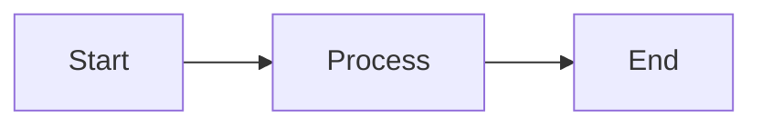

# MkDocs Quick Start Guide

Quick reference for working with the MkDocs Material documentation system using Poetry.

## First-Time Setup

1. **Run the setup script** (one-time setup from project root):
   ```bash
   ./scripts/setup-docs-env.sh
   ```

   This will:
   - Change to `docs/` directory
   - Create a Python virtual environment in `docs/.venv`
   - Install MkDocs Material and all plugins using Poetry
   - Verify the installation

2. **Or manually setup Poetry** (if you prefer):
   ```bash
   cd docs
   poetry install
   ```

## Daily Workflow

All commands should be run from the `docs/` directory:

```bash
cd docs
```

### Serve Documentation Locally

**Start the development server with live reload:**
```bash
poetry run mkdocs serve
```

Or activate the Poetry shell first:
```bash
poetry shell
mkdocs serve
```

Then open http://127.0.0.1:8000 in your browser.

Changes to markdown files will automatically reload the browser.

### Build Documentation

**Build static site to `docs/site/` directory:**
```bash
poetry run mkdocs build
```

**Build with strict mode** (fail on warnings):
```bash
poetry run mkdocs build --strict
```

### Exit Poetry Shell

When done working on documentation:
```bash
exit  # If in poetry shell
```

## Project Structure

```
bindy/
├── docs/
│   ├── pyproject.toml         # Poetry dependencies
│   ├── poetry.lock            # Poetry lockfile
│   ├── mkdocs.yml             # MkDocs configuration
│   ├── .venv/                 # Virtual environment (gitignored)
│   ├── src/                   # Markdown content
│   ├── site/                  # Built documentation (gitignored)
│   ├── stylesheets/
│   │   └── extra.css          # Custom styles
│   ├── javascripts/
│   │   └── extra.js           # Custom scripts
│   └── .python-version        # Python version pin
└── scripts/
    └── setup-docs-env.sh      # Setup script
```

## Common Tasks

### Add a New Page

1. Create the markdown file in `docs/src/`:
   ```bash
   touch src/guide/my-new-page.md
   ```

2. Add it to the navigation in `mkdocs.yml`:
   ```yaml
   nav:
     - User Guide:
         - My New Page: src/guide/my-new-page.md
   ```

3. The page will appear in the live preview immediately.

### Add a Mermaid Diagram

Mermaid diagrams are automatically rendered:

````markdown

````

### Add an Admonition (Note/Warning/Tip)

Use Material's admonition syntax:

```markdown
!!! note
    This is a note.

!!! warning "Custom Title"
    This is a warning with a custom title.

!!! tip "Pro Tip"
    This is a helpful tip.
```

Available types: `note`, `abstract`, `info`, `tip`, `success`, `question`, `warning`, `failure`, `danger`, `bug`, `example`, `quote`

### Add Code Blocks with Annotations

```markdown
\```rust linenums="1" hl_lines="2 3"
fn main() {
    println!("Hello");  // (1)!
    println!("World");  // (2)!
}
\```

1. First annotation
2. Second annotation
```

### Add Content Tabs

```markdown
=== "Rust"
    \```rust
    fn main() {}
    \```

=== "YAML"
    \```yaml
    apiVersion: v1
    kind: Pod
    \```
```

## Configuration

Main configuration file: `docs/mkdocs.yml`

Key sections:
- `site_name`, `site_url`, `site_description` - Site metadata
- `theme` - Material theme configuration
- `plugins` - Enabled plugins (search, mermaid, etc.)
- `markdown_extensions` - Markdown features
- `nav` - Navigation structure
- `extra_css`, `extra_javascript` - Custom assets
- `docs_dir: src` - Source directory for markdown files
- `site_dir: site` - Output directory (relative to docs/)

## Poetry Commands

### Managing Dependencies

```bash
cd docs

# Add a new dependency
poetry add mkdocs-new-plugin

# Add a dev dependency
poetry add --group dev pytest

# Update dependencies
poetry update

# Show installed packages
poetry show

# Show dependency tree
poetry show --tree
```

### Virtual Environment

```bash
cd docs

# Activate Poetry shell
poetry shell

# Run command without activating shell
poetry run mkdocs build

# Show virtualenv info
poetry env info

# Remove virtualenv
poetry env remove python
```

## Plugins Enabled

- **search** - Advanced search with suggestions
- **mermaid2** - Mermaid diagram rendering
- **git-revision-date-localized** - "Last updated" timestamps
- **minify** - HTML/CSS/JS minification (production builds)
- **redirects** - URL redirects for backward compatibility
- **macros** - Variables and macros in markdown

## Customization

### Custom CSS

Edit `docs/stylesheets/extra.css`

Changes apply immediately when serving locally.

### Custom JavaScript

Edit `docs/javascripts/extra.js`

Changes apply immediately when serving locally.

## Troubleshooting

### Poetry not found

Install Poetry:
```bash
curl -sSL https://install.python-poetry.org | python3 -
```

### Virtual environment issues

Recreate the virtualenv:
```bash
cd docs
rm -rf .venv poetry.lock
poetry install
```

### MkDocs command not found

Make sure you're in the docs directory and using Poetry:
```bash
cd docs
poetry run mkdocs --version
```

### Build warnings about missing files

Expected during migration. Files referenced in navigation but not yet migrated will show warnings.

Use `mkdocs build` (without `--strict`) to see warnings but still build.

### Port 8000 already in use

Either:
- Stop the existing MkDocs server
- Use a different port:
  ```bash
  poetry run mkdocs serve -a localhost:8001
  ```

### Python version mismatch

Poetry requires Python 3.10+. Check your version:
```bash
python3 --version
```

If you have multiple Python versions, specify which one to use:
```bash
cd docs
poetry env use python3.11  # or python3.10
poetry install
```

## Resources

- [MkDocs Material Documentation](https://squidfunk.github.io/mkdocs-material/)
- [MkDocs Official Docs](https://www.mkdocs.org/)
- [Poetry Documentation](https://python-poetry.org/docs/)
- [Markdown Extensions Reference](https://facelessuser.github.io/pymdown-extensions/)
- [Migration Roadmap](roadmaps/mkdocs-migration-roadmap.md)
- [Phase 1 Completion Summary](roadmaps/phase1-completion-summary.md)

## Quick Reference Commands

| Task | Command |
|------|---------|
| Setup environment (from root) | `./scripts/setup-docs-env.sh` |
| Change to docs directory | `cd docs` |
| Activate Poetry shell | `poetry shell` |
| Install dependencies | `poetry install` |
| Serve locally | `poetry run mkdocs serve` |
| Build documentation | `poetry run mkdocs build` |
| Build (strict mode) | `poetry run mkdocs build --strict` |
| Exit Poetry shell | `exit` |
| Add dependency | `poetry add package-name` |
| Update dependencies | `poetry update` |
| Show installed packages | `poetry show` |

## Tips

1. **Always work in docs/** - All MkDocs commands must be run from the `docs/` directory
2. **Use Poetry shell** - Run `poetry shell` to avoid prefixing every command with `poetry run`
3. **Keep the server running** - Use `mkdocs serve` while editing for instant feedback
4. **Use strict mode before committing** - Catches broken links and missing pages
5. **Check the navigation** - Make sure new pages are added to `mkdocs.yml`
6. **Test search** - Try searching for your new content to verify discoverability
7. **Check mobile view** - Material theme is mobile-responsive, test on different sizes
8. **Commit poetry.lock** - Always commit the lockfile for reproducible builds

---

**Happy documenting!** 📚
