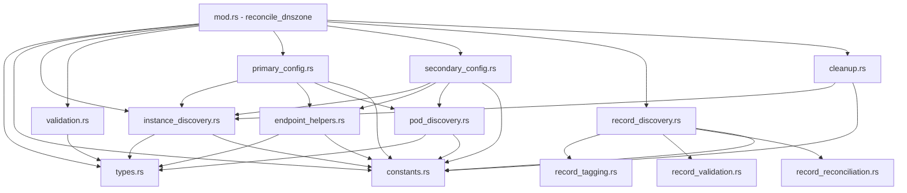

# DNSZone Module Breakdown Analysis

**Date:** 2026-01-10
**Author:** Erick Bourgeois
**Status:** Planning
**Impact:** Code organization and maintainability

## Overview

This document provides a comprehensive breakdown of the `/Users/erick/dev/bindy/src/reconcilers/dnszone.rs` file (4,171 lines) to facilitate splitting it into a proper module structure.

## Current Structure

- **Total Lines:** 4,171
- **Total Functions:** 37
- **Public Functions:** 17
- **Private Functions:** 20
- **Structs:** 4
- **Enums:** 0

---

## Function Breakdown by Logical Concern

### 1. Instance Discovery & Validation

Functions that find, filter, and validate Bind9Instance resources.

| Function | Lines | Visibility | Description | Target Module |
|----------|-------|------------|-------------|---------------|
| `get_instances_from_zone` | 46-159 (114 lines) | pub | Queries reflector store to find instances matching zone's bind9_instances_from selectors. Returns InstanceReference list. | `instance_discovery.rs` |
| `check_for_duplicate_zones` | 160-258 (99 lines) | pub | Prevents multiple DNSZone CRs from claiming the same zone name. Returns conflict info if duplicate exists. | `validation.rs` |
| `filter_instances_needing_reconciliation` | 259-283 (25 lines) | private | Filters instances where last_reconciled_at is None (never reconciled). | `instance_discovery.rs` |
| `filter_primary_instances` | 284-327 (44 lines) | pub | Filters instance refs to only PRIMARY role instances. | `instance_discovery.rs` |
| `filter_secondary_instances` | 328-375 (48 lines) | pub | Filters instance refs to only SECONDARY role instances. | `instance_discovery.rs` |
| `find_secondary_pod_ips_from_instances` | 376-473 (98 lines) | pub | Collects pod IPs from secondary instances for zone transfer configuration. | `instance_discovery.rs` |
| `find_all_primary_pods` | 2820-2954 (135 lines) | pub | Finds ALL PRIMARY pods for a Bind9Cluster or ClusterBind9Provider. Returns PodInfo list. | `pod_discovery.rs` |
| `find_primary_ips_from_instances` | 2955-3050 (96 lines) | private | Finds primary pod IPs from instance references. | `pod_discovery.rs` |
| `find_all_secondary_pods` | 3051-3186 (136 lines) | private | Finds ALL SECONDARY pods for a cluster. Returns PodInfo list. | `pod_discovery.rs` |

**Totals:** 9 functions, ~795 lines

---

### 2. Primary Configuration

Functions that configure PRIMARY zones on BIND9 instances.

| Function | Lines | Visibility | Description | Target Module |
|----------|-------|------------|-------------|---------------|
| `add_dnszone` | 1292-1655 (364 lines) | pub | Configures PRIMARY zones on all primary instances. Handles nameserver generation, zone file creation via bindcar API. | `primary_config.rs` |
| `generate_nameserver_ips` | 474-605 (132 lines) | pub | Generates nameserver IPs for NS records. Checks Service external IPs first, falls back to pod IPs. Returns HashMap of ns1/ns2/etc → IP. | `primary_config.rs` |
| `for_each_primary_endpoint` | 3274-3411 (138 lines) | pub | Helper to execute operation on all primary instance endpoints. Handles RNDC key loading and endpoint iteration. | `endpoint_helpers.rs` |

**Totals:** 3 functions, ~634 lines

---

### 3. Secondary Configuration

Functions that configure SECONDARY zones on BIND9 instances.

| Function | Lines | Visibility | Description | Target Module |
|----------|-------|------------|-------------|---------------|
| `add_dnszone_to_secondaries` | 1656-1934 (279 lines) | pub | Configures SECONDARY zones on all secondary instances. Retrieves primary IPs for zone transfer (also-notify). | `secondary_config.rs` |
| `for_each_secondary_endpoint` | 3412-3543 (132 lines) | pub | Helper to execute operation on all secondary instance endpoints. Similar to for_each_primary_endpoint but for secondaries. | `endpoint_helpers.rs` |

**Totals:** 2 functions, ~411 lines

---

### 4. Record Discovery

Functions that discover DNS records (ARecord, AAAARecord, TXTRecord, etc.) and tag them with zone references.

| Function | Lines | Visibility | Description | Target Module |
|----------|-------|------------|-------------|---------------|
| `reconcile_zone_records` | 1935-2116 (182 lines) | private | Discovers all DNS record types (A, AAAA, TXT, CNAME, MX, NS, SRV, CAA) matching zone's recordsFrom selector. Tags each record with zoneRef. | `record_discovery.rs` |
| `tag_record_with_zone` | 2117-2202 (86 lines) | private | Adds DNSZone reference to a record's status.zoneRef field via patch operation. | `record_tagging.rs` |
| `untag_record_from_zone` | 2203-2255 (53 lines) | private | Removes DNSZone reference from a record's status.zoneRef field. | `record_tagging.rs` |
| `discover_a_records` | 2256-2305 (50 lines) | private | Discovers ARecord resources matching recordsFrom selector. | `record_discovery.rs` |
| `discover_aaaa_records` | 2306-2354 (49 lines) | private | Discovers AAAARecord resources matching recordsFrom selector. | `record_discovery.rs` |
| `discover_txt_records` | 2355-2403 (49 lines) | private | Discovers TXTRecord resources matching recordsFrom selector. | `record_discovery.rs` |
| `discover_cname_records` | 2404-2456 (53 lines) | private | Discovers CNAMERecord resources matching recordsFrom selector. | `record_discovery.rs` |
| `discover_mx_records` | 2457-2505 (49 lines) | private | Discovers MXRecord resources matching recordsFrom selector. | `record_discovery.rs` |
| `discover_ns_records` | 2506-2554 (49 lines) | private | Discovers NSRecord resources matching recordsFrom selector. | `record_discovery.rs` |
| `discover_srv_records` | 2555-2603 (49 lines) | private | Discovers SRVRecord resources matching recordsFrom selector. | `record_discovery.rs` |
| `discover_caa_records` | 2604-2667 (64 lines) | private | Discovers CAARecord resources matching recordsFrom selector. | `record_discovery.rs` |
| `check_all_records_ready` | 3608-3667 (60 lines) | private | Checks if all records in status.records[] have Ready=True condition. | `record_validation.rs` |
| `check_record_ready` | 3668-3729 (62 lines) | private | Generic helper to check if a single record has Ready=True. | `record_validation.rs` |
| `find_zones_selecting_record` | 3730-3780 (51 lines) | pub | Finds all DNSZone resources that select a given record via recordsFrom. Used by record reconcilers. | `record_discovery.rs` |
| `trigger_record_reconciliation` | 3781-3897 (117 lines) | private | Triggers reconciliation of affected DNSZone resources when a record changes. | `record_reconciliation.rs` |

**Totals:** 15 functions, ~1,023 lines

---

### 5. Cleanup Operations

Functions that clean up resources and handle deletions.

| Function | Lines | Visibility | Description | Target Module |
|----------|-------|------------|-------------|---------------|
| `delete_dnszone` | 2668-2819 (152 lines) | pub | Deletes zone from all BIND9 instances via bindcar API. Removes ConfigMap if exists. | `cleanup.rs` |
| `cleanup_deleted_instances` | 3898-3956 (59 lines) | pub | Removes deleted instances from status.bind9Instances[]. Queries Kubernetes to verify instance existence. | `cleanup.rs` |
| `cleanup_stale_records` | 3957-4171 (215 lines) | pub | Removes stale records from status.records[] that no longer exist in Kubernetes or no longer match recordsFrom selector. | `cleanup.rs` |

**Totals:** 3 functions, ~426 lines

---

### 6. Status Management

Functions that update DNSZone status conditions and fields.

| Function | Lines | Visibility | Description | Target Module |
|----------|-------|------------|-------------|---------------|
| `update_zone_reconciled_timestamp` | 3187-3208 (22 lines) | private | Updates status.bind9Instances[].lastReconciledAt timestamp for a specific instance. | `status_update.rs` |

**Note:** Status management is primarily handled by `DNSZoneStatusUpdater` in `src/reconcilers/status.rs`. This is the only status-specific function in dnszone.rs.

**Totals:** 1 function, ~22 lines

---

### 7. Helper Functions

Utility functions used across multiple concerns.

| Function | Lines | Visibility | Description | Target Module |
|----------|-------|------------|-------------|---------------|
| `for_each_instance_endpoint` | 606-731 (126 lines) | pub | Generic helper to execute operation on all instance endpoints. Handles endpoint discovery and operation execution. | `endpoint_helpers.rs` |
| `load_rndc_key` | 3209-3273 (65 lines) | private | Loads RNDC key from instance's Secret. Returns RndcKeyData. | `endpoint_helpers.rs` |
| `get_endpoint` | 3544-3607 (64 lines) | pub | Gets all endpoints (pod IP + port) for a service with specific port name. | `endpoint_helpers.rs` |

**Totals:** 3 functions, ~255 lines

---

### 8. Main Reconciliation

The central orchestration function.

| Function | Lines | Visibility | Description | Target Module |
|----------|-------|------------|-------------|---------------|
| `reconcile_dnszone` | 732-1291 (560 lines) | pub | **MAIN RECONCILIATION FUNCTION**. Orchestrates entire DNSZone reconciliation flow: <br>1. Re-fetches zone to get latest status<br>2. Gets instances from zone<br>3. Checks for duplicate zones<br>4. Determines if reconciliation needed (spec changed, instances changed, unreconciled instances)<br>5. Cleans up deleted instances and stale records<br>6. Configures PRIMARY zones (calls add_dnszone)<br>7. Configures SECONDARY zones (calls add_dnszone_to_secondaries)<br>8. Discovers and tags records (calls reconcile_zone_records)<br>9. Updates status via DNSZoneStatusUpdater<br>10. Applies final status patch | **KEEP IN dnszone.rs** (main entry point) |

**Totals:** 1 function, ~560 lines

---

## Type Definitions

These structs should be moved to a `types.rs` file.

| Type | Lines | Description | Target Module |
|------|-------|-------------|---------------|
| `DuplicateZoneInfo` | 111-116 (6 lines) | Information about zone name conflicts. Contains zone_name and conflicting_zones list. | `types.rs` |
| `ConflictingZone` | 120-127 (8 lines) | Details about a conflicting zone: name, namespace, instance_names. | `types.rs` |
| `PodInfo` | 2794-2799 (6 lines) | Helper struct for pod tracking: name, ip, instance_name, namespace. | `types.rs` |
| `EndpointAddress` | 3238-3243 (6 lines) | Endpoint information: ip and port. | `types.rs` |

**Totals:** 4 structs, ~26 lines

---

## Constants to Extract

The following hardcoded values should be extracted to module-level constants:

| Value | Current Usage | Proposed Constant Name | Location |
|-------|---------------|------------------------|----------|
| `"http"` | Port name for bindcar API | `BINDCAR_API_PORT_NAME` | Top of module |
| `"dns-tcp"` | Port name for DNS TCP queries | `DNS_TCP_PORT_NAME` | Top of module |
| `"rndc-api"` | Port name for RNDC API | `RNDC_API_PORT_NAME` | Top of module |
| `"bindy.firestoned.io/v1beta1"` | API version | Already exists in crd.rs | Use from crd.rs |
| `"Bind9Instance"` | Kind name | `BIND9_INSTANCE_KIND` | Top of module |
| `"Running"` | Pod phase | `POD_PHASE_RUNNING` | Top of module |

**Note:** No time-based constants (like 3600 seconds) were found - good!

---

## Proposed Module Structure

```
src/reconcilers/dnszone/
├── mod.rs                      # Public API exports + reconcile_dnszone() (~600 lines)
├── types.rs                    # Type definitions (DuplicateZoneInfo, etc.) (~50 lines)
├── constants.rs                # Module constants (~20 lines)
├── instance_discovery.rs       # Instance finding and filtering (~400 lines)
├── validation.rs               # Duplicate zone checking (~100 lines)
├── pod_discovery.rs            # Pod IP discovery functions (~400 lines)
├── primary_config.rs           # Primary zone configuration (~500 lines)
├── secondary_config.rs         # Secondary zone configuration (~300 lines)
├── record_discovery.rs         # Record discovery and tagging (~700 lines)
├── record_tagging.rs           # Record tagging operations (~150 lines)
├── record_validation.rs        # Record readiness checks (~150 lines)
├── record_reconciliation.rs    # Record reconciliation triggering (~120 lines)
├── cleanup.rs                  # Cleanup operations (~450 lines)
├── endpoint_helpers.rs         # Endpoint and RNDC helpers (~400 lines)
└── status_update.rs            # Status update helpers (~30 lines)
```

**Total:** 15 files, ~4,200 lines (includes new imports/documentation)

---

## Refactoring Priority

**Phase 1 - Critical Path Separation (Week 1):**
1. Extract `types.rs` (all structs)
2. Extract `constants.rs` (port names, etc.)
3. Extract `instance_discovery.rs` (used by everything)
4. Extract `endpoint_helpers.rs` (used by config modules)
5. Update `mod.rs` with reconcile_dnszone()

**Phase 2 - Configuration Separation (Week 2):**
6. Extract `primary_config.rs`
7. Extract `secondary_config.rs`
8. Extract `validation.rs`
9. Extract `pod_discovery.rs`

**Phase 3 - Record Management (Week 3):**
10. Extract `record_discovery.rs`
11. Extract `record_tagging.rs`
12. Extract `record_validation.rs`
13. Extract `record_reconciliation.rs`

**Phase 4 - Cleanup (Week 4):**
14. Extract `cleanup.rs`
15. Extract `status_update.rs`
16. Final testing and documentation

---

## Dependencies Between Modules



---

## Testing Strategy

Each extracted module MUST have corresponding `_tests.rs` file:

```
src/reconcilers/dnszone/
├── instance_discovery_tests.rs
├── validation_tests.rs
├── pod_discovery_tests.rs
├── primary_config_tests.rs
├── secondary_config_tests.rs
├── record_discovery_tests.rs
├── record_tagging_tests.rs
├── record_validation_tests.rs
├── record_reconciliation_tests.rs
├── cleanup_tests.rs
├── endpoint_helpers_tests.rs
└── status_update_tests.rs
```

**Current Test Coverage:**
- Existing tests in `src/reconcilers/dnszone_tests.rs` (separate file) must be split and moved to appropriate test files.

---

## Breaking Changes

**None.** This is purely internal refactoring. All public functions maintain their signatures and are re-exported from `mod.rs`.

---

## Success Criteria

- [ ] All 4,171 lines split into logical modules
- [ ] Each module < 800 lines
- [ ] `mod.rs` < 700 lines (mostly reconcile_dnszone + exports)
- [ ] All tests pass after refactoring
- [ ] `cargo clippy` passes with no new warnings
- [ ] Documentation updated (architecture diagrams, module docs)
- [ ] Each module has comprehensive rustdoc comments
- [ ] All constants extracted from hardcoded strings
- [ ] All types moved to types.rs

---

## Risks & Mitigation

| Risk | Impact | Mitigation |
|------|--------|------------|
| Breaking function visibility | High | Run full test suite after each phase |
| Import cycles | Medium | Follow dependency graph strictly |
| Lost context from splitting | Low | Add comprehensive module-level docs |
| Merge conflicts | Medium | Do in dedicated branch, rebase frequently |

---

## Timeline

- **Week 1:** Phase 1 (types, constants, instance discovery, endpoints)
- **Week 2:** Phase 2 (primary/secondary config, validation, pods)
- **Week 3:** Phase 3 (record management)
- **Week 4:** Phase 4 (cleanup, status, testing, docs)

**Total:** 4 weeks to complete refactoring.

---

## Notes

- The main `reconcile_dnszone()` function is 560 lines and should remain in `mod.rs` as the primary entry point.
- Functions are well-documented with rustdoc comments - preserve during extraction.
- No breaking API changes - all public functions re-exported from `mod.rs`.
- This refactoring improves maintainability without changing behavior.
- TDD approach: Extract tests FIRST, then extract implementation.

---

## Conclusion

This refactoring will transform a monolithic 4,171-line file into 15 well-organized modules, each with clear responsibilities and comprehensive tests. The result will be more maintainable, easier to review, and aligned with Rust module organization best practices.
