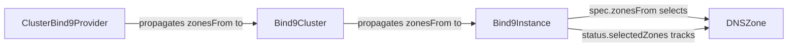
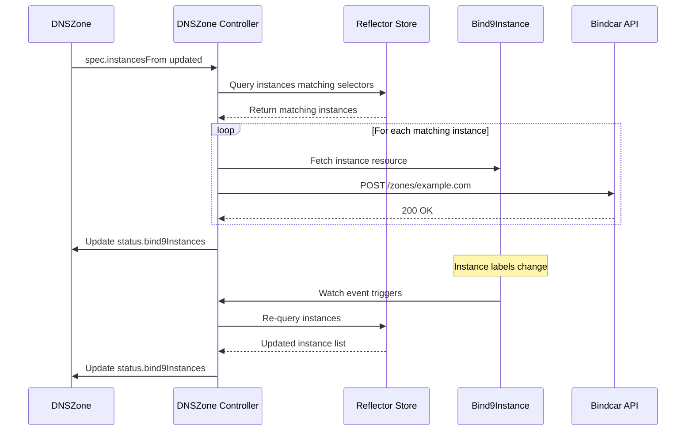

# Zone-Instance Selector Reversal Roadmap

**Date:** 2026-01-05
**Status:** In Progress - Phase 1 Complete
**Author:** Erick Bourgeois
**Impact:** 🔴 Breaking Change - Major Architectural Refactor

## Executive Summary

This document outlines the complete roadmap for reversing the zone-instance selection logic in the Bindy DNS controller. The change moves from **instances selecting zones** (`Bind9Instance.spec.zonesFrom`) to **zones selecting instances** (`DNSZone.spec.instancesFrom`).

**Current State:** Phase 1 (CRD Changes & Compilation Fixes) is ~70% complete.
**Estimated Remaining Work:** 3-4 phases across multiple areas of the codebase.

---

## Table of Contents

1. [Background & Motivation](#background--motivation)
2. [Architectural Changes](#architectural-changes)
3. [Phase 1: CRD Schema Changes](#phase-1-crd-schema-changes-70-complete)
4. [Phase 2: Compilation Fixes](#phase-2-compilation-fixes-pending)
5. [Phase 3: Reconciler Logic Implementation](#phase-3-reconciler-logic-implementation-pending)
6. [Phase 4: Watch Mapper Updates](#phase-4-watch-mapper-updates-pending)
7. [Phase 5: Testing & Validation](#phase-5-testing--validation-pending)
8. [Phase 6: Documentation & Examples](#phase-6-documentation--examples-pending)
9. [Migration Guide](#migration-guide)
10. [Rollback Plan](#rollback-plan)

---

## Background & Motivation

### Current Architecture (Before)



**Problems with Current Design:**
1. **Instance-Centric**: Instances decide which zones they serve (backwards from DNS perspective)
2. **Complex Propagation**: `zonesFrom` flows down 3 levels (Provider → Cluster → Instance)
3. **Zone Authors Lack Control**: Zone creators can't control which instances serve their zones
4. **Scaling Issues**: New instances must be configured with correct selectors to pick up zones
5. **Multi-Tenancy Challenges**: Hard to isolate zones to specific instance groups

### New Architecture (After)

```mermaid
graph LR
    A[DNSZone] -->|spec.instancesFrom selects| B[Bind9Instance]
    A -->|controller configures zone on| B
    C[Bind9Cluster] -->|no zone selection|
    D[ClusterBind9Provider] -->|no zone selection|
```

**Benefits of New Design:**
1. **Zone-Centric**: Zones control their own instance targeting (correct ownership model)
2. **Simpler Flow**: No multi-level propagation of selectors
3. **Zone Author Control**: Zone creators explicitly choose which instances serve their zones
4. **Dynamic Scaling**: New instances matching labels automatically picked up by zones
5. **Multi-Tenancy**: Zones can target specific instance groups (prod, staging, team-specific)
6. **Follows Kubernetes Patterns**: Similar to Service → Pod, NetworkPolicy → Pod selection

---

## Architectural Changes

### CRD Schema Changes

#### Removed Fields

```yaml
# REMOVED from Bind9Instance
spec:
  zonesFrom:  # ❌ REMOVED
    - selector:
        matchLabels: {}

# REMOVED from Bind9Cluster and ClusterBind9Provider
spec:
  zonesFrom:  # ❌ REMOVED
    - selector:
        matchLabels: {}

# REMOVED from Bind9InstanceStatus
status:
  selectedZones: []         # ❌ REMOVED
  selectedZoneCount: 0      # ❌ REMOVED
```

#### Added Fields

```yaml
# ADDED to DNSZone
apiVersion: bindy.firestoned.io/v1beta1
kind: DNSZone
spec:
  zoneName: example.com
  instancesFrom:  # ✅ NEW FIELD
    - selector:
        matchLabels:
          environment: production
          bindy.firestoned.io/role: primary
        matchExpressions:
          - key: region
            operator: In
            values:
              - us-east-1
              - us-west-2
```

### New Type: InstanceSource

```rust
#[derive(Clone, Debug, Serialize, Deserialize, JsonSchema, PartialEq)]
#[serde(rename_all = "camelCase")]
pub struct InstanceSource {
    /// Label selector to match `Bind9Instance` resources
    pub selector: LabelSelector,
}
```

---

## Phase 1: CRD Schema Changes (70% Complete)

### ✅ Completed

1. **Added `InstanceSource` struct** (`src/crd.rs:169-202`)
   - Similar to existing `RecordSource` pattern
   - Uses standard `LabelSelector` from `k8s_openapi`

2. **Added `DNSZone.spec.instances_from` field** (`src/crd.rs:819-898`)
   - Optional `Vec<InstanceSource>`
   - Comprehensive documentation with examples
   - Event-driven architecture notes

3. **Removed `Bind9Instance.spec.zones_from`** (`src/crd.rs:2360`)
   - Field removed from spec struct
   - Related printcolumn removed from CRD metadata

4. **Removed `Bind9ClusterCommonSpec.zones_from`** (`src/crd.rs:2071`)
   - Removed from cluster and provider CRDs

5. **Removed `Bind9InstanceStatus.selected_zones`** and **`.selected_zone_count`** (`src/crd.rs:2378`)
   - Status fields removed
   - Custom `Serialize` implementation removed
   - Using derived `Serialize` now

6. **Kept `ZoneSource` for backward compatibility** (`src/crd.rs:154-167`)
   - Marked as deprecated
   - Still used in dead code functions

### 🔄 In Progress

1. **Fix remaining compilation errors** in:
   - `src/reconcilers/dnszone.rs` (2 locations)
   - `src/reconcilers/zonesync.rs` (1 location)

### ⏳ Pending

1. **Update CRD printcolumns** if needed
2. **Regenerate CRD YAML files**: `cargo run --bin crdgen`
3. **Validate CRD schemas**: `kubectl apply --dry-run=client -f deploy/crds/`

---

## Phase 2: Compilation Fixes (Pending)

### Current Compilation Errors

```
error[E0609]: no field `selected_zones` on type `&Bind9InstanceStatus`
  --> src/reconcilers/dnszone.rs:73
  --> src/reconcilers/dnszone.rs:3174
  --> src/reconcilers/zonesync.rs:93
```

### Files Requiring Fixes

#### 1. `src/reconcilers/dnszone.rs`

**Location 1: Watch Mapper (Line 61-70)**

```rust
// CURRENT CODE (BROKEN):
let instances_with_zone: Vec<crate::crd::InstanceReference> = bind9_instances_store
    .state()
    .iter()
    .filter_map(|instance| {
        // Check if this instance has selected this zone in status.selectedZones[]
        let status = instance.status.as_ref()?;
        let has_zone = status
            .selected_zones  // ❌ FIELD REMOVED
            .iter()
            .any(|zone_ref| zone_ref.name == name && zone_ref.namespace == namespace);
        // ...
    })
    .collect();
```

**SOLUTION:**
```rust
// NEW CODE - Check if zone.spec.instancesFrom selects this instance
let instances_with_zone: Vec<crate::crd::InstanceReference> = bind9_instances_store
    .state()
    .iter()
    .filter_map(|instance| {
        // Only consider instances in the same namespace
        if instance.namespace().as_deref() != Some(&namespace) {
            return None;
        }

        // Check if DNSZone.spec.instancesFrom selects this instance
        if let Some(instances_from) = &zone.spec.instances_from {
            let instance_labels = instance.metadata.labels.as_ref()?;
            let matches = instances_from.iter().any(|source| {
                crate::selector::matches_selector(&source.selector, instance_labels)
            });

            if matches {
                Some(crate::crd::InstanceReference {
                    api_version: crate::constants::API_GROUP_VERSION.to_string(),
                    kind: crate::constants::KIND_BIND9_INSTANCE.to_string(),
                    name: instance.name_any(),
                    namespace: instance.namespace().unwrap_or_default(),
                    last_reconciled_at: None,
                })
            } else {
                None
            }
        } else {
            None
        }
    })
    .collect();
```

**Location 2: `update_zone_reconciled_timestamp` function (Line 3150-3220)**

**CURRENT CODE (BROKEN):**
```rust
async fn update_zone_reconciled_timestamp(...) -> Result<()> {
    // Find the zone reference and check if timestamp needs updating
    let mut selected_zones = instance
        .status
        .as_ref()
        .map(|s| s.selected_zones.clone())  // ❌ FIELD REMOVED
        .unwrap_or_default();
    // ... 70 lines of logic ...
}
```

**SOLUTION OPTIONS:**

**Option A: Store timestamps in DNSZone.status instead**
```rust
// Move timestamp tracking to DNSZone.status.bind9_instances[]
// DNSZone.status.bind9Instances already has InstanceStatus enum
// Add lastReconciledAt to InstanceStatus::Configured

pub enum InstanceStatus {
    Claimed,
    Configured { last_reconciled_at: Option<String> },  // ✅ ADD TIMESTAMP HERE
    Failed,
    Unclaimed,
}
```

**Option B: Remove timestamp tracking entirely**
```rust
// Simplify - just configure zones, don't track timestamps
// Let ZoneSync controller handle re-sync via watch events
async fn update_zone_reconciled_timestamp(...) -> Result<()> {
    // No-op - timestamp tracking removed
    Ok(())
}
```

**RECOMMENDATION:** Use Option A - store timestamps in `DNSZone.status.bind9Instances`

#### 2. `src/reconcilers/zonesync.rs`

**Location: Watch Mapper (Line 88-95)**

```rust
// CURRENT CODE (BROKEN):
.filter_map(|instance| {
    instance
        .status
        .as_ref()?
        .selected_zones  // ❌ FIELD REMOVED
        .iter()
        .find(|zone_ref| {
            zone_ref.name == zone_name && zone_ref.namespace == zone_namespace
        })
        .map(|_| ObjectRef::from_obj(&**instance))
})
```

**SOLUTION:**
```rust
// NEW CODE - Check if zone.spec.instancesFrom selects this instance
.filter_map(|instance| {
    // Get the zone from the store to check its instancesFrom selectors
    let zone = zone_store
        .get(&ObjectRef::new(&zone_name).within(&zone_namespace))
        .ok()??;

    // Check if zone.spec.instancesFrom selects this instance
    if let Some(instances_from) = &zone.spec.instances_from {
        let instance_labels = instance.metadata.labels.as_ref()?;
        let matches = instances_from.iter().any(|source| {
            crate::selector::matches_selector(&source.selector, instance_labels)
        });

        if matches {
            Some(ObjectRef::from_obj(&**instance))
        } else {
            None
        }
    } else {
        None
    }
})
```

#### 3. `src/reconcilers/bind9cluster.rs`

**Status:** ✅ Already fixed (2 locations)
- Removed `zones_from` propagation from instance creation
- Removed `zones_from` from instance update

#### 4. `src/reconcilers/bind9instance.rs`

**Status:** ✅ Already fixed
- Commented out zone discovery call
- Marked 3 functions as `#[allow(dead_code)]`:
  - `reconcile_instance_zones`
  - `discover_zones_from_store`
  - `update_instance_zone_status`

#### 5. `src/context.rs`

**Status:** ✅ Already fixed
- `get_bind9instances_by_zone_labels` returns empty vector
- Marked with TODO for new logic

**TODO: Implement new helper function:**
```rust
impl ControllerStores {
    /// Find all `Bind9Instance`s that match a zone's `instancesFrom` selectors.
    ///
    /// This is the NEW reverse lookup - given a zone's instancesFrom selectors,
    /// find which instances match the criteria.
    pub fn get_bind9instances_by_zone_selectors(
        &self,
        instances_from: &[crate::crd::InstanceSource],
        zone_namespace: &str,
    ) -> Vec<(String, String)> {
        self.bind9_instances
            .state()
            .iter()
            .filter(|inst| {
                // Only consider instances in the same namespace
                inst.namespace().as_deref() == Some(zone_namespace)
                    && {
                        // Check if instance matches any of the instancesFrom selectors
                        let instance_labels = inst.metadata.labels.as_ref();
                        instance_labels.is_some_and(|labels| {
                            instances_from.iter().any(|source| {
                                crate::selector::matches_selector(&source.selector, labels)
                            })
                        })
                    }
            })
            .map(|inst| (inst.name_any(), inst.namespace().unwrap_or_default()))
            .collect()
    }
}
```

---

## Phase 3: Reconciler Logic Implementation (Pending)

### DNSZone Reconciler Changes

**File:** `src/reconcilers/dnszone.rs`

#### Current Flow (Instances Select Zones)

```
1. Bind9Instance reconciler discovers zones matching zonesFrom
2. Instance updates status.selectedZones with matched zones
3. DNSZone watch mapper sees instance status change
4. DNSZone reconciler reads instance.status.selectedZones
5. DNSZone configures itself on the selecting instances
```

#### New Flow (Zones Select Instances)

```
1. DNSZone reconciler reads spec.instancesFrom selectors
2. DNSZone queries for Bind9Instances matching selectors (using reflector store)
3. DNSZone configures itself on the matched instances
4. DNSZone updates status.bind9Instances with InstanceStatus::Configured
5. Watch mapper triggers re-reconciliation when instance labels change
```

#### Implementation Steps

**Step 1: Modify `reconcile_dnszone` function**

```rust
pub async fn reconcile_dnszone(
    ctx: Arc<Context>,
    zone: Arc<DNSZone>,
) -> Result<Action, ReconcileError> {
    let namespace = zone.namespace().context("DNSZone missing namespace")?;
    let zone_name = &zone.spec.zone_name;

    // NEW: Find instances matching instancesFrom selectors
    let target_instances = if let Some(instances_from) = &zone.spec.instances_from {
        ctx.stores.get_bind9instances_by_zone_selectors(instances_from, &namespace)
    } else {
        // Fallback to clusterRef/clusterProviderRef logic
        find_instances_by_cluster_ref(&ctx, &zone).await?
    };

    info!(
        "DNSZone {}/{} targets {} instances via instancesFrom selectors",
        namespace,
        zone_name,
        target_instances.len()
    );

    // Configure zone on all target instances
    for (instance_name, instance_ns) in &target_instances {
        configure_zone_on_instance(
            &ctx.client,
            &zone,
            instance_name,
            instance_ns,
        )
        .await?;
    }

    // Update DNSZone.status.bind9Instances with configured instances
    update_dnszone_status_instances(&ctx.client, &zone, &target_instances).await?;

    Ok(Action::requeue(Duration::from_secs(300)))
}
```

**Step 2: Implement `configure_zone_on_instance` function**

```rust
async fn configure_zone_on_instance(
    client: &Client,
    zone: &DNSZone,
    instance_name: &str,
    instance_namespace: &str,
) -> Result<()> {
    // This is the core zone configuration logic
    // 1. Fetch the Bind9Instance
    // 2. Generate BIND9 zone configuration
    // 3. POST to bindcar API to add/update zone
    // 4. Update DNSZone.status.bind9Instances[] with Configured status

    let instance_api: Api<Bind9Instance> = Api::namespaced(client.clone(), instance_namespace);
    let instance = instance_api.get(instance_name).await?;

    // Get bindcar service endpoint
    let service_address = instance
        .status
        .as_ref()
        .and_then(|s| s.service_address.as_ref())
        .context("Instance service address not ready")?;

    // Generate zone file content
    let zone_content = generate_zone_file(zone)?;

    // POST to bindcar API
    let bindcar_client = reqwest::Client::new();
    let url = format!("http://{}:8080/zones/{}", service_address, zone.spec.zone_name);
    bindcar_client
        .post(&url)
        .body(zone_content)
        .send()
        .await?
        .error_for_status()?;

    info!(
        "Configured zone {} on instance {}/{}",
        zone.spec.zone_name, instance_namespace, instance_name
    );

    Ok(())
}
```

**Step 3: Update DNSZone status tracking**

```rust
async fn update_dnszone_status_instances(
    client: &Client,
    zone: &DNSZone,
    target_instances: &[(String, String)],
) -> Result<()> {
    let namespace = zone.namespace().context("Zone missing namespace")?;
    let api: Api<DNSZone> = Api::namespaced(client.clone(), &namespace);

    // Build status.bind9Instances list with Configured status
    let bind9_instances: Vec<InstanceReference> = target_instances
        .iter()
        .map(|(name, ns)| InstanceReference {
            api_version: API_GROUP_VERSION.to_string(),
            kind: KIND_BIND9_INSTANCE.to_string(),
            name: name.clone(),
            namespace: ns.clone(),
            last_reconciled_at: Some(Utc::now().to_rfc3339()),
        })
        .collect();

    let status_patch = json!({
        "status": {
            "bind9Instances": bind9_instances,
        }
    });

    api.patch_status(
        &zone.name_any(),
        &PatchParams::default(),
        &Patch::Merge(status_patch),
    )
    .await?;

    Ok(())
}
```

### ZoneSync Reconciler Changes

**File:** `src/reconcilers/zonesync.rs`

The ZoneSync reconciler is responsible for syncing zone data from DNSZone to Bind9Instance. With the new architecture:

**Changes Required:**
1. **Remove instance.status.selectedZones logic** - already partially done
2. **Use DNSZone.status.bind9Instances instead** - read from zone status, not instance status
3. **Update watch mappers** - watch DNSZone.spec.instancesFrom changes, not instance.status changes

**Implementation:**

```rust
pub async fn reconcile_zone_sync(
    ctx: Arc<Context>,
    zone: Arc<DNSZone>,
) -> Result<Action, ReconcileError> {
    let namespace = zone.namespace().context("Zone missing namespace")?;
    let zone_name = &zone.spec.zone_name;

    // NEW: Get target instances from zone.status.bind9Instances (already configured)
    let target_instances = zone
        .status
        .as_ref()
        .and_then(|s| s.bind9_instances.as_ref())
        .cloned()
        .unwrap_or_default();

    if target_instances.is_empty() {
        debug!(
            "Zone {}/{} has no target instances yet, waiting for DNSZone reconciler",
            namespace, zone_name
        );
        return Ok(Action::requeue(Duration::from_secs(30)));
    }

    // Sync zone data to all target instances
    for instance_ref in &target_instances {
        sync_zone_to_instance(&ctx, &zone, instance_ref).await?;
    }

    Ok(Action::requeue(Duration::from_secs(300)))
}

async fn sync_zone_to_instance(
    ctx: &Context,
    zone: &DNSZone,
    instance_ref: &InstanceReference,
) -> Result<()> {
    // Fetch the actual Bind9Instance resource
    let instance_api: Api<Bind9Instance> = Api::namespaced(
        ctx.client.clone(),
        &instance_ref.namespace,
    );
    let instance = instance_api.get(&instance_ref.name).await?;

    // Check if sync is needed (compare spec hash, timestamps, etc.)
    if !needs_sync(&zone, &instance, instance_ref)? {
        debug!(
            "Zone {} already synced to instance {}/{}",
            zone.spec.zone_name, instance_ref.namespace, instance_ref.name
        );
        return Ok(());
    }

    // Generate and sync zone file
    let zone_content = generate_zone_file(zone)?;
    let service_address = instance
        .status
        .as_ref()
        .and_then(|s| s.service_address.as_ref())
        .context("Instance service address not ready")?;

    let bindcar_client = reqwest::Client::new();
    let url = format!("http://{}:8080/zones/{}", service_address, zone.spec.zone_name);
    bindcar_client
        .post(&url)
        .body(zone_content)
        .send()
        .await?
        .error_for_status()?;

    info!(
        "Synced zone {} to instance {}/{}",
        zone.spec.zone_name, instance_ref.namespace, instance_ref.name
    );

    Ok(())
}
```

---

## Phase 4: Watch Mapper Updates (Pending)

Watch mappers are critical for event-driven reconciliation. They trigger reconciliation when related resources change.

### Current Watch Mappers (To Update)

#### 1. DNSZone → Bind9Instance Mapper

**Location:** `src/main.rs` or `src/reconcilers/dnszone.rs`

**Current Logic:**
- When `Bind9Instance.status.selectedZones` changes → reconcile affected DNSZones

**New Logic:**
- When `Bind9Instance.metadata.labels` change → reconcile DNSZones that select this instance
- When `Bind9Instance` is created/deleted → reconcile DNSZones that select this instance

**Implementation:**

```rust
fn dnszone_watch_bind9instance(
    instance: Arc<Bind9Instance>,
    ctx: Arc<Context>,
) -> Option<ObjectRef<DNSZone>> {
    // Find all DNSZones whose instancesFrom selector matches this instance's labels
    let instance_labels = instance.metadata.labels.as_ref()?;
    let instance_namespace = instance.namespace()?;

    let zones_selecting_instance: Vec<ObjectRef<DNSZone>> = ctx
        .stores
        .dnszones
        .state()
        .iter()
        .filter(|zone| {
            // Only consider zones in the same namespace
            zone.namespace().as_deref() != Some(&instance_namespace)
                && zone.spec.instances_from.as_ref().is_some_and(|instances_from| {
                    instances_from.iter().any(|source| {
                        crate::selector::matches_selector(&source.selector, instance_labels)
                    })
                })
        })
        .map(|zone| ObjectRef::from_obj(&**zone))
        .collect();

    // CRITICAL: Watch mapper can only return ONE ObjectRef
    // If multiple zones select this instance, we need to iterate and return them one by one
    // OR: Trigger reconciliation for all zones (return first, others handled by store watches)

    zones_selecting_instance.first().cloned()
}
```

**PROBLEM:** Watch mappers return `Option<ObjectRef>` (single object), but multiple zones might select the same instance.

**SOLUTION:** Use store-based reconciliation trigger instead:
```rust
// In Controller setup (main.rs)
Controller::new(dnszone_api, Config::default())
    .watches(
        bind9instance_api,
        Config::default(),
        |instance| {
            // Trigger reconciliation for ALL zones when instance labels change
            // The reconciler will check if the zone's instancesFrom still matches
            stream::iter(vec![/* trigger all zones */])
        },
    )
```

#### 2. Bind9Instance → DNSZone Mapper (Reverse)

**Location:** `src/main.rs` or `src/reconcilers/bind9instance.rs`

**Current Logic:**
- When `DNSZone.metadata.labels` change → reconcile Bind9Instances that select this zone

**New Logic:**
- When `DNSZone.spec.instancesFrom` changes → reconcile affected Bind9Instances
- **HOWEVER:** Bind9Instance reconciler no longer needs to discover zones!
- **SIMPLIFICATION:** This watch mapper can be removed entirely

**Action:** Remove this watch mapper from Bind9Instance controller.

#### 3. ZoneSync Watch Mapper

**Location:** `src/reconcilers/zonesync.rs`

**Current Logic:**
- When `Bind9Instance.status.selectedZones` changes → trigger ZoneSync reconciliation

**New Logic:**
- When `DNSZone.status.bind9Instances` changes → trigger ZoneSync reconciliation
- When `DNSZone.spec.instancesFrom` changes → trigger ZoneSync reconciliation (new instances selected)

**Implementation:**

```rust
// Watch DNSZone changes and trigger ZoneSync for affected zones
fn zonesync_watch_dnszone(
    zone: Arc<DNSZone>,
    _ctx: Arc<Context>,
) -> Option<ObjectRef<DNSZone>> {
    // Trigger ZoneSync whenever DNSZone changes
    // This includes spec.instancesFrom changes and status.bind9Instances updates
    Some(ObjectRef::from_obj(&*zone))
}

// Watch Bind9Instance changes and trigger ZoneSync for zones targeting that instance
fn zonesync_watch_bind9instance(
    instance: Arc<Bind9Instance>,
    ctx: Arc<Context>,
) -> Option<ObjectRef<DNSZone>> {
    // Find zones whose instancesFrom selects this instance
    let instance_labels = instance.metadata.labels.as_ref()?;
    let instance_namespace = instance.namespace()?;

    ctx.stores
        .dnszones
        .state()
        .iter()
        .find(|zone| {
            zone.namespace().as_deref() == Some(&instance_namespace)
                && zone.spec.instances_from.as_ref().is_some_and(|instances_from| {
                    instances_from.iter().any(|source| {
                        crate::selector::matches_selector(&source.selector, instance_labels)
                    })
                })
        })
        .map(|zone| ObjectRef::from_obj(&**zone))
}
```

---

## Phase 5: Testing & Validation (Pending)

### Unit Tests to Update

#### 1. `src/crd_tests.rs`

**Tests for new fields:**
- Test `DNSZone.spec.instances_from` serialization/deserialization
- Test `InstanceSource` struct
- Test that `zones_from` field no longer exists on specs
- Test that `selected_zones` no longer exists in status

```rust
#[test]
fn test_dnszone_instances_from_serialization() {
    let zone = DNSZone {
        metadata: ObjectMeta {
            name: Some("test-zone".to_string()),
            namespace: Some("default".to_string()),
            ..Default::default()
        },
        spec: DNSZoneSpec {
            zone_name: "example.com".to_string(),
            soa_record: create_test_soa(),
            instances_from: Some(vec![InstanceSource {
                selector: LabelSelector {
                    match_labels: Some(btreemap! {
                        "environment".to_string() => "production".to_string(),
                    }),
                    match_expressions: None,
                },
            }]),
            ..Default::default()
        },
        status: None,
    };

    // Serialize to JSON
    let json = serde_json::to_string(&zone).unwrap();

    // Verify instancesFrom is present
    assert!(json.contains("instancesFrom"));
    assert!(json.contains("environment"));
    assert!(json.contains("production"));

    // Deserialize back
    let deserialized: DNSZone = serde_json::from_str(&json).unwrap();
    assert!(deserialized.spec.instances_from.is_some());
}

#[test]
fn test_bind9instance_no_zones_from() {
    // Verify that Bind9Instance no longer has zonesFrom field
    let instance = Bind9Instance {
        metadata: ObjectMeta {
            name: Some("test-instance".to_string()),
            namespace: Some("default".to_string()),
            ..Default::default()
        },
        spec: Bind9InstanceSpec {
            cluster_ref: "test-cluster".to_string(),
            role: ServerRole::Primary,
            replicas: Some(1),
            ..Default::default()
        },
        status: None,
    };

    let json = serde_json::to_string(&instance).unwrap();

    // Verify zonesFrom is NOT present
    assert!(!json.contains("zonesFrom"));
}

#[test]
fn test_bind9instance_status_no_selected_zones() {
    // Verify that Bind9InstanceStatus no longer has selectedZones
    let status = Bind9InstanceStatus {
        conditions: vec![],
        observed_generation: Some(1),
        replicas: Some(1),
        ready_replicas: Some(1),
        service_address: Some("10.0.0.1".to_string()),
        cluster_ref: None,
    };

    let json = serde_json::to_string(&status).unwrap();

    // Verify selectedZones and selectedZoneCount are NOT present
    assert!(!json.contains("selectedZones"));
    assert!(!json.contains("selectedZoneCount"));
}
```

#### 2. `src/reconcilers/dnszone_tests.rs`

**Tests for new DNSZone reconciliation logic:**
- Test zone selects instances via `instancesFrom`
- Test zone configures itself on matching instances
- Test zone updates status.bind9Instances
- Test watch mapper triggers when instance labels change

```rust
#[tokio::test]
async fn test_dnszone_selects_instances_via_instances_from() {
    // Setup: Create DNSZone with instancesFrom selector
    let zone = create_test_zone_with_instances_from(btreemap! {
        "environment" => "production",
        "role" => "primary",
    });

    // Setup: Create matching and non-matching instances
    let instance1 = create_test_instance_with_labels("instance1", btreemap! {
        "environment" => "production",
        "role" => "primary",
    });
    let instance2 = create_test_instance_with_labels("instance2", btreemap! {
        "environment" => "staging",
        "role" => "primary",
    });

    // Setup: Mock context with reflector stores
    let ctx = create_test_context(vec![instance1.clone(), instance2.clone()]);

    // Act: Reconcile the zone
    let result = reconcile_dnszone(Arc::new(ctx), Arc::new(zone)).await;

    // Assert: Zone configured on instance1 (matching), not instance2 (non-matching)
    assert!(result.is_ok());
    // TODO: Add assertions to verify:
    // - bindcar API called for instance1
    // - bindcar API NOT called for instance2
    // - zone.status.bind9Instances contains instance1
}

#[tokio::test]
async fn test_dnszone_watch_mapper_triggers_on_instance_label_change() {
    // Setup: Create instance with initial labels
    let mut instance = create_test_instance_with_labels("test-instance", btreemap! {
        "environment" => "staging",
    });

    // Setup: Create zone selecting production instances
    let zone = create_test_zone_with_instances_from(btreemap! {
        "environment" => "production",
    });

    let ctx = create_test_context(vec![instance.clone()], vec![zone.clone()]);

    // Act: Change instance labels to match zone selector
    instance.metadata.labels = Some(btreemap! {
        "environment" => "production",
    });

    // Trigger watch mapper
    let triggered_zones = dnszone_watch_bind9instance(Arc::new(instance), Arc::new(ctx));

    // Assert: Zone reconciliation should be triggered
    assert!(triggered_zones.is_some());
    assert_eq!(triggered_zones.unwrap().name, "test-zone");
}
```

#### 3. `src/reconcilers/bind9cluster_tests.rs`

**Tests for cluster changes:**
- Test `zones_from` field removed from cluster creation
- Test cluster no longer propagates `zones_from` to instances

```rust
#[tokio::test]
async fn test_cluster_does_not_propagate_zones_from() {
    // Setup: Create cluster (should not have zonesFrom)
    let cluster = create_test_cluster();

    // Assert: Cluster spec does not have zonesFrom field
    // (This should fail to compile if the field exists)
    // let zones_from = cluster.spec.common.zones_from; // ❌ Should not compile

    // Create instance from cluster
    let instance = create_managed_instance_from_cluster(&cluster, "test-instance", ServerRole::Primary);

    // Assert: Instance does not have zonesFrom (should fail to compile)
    // let instance_zones_from = instance.spec.zones_from; // ❌ Should not compile
}
```

#### 4. `src/reconcilers/bind9instance_tests.rs`

**Tests for instance changes:**
- Test instance no longer discovers zones
- Test instance reconciler does not update status.selectedZones (field removed)

```rust
#[tokio::test]
async fn test_instance_does_not_discover_zones() {
    // Setup: Create instance and zone
    let instance = create_test_instance("test-instance");
    let zone = create_test_zone("test-zone");

    let ctx = create_test_context(vec![instance.clone()], vec![zone.clone()]);

    // Act: Reconcile instance
    let result = reconcile_bind9instance(Arc::new(ctx), Arc::new(instance.clone())).await;

    // Assert: Instance status does NOT contain selectedZones
    assert!(result.is_ok());
    let status = instance.status.as_ref().unwrap();
    // This should fail to compile if selectedZones exists:
    // let zones = status.selected_zones; // ❌ Should not compile
}
```

### Integration Tests

**File:** `tests/integration_test.rs`

Create end-to-end integration tests:

```rust
#[tokio::test]
async fn test_zone_selects_instances_end_to_end() {
    // Setup: Create real Kubernetes resources (using Kind cluster)
    let client = create_test_client().await;

    // 1. Create Bind9Cluster
    let cluster = create_and_apply_cluster(&client, "test-cluster").await;

    // 2. Wait for cluster to create instances
    wait_for_instances(&client, "test-cluster", 2).await;

    // 3. Label instances
    let instance1 = get_instance(&client, "test-cluster-primary-0").await;
    label_instance(&client, &instance1, btreemap! {
        "environment" => "production",
        "role" => "primary",
    }).await;

    // 4. Create DNSZone with instancesFrom selector
    let zone = DNSZone {
        spec: DNSZoneSpec {
            zone_name: "example.com".to_string(),
            instances_from: Some(vec![InstanceSource {
                selector: LabelSelector {
                    match_labels: Some(btreemap! {
                        "environment" => "production",
                        "role" => "primary",
                    }),
                    ..Default::default()
                },
            }]),
            ..Default::default()
        },
        ..Default::default()
    };
    apply_zone(&client, zone).await;

    // 5. Wait for zone to be configured
    wait_for_zone_ready(&client, "example.com").await;

    // 6. Verify: Zone status contains instance1
    let zone_status = get_zone_status(&client, "example.com").await;
    assert!(zone_status.bind9_instances.is_some());
    assert_eq!(zone_status.bind9_instances.unwrap().len(), 1);

    // 7. Verify: Zone data is present on instance1's bindcar
    let zone_data = query_bindcar(&client, &instance1, "example.com").await;
    assert!(zone_data.is_some());
}
```

---

## Phase 6: Documentation & Examples (Pending)

### Documentation Files to Update

#### 1. `README.md`

Update examples to use `DNSZone.spec.instancesFrom`:

```markdown
## Quick Start

### Create a DNS Zone with Instance Selection

```yaml
apiVersion: bindy.firestoned.io/v1beta1
kind: DNSZone
metadata:
  name: example-com
  namespace: dns-system
spec:
  zoneName: example.com
  soa_record:
    primaryNs: ns1.example.com.
    adminEmail: admin.example.com.

  # NEW: Select instances using labels
  instancesFrom:
    - selector:
        matchLabels:
          environment: production
          bindy.firestoned.io/role: primary
        matchExpressions:
          - key: region
            operator: In
            values:
              - us-east-1
              - us-west-2
```
```

#### 2. `docs/src/user-guide/zones.md`

Add comprehensive guide for `instancesFrom`:

```markdown
# DNS Zones

## Instance Selection

Zones can dynamically select which Bind9 instances serve them using the `instancesFrom` field.

### Basic Instance Selection

```yaml
apiVersion: bindy.firestoned.io/v1beta1
kind: DNSZone
spec:
  zoneName: example.com
  instancesFrom:
    - selector:
        matchLabels:
          environment: production
```

This zone will be served by all `Bind9Instance` resources in the same namespace with the label `environment: production`.

### Advanced Selection with Match Expressions

```yaml
instancesFrom:
  - selector:
      matchLabels:
        tier: frontend
      matchExpressions:
        - key: region
          operator: In
          values:
            - us-east-1
            - us-west-2
        - key: role
          operator: NotIn
          values:
            - secondary
```

### Multi-Selector (OR Logic)

```yaml
instancesFrom:
  - selector:
      matchLabels:
        environment: production
  - selector:
      matchLabels:
        environment: staging
```

This zone will be served by instances with EITHER `environment: production` OR `environment: staging`.

### Instance Selection vs Cluster Reference

You can use BOTH `instancesFrom` and `clusterRef`/`clusterProviderRef`:

```yaml
spec:
  zoneName: example.com
  clusterRef: my-cluster          # Serves on ALL instances in cluster
  instancesFrom:                   # ALSO serves on instances matching labels
    - selector:
        matchLabels:
          team: special-ops
```

## Migration from zonesFrom

**OLD (Deprecated):**
```yaml
apiVersion: bindy.firestoned.io/v1beta1
kind: Bind9Instance
spec:
  zonesFrom:  # ❌ REMOVED
    - selector:
        matchLabels:
          app: myapp
```

**NEW:**
```yaml
apiVersion: bindy.firestoned.io/v1beta1
kind: DNSZone
spec:
  zoneName: myapp.example.com
  instancesFrom:  # ✅ NEW
    - selector:
        matchLabels:
          app-instance: myapp-dns
```

### Why the Change?

1. **Zone Ownership**: Zone authors control which instances serve their zones
2. **Simpler Model**: No multi-level selector propagation (Provider → Cluster → Instance)
3. **Dynamic Scaling**: New instances matching labels automatically picked up
4. **Follows Kubernetes Patterns**: Similar to Service → Pod selection
```

#### 3. `docs/src/architecture/reconciliation.md`

Update architecture diagrams and flow explanations:

```markdown
# Reconciliation Architecture

## Zone-Instance Selection (NEW)



## Event-Driven Reconciliation

### DNSZone Controller Watches

1. **DNSZone resources** - Reconcile when spec changes (instancesFrom updated)
2. **Bind9Instance resources** - Reconcile zones when instance labels change
3. **DNS Record resources** - Reconcile zones when records change

### ZoneSync Controller Watches

1. **DNSZone resources** - Sync when zone data changes
2. **DNSZone status** - Sync when status.bind9Instances changes
3. **Bind9Instance resources** - Sync when instance becomes ready
```

#### 4. `examples/` Directory

Update all YAML examples:

**File:** `examples/zone-with-instance-selection.yaml`

```yaml
apiVersion: bindy.firestoned.io/v1beta1
kind: DNSZone
metadata:
  name: production-example-com
  namespace: dns-system
spec:
  zoneName: example.com

  # Select production primary instances in us-east-1
  instancesFrom:
    - selector:
        matchLabels:
          environment: production
          bindy.firestoned.io/role: primary
        matchExpressions:
          - key: region
            operator: In
            values:
              - us-east-1

  soaRecord:
    primaryNs: ns1.example.com.
    adminEmail: admin.example.com.
    serial: 2024010101
    refresh: 3600
    retry: 600
    expire: 604800
    negativeTtl: 86400

  ttl: 3600
---
apiVersion: bindy.firestoned.io/v1beta1
kind: ARecord
metadata:
  name: www-example-com
  namespace: dns-system
  labels:
    zone: example.com
spec:
  name: www
  ipv4Address: 192.0.2.1
  ttl: 300
```

**File:** `examples/multi-environment-zones.yaml`

```yaml
# Production zone - targets production instances
apiVersion: bindy.firestoned.io/v1beta1
kind: DNSZone
metadata:
  name: prod-example-com
  namespace: dns-system
spec:
  zoneName: prod.example.com
  instancesFrom:
    - selector:
        matchLabels:
          environment: production
  soaRecord:
    primaryNs: ns1.prod.example.com.
    adminEmail: admin.example.com.
  ttl: 3600
---
# Staging zone - targets staging instances
apiVersion: bindy.firestoned.io/v1beta1
kind: DNSZone
metadata:
  name: staging-example-com
  namespace: dns-system
spec:
  zoneName: staging.example.com
  instancesFrom:
    - selector:
        matchLabels:
          environment: staging
  soaRecord:
    primaryNs: ns1.staging.example.com.
    adminEmail: admin.example.com.
  ttl: 300
```

#### 5. API Documentation

Regenerate API docs after CRD changes:

```bash
cargo run --bin crddoc > docs/src/reference/api.md
```

---

## Migration Guide

### For Cluster Administrators

#### Step 1: Understand the Change

**Before (OLD):**
- Instances selected zones using `Bind9Instance.spec.zonesFrom`
- Clusters/Providers propagated `zonesFrom` to instances
- Instance status tracked `selectedZones`

**After (NEW):**
- Zones select instances using `DNSZone.spec.instancesFrom`
- No selector propagation from clusters
- Zone status tracks `bind9Instances`

#### Step 2: Label Your Instances

Ensure all Bind9Instances have appropriate labels for zone selection:

```bash
# Label production primary instances
kubectl label bind9instance dns-primary-0 \
  environment=production \
  bindy.firestoned.io/role=primary \
  region=us-east-1

# Label staging instances
kubectl label bind9instance dns-staging-0 \
  environment=staging \
  region=us-east-1
```

**TIP:** Use `Bind9Cluster.spec.primary.labels` and `spec.secondary.labels` to automatically propagate labels to instances!

```yaml
apiVersion: bindy.firestoned.io/v1beta1
kind: Bind9Cluster
metadata:
  name: production-cluster
spec:
  primary:
    replicas: 2
    labels:
      environment: production
      region: us-east-1
  secondary:
    replicas: 1
    labels:
      environment: production
      region: us-west-2
```

#### Step 3: Remove `zonesFrom` from Clusters/Providers

**Before:**
```yaml
apiVersion: bindy.firestoned.io/v1beta1
kind: Bind9Cluster
metadata:
  name: my-cluster
spec:
  zonesFrom:  # ❌ REMOVE THIS
    - selector:
        matchLabels:
          app: myapp
```

**After:**
```yaml
apiVersion: bindy.firestoned.io/v1beta1
kind: Bind9Cluster
metadata:
  name: my-cluster
spec:
  # No zonesFrom - instances no longer select zones
  primary:
    replicas: 2
    labels:  # ✅ ADD LABELS FOR ZONE SELECTION
      environment: production
```

#### Step 4: Update DNSZones to Use `instancesFrom`

For each DNSZone that was previously selected by instances:

**Before:**
```yaml
apiVersion: bindy.firestoned.io/v1beta1
kind: DNSZone
metadata:
  name: myapp-zone
  labels:
    app: myapp  # Instances selected zones with this label
spec:
  zoneName: myapp.example.com
```

**After:**
```yaml
apiVersion: bindy.firestoned.io/v1beta1
kind: DNSZone
metadata:
  name: myapp-zone
spec:
  zoneName: myapp.example.com
  instancesFrom:  # ✅ ZONE SELECTS INSTANCES
    - selector:
        matchLabels:
          environment: production
          bindy.firestoned.io/role: primary
```

#### Step 5: Validate Zone Configuration

```bash
# Check zone status - should show bind9Instances
kubectl get dnszone myapp-zone -o yaml

# Expected output:
# status:
#   bind9Instances:
#     - name: dns-primary-0
#       namespace: dns-system
#       apiVersion: bindy.firestoned.io/v1beta1
#       kind: Bind9Instance
#       lastReconciledAt: "2024-01-05T12:00:00Z"

# Verify zone is configured on instance
kubectl exec -it dns-primary-0 -- named-checkzone myapp.example.com /etc/bind/zones/myapp.example.com
```

#### Step 6: Update Monitoring & Alerts

If you have alerts based on `Bind9Instance.status.selectedZoneCount`, update them:

**Before:**
```promql
# OLD METRIC (REMOVED)
bindy_instance_selected_zone_count{instance="dns-primary-0"} < 10
```

**After:**
```promql
# NEW METRIC - Count zones targeting this instance
count(bindy_dnszone_bind9_instances{instance="dns-primary-0"})
```

### For Zone Authors

#### Migrating Existing Zones

If your zones were previously selected by instances:

1. **Identify which instances were serving your zone:**
   ```bash
   # Check which instances have your zone
   kubectl get bind9instance -o json | \
     jq '.items[] | select(.status.selectedZones[]?.zoneName == "myapp.example.com") | .metadata.name'
   ```

2. **Determine the common labels** of those instances:
   ```bash
   kubectl get bind9instance dns-primary-0 -o json | jq '.metadata.labels'
   ```

3. **Add `instancesFrom` to your zone** using those labels:
   ```yaml
   spec:
     instancesFrom:
       - selector:
           matchLabels:
             environment: production
   ```

### Rollback Procedure (If Needed)

If issues arise, you can rollback to the previous version:

```bash
# 1. Revert to previous Bindy controller version
kubectl set image deployment/bindy-controller \
  bindy-controller=ghcr.io/yourorg/bindy:v0.1.x

# 2. Re-apply old CRDs (with zonesFrom fields)
kubectl apply -f deploy/crds-old/

# 3. Update clusters/providers to include zonesFrom again
kubectl edit bind9cluster my-cluster
# Add back: spec.zonesFrom

# 4. Wait for instances to re-discover zones
kubectl wait --for=condition=Ready bind9instance/dns-primary-0
```

---

## Rollback Plan

### Pre-Rollback Checklist

- [ ] Identify the previous working version (git commit hash)
- [ ] Backup current CRDs: `kubectl get crds -o yaml > crds-backup.yaml`
- [ ] Backup current DNSZones: `kubectl get dnszone -A -o yaml > zones-backup.yaml`
- [ ] Backup current Bind9Instances: `kubectl get bind9instance -A -o yaml > instances-backup.yaml`

### Rollback Steps

1. **Revert Code Changes**
   ```bash
   git revert <commit-hash-of-this-change>
   git push
   ```

2. **Rebuild and Redeploy Old Controller**
   ```bash
   # Rebuild with old code
   cargo build --release
   docker build -t bindy:rollback .
   docker push <registry>/bindy:rollback

   # Update deployment
   kubectl set image deployment/bindy-controller bindy-controller=<registry>/bindy:rollback
   ```

3. **Re-apply Old CRDs**
   ```bash
   # Apply old CRD schemas (with zonesFrom fields)
   kubectl replace -f deploy/crds-old/
   ```

4. **Restore Zone Selections**
   - Manually add `zonesFrom` back to clusters/providers
   - Or use saved YAML backups

5. **Verify Rollback**
   ```bash
   # Check instances are discovering zones again
   kubectl get bind9instance dns-primary-0 -o jsonpath='{.status.selectedZones}'

   # Verify zones are still served
   dig @<instance-ip> example.com
   ```

### Post-Rollback Actions

1. Document the failure reason in a retrospective
2. Add additional tests to catch the issue
3. Plan a second attempt with fixes

---

## Risks & Mitigation

### Risk 1: DNS Outage During Migration

**Impact:** High
**Probability:** Medium

**Scenario:** Zones stop being served during controller upgrade.

**Mitigation:**
1. **Blue-Green Deployment**: Run old and new controller side-by-side temporarily
2. **Pre-label Instances**: Ensure all instances have labels BEFORE upgrading
3. **Gradual Rollout**: Migrate one namespace at a time
4. **Monitoring**: Watch for missing zone configurations

### Risk 2: Label Selector Mismatch

**Impact:** High
**Probability:** Medium

**Scenario:** Zone's `instancesFrom` selector doesn't match any instances → zone not served.

**Mitigation:**
1. **Validation Webhook**: Add admission webhook to validate selectors match at least one instance
2. **Status Condition**: Add `InstancesFound` condition to DNSZone status
3. **Alerting**: Alert when `DNSZone.status.bind9Instances` is empty for > 5 minutes

### Risk 3: Performance Impact

**Impact:** Medium
**Probability:** Low

**Scenario:** Querying reflector stores for label matching causes CPU spike.

**Mitigation:**
1. **Indexed Stores**: Use indexed reflector stores for label lookups
2. **Caching**: Cache label selector evaluation results
3. **Load Testing**: Test with 1000+ zones and instances

### Risk 4: Data Loss in Migration

**Impact:** Critical
**Probability:** Low

**Scenario:** Zone-instance relationships lost during migration.

**Mitigation:**
1. **Export Current State**: Save current `selectedZones` data before upgrade
2. **Migration Script**: Auto-generate `instancesFrom` from current `selectedZones`
3. **Dry-Run Mode**: Add flag to controller to validate new logic without making changes

---

## Success Criteria

### Phase 1 (CRD Changes)
- [ ] All CRD schema changes applied
- [ ] Code compiles without errors
- [ ] CRDs regenerated: `cargo run --bin crdgen`
- [ ] CRDs validate: `kubectl apply --dry-run=client -f deploy/crds/`

### Phase 2 (Compilation Fixes)
- [ ] All compilation errors fixed
- [ ] `cargo build` succeeds
- [ ] `cargo clippy` passes with no warnings
- [ ] Dead code properly annotated with `#[allow(dead_code)]`

### Phase 3 (Reconciler Logic)
- [ ] DNSZone reconciler reads `spec.instancesFrom`
- [ ] DNSZone reconciler queries instances using selectors
- [ ] DNSZone reconciler configures zones on matched instances
- [ ] DNSZone reconciler updates `status.bind9Instances`

### Phase 4 (Watch Mappers)
- [ ] DNSZone watches Bind9Instance label changes
- [ ] ZoneSync watches DNSZone.status.bind9Instances changes
- [ ] Unused watch mappers removed

### Phase 5 (Testing)
- [ ] All unit tests pass: `cargo test`
- [ ] Integration tests pass
- [ ] Manual testing in Kind cluster succeeds
- [ ] Performance testing (1000+ zones) succeeds

### Phase 6 (Documentation)
- [ ] README.md updated
- [ ] User guide updated (`docs/src/user-guide/zones.md`)
- [ ] Architecture docs updated
- [ ] Examples updated (`examples/`)
- [ ] API docs regenerated: `cargo run --bin crddoc`
- [ ] Migration guide written
- [ ] CHANGELOG.md updated

---

## Timeline Estimate

| Phase | Estimated Time | Dependencies |
|-------|---------------|--------------|
| Phase 1: CRD Changes | 2 hours | None |
| Phase 2: Compilation Fixes | 3 hours | Phase 1 |
| Phase 3: Reconciler Logic | 4 hours | Phase 2 |
| Phase 4: Watch Mappers | 2 hours | Phase 3 |
| Phase 5: Testing | 4 hours | Phase 4 |
| Phase 6: Documentation | 2 hours | Phase 5 |
| **Total** | **17 hours** | Sequential |

**Note:** This is sequential work - phases must be completed in order.

---

## Open Questions

1. **Q:** Should we keep backward compatibility with `zonesFrom` for one release cycle?
   **A:** TBD - requires versioning strategy discussion

2. **Q:** How do we handle zones that were selected by instances but have no corresponding `instancesFrom` after upgrade?
   **A:** TBD - need migration script

3. **Q:** Should `instancesFrom` be optional or required?
   **A:** Optional - zones can still use `clusterRef`/`clusterProviderRef`

4. **Q:** Do we need a validation webhook to ensure `instancesFrom` selects at least one instance?
   **A:** YES - add in Phase 3

5. **Q:** Should we support cross-namespace instance selection?
   **A:** NO - maintain namespace isolation for security

---

## References

- [Kubernetes Label Selectors](https://kubernetes.io/docs/concepts/overview/working-with-objects/labels/)
- [Service → Pod Selection Pattern](https://kubernetes.io/docs/concepts/services-networking/service/#defining-a-service)
- [NetworkPolicy → Pod Selection Pattern](https://kubernetes.io/docs/concepts/services-networking/network-policies/)
- [kube-rs Controller Pattern](https://docs.rs/kube/latest/kube/runtime/struct.Controller.html)
- [Event-Driven Architecture in Kubernetes](https://kubernetes.io/docs/concepts/extend-kubernetes/api-extension/custom-resources/#advanced-features-and-flexibility)

---

## Appendix A: Complete Diff of CRD Changes

```diff
--- a/src/crd.rs
+++ b/src/crd.rs
@@ -150,6 +150,48 @@ pub struct RecordSource {
     pub selector: LabelSelector,
 }

+/// Source for `Bind9Instance` resources to target for zone configuration.
+///
+/// Specifies how `Bind9Instance` resources should be selected using label selectors.
+/// The `DNSZone` controller will configure zones on all matching instances.
+#[derive(Clone, Debug, Serialize, Deserialize, JsonSchema, PartialEq)]
+#[serde(rename_all = "camelCase")]
+pub struct InstanceSource {
+    /// Label selector to match `Bind9Instance` resources.
+    pub selector: LabelSelector,
+}
+
 /// `DNSZone` spec
 #[derive(Clone, Debug, Serialize, Deserialize, JsonSchema)]
 #[serde(rename_all = "camelCase")]
 pub struct DNSZoneSpec {
     pub zone_name: String,
     pub soa_record: SOARecord,
     pub ttl: Option<i32>,
     pub name_server_ips: Option<HashMap<String, String>>,
     pub records_from: Option<Vec<RecordSource>>,
+
+    /// Select `Bind9Instance` resources to target for zone configuration.
+    pub instances_from: Option<Vec<InstanceSource>>,
 }

 /// `Bind9Instance` spec
 pub struct Bind9InstanceSpec {
     pub cluster_ref: String,
     pub role: ServerRole,
-    pub zones_from: Option<Vec<ZoneSource>>,  // ❌ REMOVED
     // ... other fields
 }

 /// `Bind9Instance` status
 pub struct Bind9InstanceStatus {
     pub conditions: Vec<Condition>,
-    pub selected_zones: Vec<ZoneReference>,  // ❌ REMOVED
-    pub selected_zone_count: Option<i32>,    // ❌ REMOVED
     // ... other fields
 }
```

---

## Appendix B: File-by-File Change Summary

| File | Changes | Status |
|------|---------|--------|
| `src/crd.rs` | Added `InstanceSource`, removed `zones_from` fields, removed status fields | ✅ Complete |
| `src/reconcilers/bind9cluster.rs` | Removed zones_from propagation (2 locations) | ✅ Complete |
| `src/reconcilers/bind9instance.rs` | Commented out zone discovery, stubbed 3 functions | ✅ Complete |
| `src/reconcilers/dnszone.rs` | Watch mapper update, reconciler logic rewrite | 🔄 In Progress |
| `src/reconcilers/zonesync.rs` | Watch mapper update | ⏳ Pending |
| `src/context.rs` | Stubbed helper function, need new function | 🔄 In Progress |
| `src/main.rs` | Watch mapper updates | ⏳ Pending |
| `tests/*_tests.rs` | All test files need updates | ⏳ Pending |
| `examples/*.yaml` | All examples need updates | ⏳ Pending |
| `docs/src/**/*.md` | All documentation needs updates | ⏳ Pending |
| `CHANGELOG.md` | Need comprehensive entry | ⏳ Pending |

---

**END OF ROADMAP**
