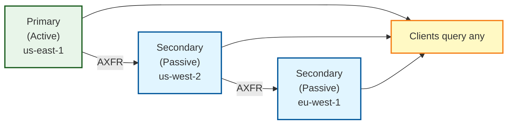
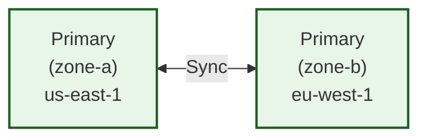
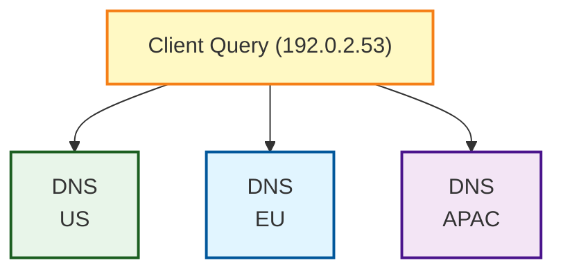
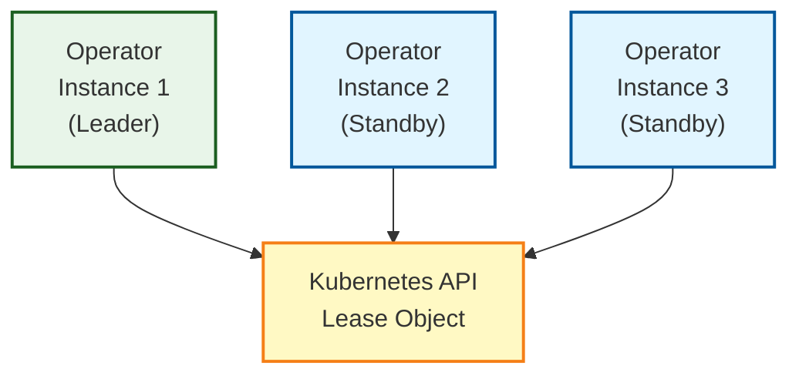

# High Availability

Design and implement highly available DNS infrastructure with Bindy.

## Overview

High availability (HA) DNS ensures continuous DNS service even during:
- Pod failures
- Node failures
- Availability zone outages
- Regional outages
- Planned maintenance

## HA Architecture Components

### 1. Multiple Replicas

Run multiple replicas of each Bind9Instance:

```yaml
apiVersion: bindy.firestoned.io/v1beta1
kind: Bind9Instance
metadata:
  name: primary-dns
spec:
  replicas: 3  # Multiple replicas for pod-level HA
```

**Benefits:**
- Survives pod crashes
- Load distribution
- Zero-downtime updates

### 2. Multiple Instances

Deploy separate primary and secondary instances:

```yaml
# Primary instance
apiVersion: bindy.firestoned.io/v1beta1
kind: Bind9Instance
metadata:
  name: primary-dns
  labels:
    dns-role: primary
spec:
  replicas: 2
---
# Secondary instance  
apiVersion: bindy.firestoned.io/v1beta1
kind: Bind9Instance
metadata:
  name: secondary-dns
  labels:
    dns-role: secondary
spec:
  replicas: 2
```

**Benefits:**
- Role separation
- Independent scaling
- Failover capability

### 3. Geographic Distribution

Deploy instances across multiple regions:

```yaml
# US East primary
apiVersion: bindy.firestoned.io/v1beta1
kind: Bind9Instance
metadata:
  name: primary-us-east
  labels:
    dns-role: primary
    region: us-east-1
spec:
  replicas: 2
---
# US West secondary
apiVersion: bindy.firestoned.io/v1beta1
kind: Bind9Instance
metadata:
  name: secondary-us-west
  labels:
    dns-role: secondary
    region: us-west-2
spec:
  replicas: 2
---
# EU secondary
apiVersion: bindy.firestoned.io/v1beta1
kind: Bind9Instance
metadata:
  name: secondary-eu-west
  labels:
    dns-role: secondary
    region: eu-west-1
spec:
  replicas: 2
```

**Benefits:**
- Regional failure tolerance
- Lower latency for global users
- Regulatory compliance (data locality)

## HA Patterns

### Pattern 1: Active-Passive

One active primary, multiple passive secondaries:



- Updates go to primary only
- Secondaries receive via zone transfer
- Clients query any available instance

### Pattern 2: Multi-Primary

Multiple primaries in different regions:



- Different zones on different primaries
- Geographic distribution of updates
- Careful coordination required

### Pattern 3: Anycast

Same IP announced from multiple locations:



- Requires BGP routing
- Lowest latency routing
- Automatic failover

## Pod-Level HA

### Anti-Affinity

Spread pods across nodes:

```yaml
apiVersion: apps/v1
kind: Deployment
metadata:
  name: primary-dns
spec:
  replicas: 3
  template:
    spec:
      affinity:
        podAntiAffinity:
          preferredDuringSchedulingIgnoredDuringExecution:
          - weight: 100
            podAffinityTerm:
              labelSelector:
                matchExpressions:
                - key: instance
                  operator: In
                  values:
                  - primary-dns
              topologyKey: kubernetes.io/hostname
```

### Topology Spread

Distribute across availability zones:

```yaml
spec:
  topologySpreadConstraints:
  - maxSkew: 1
    topologyKey: topology.kubernetes.io/zone
    whenUnsatisfiable: DoNotSchedule
    labelSelector:
      matchLabels:
        instance: primary-dns
```

## Service-Level HA

### Liveness and Readiness Probes

Ensure only healthy pods serve traffic:

```yaml
livenessProbe:
  exec:
    command: ["dig", "@localhost", "version.bind", "txt", "chaos"]
  initialDelaySeconds: 30
  periodSeconds: 10
  
readinessProbe:
  exec:
    command: ["dig", "@localhost", "version.bind", "txt", "chaos"]
  initialDelaySeconds: 5
  periodSeconds: 5
```

### Pod Disruption Budgets

Limit concurrent disruptions:

```yaml
apiVersion: policy/v1
kind: PodDisruptionBudget
metadata:
  name: primary-dns-pdb
spec:
  minAvailable: 2
  selector:
    matchLabels:
      instance: primary-dns
```

## Monitoring HA

### Check Instance Distribution

```bash
# View instances across regions
kubectl get bind9instances -A -L region

# View pod distribution
kubectl get pods -n dns-system -o wide

# Check zone spread
kubectl get pods -n dns-system \
  -o custom-columns=NAME:.metadata.name,NODE:.spec.nodeName,ZONE:.spec.nodeSelector
```

### Test Failover

```bash
# Simulate pod failure
kubectl delete pod -n dns-system <pod-name>

# Verify automatic recovery
kubectl get pods -n dns-system -w

# Test DNS during failover
while true; do dig @$SERVICE_IP example.com +short; sleep 1; done
```

## Disaster Recovery

### Backup Strategy

```bash
# Regular backups of all CRDs
kubectl get bind9instances,dnszones,arecords,aaaarecords,cnamerecords,mxrecords,txtrecords,nsrecords,srvrecords,caarecords \
  -A -o yaml > backup-$(date +%Y%m%d).yaml
```

### Recovery Procedures

1. **Single Pod Failure** - Kubernetes automatically recreates
2. **Instance Failure** - Clients fail over to other instances
3. **Regional Failure** - Zone data available from other regions
4. **Complete Loss** - Restore from backup

```bash
# Restore from backup
kubectl apply -f backup-20241126.yaml
```

## Operator High Availability

The Bindy operator itself can run in high availability mode with automatic leader election. This ensures continuous DNS management even if operator pods fail.

### Leader Election

Multiple operator instances use Kubernetes Lease objects for distributed leader election:



**How it works:**
1. All operator instances attempt to acquire the lease
2. One instance becomes the leader and starts reconciling resources
3. Standby instances wait and monitor the lease
4. If the leader fails, a standby automatically takes over (~15 seconds)

### HA Operator Deployment

Deploy multiple operator replicas with leader election enabled:

```yaml
apiVersion: apps/v1
kind: Deployment
metadata:
  name: bindy
  namespace: dns-system
spec:
  replicas: 3  # Run 3 instances for HA
  selector:
    matchLabels:
      app: bindy
  template:
    metadata:
      labels:
        app: bindy
    spec:
      serviceAccountName: bindy
      containers:
      - name: operator
        image: ghcr.io/firestoned/bindy:latest
        env:
        # Leader election configuration
        - name: ENABLE_LEADER_ELECTION
          value: "true"
        - name: LEASE_NAME
          value: "bindy-leader"
        - name: LEASE_NAMESPACE
          value: "dns-system"
        - name: LEASE_DURATION_SECONDS
          value: "15"
        - name: LEASE_RENEW_DEADLINE_SECONDS
          value: "10"
        - name: LEASE_RETRY_PERIOD_SECONDS
          value: "2"
        - name: POD_NAME
          valueFrom:
            fieldRef:
              fieldPath: metadata.name
```

### Configuration Options

Environment variables for leader election:

| Variable | Default | Description |
|----------|---------|-------------|
| `ENABLE_LEADER_ELECTION` | `true` | Enable/disable leader election |
| `LEASE_NAME` | `bindy-leader` | Name of the Lease resource |
| `LEASE_NAMESPACE` | `dns-system` | Namespace for the Lease |
| `LEASE_DURATION_SECONDS` | `15` | How long leader holds lease |
| `LEASE_RENEW_DEADLINE_SECONDS` | `10` | Leader must renew before this |
| `LEASE_RETRY_PERIOD_SECONDS` | `2` | How often to attempt lease acquisition |
| `POD_NAME` | `$HOSTNAME` | Unique identity for this operator instance |

### Monitoring Leader Election

Check which operator instance is the current leader:

```bash
# View the lease object
kubectl get lease -n dns-system bindy-leader -o yaml

# Output shows current leader
spec:
  holderIdentity: bindy-7d8f9c5b4d-x7k2m  # Current leader pod
  leaseDurationSeconds: 15
  renewTime: "2025-11-30T12:34:56Z"
```

Monitor operator logs to see leadership changes:

```bash
# Watch operator logs
kubectl logs -n dns-system deployment/bindy -f

# Look for leadership events
INFO Attempting to acquire lease bindy-leader
INFO Lease acquired, this instance is now the leader
INFO Starting all operators
WARN Leadership lost! Stopping all operators...
INFO Lease acquired, this instance is now the leader
```

### Failover Testing

Test automatic failover:

```bash
# Find current leader
LEADER=$(kubectl get lease -n dns-system bindy-leader -o jsonpath='{.spec.holderIdentity}')
echo "Current leader: $LEADER"

# Delete the leader pod
kubectl delete pod -n dns-system $LEADER

# Watch for new leader election (typically ~15 seconds)
kubectl get lease -n dns-system bindy-leader -w

# Verify DNS operations continue uninterrupted
kubectl get bind9instances -A
```

### RBAC Requirements

Leader election requires additional permissions in the operator's Role:

```yaml
apiVersion: rbac.authorization.k8s.io/v1
kind: Role
metadata:
  name: bindy
  namespace: dns-system
rules:
# Leases for leader election
- apiGroups: ["coordination.k8s.io"]
  resources: ["leases"]
  verbs: ["get", "create", "update", "patch"]
```

### Troubleshooting

**Operator not reconciling resources:**

```bash
# Check which instance is leader
kubectl get lease -n dns-system bindy-leader -o jsonpath='{.spec.holderIdentity}'

# Verify that pod exists and is running
kubectl get pods -n dns-system

# Check operator logs
kubectl logs -n dns-system deployment/bindy -f
```

**Multiple operators reconciling (split brain):**

This should never happen with proper leader election. If you suspect it:

```bash
# Check lease configuration
kubectl get lease -n dns-system bindy-leader -o yaml

# Verify all operators use the same LEASE_NAME
kubectl get deployment -n dns-system bindy -o yaml | grep LEASE_NAME

# Force lease release (recreate it)
kubectl delete lease -n dns-system bindy-leader
```

**Leader election disabled but multiple replicas running:**

This will cause conflicts. Either:
1. Enable leader election: Set `ENABLE_LEADER_ELECTION=true`
2. Or run single replica: `kubectl scale deployment bindy --replicas=1`

### Performance Impact

Leader election adds minimal overhead:
- **Failover time:** ~15 seconds (configurable via `LEASE_DURATION_SECONDS`)
- **Network traffic:** 1 lease renewal every 2 seconds from leader only
- **CPU/Memory:** Negligible (<1% increase)

## Best Practices

1. **Run 3+ Operator Replicas** - For operator HA with leader election
2. **Run 3+ DNS Instance Replicas** - Odd numbers for quorum
3. **Multi-AZ Deployment** - Spread across availability zones
4. **Geographic Redundancy** - At least 2 regions for critical zones
5. **Monitor Continuously** - Alert on degraded HA
6. **Test Failover** - Regular disaster recovery drills (both operator and DNS instances)
7. **Automate Recovery** - Use Kubernetes self-healing
8. **Document Procedures** - Runbooks for incidents
9. **Enable Leader Election** - Always run operator with `ENABLE_LEADER_ELECTION=true` in production
10. **Monitor Lease Health** - Alert if lease ownership changes frequently (indicates instability)

## Next Steps

- [Zone Transfers](./zone-transfers.md) - Configure zone replication
- [Replication](./replication.md) - Multi-region replication strategies
- [Performance](./performance.md) - Optimize for high availability
