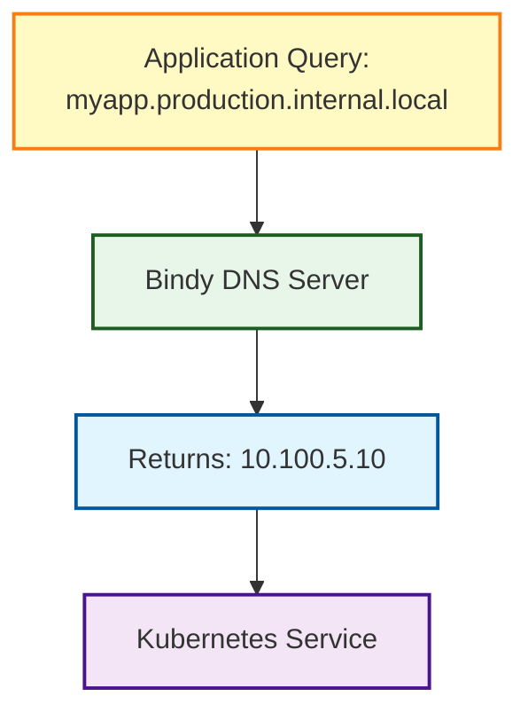

# Service Discovery

Use Bindy for Kubernetes service discovery and internal DNS.

## Kubernetes Service DNS

### Automatic Service Records

Create DNS records for Kubernetes services:

```yaml
apiVersion: v1
kind: Service
metadata:
  name: myapp
  namespace: production
spec:
  selector:
    app: myapp
  ports:
  - port: 80
---
# Create corresponding DNS record
apiVersion: bindy.firestoned.io/v1beta1
kind: ARecord
metadata:
  name: myapp
spec:
  zone: internal-local
  name: myapp.production
  ipv4Addresses:
    - "10.100.5.10"  # Service ClusterIP
```

### Service Discovery Pattern



## Dynamic Updates

Automatically update DNS when services change (future enhancement):

```yaml
# Operator watches Services and creates DNS records
```

## Best Practices

1. **Consistent naming** - Match service names to DNS names
2. **Namespace separation** - Use subdomains per namespace
3. **TTL management** - Short TTLs for dynamic services
4. **Health checks** - Only advertise healthy services

## Next Steps

- [Integration](./integration.md) - Integration patterns
- [External DNS](./external-dns.md) - External DNS integration
