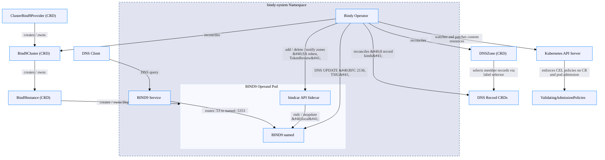

<!--
  GENERATED FILE — DO NOT EDIT.
  Source: calm/bindy-control-plane.architecture.json
  Regenerate with: make calm-docs
-->

# Control Plane — Reconcilers, CRDs & Operands

> Auto-generated from [`calm/bindy-control-plane.architecture.json`](https://github.com/firestoned/bindy/blob/main/calm/bindy-control-plane.architecture.json)
> via `make calm-docs`. Edit the CALM model, not this page.

