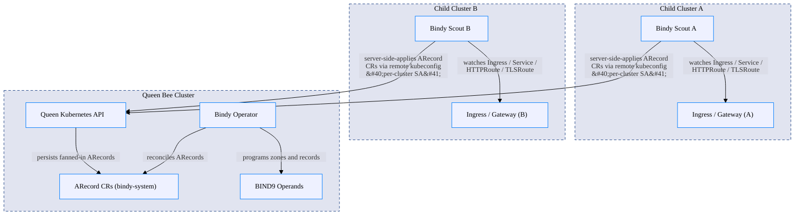

<!--
  GENERATED FILE — DO NOT EDIT.
  Source: calm/bindy-multi-cluster.architecture.json
  Regenerate with: make calm-docs
-->

# Multi-Cluster — Queen Bee & Scout Fan-in

> Auto-generated from [`calm/bindy-multi-cluster.architecture.json`](https://github.com/firestoned/bindy/blob/main/calm/bindy-multi-cluster.architecture.json)
> via `make calm-docs`. Edit the CALM model, not this page.

