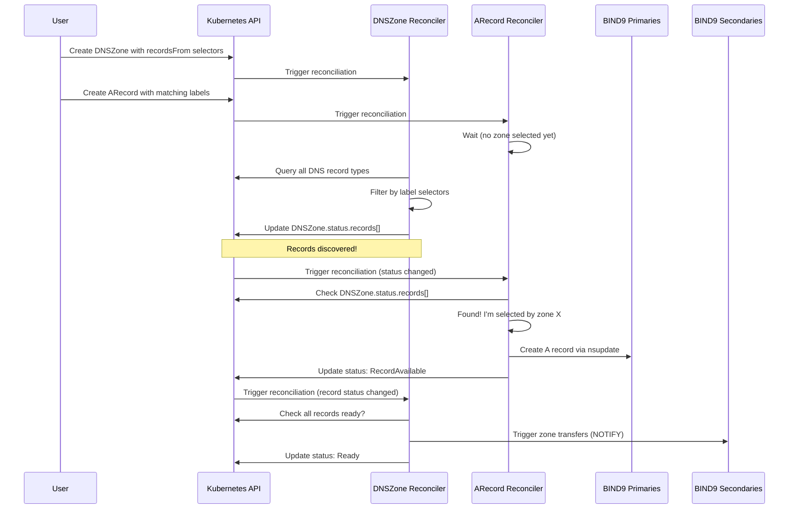
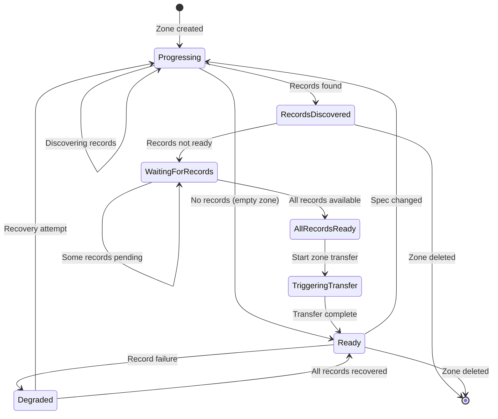
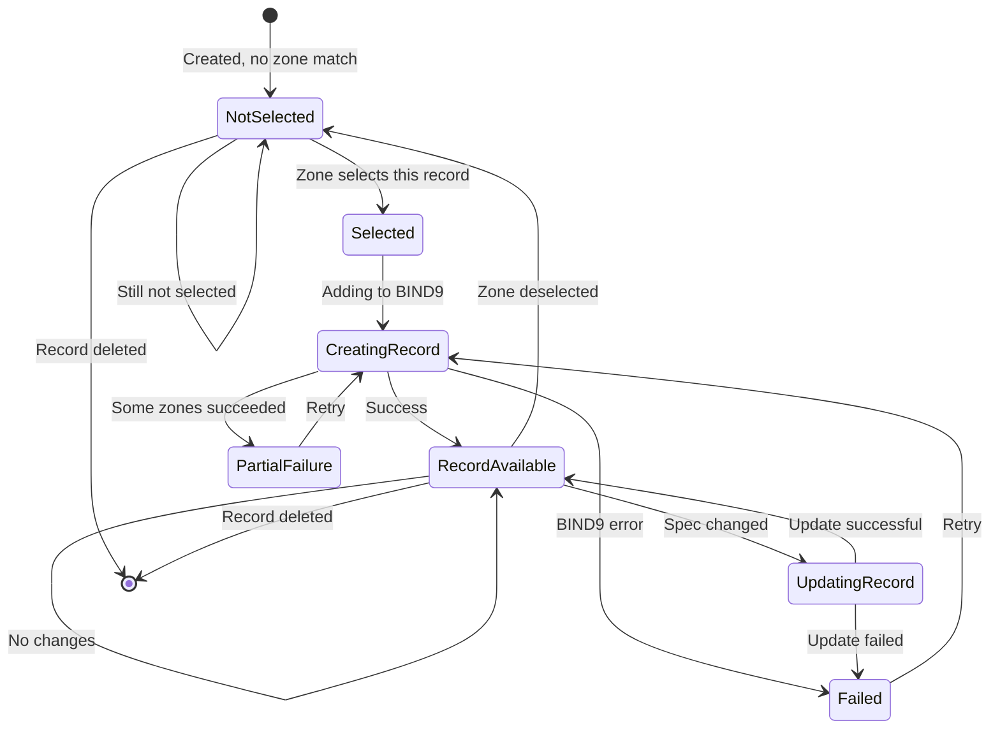
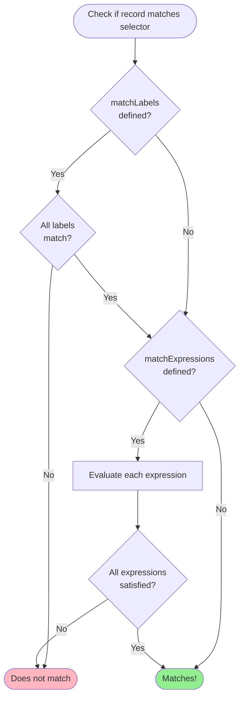
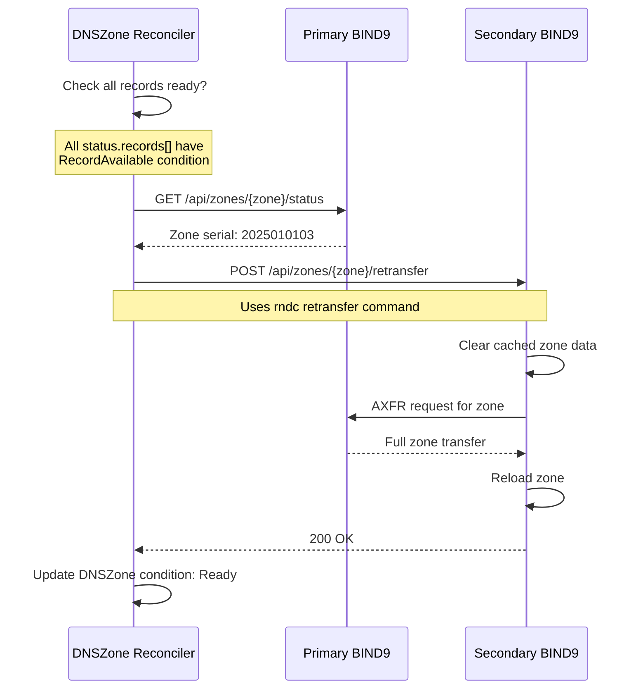

# Label Selector Reconciliation Architecture

## Overview

Bindy uses a hybrid reconciliation architecture where DNS records are associated with zones via Kubernetes label selectors. This document describes how the DNSZone and Record reconcilers work together to manage DNS records in BIND9.

## Architecture Pattern

The architecture follows a **discovery-delegation pattern** similar to how Kubernetes Services discover Pods:

- **DNSZone Reconciler**: Discovers records via label selectors, updates status
- **Record Reconcilers**: Create/update/delete actual DNS records in BIND9
- **Status-Driven**: Record reconcilers check if they're selected before taking action

This separation provides:
- ✅ **Scalability**: Record reconcilers run in parallel
- ✅ **Clear ownership**: Each reconciler has a single responsibility
- ✅ **Efficient updates**: Bulk zone transfers after all records are ready
- ✅ **Better error handling**: Individual record failures don't block others

---

## Reconciliation Flow

### High-Level Flow



### Detailed Flow Diagram

```mermaid
flowchart TB
    Start([User creates DNSZone<br/>and DNS Records]) --> DZStart[DNSZone Reconciler Starts]

    DZStart --> QueryRecords[Query all DNS record types<br/>in namespace]
    QueryRecords --> FilterLabels{Records match<br/>label selectors?}

    FilterLabels -->|Yes| CreateRefs[Create RecordReference<br/>for each match]
    FilterLabels -->|No| NoRecords[No records found]

    CreateRefs --> UpdateStatus[Update DNSZone.status.records[]]
    UpdateStatus --> CheckReady{All records<br/>have status<br/>RecordAvailable?}

    CheckReady -->|No| WaitRecords[Wait for records<br/>to be created]
    CheckReady -->|Yes| TriggerTransfer[Trigger zone transfers<br/>to secondaries]

    TriggerTransfer --> DZReady[Update DNSZone status:<br/>Ready]
    DZReady --> DZEnd([DNSZone Reconciliation Complete])

    NoRecords --> DZEnd
    WaitRecords --> DZEnd

    %% Record Reconciler Flow
    RecStart([Record Reconciler Starts]) --> CheckSelected{Am I in any<br/>DNSZone.status.records[]?}

    CheckSelected -->|No| NotSelected[Update status:<br/>NotSelected]
    NotSelected --> RecEnd([Record Reconciliation Complete])

    CheckSelected -->|Yes| GetZones[Get list of<br/>selecting zones]
    GetZones --> AddLoop[For each zone...]

    AddLoop --> FindPrimaries[Find primary instances<br/>for the cluster]
    FindPrimaries --> AddRecord[Add record to BIND9<br/>via nsupdate/dynamic DNS]

    AddRecord --> RecordSuccess{Success?}
    RecordSuccess -->|Yes| NextZone{More zones?}
    RecordSuccess -->|No| RecordFail[Collect error]

    RecordFail --> NextZone
    NextZone -->|Yes| AddLoop
    NextZone -->|No| UpdateRecStatus[Update record status<br/>based on results]

    UpdateRecStatus --> RecEnd

    style DZReady fill:#90EE90
    style RecordAvailable fill:#90EE90
    style NotSelected fill:#FFB6C1
    style RecordFail fill:#FFB6C1
```

---

## Component Responsibilities

### DNSZone Reconciler

**Primary Responsibilities:**
1. **Discover records** via label selectors
2. **Update `DNSZone.status.records[]`** with discovered records
3. **Trigger zone transfers** to secondaries when all records are ready
4. **Monitor zone health** and update conditions

**Does NOT:**
- ❌ Create individual DNS records in BIND9
- ❌ Manage record lifecycles
- ❌ Track individual record status

**Key Functions:**
- `reconcile_dnszone()` - Main reconciliation loop
- `reconcile_zone_records()` - Discover records via label selectors
- `discover_*_records()` - Helper functions for each record type (A, AAAA, TXT, etc.)

**Status Updates:**
```yaml
status:
  records:
    - apiVersion: bindy.firestoned.io/v1beta1
      kind: ARecord
      name: www-example
    - apiVersion: bindy.firestoned.io/v1beta1
      kind: TXTRecord
      name: spf-example
  recordCount: 2
  conditions:
    - type: Ready
      status: "True"
      reason: ZoneReady
      message: "Zone example.com configured, discovered 2 DNS record(s)"
```

### Record Reconcilers

**Primary Responsibilities:**
1. **Check if selected** by any DNSZone (via `status.records[]`)
2. **Create/update DNS records** in BIND9 primaries
3. **Update record status** with success/failure
4. **Handle record deletion** (remove from BIND9)

**Does NOT:**
- ❌ Trigger zone transfers (DNSZone handles this)
- ❌ Manage zone configuration
- ❌ Discover other records

**Key Functions:**
- `reconcile_*_record()` - Main reconciliation for each record type
- `find_selecting_zones()` - Find DNSZones that selected this record
- `add_*_record_to_zone()` - Add record to BIND9 primaries for a specific zone

**Status Updates:**
```yaml
status:
  conditions:
    - type: Ready
      status: "True"
      reason: RecordAvailable
      message: "A record www successfully added to 1 zone(s)"
  observedGeneration: 3
```

---

## State Transitions

### DNSZone Status States



### Record Status States



---

## Label Selector Matching

### How It Works

DNSZones use Kubernetes label selectors to discover records:

```yaml
apiVersion: bindy.firestoned.io/v1beta1
kind: DNSZone
metadata:
  name: example-com
spec:
  zoneName: example.com
  recordsFrom:
    - selector:
        matchLabels:
          zone: example.com
        matchExpressions:
          - key: environment
            operator: In
            values: [production, staging]
```

Records must have matching labels:

```yaml
apiVersion: bindy.firestoned.io/v1beta1
kind: ARecord
metadata:
  name: www-example
  labels:
    zone: example.com          # Matches matchLabels
    environment: production    # Matches matchExpressions
spec:
  name: www
  ipv4Address: 192.0.2.1
```

### Supported Operators

| Operator | Description | Example |
|----------|-------------|---------|
| `In` | Label value must be in the list | `environment In [prod, staging]` |
| `NotIn` | Label value must NOT be in the list | `tier NotIn [deprecated]` |
| `Exists` | Label key must exist (any value) | `managed-by Exists` |
| `DoesNotExist` | Label key must NOT exist | `legacy DoesNotExist` |

### Matching Algorithm



---

## Zone Transfer Process

### When Transfers Are Triggered

Zone transfers are triggered by the DNSZone reconciler when:
1. ✅ All discovered records have status `RecordAvailable`
2. ✅ At least one record was added/updated/deleted
3. ✅ Secondary instances are configured and running

### Transfer Flow



### Transfer Types

| Type | When Used | Description |
|------|-----------|-------------|
| **AXFR** | Initial transfer, full reload | Complete zone transfer |
| **IXFR** | Incremental updates | Only changed records |
| **NOTIFY** | After record changes | Alert secondaries to check for updates |

Bindy uses `rndc retransfer` which triggers the secondary to request a zone transfer from the primary (typically IXFR if supported, falling back to AXFR).

---

## Error Handling

### DNSZone Reconciler Errors

```yaml
# Record discovery failed
status:
  conditions:
    - type: Degraded
      status: "True"
      reason: RecordDiscoveryFailed
      message: "Failed to discover records: API error"

# Some records failed
status:
  conditions:
    - type: Degraded
      status: "True"
      reason: PartialRecordFailure
      message: "2/5 records failed to create"

# Zone transfer failed
status:
  conditions:
    - type: Degraded
      status: "True"
      reason: TransferFailed
      message: "Failed to transfer zone to secondaries"
```

### Record Reconciler Errors

```yaml
# Not selected by any zone
status:
  conditions:
    - type: Ready
      status: "False"
      reason: NotSelected
      message: "Record not selected by any DNSZone label selector"

# Failed to add to BIND9
status:
  conditions:
    - type: Ready
      status: "False"
      reason: Failed
      message: "Failed to add A record to any zone: connection refused"

# Partial success
status:
  conditions:
    - type: Degraded
      status: "True"
      reason: PartialFailure
      message: "A record www added to 2/3 zones. Errors: zone3: timeout"
```

---

## Performance Considerations

### Parallel Record Reconciliation

Record reconcilers run in parallel, enabling fast reconciliation:

```
DNSZone discovers 100 records
  ├─> ARecord reconcilers (20 parallel)
  ├─> TXTRecord reconcilers (15 parallel)
  ├─> CNAMERecord reconcilers (10 parallel)
  └─> MXRecord reconcilers (5 parallel)
```

### Bulk Zone Transfers

Instead of N transfers (one per record), DNSZone triggers a single transfer after all records are ready:

```
❌ Old approach: 100 records = 100 zone transfers
✅ New approach: 100 records = 1 zone transfer
```

### Generation Tracking

Both DNSZone and Record reconcilers use `metadata.generation` and `status.observedGeneration` to avoid unnecessary reconciliations:

```go
if currentGeneration == observedGeneration {
    // Spec hasn't changed, skip reconciliation
    return Ok(());
}
```

---

## Migration from zoneRef

### Old Approach (zoneRef)

```yaml
apiVersion: bindy.firestoned.io/v1beta1
kind: ARecord
metadata:
  name: www-example
spec:
  zoneRef: example-com  # Hard reference to zone
  name: www
  ipv4Address: 192.0.2.1
```

**Problems:**
- ❌ Bidirectional dependency (record → zone → cluster → instances)
- ❌ Complex reconciliation (record reconciler does everything)
- ❌ One record = one zone only
- ❌ Not Kubernetes-native

### New Approach (Label Selectors)

```yaml
apiVersion: bindy.firestoned.io/v1beta1
kind: DNSZone
metadata:
  name: example-com
spec:
  zoneName: example.com
  recordsFrom:
    - selector:
        matchLabels:
          zone: example.com
---
apiVersion: bindy.firestoned.io/v1beta1
kind: ARecord
metadata:
  name: www-example
  labels:
    zone: example.com  # Declarative label
spec:
  name: www
  ipv4Address: 192.0.2.1
```

**Benefits:**
- ✅ Declarative (zone selects records, not vice versa)
- ✅ Clear separation of concerns
- ✅ One record can be in multiple zones
- ✅ Kubernetes-native pattern (like Services selecting Pods)

---

## Troubleshooting

### Record Not Created in BIND9

**Symptoms:**
- Record status shows `NotSelected`
- Record is not in `DNSZone.status.records[]`

**Diagnosis:**
```bash
# Check DNSZone status
kubectl get dnszone example-com -o jsonpath='{.status.records[*].name}'

# Check record labels
kubectl get arecord www-example -o jsonpath='{.metadata.labels}'

# Check DNSZone selector
kubectl get dnszone example-com -o jsonpath='{.spec.recordsFrom[*].selector}'
```

**Fix:**
Ensure record labels match the DNSZone selector:
```bash
kubectl label arecord www-example zone=example.com
```

### Zone Transfer Not Happening

**Symptoms:**
- Primary has records, secondary doesn't
- DNSZone status shows `Degraded` with `TransferFailed`

**Diagnosis:**
```bash
# Check secondary logs
kubectl logs -l app=bind9,role=secondary -n dns-system

# Check zone serial numbers
kubectl exec -it bind9-primary-0 -- rndc status | grep "zone example.com"
```

**Fix:**
- Check network connectivity between primaries and secondaries
- Verify TSIG keys are configured correctly
- Check allow-transfer ACLs in BIND9 config

### Record Shows PartialFailure

**Symptoms:**
- Record status: `Degraded` / `PartialFailure`
- Some zones have the record, others don't

**Diagnosis:**
Check record status message:
```bash
kubectl get arecord www-example -o jsonpath='{.status.conditions[?(@.type=="Degraded")].message}'
```

**Fix:**
- Check logs of failing primary instances
- Verify RNDC keys are correct for all primaries
- Check if failing primaries are reachable

---

## Best Practices

### 1. Use Consistent Label Schemes

```yaml
# ✅ Good: Consistent labels across records
labels:
  zone: example.com
  environment: production
  team: platform

# ❌ Bad: Inconsistent labels
labels:
  dns-zone: example.com  # Different key
  env: prod              # Abbreviated
```

### 2. Use Meaningful Selectors

```yaml
# ✅ Good: Specific, clear selector
recordsFrom:
  - selector:
      matchLabels:
        zone: example.com
        managed-by: bindy

# ❌ Bad: Too broad selector
recordsFrom:
  - selector:
      matchLabels:
        app: web  # Might match unrelated records
```

### 3. Monitor Record Status

```bash
# Check all records selected by a zone
kubectl get dnszone example-com -o jsonpath='{.status.records[*].name}' | tr ' ' '\n'

# Check records not selected by any zone
kubectl get arecords -o json | jq -r '.items[] | select(.status.conditions[]?.reason == "NotSelected") | .metadata.name'

# Check failed records
kubectl get arecords,txtrecords,cnamerecords -A -o json | jq -r '.items[] | select(.status.conditions[]?.reason == "Failed") | "\(.metadata.namespace)/\(.metadata.name)"'
```

### 4. Use Health Checks

DNSZone health check:
```yaml
status:
  conditions:
    - type: Ready
      status: "True"                        # ← Check this
      reason: ZoneReady
      message: "Zone configured, 5 records"
  recordCount: 5                             # ← Compare with expected count
```

Record health check:
```yaml
status:
  conditions:
    - type: Ready
      status: "True"                        # ← Must be True
      reason: RecordAvailable
      message: "Added to 1 zone(s)"
  observedGeneration: 3                      # ← Should match metadata.generation
```

---

---

## Canonical Kubernetes Watch Pattern

### The Ideal Pattern

The canonical Kubernetes controller pattern uses `.watches()` with mapper functions to trigger parent reconciliation when children change:

```rust
Controller::new(zones_api, Config::default())
    .watches(
        Api::<ARecord>::all(client.clone()),
        Config::default(),
        |arecord| {
            // Mapper: when ARecord changes, find parent DNSZones
            find_zones_selecting_record(&arecord)
                .into_iter()
                .map(|zone_ref| ObjectRef::new(&zone_ref.name).within(&zone_ref.namespace))
        }
    )
    .run(reconcile_zone, error_policy, ctx)
    .await
```

**When a record changes:**
1. Mapper function identifies affected parent DNSZones
2. Controller triggers reconciliation of those zones
3. Zone reconciler processes the change immediately (event-driven)

### Why Bindy Doesn't Use This (Yet)

**Technical Constraint:** The kube-rs `.watches()` API requires **synchronous** mapper functions, but finding which zones selected a record requires an **async** API call:

```rust
// ❌ Problem: This function is async
async fn find_zones_selecting_record(record: &ARecord) -> Vec<ObjectRef> {
    let client = Client::try_default().await?;  // Async!
    let zones = Api::<DNSZone>::namespaced(client, &record.namespace()?);
    let list = zones.list(&ListParams::default()).await?;  // Async!

    list.items.into_iter()
        .filter(|z| z.status.records.contains(record))
        .map(|z| ObjectRef::from(&z))
        .collect()
}

// ✅ Required: Mapper must be sync
fn mapper(record: ARecord) -> impl Iterator<Item = ObjectRef> {
    // No await allowed here!
}
```

### Current Approach

Bindy uses:
1. **Periodic DNSZone reconciliation** (5 minutes for ready zones, 30 seconds otherwise)
2. **Immediate record updates** via record controllers
3. **Event-driven record reconciliation** when zones discover them

This provides most of the benefits without the complexity of caching.

---

## Future Enhancement: Reflector-Based Watches

### Phase 1: Add In-Memory Zone Cache

Use kube-rs reflector/store to maintain a cached view of DNSZones:

```rust
use kube::runtime::reflector::{reflector, Store};
use kube::runtime::watcher;

async fn run_dnszone_controller(client: Client) -> Result<()> {
    // Create in-memory cache of DNSZones
    let zones_api = Api::<DNSZone>::all(client.clone());
    let (zone_reader, zone_writer) = reflector::store();

    // Spawn background task to keep cache updated
    tokio::spawn(reflector(zone_writer, watcher(zones_api.clone(), Config::default())));

    // Now use synchronous mapper with cached data
    Controller::new(zones_api, Config::default())
        .watches(
            Api::<ARecord>::all(client.clone()),
            Config::default(),
            move |arecord| {
                let zones = zone_reader.state();  // Synchronous!
                zones.iter()
                    .filter(|z| {
                        z.status.as_ref()
                            .map(|s| s.records.iter()
                                .any(|r| r.kind == "ARecord" && r.name == arecord.name_any()))
                            .unwrap_or(false)
                    })
                    .map(|z| ObjectRef::new(&z.name_any()).within(&z.namespace().unwrap()))
            }
        )
        .run(reconcile_zone, error_policy, ctx)
        .await
}
```

**Benefits:**
- ✅ Event-driven zone reconciliation when records change
- ✅ No API calls in mapper (uses in-memory cache)
- ✅ Immediate zone transfer triggers
- ✅ Follows canonical Kubernetes pattern

**Trade-offs:**
- ❌ Additional memory overhead (~1KB per DNSZone)
- ❌ Slightly increased complexity
- ❌ Cache consistency considerations (eventual consistency)

### Phase 2: Centralize BIND Interaction (Optional)

Move all BIND9 updates to the DNSZone reconciler:

```rust
async fn reconcile_zone(zone: Arc<DNSZone>, ctx: Arc<Context>) -> Result<Action> {
    // 1. List all records matching zone's label selectors
    let records = discover_all_records(&ctx.client, &zone).await?;

    // 2. Compute full zone state from discovered records
    let zone_data = compute_zone_data(&zone, &records)?;

    // 3. Sync entire zone to BIND9 atomically
    sync_zone_to_bind(&zone, &zone_data, &ctx.zone_manager).await?;

    Ok(Action::requeue(Duration::from_secs(300)))
}
```

**Benefits:**
- ✅ Zone-level transactional semantics
- ✅ Simpler record controllers (validation only)
- ✅ Better consistency guarantees

**Trade-offs:**
- ❌ More complex DNSZone reconciler
- ❌ Delayed record propagation (wait for zone reconciliation)
- ❌ Higher resource usage (full zone syncs)
- ❌ Loss of immediate record updates

### Recommendation: Implement Phase 1 Only

**Phase 1 (reflector-based watches):**
- ✅ Provides event-driven reconciliation
- ✅ Maintains immediate record updates
- ✅ Minimal complexity increase
- ✅ Follows Kubernetes best practices

**Phase 2 (centralized BIND interaction):**
- ❌ Breaks immediate record updates
- ❌ Significant complexity increase
- ❌ Performance concerns with large zones
- ⚠️ Only implement if you need zone-level transactions

---

## References

- [Kubernetes Label Selectors](https://kubernetes.io/docs/concepts/overview/working-with-objects/labels/)
- [BIND9 Dynamic DNS Updates (RFC 2136)](https://datatracker.ietf.org/doc/html/rfc2136)
- [BIND9 Zone Transfers (AXFR/IXFR)](https://bind9.readthedocs.io/en/latest/reference.html#zone-transfers)
- [Kubernetes Controller Pattern](https://kubernetes.io/docs/concepts/architecture/controller/)
- [kube-rs Controller Documentation](https://docs.rs/kube/latest/kube/runtime/controller/struct.Controller.html)
- [kube-rs Reflector/Store Pattern](https://docs.rs/kube/latest/kube/runtime/reflector/index.html)
