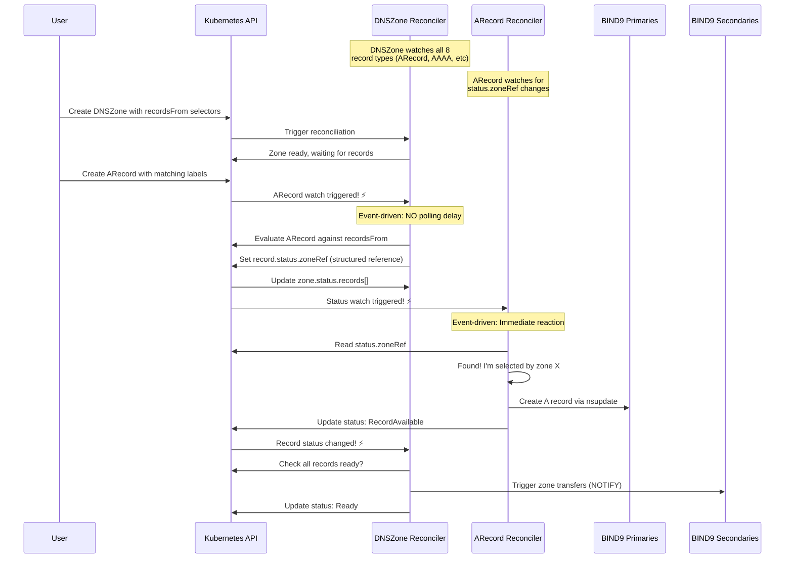
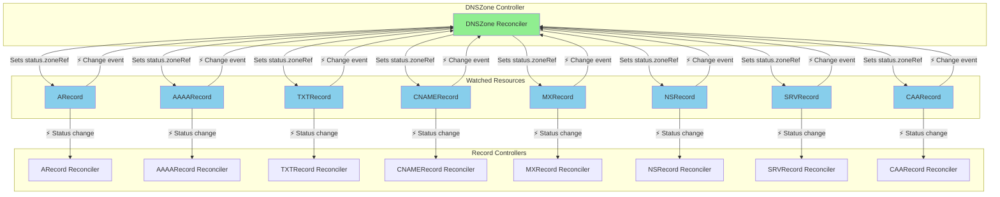
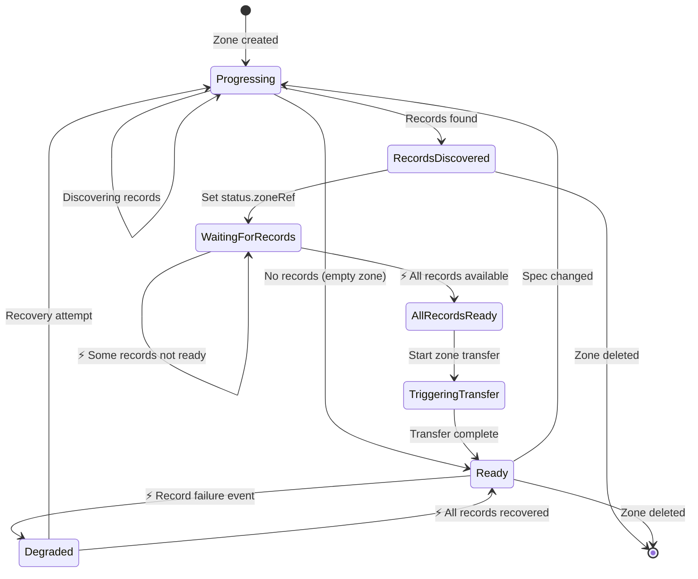
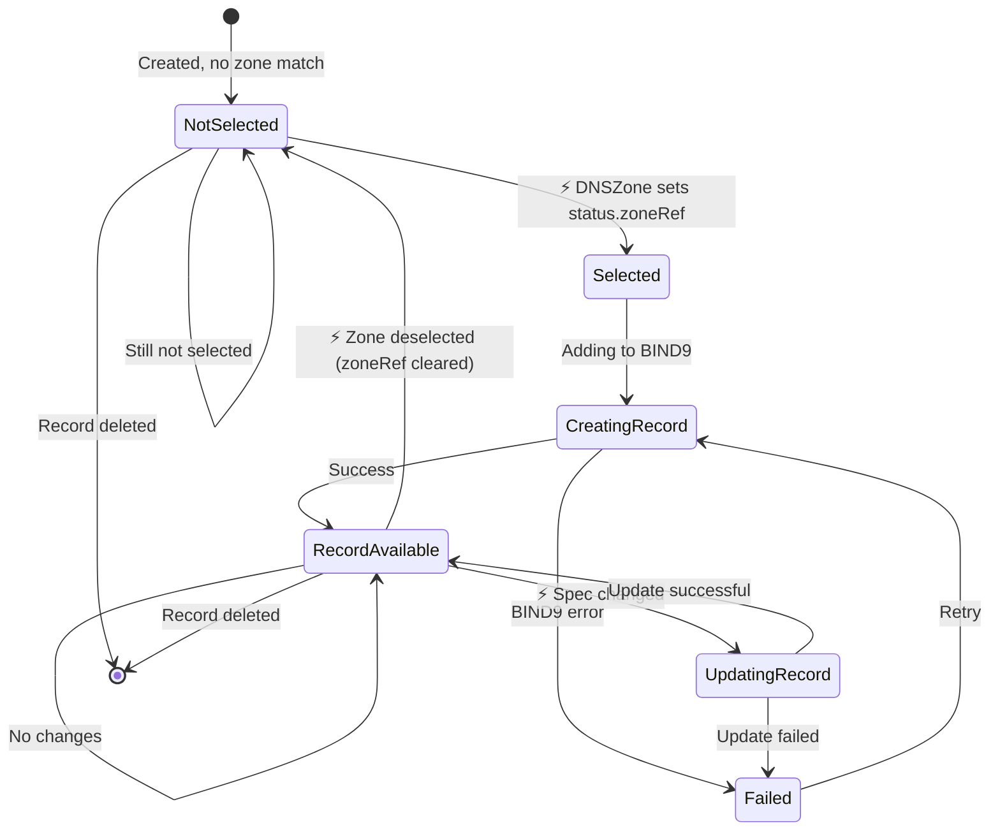
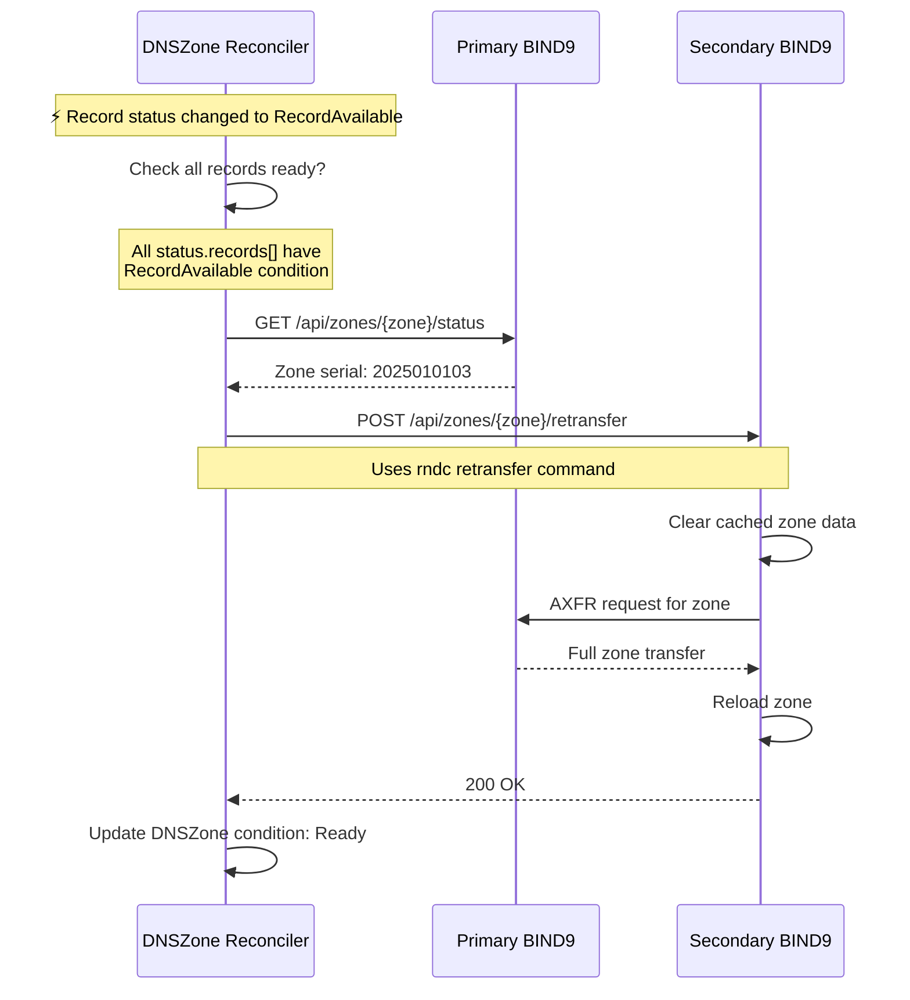

# Label Selector Reconciliation Architecture

## Overview

Bindy uses a **fully event-driven** reconciliation architecture where DNS records are associated with zones via Kubernetes label selectors. This document describes how the DNSZone and Record reconcilers work together to manage DNS records in BIND9 with immediate, reactive reconciliation.

## Architecture Pattern

The architecture follows a **discovery-delegation pattern** similar to how Kubernetes Services discover Pods, but with **event-driven watches** instead of polling:

- **DNSZone Reconciler**: Watches all 8 record types, sets `record.status.zoneRef` when records match label selectors
- **Record Reconcilers**: Watch for status changes, create/update/delete actual DNS records in BIND9 when selected
- **Event-Driven**: Both controllers react immediately to changes (no polling delays)

This separation provides:
- ✅ **Instant responsiveness**: Sub-second reaction to record/zone changes
- ✅ **Scalability**: Record reconcilers run in parallel
- ✅ **Clear ownership**: Each reconciler has a single responsibility
- ✅ **Efficient updates**: Bulk zone transfers after all records are ready
- ✅ **Better error handling**: Individual record failures don't block others
- ✅ **Kubernetes-native**: Follows canonical controller watch patterns

---

## Reconciliation Flow

### High-Level Event-Driven Flow



### Detailed Flow Diagram

```mermaid
flowchart TB
    Start([User creates DNSZone<br/>and DNS Records]) --> DZStart[DNSZone Reconciler Starts]

    DZStart --> SetupWatches[Setup watches for all 8<br/>record types]
    SetupWatches --> InitialDisc[Initial record discovery]
    InitialDisc --> QueryRecords[Query all DNS record types<br/>in namespace]
    QueryRecords --> FilterLabels{Records match<br/>label selectors?}

    FilterLabels -->|Yes| SetZoneRef[Set record.status.zoneRef<br/>with full metadata]
    FilterLabels -->|No| NoRecords[No matching records]

    SetZoneRef --> UpdateStatus[Update DNSZone.status.records[]]
    UpdateStatus --> WaitStatus[Wait for record<br/>status updates]

    WaitStatus --> RecWatch[⚡ Record status changed]
    RecWatch --> CheckReady{All records<br/>have status<br/>RecordAvailable?}

    CheckReady -->|No| WaitStatus
    CheckReady -->|Yes| TriggerTransfer[Trigger zone transfers<br/>to secondaries]

    TriggerTransfer --> DZReady[Update DNSZone status:<br/>Ready]
    DZReady --> EventWait[Wait for events...]

    EventWait --> RecordCreated{⚡ Record<br/>created/updated?}
    RecordCreated -->|Yes| QueryRecords

    NoRecords --> DZReady
    DZReady --> DZEnd([DNSZone watching...])

    %% Record Reconciler Flow
    RecStart([Record Reconciler Starts]) --> RecWatch2[⚡ Status change event]
    RecWatch2 --> CheckZoneRef{status.zoneRef<br/>set?}

    CheckZoneRef -->|No| NotSelected[Update status:<br/>NotSelected]
    NotSelected --> RecEnd([Record waiting...])

    CheckZoneRef -->|Yes| GetZone[Get parent DNSZone<br/>from zoneRef]
    GetZone --> FindPrimaries[Find primary instances<br/>for the zone]
    FindPrimaries --> AddRecord[Add record to BIND9<br/>via nsupdate/dynamic DNS]

    AddRecord --> RecordSuccess{Success?}
    RecordSuccess -->|Yes| UpdateRecStatus[Update status:<br/>RecordAvailable]
    RecordSuccess -->|No| RecordFail[Update status:<br/>Failed]

    UpdateRecStatus --> RecEnd
    RecordFail --> RecEnd

    style DZReady fill:#90EE90
    style RecordAvailable fill:#90EE90
    style NotSelected fill:#FFB6C1
    style RecordFail fill:#FFB6C1
    style RecWatch fill:#FFD700
    style RecWatch2 fill:#FFD700
    style RecordCreated fill:#FFD700
```

---

## Component Responsibilities

### DNSZone Reconciler

**Primary Responsibilities:**
1. **Watch all 8 record types** (ARecord, AAAARecord, TXTRecord, CNAMERecord, MXRecord, NSRecord, SRVRecord, CAARecord)
2. **Set `record.status.zoneRef`** when records match `spec.recordsFrom` label selectors
3. **Update `DNSZone.status.records[]`** with discovered records
4. **Trigger zone transfers** to secondaries when all records are ready
5. **Monitor zone health** and update conditions

**Does NOT:**
- ❌ Create individual DNS records in BIND9 (record controllers do this)
- ❌ Manage record lifecycles
- ❌ Poll for records (uses event-driven watches)

**Key Functions:**
- `reconcile_dnszone()` - Main reconciliation loop
- `reconcile_zone_records()` - Discover records via label selectors
- `tag_record_with_zone()` - Set `status.zoneRef` on matching records

**Watch Configuration:**
```rust
// DNSZone controller watches ALL 8 record types
Controller::new(api, default_watcher_config())
    .watches(arecord_api, default_watcher_config(), move |record| {
        // When ARecord changes, find zones in same namespace
        zone_store.state().iter()
            .find(|zone| zone.namespace() == record.namespace())
            .map(|zone| ObjectRef::new(&zone.name_any()).within(&namespace))
    })
    // ... 7 more watches for other record types
    .run(reconcile_dnszone, error_policy, ctx)
```

**Status Updates:**
```yaml
status:
  records:
    - apiVersion: bindy.firestoned.io/v1beta1
      kind: ARecord
      name: www-example
    - apiVersion: bindy.firestoned.io/v1beta1
      kind: TXTRecord
      name: spf-example
  recordCount: 2
  conditions:
    - type: Ready
      status: "True"
      reason: ZoneReady
      message: "Zone example.com configured, discovered 2 DNS record(s)"
```

### Record Reconcilers

**Primary Responsibilities:**
1. **Watch for status changes** (specifically `status.zoneRef`)
2. **Check if selected** by a DNSZone (via `status.zoneRef`)
3. **Create/update DNS records** in BIND9 primaries
4. **Update record status** with success/failure
5. **Handle record deletion** (remove from BIND9)

**Does NOT:**
- ❌ Trigger zone transfers (DNSZone handles this)
- ❌ Manage zone configuration
- ❌ Discover other records
- ❌ Poll for zone assignments (uses event-driven watches)

**Key Functions:**
- `reconcile_*_record()` - Main reconciliation for each record type
- `find_zone_from_status()` - Get parent zone from `status.zoneRef`
- `add_*_record_to_zone()` - Add record to BIND9 primaries for a specific zone

**Watch Configuration:**
```rust
// Record controllers watch for ALL changes including status
Controller::new(api, default_watcher_config())  // Watches spec + status
    .run(reconcile_arecord, error_policy, ctx)
```

**Status Updates:**
```yaml
status:
  # NEW: Structured zone reference set by DNSZone controller
  zoneRef:
    apiVersion: bindy.firestoned.io/v1beta1
    kind: DNSZone
    name: example-com
    namespace: default
    zoneName: example.com
  # DEPRECATED: String-based zone reference (kept for backward compat)
  zone: example.com
  conditions:
    - type: Ready
      status: "True"
      reason: RecordAvailable
      message: "A record www successfully added to zone example.com"
  observedGeneration: 3
```

---

## Event-Driven Architecture

### Why Event-Driven?

**Old Polling Approach:**
```
DNSZone reconciles every 5 minutes
  → Queries all 8 record types
  → Filters by label selectors
  → Updates status.records[]
  → Record sees change... eventually (30s-5min delay)
```

**New Event-Driven Approach:**
```
Record created/updated
  → DNSZone watches trigger immediately ⚡
  → Evaluate label selectors
  → Set status.zoneRef instantly
  → Record status watch triggers ⚡
  → Record reconciles within seconds
```

**Performance Improvement:**
- ❌ Old: 30 seconds to 5 minutes delay
- ✅ New: Sub-second reaction time

### Watch Relationships



---

## State Transitions

### DNSZone Status States



### Record Status States



---

## Label Selector Matching

### How It Works

DNSZones use Kubernetes label selectors to discover records:

```yaml
apiVersion: bindy.firestoned.io/v1beta1
kind: DNSZone
metadata:
  name: example-com
spec:
  zoneName: example.com
  recordsFrom:
    - selector:
        matchLabels:
          zone: example.com
        matchExpressions:
          - key: environment
            operator: In
            values: [production, staging]
```

Records must have matching labels:

```yaml
apiVersion: bindy.firestoned.io/v1beta1
kind: ARecord
metadata:
  name: www-example
  labels:
    zone: example.com          # Matches matchLabels
    environment: production    # Matches matchExpressions
spec:
  name: www
  ipv4Address: 192.0.2.1
```

When the DNSZone controller watches this ARecord change, it:
1. ⚡ **Receives watch event** immediately (no polling)
2. **Evaluates label selectors** against the record
3. **Sets `status.zoneRef`** with full metadata if matched
4. **Updates `status.records[]`** in the DNSZone

When the ARecord controller sees the status change:
1. ⚡ **Receives status watch event** immediately
2. **Reads `status.zoneRef`** to find parent zone
3. **Adds record to BIND9** primaries
4. **Updates status** with result

### Supported Operators

| Operator | Description | Example |
|----------|-------------|---------|
| `In` | Label value must be in the list | `environment In [prod, staging]` |
| `NotIn` | Label value must NOT be in the list | `tier NotIn [deprecated]` |
| `Exists` | Label key must exist (any value) | `managed-by Exists` |
| `DoesNotExist` | Label key must NOT exist | `legacy DoesNotExist` |

---

## Zone Transfer Process

### When Transfers Are Triggered

Zone transfers are triggered by the DNSZone reconciler when:
1. ✅ All discovered records have status `RecordAvailable`
2. ✅ At least one record was added/updated/deleted
3. ✅ Secondary instances are configured and running

**Event-Driven Trigger:**
```
Record updates status.RecordAvailable
  → DNSZone status watch triggers ⚡
  → Check if all records ready
  → Trigger zone transfer immediately
```

### Transfer Flow



---

## Performance Considerations

### Instant Reconciliation

Event-driven architecture provides sub-second reconciliation:

```
Record created at 10:00:00.000
  → DNSZone watch triggered at 10:00:00.050 (50ms)
  → status.zoneRef set at 10:00:00.100 (100ms)
  → Record watch triggered at 10:00:00.150 (150ms)
  → BIND9 updated at 10:00:00.500 (500ms)
  → Total time: 500ms ✅
```

**Old Polling Approach:**
```
Record created at 10:00:00.000
  → DNSZone reconciles at 10:05:00.000 (5 minute delay)
  → Record sees change at 10:05:30.000 (30 second delay)
  → Total time: 5 minutes 30 seconds ❌
```

### Parallel Record Reconciliation

Record reconcilers run in parallel, enabling fast reconciliation:

```
DNSZone discovers 100 records
  ├─> ARecord reconcilers (20 parallel)
  ├─> TXTRecord reconcilers (15 parallel)
  ├─> CNAMERecord reconcilers (10 parallel)
  └─> MXRecord reconcilers (5 parallel)
```

### Efficient Zone Transfers

DNSZone triggers a single transfer after all records are ready:

```
❌ Old approach: 100 records = 100 zone transfers
✅ New approach: 100 records = 1 zone transfer (after all ready)
```

---

## Troubleshooting

### Record Not Created in BIND9

**Symptoms:**
- Record status shows `NotSelected`
- Record status.zoneRef is not set

**Diagnosis:**
```bash
# Check record status.zoneRef
kubectl get arecord www-example -o jsonpath='{.status.zoneRef}'

# Check record labels
kubectl get arecord www-example -o jsonpath='{.metadata.labels}'

# Check DNSZone selector
kubectl get dnszone example-com -o jsonpath='{.spec.recordsFrom[*].selector}'
```

**Fix:**
Ensure record labels match the DNSZone selector:
```bash
kubectl label arecord www-example zone=example.com
# DNSZone watch will trigger immediately ⚡
# status.zoneRef will be set within seconds
```

### Zone Transfer Not Happening

**Symptoms:**
- Primary has records, secondary doesn't
- DNSZone status shows `Degraded` with `TransferFailed`

**Diagnosis:**
```bash
# Check secondary logs
kubectl logs -l app=bind9,role=secondary -n dns-system

# Check zone serial numbers
kubectl exec -it bind9-primary-0 -- rndc status | grep "zone example.com"
```

**Fix:**
- Check network connectivity between primaries and secondaries
- Verify TSIG keys are configured correctly
- Check allow-transfer ACLs in BIND9 config

### Record Shows PartialFailure

**Symptoms:**
- Record status: `Degraded` / `PartialFailure`
- Some zones have the record, others don't

**Diagnosis:**
Check record status message:
```bash
kubectl get arecord www-example -o jsonpath='{.status.conditions[?(@.type=="Degraded")].message}'
```

**Fix:**
- Check logs of failing primary instances
- Verify RNDC keys are correct for all primaries
- Check if failing primaries are reachable

---

## Best Practices

### 1. Use Consistent Label Schemes

```yaml
# ✅ Good: Consistent labels across records
labels:
  zone: example.com
  environment: production
  team: platform

# ❌ Bad: Inconsistent labels
labels:
  dns-zone: example.com  # Different key
  env: prod              # Abbreviated
```

### 2. Use Meaningful Selectors

```yaml
# ✅ Good: Specific, clear selector
recordsFrom:
  - selector:
      matchLabels:
        zone: example.com
        managed-by: bindy

# ❌ Bad: Too broad selector
recordsFrom:
  - selector:
      matchLabels:
        app: web  # Might match unrelated records
```

### 3. Monitor Record Status

```bash
# Check all records selected by a zone
kubectl get dnszone example-com -o jsonpath='{.status.records[*].name}' | tr ' ' '\n'

# Check records not selected by any zone
kubectl get arecords -o json | jq -r '.items[] | select(.status.zoneRef == null) | .metadata.name'

# Check failed records
kubectl get arecords,txtrecords,cnamerecords -A -o json | jq -r '.items[] | select(.status.conditions[]?.reason == "Failed") | "\(.metadata.namespace)/\(.metadata.name)"'
```

### 4. Use Health Checks

DNSZone health check:
```yaml
status:
  conditions:
    - type: Ready
      status: "True"                        # ← Check this
      reason: ZoneReady
      message: "Zone configured, 5 records"
  recordCount: 5                             # ← Compare with expected count
```

Record health check:
```yaml
status:
  zoneRef:                                  # ← Must be set if selected
    name: example-com
    zoneName: example.com
  conditions:
    - type: Ready
      status: "True"                        # ← Must be True
      reason: RecordAvailable
      message: "Added to zone example.com"
  observedGeneration: 3                      # ← Should match metadata.generation
```

---

## Migration from Old Architecture

### Old Approach (Polling)

```rust
// ❌ Old: Periodic reconciliation
Controller::new(zones_api, Config::default())
    .run(reconcile_zone, error_policy, ctx)
    .await

// Zone reconciled every 5 minutes
// Records discovered via API calls during reconciliation
```

**Problems:**
- ❌ 30 second to 5 minute delays
- ❌ Unnecessary API calls every 5 minutes
- ❌ High API server load
- ❌ Poor user experience

### New Approach (Event-Driven)

```rust
// ✅ New: Event-driven watches
Controller::new(zones_api, default_watcher_config())
    .watches(arecord_api, default_watcher_config(), |record| {
        // Immediately react to record changes
        find_zones_in_namespace(&record)
    })
    // ... 7 more watches for other record types
    .run(reconcile_zone, error_policy, ctx)
    .await

// Instant reaction to changes
// No polling delays
```

**Benefits:**
- ✅ Sub-second reaction times
- ✅ Lower API server load
- ✅ Better user experience
- ✅ Follows Kubernetes best practices

---

## References

- [Kubernetes Label Selectors](https://kubernetes.io/docs/concepts/overview/working-with-objects/labels/)
- [BIND9 Dynamic DNS Updates (RFC 2136)](https://datatracker.ietf.org/doc/html/rfc2136)
- [BIND9 Zone Transfers (AXFR/IXFR)](https://bind9.readthedocs.io/en/latest/reference.html#zone-transfers)
- [Kubernetes Controller Pattern](https://kubernetes.io/docs/concepts/architecture/controller/)
- [kube-rs Controller Documentation](https://docs.rs/kube/latest/kube/runtime/controller/struct.Controller.html)
- [kube-rs Reflector/Store Pattern](https://docs.rs/kube/latest/kube/runtime/reflector/index.html)
