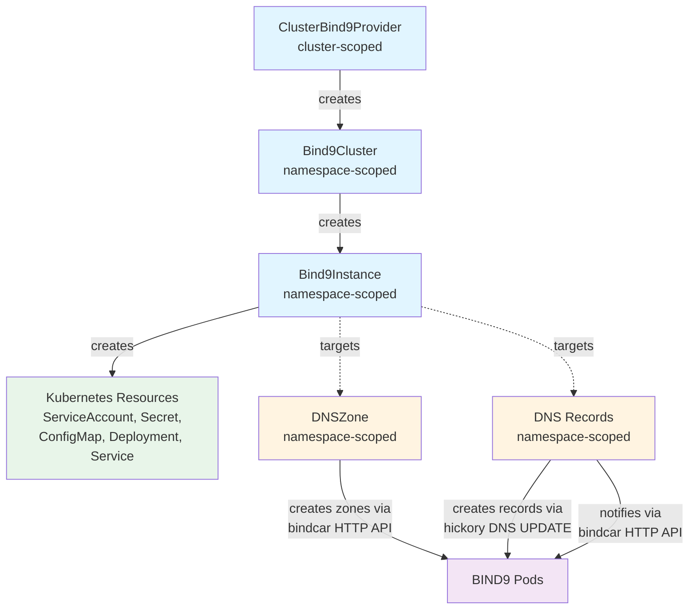
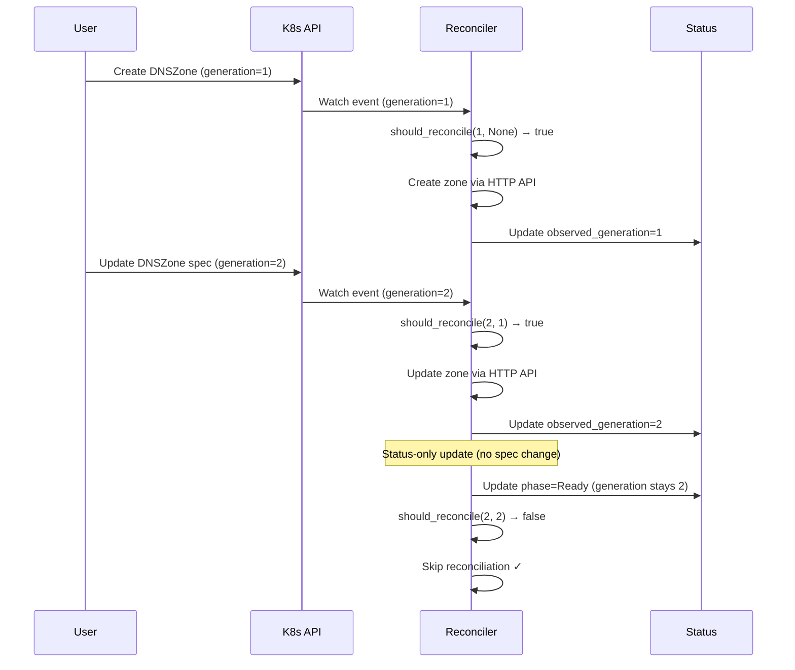
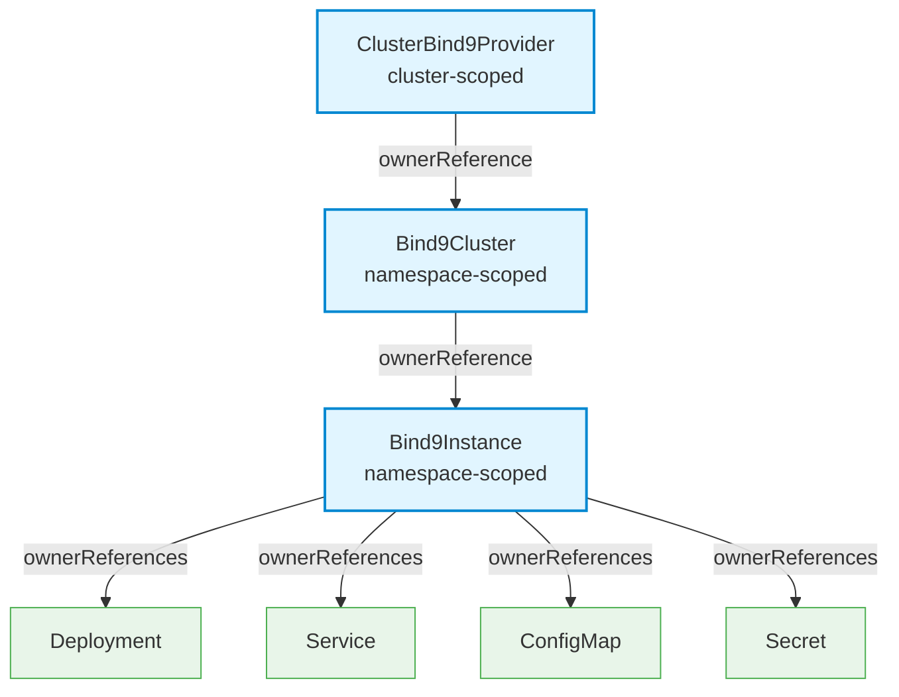
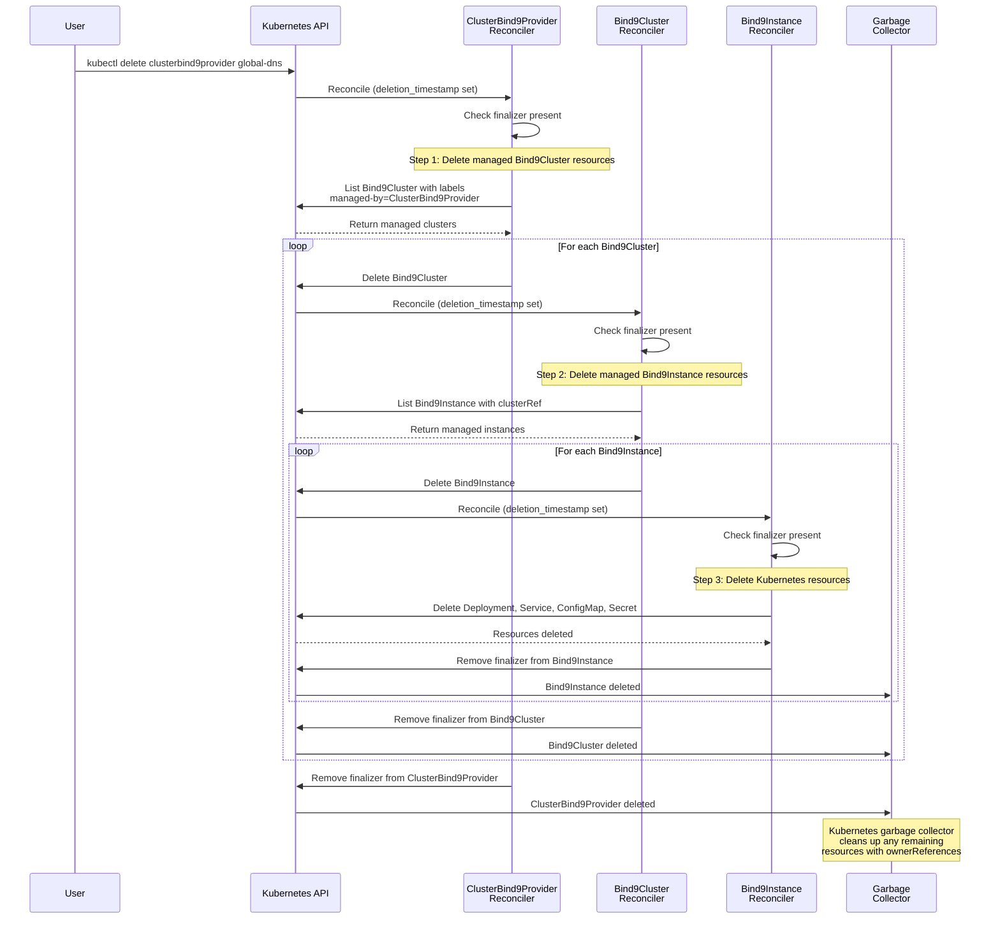

# Reconciler Hierarchy and Delegation

This document describes the simplified reconciler architecture in Bindy, showing how each operator watches for resources and delegates to sub-resources.

## Overview

Bindy follows a **hierarchical delegation pattern** where each reconciler is responsible for creating and managing its immediate child resources. This creates a clean separation of concerns and makes the system easier to understand and maintain.



## Reconciler Details

### 1. ClusterBind9Provider Reconciler

**Scope**: Cluster-scoped resource

**Purpose**: Creates `Bind9Cluster` resources in desired namespaces to enable multi-tenant DNS infrastructure.

**Watches**: `ClusterBind9Provider` resources

**Creates**: `Bind9Cluster` resources in the namespace specified in the spec, or defaults to `dns-system`

**Change Detection**:
- **Spec changed**: Uses `should_reconcile()` to compare `metadata.generation` with `status.observed_generation`
- **Desired vs actual state**: Verifies all `Bind9Cluster` resources exist in target namespaces

**Implementation**: [`src/reconcilers/clusterbind9provider.rs`](https://github.com/firestoned/bindy/blob/main/src/reconcilers/clusterbind9provider.rs)

**Example**:
```yaml
apiVersion: bindy.firestoned.io/v1beta1
kind: ClusterBind9Provider
metadata:
  name: global-dns
spec:
  namespaces:
    - platform-dns
    - team-web
    - team-api
  primaryReplicas: 2
  secondaryReplicas: 3
```

Creates `Bind9Cluster` resources in each namespace: `platform-dns`, `team-web`, `team-api`.

---

### 2. Bind9Cluster Reconciler

**Scope**: Namespace-scoped resource

**Purpose**: Creates and manages `Bind9Instance` resources based on desired replica counts for primary and secondary servers.

**Watches**: `Bind9Cluster` resources

**Creates**:
- `Bind9Instance` resources for primaries (e.g., `my-cluster-primary-0`, `my-cluster-primary-1`)
- `Bind9Instance` resources for secondaries (e.g., `my-cluster-secondary-0`, `my-cluster-secondary-1`)
- ConfigMap with shared BIND9 configuration (optional, for standalone configs)

**Change Detection**:
- **Spec changed**: Uses `should_reconcile()` to compare `metadata.generation` with `status.observed_generation`
- **Desired vs actual state**:
  - Verifies all `Bind9Instance` resources exist
  - Scales instances up/down based on `primaryReplicas` and `secondaryReplicas`

**Implementation**: [`src/reconcilers/bind9cluster.rs`](https://github.com/firestoned/bindy/blob/main/src/reconcilers/bind9cluster.rs)

**Example**:
```yaml
apiVersion: bindy.firestoned.io/v1beta1
kind: Bind9Cluster
metadata:
  name: my-cluster
  namespace: platform-dns
spec:
  primaryReplicas: 2
  secondaryReplicas: 3
```

Creates:
- `my-cluster-primary-0`, `my-cluster-primary-1` (primaries)
- `my-cluster-secondary-0`, `my-cluster-secondary-1`, `my-cluster-secondary-2` (secondaries)

---

### 3. Bind9Instance Reconciler

**Scope**: Namespace-scoped resource

**Purpose**: Creates all Kubernetes resources needed to run a single BIND9 server pod.

**Watches**: `Bind9Instance` resources

**Creates**:
- **ServiceAccount**: For pod identity and RBAC
- **Secret**: Contains auto-generated RNDC key (HMAC-SHA256) for authentication
- **ConfigMap**: BIND9 configuration (`named.conf`, zone files, etc.) - only for standalone instances
- **Deployment**: Runs the BIND9 pod with bindcar HTTP API sidecar
- **Service**: Exposes DNS (UDP/TCP 53) and HTTP API (TCP 8080) ports

**Change Detection**:
- **Spec changed**: Uses `should_reconcile()` to compare `metadata.generation` with `status.observed_generation`
- **Desired vs actual state** (drift detection):
  - Checks if `Deployment` resource exists
  - Recreates missing resources if detected

**Implementation**: [`src/reconcilers/bind9instance.rs`](https://github.com/firestoned/bindy/blob/main/src/reconcilers/bind9instance.rs)

**Drift Detection Logic**:
```rust
// Only reconcile resources if:
// 1. Spec changed (generation mismatch), OR
// 2. We haven't processed this resource yet (no observed_generation), OR
// 3. Resources are missing (drift detected)
let should_reconcile = should_reconcile(current_generation, observed_generation);

if !should_reconcile && deployment_exists {
    // Skip reconciliation - spec unchanged and resources exist
    return Ok(());
}

if !should_reconcile && !deployment_exists {
    // Drift detected - recreate missing resources
    info!("Spec unchanged but Deployment missing - drift detected, reconciling resources");
}
```

**Example**:
```yaml
apiVersion: bindy.firestoned.io/v1beta1
kind: Bind9Instance
metadata:
  name: my-cluster-primary-0
  namespace: platform-dns
spec:
  role: Primary
  clusterRef: my-cluster
  replicas: 1
```

Creates: ServiceAccount, Secret, ConfigMap, Deployment, Service for `my-cluster-primary-0`.

---

### 4. DNSZone Reconciler

**Scope**: Namespace-scoped resource

**Purpose**: Creates DNS zones in **ALL** BIND9 instances (primary and secondary) via the bindcar HTTP API.

**Watches**: `DNSZone` resources

**Creates**: DNS zones in BIND9 using the bindcar HTTP API sidecar

**Change Detection**:
- **Spec changed**: Uses `should_reconcile()` to compare `metadata.generation` with `status.observed_generation`
- **Desired vs actual state**:
  - Checks if zone exists using `zone_manager.zone_exists()` via HTTP API
  - Early returns if spec unchanged

**Implementation**: [`src/reconcilers/dnszone.rs`](https://github.com/firestoned/bindy/blob/main/src/reconcilers/dnszone.rs)

**Protocol Details**:
- **Zone operations**: HTTP API via bindcar sidecar (port 8080)
- **Endpoints**:
  - `POST /api/addzone/{zone}` - Add primary/secondary zone
  - `DELETE /api/delzone/{zone}` - Delete zone
  - `POST /api/notify/{zone}` - Trigger zone transfer (NOTIFY)
  - `GET /api/zonestatus/{zone}` - Check if zone exists

**Logic Flow**:
1. Finds **all primary instances** for the cluster (namespace-scoped or global)
2. Loads RNDC key for each instance (from Secret `{instance}-rndc-key`)
3. Calls `zone_manager.add_zones()` via HTTP API on **all primary endpoints**
4. Finds **all secondary instances** for the cluster
5. Calls `zone_manager.add_secondary_zone()` via HTTP API on **all secondary endpoints**
6. Notifies secondaries via `zone_manager.notify_zone()` to trigger zone transfer

**Example**:
```yaml
apiVersion: bindy.firestoned.io/v1beta1
kind: DNSZone
metadata:
  name: example-zone
  namespace: platform-dns
spec:
  zoneName: example.com
  clusterRef: my-cluster
  soa:
    primaryNameServer: ns1.example.com
    adminEmail: admin.example.com
    ttl: 3600
```

Creates zone `example.com` in all instances of `my-cluster` via HTTP API.

---

### 5. DNS Record Reconcilers

**Scope**: Namespace-scoped resources

**Purpose**: Create DNS records in zones using **hickory DNS UPDATE (RFC 2136)** and notify secondaries via bindcar HTTP API.

**Watches**: `ARecord`, `AAAARecord`, `CNAMERecord`, `TXTRecord`, `MXRecord`, `NSRecord`, `SRVRecord`, `CAARecord`

**Creates**: DNS records in BIND9 using two protocols:
1. **DNS UPDATE (RFC 2136)** via hickory client - for creating records
2. **HTTP API** via bindcar sidecar - for notifying secondaries

**Change Detection**:
- **Spec changed**: Uses `should_reconcile()` to compare `metadata.generation` with `status.observed_generation`
- **Desired vs actual state**:
  - Checks if zone exists using HTTP API before adding records
  - Returns error if zone doesn't exist

**Implementation**: [`src/reconcilers/records.rs`](https://github.com/firestoned/bindy/blob/main/src/reconcilers/records.rs)

**Protocol Details**:

| Operation | Protocol | Port | Authentication |
|-----------|----------|------|----------------|
| Check zone exists | HTTP API (bindcar) | 8080 | ServiceAccount token |
| Add/update records | DNS UPDATE (hickory) | 53 (TCP) | TSIG (RNDC key) |
| Notify secondaries | HTTP API (bindcar) | 8080 | ServiceAccount token |

**Logic Flow**:
1. Looks up the `DNSZone` resource to get zone info
2. Finds **all primary instances** for the zone's cluster
3. For each primary instance:
   - Checks if zone exists via HTTP API (port 8080)
   - Loads RNDC key from Secret
   - Creates TSIG signer for authentication
   - Sends DNS UPDATE message via hickory client (port 53 TCP)
4. After all records are added, notifies **first primary** via HTTP API to trigger zone transfer

**Example**:
```yaml
apiVersion: bindy.firestoned.io/v1beta1
kind: ARecord
metadata:
  name: www-example-com
  namespace: platform-dns
spec:
  zone: example.com
  name: www
  ipv4: 192.0.2.1
  ttl: 300
```

Creates A record `www.example.com` → `192.0.2.1` in all primary instances via DNS UPDATE, then notifies secondaries via HTTP API.

---

## Change Detection Logic

All reconcilers implement the **"changed"** detection pattern, which means they reconcile when:

1. **Spec changed**: `metadata.generation` ≠ `status.observed_generation`
2. **First reconciliation**: `status.observed_generation` is `None`
3. **Drift detected**: Desired state (YAML) ≠ actual state (cluster)

### Implementation: `should_reconcile()`

Located in [`src/reconcilers/mod.rs:127-133`](https://github.com/firestoned/bindy/blob/main/src/reconcilers/mod.rs#L127-L133):

```rust
pub fn should_reconcile(current_generation: Option<i64>, observed_generation: Option<i64>) -> bool {
    match (current_generation, observed_generation) {
        (Some(current), Some(observed)) => current != observed,
        (Some(_), None) => true, // First reconciliation
        _ => false,              // No generation tracking available
    }
}
```

### Kubernetes Generation Semantics

- **`metadata.generation`**: Incremented by Kubernetes API server **only when spec changes**
- **`status.observed_generation`**: Set by operator to match `metadata.generation` after successful reconciliation
- **Status-only updates**: Do NOT increment `metadata.generation`, preventing unnecessary reconciliations

### Example: Reconciliation Flow



---

## Protocol Summary

| Component | Creates | Protocol | Port | Authentication |
|-----------|---------|----------|------|----------------|
| **ClusterBind9Provider** | Bind9Cluster | Kubernetes API | - | ServiceAccount |
| **Bind9Cluster** | Bind9Instance | Kubernetes API | - | ServiceAccount |
| **Bind9Instance** | K8s Resources | Kubernetes API | - | ServiceAccount |
| **DNSZone** | Zones in BIND9 | HTTP API (bindcar) | 8080 | ServiceAccount token |
| **DNS Records** | Records in zones | DNS UPDATE (hickory) | 53 TCP | TSIG (RNDC key) |
| **DNS Records** | Notify secondaries | HTTP API (bindcar) | 8080 | ServiceAccount token |

---

## Key Architectural Principles

### 1. **Hierarchical Delegation**
Each reconciler creates and manages only its immediate children:
- `ClusterBind9Provider` → `Bind9Cluster`
- `Bind9Cluster` → `Bind9Instance`
- `Bind9Instance` → Kubernetes resources

### 2. **Namespace Scoping**
All resources (except `ClusterBind9Provider`) are namespace-scoped, enabling multi-tenancy:
- Teams can manage their own DNS infrastructure in their namespaces
- No cross-namespace resource access required

### 3. **Change Detection**
All reconcilers implement consistent change detection:
- Skip work if spec unchanged and resources exist
- Detect drift and recreate missing resources
- Use generation tracking to avoid unnecessary reconciliations

### 4. **Protocol Separation**
- **HTTP API** (bindcar): Zone-level operations (add, delete, notify)
- **DNS UPDATE** (hickory): Record-level operations (add, update, delete records)
- **Kubernetes API**: Resource lifecycle management

### 5. **Idempotency**
All operations are idempotent:
- Adding an existing zone returns success
- Adding an existing record updates it
- Deleting a non-existent resource returns success

### 6. **Error Handling**
Each reconciler handles errors gracefully:
- Updates status with error conditions
- Retries on transient failures (exponential backoff)
- Requeues on permanent errors with longer delays

---

## Owner References and Resource Cleanup

Bindy implements proper Kubernetes owner references to ensure automatic cascade deletion and prevent resource leaks.

### What are Owner References?

Owner references are Kubernetes metadata that establish parent-child relationships between resources. When set, Kubernetes automatically:
- **Garbage collects** child resources when the parent is deleted
- **Blocks deletion** of the parent if children still exist (when `blockOwnerDeletion: true`)
- **Shows ownership** in resource metadata for easy tracking

### Owner Reference Hierarchy in Bindy



### Implementation Details

#### 1. ClusterBind9Provider → Bind9Cluster

**Location:** [`src/reconcilers/clusterbind9provider.rs:340-352`](https://github.com/firestoned/bindy/blob/main/src/reconcilers/clusterbind9provider.rs#L340-L352)

```rust
// Create ownerReference to cluster provider (cluster-scoped can own namespace-scoped)
let owner_ref = OwnerReference {
    api_version: API_GROUP_VERSION.to_string(),
    kind: KIND_BIND9_GLOBALCLUSTER.to_string(),
    name: global_cluster_name.clone(),
    uid: global_cluster.metadata.uid.clone().unwrap_or_default(),
    operator: Some(true),
    block_owner_deletion: Some(true),
};
```

**Key Points:**
- Cluster-scoped resources CAN own namespace-scoped resources
- `operator: true` means this is the primary operator for the child
- `block_owner_deletion: true` prevents deleting parent while children exist
- Finalizer ensures manual cleanup of `Bind9Cluster` resources before parent deletion

#### 2. Bind9Cluster → Bind9Instance

**Location:** [`src/reconcilers/bind9cluster.rs:592-599`](https://github.com/firestoned/bindy/blob/main/src/reconcilers/bind9cluster.rs#L592-L599)

```rust
// Create ownerReference to the Bind9Cluster
let owner_ref = OwnerReference {
    api_version: API_GROUP_VERSION.to_string(),
    kind: KIND_BIND9_CLUSTER.to_string(),
    name: cluster_name.clone(),
    uid: cluster.metadata.uid.clone().unwrap_or_default(),
    operator: Some(true),
    block_owner_deletion: Some(true),
};
```

**Key Points:**
- Both resources are namespace-scoped, so they must be in the same namespace
- Finalizer ensures manual cleanup of `Bind9Instance` resources before parent deletion
- Each instance created includes this owner reference

#### 3. Bind9Instance → Kubernetes Resources

**Location:** [`src/bind9_resources.rs:188-197`](https://github.com/firestoned/bindy/blob/main/src/bind9_resources.rs#L188-L197)

```rust
pub fn build_owner_references(instance: &Bind9Instance) -> Vec<OwnerReference> {
    vec![OwnerReference {
        api_version: API_GROUP_VERSION.to_string(),
        kind: KIND_BIND9_INSTANCE.to_string(),
        name: instance.name_any(),
        uid: instance.metadata.uid.clone().unwrap_or_default(),
        operator: Some(true),
        block_owner_deletion: Some(true),
    }]
}
```

**Resources with Owner References:**
- ✅ **Deployment**: Managed by `Bind9Instance`
- ✅ **Service**: Managed by `Bind9Instance`
- ✅ **ConfigMap**: Managed by `Bind9Instance` (standalone instances only)
- ✅ **Secret** (RNDC key): Managed by `Bind9Instance`
- ❌ **ServiceAccount**: Shared resource, no owner reference (prevents conflicts)

### Deletion Flow

When a `ClusterBind9Provider` is deleted, the following cascade occurs:



### Why Both Finalizers AND Owner References?

Bindy uses **both** finalizers and owner references for robust cleanup:

| Mechanism | Purpose | When It Runs |
|-----------|---------|--------------|
| **Owner References** | Automatic cleanup by Kubernetes | After parent deletion completes |
| **Finalizers** | Manual cleanup of children | Before parent deletion completes |

**The Flow:**
1. **Finalizer runs first**: Lists and deletes managed children explicitly
2. **Owner reference runs second**: Kubernetes garbage collector cleans up any remaining resources

**Why this combination?**
- **Finalizers**: Give control over deletion order and allow cleanup actions (like calling HTTP APIs)
- **Owner References**: Provide safety net if finalizer fails or is bypassed
- **Together**: Ensure no resource leaks under any circumstances

### Verifying Owner References

You can verify owner references are set correctly:

```bash
# Check Bind9Cluster owner reference
kubectl get bind9cluster <name> -n <namespace> -o yaml | grep -A 10 ownerReferences

# Check Bind9Instance owner reference
kubectl get bind9instance <name> -n <namespace> -o yaml | grep -A 10 ownerReferences

# Check Deployment owner reference
kubectl get deployment <name> -n <namespace> -o yaml | grep -A 10 ownerReferences
```

Expected output:
```yaml
ownerReferences:
- apiVersion: bindy.firestoned.io/v1beta1
  blockOwnerDeletion: true
  operator: true
  kind: ClusterBind9Provider  # or Bind9Cluster, Bind9Instance
  name: global-dns
  uid: 12345678-1234-1234-1234-123456789abc
```

### Troubleshooting

#### Issue: Resources not being deleted

**Check:**
1. Verify owner references are set: `kubectl get <resource> -o yaml | grep ownerReferences`
2. Check if finalizers are blocking deletion: `kubectl get <resource> -o yaml | grep finalizers`
3. Verify garbage collector is running: `kubectl get events --field-selector reason=Garbage`

**Solution:**
- If owner reference is missing, the resource was created before the fix (manual deletion required)
- If finalizer is stuck, check reconciler logs for errors
- If garbage collector is not running, check cluster health

#### Issue: Cannot delete parent resource

**Symptom:** `kubectl delete` hangs or shows "waiting for deletion"

**Cause:** Finalizer is running and cleaning up children

**Expected Behavior:** This is normal! Wait for the finalizer to complete.

**Check Progress:**
```bash
# Watch deletion progress
kubectl get clusterbind9provider <name> -w

# Check reconciler logs
kubectl logs -n bindy-system -l app=bindy -f
```

---

## DNSZone Reconciliation Architecture Evolution

### Before: Dual Operator Architecture (Deprecated)

Prior to Phase 1-8 consolidation (January 2026), Bindy used a dual operator architecture with circular dependencies:

**Problems:**
- Two operators managing the same resource (DNSZone)
- Circular dependencies: DNSZone → Bind9Instance.status.selectedZones → ZoneSync → DNSZone
- Multiple status fields tracking the same information (`instances[]`, `syncStatus[]`, `selectedZones[]`)
- Complex event-driven architecture with multiple reconciliation paths

### After: Unified DNSZone Operator

The consolidated architecture (current) uses a single DNSZone operator that:

1. **Discovers Bind9Instances** via `clusterRef` and/or `bind9InstancesFrom` label selectors
2. **Synchronizes zones** to selected instances via HTTP API
3. **Tracks status** per instance in `status.bind9Instances[]`
4. **Maintains conditions** based on instance health

**Key Improvements:**
- ✅ **Single reconciler**: DNSZone operator owns all zone operations
- ✅ **No circular dependencies**: Unidirectional data flow
- ✅ **Simplified status**: Single source of truth in `DNSZone.status`
- ✅ **Better performance**: Fewer reconciliation loops
- ✅ **Easier debugging**: Clear ownership and responsibility

**Selection Methods:**

DNSZone can select Bind9Instances in two ways:

1. **Via clusterRef**: All instances with matching `spec.clusterRef`
2. **Via bind9InstancesFrom**: Instances matching label selectors
3. **BOTH**: UNION of instances from both methods (duplicates removed by UID)

**Status Tracking:**

```yaml
status:
  bind9Instances:
    - name: primary-dns-0
      namespace: dns-system
      uid: abc-123
      state: Configured
      lastSyncTime: "2026-01-25T10:30:00Z"
    - name: secondary-dns-0
      namespace: dns-system
      uid: def-456
      state: Configured
      lastSyncTime: "2026-01-25T10:30:05Z"
  bind9InstancesCount: 2
  observedGeneration: 5
  conditions:
    - type: Ready
      status: "True"
      reason: AllInstancesConfigured
```

For detailed reconciliation flow, see [Architecture Overview](../guide/architecture.md#reconciliation-flow).

---

## Related Documentation

- [Architecture Overview](../concepts/architecture.md) - High-level system architecture
- [Protocol Reference](../concepts/architecture-protocols.md) - HTTP API and RNDC protocols
- [Label Selector Reconciliation](./label-selector-reconciliation.md) - Label selector logic details
- [Custom Resource Definitions](../reference/api.md) - CRD API reference
- [Labels and Annotations](../reference/labels-annotations.md) - Standard labels
