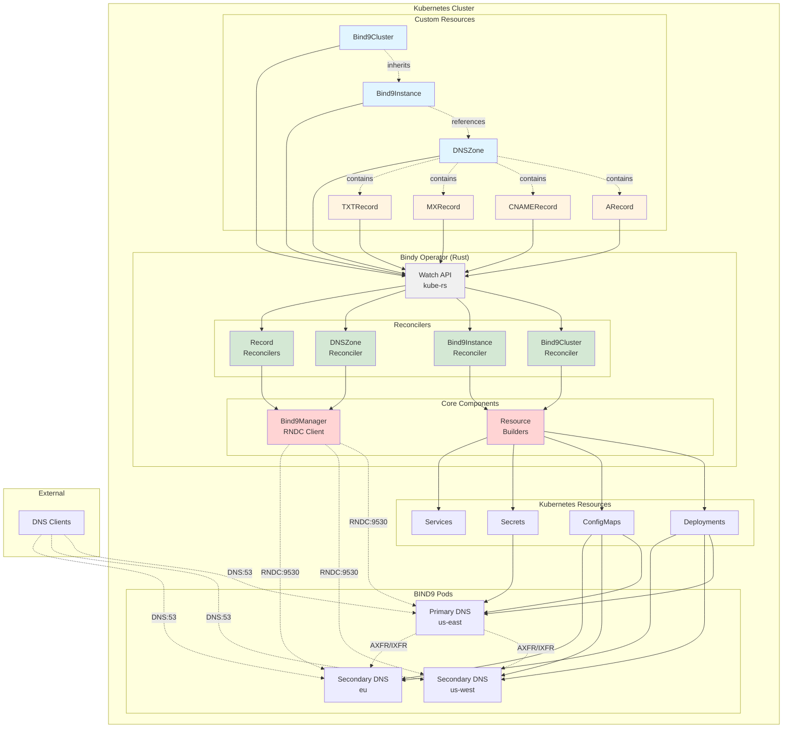
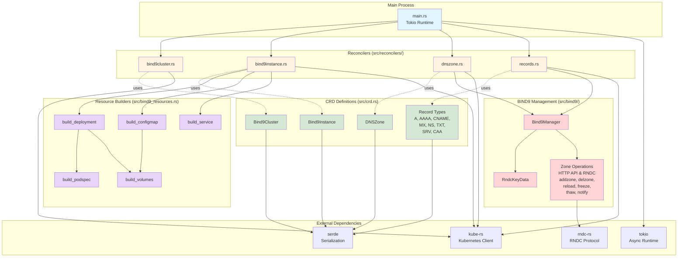
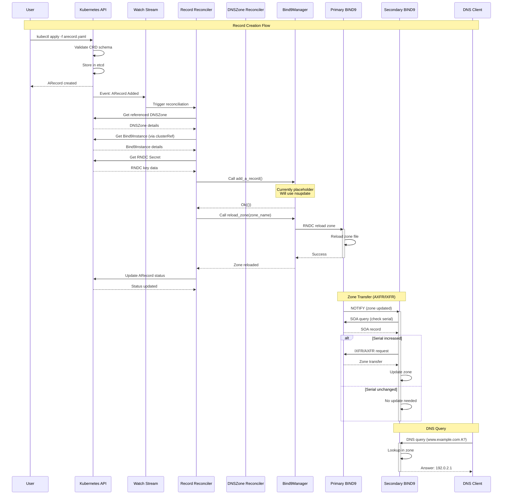
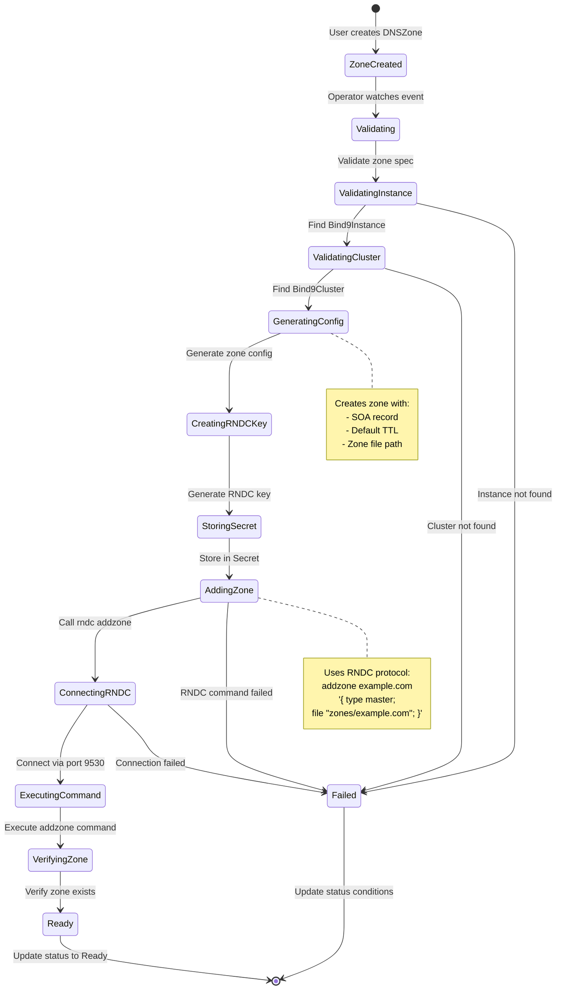
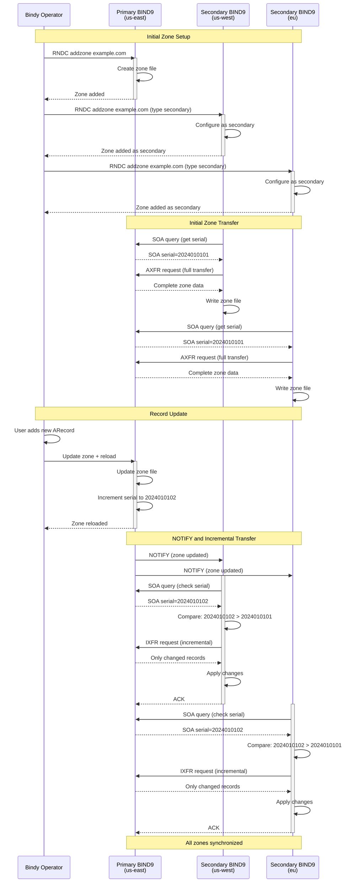
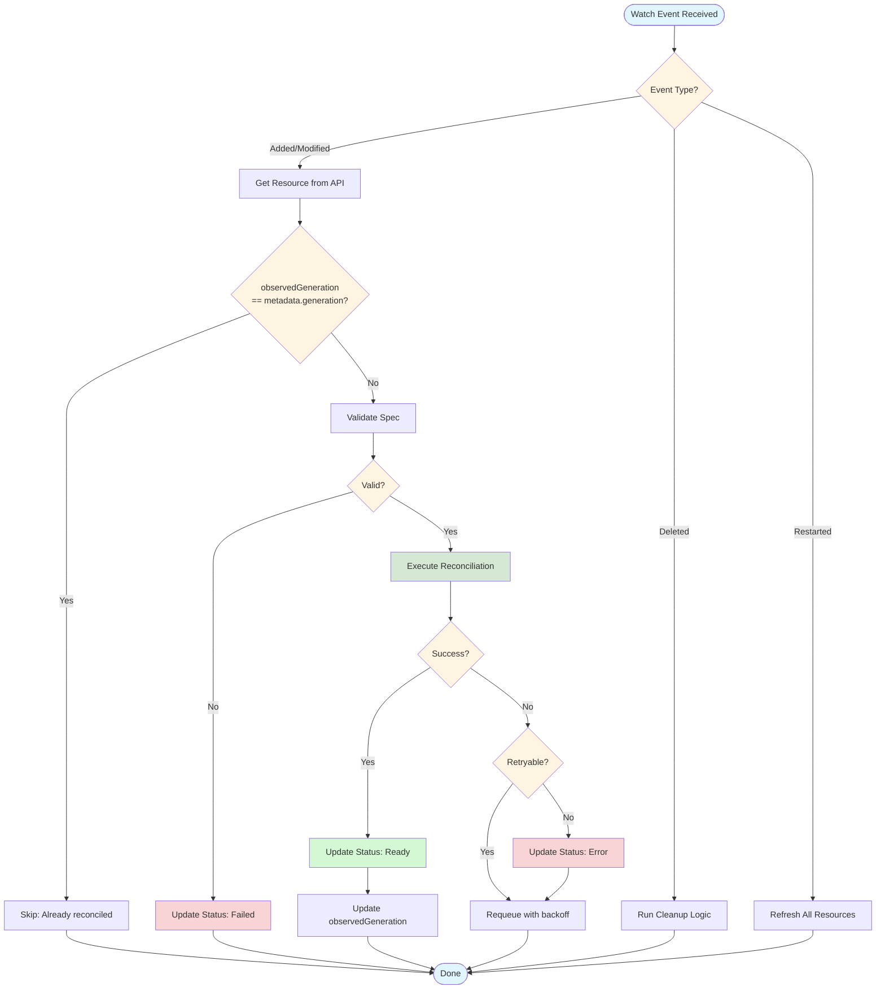
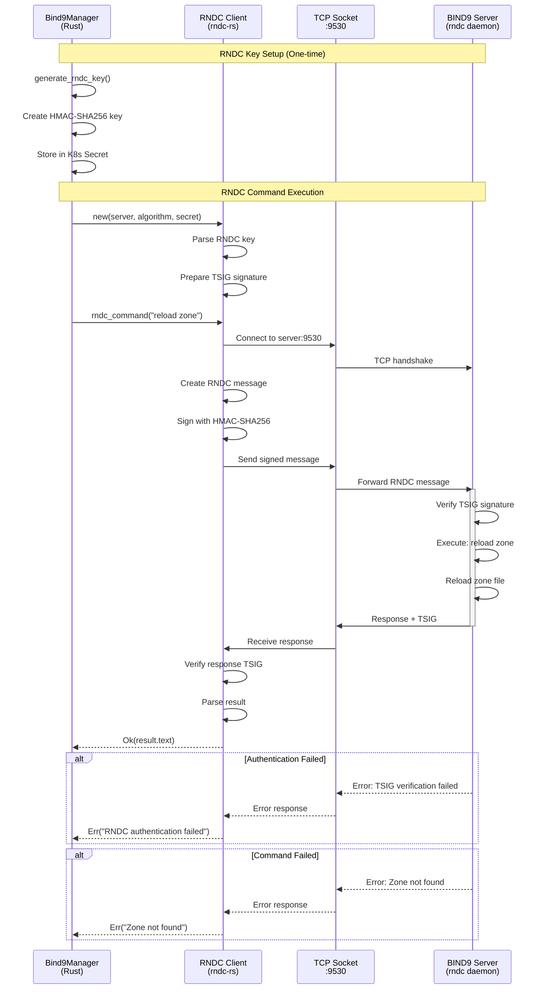
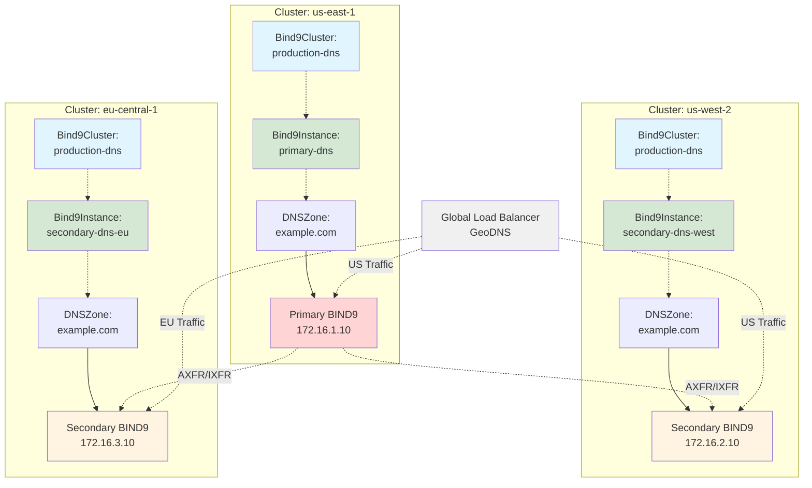

# Architecture Diagrams

Comprehensive visual diagrams showing Bindy's architecture, components, and data flows.

## System Architecture

## Rust Component Architecture

## DNS Record Creation Data Flow

## Zone Creation and Synchronization Flow

## Primary to Secondary Zone Transfer Flow

## Reconciliation Loop

## RNDC Protocol Communication

## Multi-Cluster Deployment

## Related Documentation

- [Architecture Overview](./architecture.md) - Detailed text description
- [Protocol Reference](./architecture-protocols.md) - RNDC and HTTP API protocol details
- [CRD Specifications](./crds.md) - Custom resource definitions
