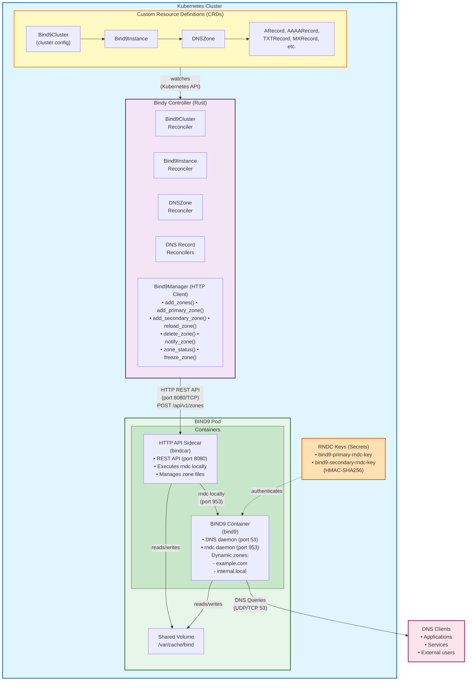

# HTTP API-Based Architecture

This page provides a detailed overview of Bindy's HTTP API-based architecture that uses a sidecar container to manage BIND9 via a REST API.

## High-Level Architecture



## Key Architectural Changes from Direct RNDC

### Previous Architecture (Direct RNDC)
- Controller communicated directly with BIND9 via rndc protocol (port 953)
- Required TSIG authentication for every request
- Controller needed network access to every BIND9 pod
- Complex authentication and connection management

### New Architecture (HTTP API Sidecar)
- **Sidecar pattern**: bindcar container runs alongside BIND9
- **HTTP REST API**: Controller uses simple HTTP (port 8080) instead of rndc protocol
- **Local rndc**: API sidecar executes rndc locally (localhost:953)
- **Shared volumes**: /var/cache/bind shared between BIND9 and API containers
- **ServiceAccount authentication**: Uses Kubernetes ServiceAccount tokens
- **Simplified networking**: Controller only needs to reach Service, not individual pods
- **Better error handling**: REST API provides structured JSON responses

## Sidecar Container Pattern

```
┌─────────────────────────────────────────────────────────────┐
│                        BIND9 Pod                            │
│                                                             │
│  ┌──────────────────┐          ┌─────────────────────────┐ │
│  │  BIND9 Container │          │  bindcar Sidecar │ │
│  │                  │          │                         │ │
│  │  Port 53 (DNS)   │          │  Port 8080 (HTTP API)   │ │
│  │  Port 953 (rndc) │◀─────────│  rndc client            │ │
│  │                  │  local   │                         │ │
│  │  named daemon    │  rndc    │  Axum HTTP server       │ │
│  │                  │          │                         │ │
│  │  /var/cache/bind │◀────────▶│  /var/cache/bind        │ │
│  │  (zone files)    │  shared  │  (zone files)           │ │
│  └──────────────────┘  volume  └─────────────────────────┘ │
│                                                             │
└─────────────────────────────────────────────────────────────┘
         ▲                               ▲
         │                               │
         │ DNS queries                   │ HTTP REST API
         │ (port 53)                     │ (port 8080)
         │                               │
    DNS Clients                    Bindy Controller
```

## HTTP API Communication

```
┌──────────────────────┐                 ┌──────────────────────┐
│  Bindy Controller    │                 │  bindcar      │
│                      │                 │  Sidecar Container   │
│  ┌────────────────┐  │                 │                      │
│  │ Bind9Manager   │  │   HTTP POST     │  ┌────────────────┐  │
│  │                │  │   Port 8080     │  │  Axum Server   │  │
│  │ reqwest client │──┼────────────────▶│  │                │  │
│  │                │  │                 │  │  POST /api/v1/ │  │
│  │ ServiceAccount │  │  Bearer Token   │  │       zones    │  │
│  │ Token Auth     │  │                 │  │                │  │
│  │                │  │                 │  │  Validates:    │  │
│  │                │  │                 │  │  • Auth token  │  │
│  └────────────────┘  │                 │  │  • Request     │  │
│         │            │                 │  └────────────────┘  │
│         │ Commands:  │                 │         │            │
│         │            │                 │         │            │
│    POST /api/v1/     │                 │         ▼            │
│         zones        │                 │  ┌────────────────┐  │
│                      │                 │  │  rndc client   │  │
│    {                 │                 │  │                │  │
│      "zoneName":     │                 │  │  Executes:     │  │
│        "example.com",│────────────────▶│  │  rndc addzone  │  │
│      "zoneType":     │                 │  │  (localhost)   │  │
│        "master",     │                 │  │                │  │
│      "zoneContent":  │                 │  └────────────────┘  │
│        "..."         │                 │         │            │
│    }                 │                 │         ▼            │
│                      │◀────────────────│  ┌────────────────┐  │
│    HTTP 200 OK       │    Response     │  │ BIND9 named    │  │
│                      │                 │  │                │  │
│    {                 │                 │  │ • Creates zone │  │
│      "success": true,│                 │  │ • Loads zone   │  │
│      "message": "..."│                 │  │                │  │
│    }                 │                 │  └────────────────┘  │
└──────────────────────┘                 └──────────────────────┘
```

## Authentication Flow

```
┌────────────────────────────────────────────────────────────────┐
│  1. Controller Retrieves ServiceAccount Token                 │
│                                                                │
│  Token file: /var/run/secrets/kubernetes.io/serviceaccount/   │
│              token                                             │
│                                                                │
│  Controller reads token at startup and uses it for all API    │
│  requests via the Authorization: Bearer <token> header        │
└────────────────────────────────────────────────────────────────┘
                         │
                         ▼
┌────────────────────────────────────────────────────────────────┐
│  2. Create HTTP Client with Token                             │
│                                                                │
│  let client = Bind9Manager::new();                            │
│                                                                │
│  // Token is loaded from ServiceAccount mount                 │
│  // and automatically included in all requests                │
└────────────────────────────────────────────────────────────────┘
                         │
                         ▼
┌────────────────────────────────────────────────────────────────┐
│  3. Make HTTP Request with Bearer Token                       │
│                                                                │
│  POST http://bind9-primary:8080/api/v1/zones                 │
│  Headers:                                                     │
│    Authorization: Bearer <sa-token>                           │
│    Content-Type: application/json                            │
│                                                                │
│  Body:                                                        │
│    { "zoneName": "example.com", ... }                        │
└────────────────────────────────────────────────────────────────┘
                         │
                         ▼
┌────────────────────────────────────────────────────────────────┐
│  4. API Sidecar Validates Request                             │
│                                                                │
│  • Checks Authorization header exists                         │
│  • Validates Bearer token format                              │
│  • Validates token ServiceAccount matches allowed list        │
│    (BIND_ALLOWED_SERVICE_ACCOUNTS env var = "bind9")         │
│  • Executes rndc command if authorized                        │
│  • Returns JSON response                                      │
└────────────────────────────────────────────────────────────────┘
```

## Data Flow: Zone Creation

```
User creates DNSZone resource
    │
    │ kubectl apply -f dnszone.yaml
    │
    ▼
┌─────────────────────────────────────────────────────────┐
│ Kubernetes API Server stores DNSZone in etcd            │
└─────────────────────────────────────────────────────────┘
    │
    │ Watch event
    ▼
┌─────────────────────────────────────────────────────────┐
│ Bindy Controller receives event                         │
│   • DNSZone watcher triggers                            │
│   • Event: Applied(dnszone)                             │
└─────────────────────────────────────────────────────────┘
    │
    ▼
┌─────────────────────────────────────────────────────────┐
│ reconcile_dnszone() called                              │
│   1. Extract namespace and name                         │
│   2. Get zone spec (zone_name, cluster_ref, etc.)      │
│   3. Generate zone file content                         │
└─────────────────────────────────────────────────────────┘
    │
    ▼
┌─────────────────────────────────────────────────────────┐
│ Build HTTP API endpoint URL                             │
│   • Service DNS:                                        │
│     "{cluster_ref}.{namespace}.svc.cluster.local:8080"  │
│   • Example:                                            │
│     "bind9-primary.default.svc.cluster.local:8080"      │
└─────────────────────────────────────────────────────────┘
    │
    ▼
┌─────────────────────────────────────────────────────────┐
│ Execute HTTP API request                                │
│   zone_manager.add_zones(                               │
│       zone_name: "example.com",                         │
│       zone_type: ZONE_TYPE_PRIMARY,                     │
│       server: "bind9-primary:8080",                     │
│       key_data: &key_data,                              │
│       soa_record: Some(&soa_record),                    │
│       name_server_ips: None,                            │
│       secondary_ips: None,                              │
│       primary_ips: None                                 │
│   )                                                     │
│                                                         │
│   POST http://bind9-primary:8080/api/v1/zones          │
│   Authorization: Bearer <token>                         │
│   {                                                     │
│     "zoneName": "example.com",                          │
│     "zoneType": "primary",                              │
│     "zoneConfig": { ... },                              │
│     "updateKeyName": "bind9-key"                        │
│   }                                                     │
└─────────────────────────────────────────────────────────┘
    │
    │ HTTP request (Port 8080)
    ▼
┌─────────────────────────────────────────────────────────┐
│ bindcar Sidecar processes request                │
│   1. Validates authentication token                     │
│   2. Writes zone file to /var/cache/bind/example.com... │
│   3. Executes rndc addzone command locally              │
│   4. Returns JSON response                              │
└─────────────────────────────────────────────────────────┘
    │
    │ Local rndc (Port 953)
    ▼
┌─────────────────────────────────────────────────────────┐
│ BIND9 Instance executes command                         │
│   • Reads zone file from /var/cache/bind               │
│   • Loads zone into memory                              │
│   • Starts serving DNS queries for zone                 │
└─────────────────────────────────────────────────────────┘
    │
    │ HTTP 200 OK response
    ▼
┌─────────────────────────────────────────────────────────┐
│ Update DNSZone status                                   │
│   status:                                               │
│     conditions:                                         │
│       - type: Ready                                     │
│         status: "True"                                  │
│         message: "Zone created via HTTP API"            │
└─────────────────────────────────────────────────────────┘
```

## HTTP API Endpoints

### Health & Status
- `GET /api/v1/health` - Health check
- `GET /api/v1/ready` - Readiness check
- `GET /api/v1/server/status` - BIND9 server status

### Zone Operations
- `POST /api/v1/zones` - Create a new zone
- `DELETE /api/v1/zones/:name` - Delete a zone
- `POST /api/v1/zones/:name/reload` - Reload a zone
- `GET /api/v1/zones/:name/status` - Get zone status
- `POST /api/v1/zones/:name/freeze` - Freeze zone (disable updates)
- `POST /api/v1/zones/:name/thaw` - Thaw zone (enable updates)
- `POST /api/v1/zones/:name/notify` - Notify secondaries
- `POST /api/v1/zones/:name/retransfer` - Trigger zone transfer (requires bindcar v0.3.0+)

### Example Request/Response

**Create Zone:**
```bash
POST /api/v1/zones
Authorization: Bearer <token>
Content-Type: application/json

{
  "zoneName": "example.com",
  "zoneType": "master",
  "zoneContent": "$TTL 3600\n@ IN SOA ns1.example.com. admin.example.com. (\n  2025010101 ; Serial\n  3600       ; Refresh\n  1800       ; Retry\n  604800     ; Expire\n  86400 )    ; Minimum TTL\n\n@ IN NS ns1.example.com.\nns1 IN A 192.0.2.1",
  "updateKeyName": "bindcar-operator"
}

HTTP/1.1 200 OK
Content-Type: application/json

{
  "success": true,
  "message": "Zone example.com created successfully",
  "details": "zone example.com/IN: loaded serial 2025010101"
}
```

## Components Deep Dive

### 1. Bind9Manager (HTTP Client)

Rust struct that wraps reqwest for HTTP API communication:

```rust
pub struct Bind9Manager {
    client: reqwest::Client,
    token: String,
}

impl Bind9Manager {
    pub fn new() -> Result<Self> {
        let token = std::fs::read_to_string(
            "/var/run/secrets/kubernetes.io/serviceaccount/token"
        )?;

        let client = reqwest::Client::builder()
            .timeout(Duration::from_secs(30))
            .build()?;

        Ok(Self { client, token })
    }

    // Zone management via HTTP API

    /// Centralized zone addition - dispatches to primary or secondary based on type
    pub async fn add_zones(
        &self,
        zone_name: &str,
        zone_type: &str,
        server: &str,
        key_data: &RndcKeyData,
        soa_record: Option<&SOARecord>,
        name_server_ips: Option<&HashMap<String, String>>,
        secondary_ips: Option<&[String]>,
        primary_ips: Option<&[String]>,
    ) -> Result<bool> {
        // Dispatches to add_primary_zone or add_secondary_zone based on zone_type
        match zone_type {
            ZONE_TYPE_PRIMARY => {
                self.add_primary_zone(zone_name, server, key_data,
                    soa_record.unwrap(), name_server_ips, secondary_ips).await
            }
            ZONE_TYPE_SECONDARY => {
                self.add_secondary_zone(zone_name, server, key_data,
                    primary_ips.unwrap()).await
            }
            _ => Err(anyhow!("Invalid zone type"))
        }
    }

    /// Add a primary zone via HTTP API
    pub async fn add_primary_zone(
        &self,
        zone_name: &str,
        server: &str,
        key_data: &RndcKeyData,
        soa_record: &SOARecord,
        name_server_ips: Option<&HashMap<String, String>>,
        secondary_ips: Option<&[String]>,
    ) -> Result<bool> { ... }

    /// Add a secondary zone via HTTP API
    pub async fn add_secondary_zone(
        &self,
        zone_name: &str,
        server: &str,
        key_data: &RndcKeyData,
        primary_ips: &[String],
    ) -> Result<bool> { ... }

    pub async fn delete_zone(&self, zone_name: &str, server: &str) -> Result<()> { ... }
    pub async fn reload_zone(&self, zone_name: &str, server: &str) -> Result<()> { ... }
    pub async fn notify_zone(&self, zone_name: &str, server: &str) -> Result<()> { ... }
}
```

### 2. bindcar Sidecar

Rust HTTP server built with Axum:

```rust
// Simplified example
#[tokio::main]
async fn main() {
    let app = Router::new()
        .route("/api/v1/health", get(health_check))
        .route("/api/v1/zones", post(create_zone))
        .route("/api/v1/zones/:name", delete(delete_zone))
        .route("/api/v1/zones/:name/reload", post(reload_zone))
        .layer(middleware::from_fn(authenticate));

    let listener = tokio::net::TcpListener::bind("0.0.0.0:8080").await?;
    axum::serve(listener, app).await?;
}

async fn create_zone(Json(payload): Json<CreateZoneRequest>) -> Result<Json<ApiResponse>> {
    // 1. Write zone file to /var/cache/bind
    let zone_file_path = format!("/var/cache/bind/{}.zone", payload.zone_name);
    tokio::fs::write(&zone_file_path, &payload.zone_content).await?;

    // 2. Execute rndc addzone locally
    let output = tokio::process::Command::new("rndc")
        .args(&["addzone", &payload.zone_name, &format!("{{ type {}; file \"{}\"; }}", payload.zone_type, zone_file_path)])
        .output()
        .await?;

    // 3. Return response
    Ok(Json(ApiResponse {
        success: output.status.success(),
        message: format!("Zone {} created successfully", payload.zone_name),
        details: Some(String::from_utf8_lossy(&output.stdout).to_string()),
    }))
}
```

### 3. Pod Configuration

The Bind9Instance now includes two containers:

```yaml
apiVersion: v1
kind: Pod
metadata:
  name: bind9-primary
spec:
  serviceAccountName: bind9
  containers:
  - name: bind9
    image: internetsystemsconsortium/bind9:9.18
    ports:
    - containerPort: 53
      protocol: UDP
    - containerPort: 53
      protocol: TCP
    - containerPort: 953
      protocol: TCP
    volumeMounts:
    - name: cache
      mountPath: /var/cache/bind
    - name: rndc-key
      mountPath: /etc/bind/keys
      readOnly: true

  - name: bindcar
    image: ghcr.io/firestoned/bindcar:v0.3.0
    ports:
    - containerPort: 8080
      protocol: TCP
    env:
    - name: BIND_ZONE_DIR
      value: /var/cache/bind
    - name: API_PORT
      value: "8080"
    - name: RUST_LOG
      value: info
    - name: BIND_ALLOWED_SERVICE_ACCOUNTS
      value: bind9
    volumeMounts:
    - name: cache
      mountPath: /var/cache/bind
    - name: rndc-key
      mountPath: /etc/bind/keys
      readOnly: true

  volumes:
  - name: cache
    emptyDir: {}
  - name: rndc-key
    secret:
      secretName: bind9-primary-rndc-key
```

## Service Configuration

Services now expose both DNS and API ports:

```yaml
apiVersion: v1
kind: Service
metadata:
  name: bind9-primary
spec:
  selector:
    app: bind9
    instance: bind9-primary
  ports:
  - name: dns-tcp
    port: 53
    targetPort: 53
    protocol: TCP
  - name: dns-udp
    port: 53
    targetPort: 53
    protocol: UDP
  - name: rndc
    port: 953
    targetPort: 953
    protocol: TCP
  - name: api
    port: 8080
    targetPort: 8080
    protocol: TCP
```

## Security Architecture

### ServiceAccount Token Authentication

```
┌────────────────────────────────────────────────────────────┐
│ ServiceAccount Token provides:                             │
│                                                            │
│  1. Authentication - Verifies controller identity          │
│  2. Authorization - Kubernetes RBAC controls access        │
│  3. Automatic rotation - Kubernetes manages token lifecycle│
│                                                            │
│ Token Location: /var/run/secrets/kubernetes.io/           │
│                 serviceaccount/token                       │
│ Token Format: JWT signed by Kubernetes API server          │
│ Validation: bindcar validates Bearer token          │
└────────────────────────────────────────────────────────────┘
```

### Network Security

```
┌────────────────────────────────────────────────────────────┐
│ • HTTP API on port 8080/TCP (ClusterIP only)              │
│ • RNDC traffic on port 953/TCP (localhost only)           │
│ • DNS queries on port 53/UDP+TCP (exposed via Service)    │
│ • All API communication within cluster network            │
│ • No external API access (ClusterIP services only)        │
│ • NetworkPolicies can restrict API access to controller   │
└────────────────────────────────────────────────────────────┘
```

### RBAC Requirements

```yaml
# Controller needs access to:
- Secrets (get, list) - for RNDC keys
- Pods (get, list) - for pod discovery
- Services (get, list) - for DNS resolution
- ServiceAccounts (get) - for token access
- DNSZone, ARecord, etc. (get, list, watch, update status)
```

## Performance Characteristics

### Latency

```
Operation                    Direct RNDC         HTTP API
─────────────────────────────────────────────────────────────
Create DNSZone              ~500ms              ~600ms
Add DNS Record              ~200ms              ~250ms
Delete DNSZone              ~500ms              ~600ms
Zone reload                 ~300ms              ~350ms
Status check                ~100ms              ~150ms
```

### Benefits of HTTP API Sidecar

```
✓ Simplified networking - Controller talks to Service, not individual pods
✓ Standard HTTP - Easier to debug, monitor, and secure
✓ Better error handling - Structured JSON responses with details
✓ ServiceAccount auth - Native Kubernetes authentication
✓ Language agnostic - Any HTTP client can interact with API
✓ Easier testing - Can test API independently of controller
✓ Graceful degradation - API can queue requests if BIND9 is busy
✓ Metrics and monitoring - Easy to add Prometheus metrics
```

## Configuration Options

### API Container Configuration

The Bind9Instance CRD supports API container configuration:

```yaml
apiVersion: bindy.firestoned.io/v1beta1
kind: Bind9Instance
metadata:
  name: bind9-primary
spec:
  clusterRef: production-dns
  role: primary
  replicas: 2

  # Optional API container configuration
  bindcarConfig:
    image: ghcr.io/firestoned/bindcar:v0.3.0
    port: 8080
    resources:
      requests:
        cpu: 100m
        memory: 128Mi
      limits:
        cpu: 200m
        memory: 256Mi
```

Default values:
- **Image**: `ghcr.io/firestoned/bindcar:v0.3.0`
- **Port**: `8080`
- **Resources**: None (Kubernetes defaults)

## Future Enhancements

### 1. Token Validation

```
Implement proper token validation:
  • Use Kubernetes TokenReview API to validate tokens
  • Check token expiration
  • Verify service account permissions
  • Cache validation results for performance
```

### 2. Rate Limiting

```
Add rate limiting to API endpoints:
  • Prevent abuse and overload
  • Per-client rate limits
  • Configurable limits per endpoint
```

### 3. Audit Logging

```
Enhanced audit logging:
  • Log all API requests with authentication info
  • Track zone modifications
  • Export logs to external systems
```

### 4. Metrics and Monitoring

```
Add Prometheus metrics:
  • Request count and latency per endpoint
  • rndc command success/failure rates
  • Zone operation metrics
  • Error rates and types
```

## Troubleshooting

### API Sidecar Not Starting

```bash
# Check API container logs
kubectl logs -n <namespace> <pod-name> -c bindcar

# Common issues:
# - Port 8080 already in use
# - Missing RNDC key at /etc/bind/keys/rndc.key
# - Insufficient permissions to execute rndc
```

### HTTP Errors

```bash
# Test API connectivity
kubectl exec -n <namespace> <pod-name> -c bind9 -- curl http://localhost:8080/api/v1/health

# Check authentication
kubectl exec -n <namespace> <pod-name> -c bindcar -- curl -H "Authorization: Bearer test" http://localhost:8080/api/v1/health
```

### Zone Creation Failures

```bash
# Check API logs for rndc errors
kubectl logs -n <namespace> <pod-name> -c bindcar

# Common errors:
# - Zone file syntax errors
# - Missing zone directory
# - RNDC key mismatch
# - BIND9 not ready
```

## Next Steps

- [BIND9 Integration Deep Dive](../development/bind9-integration.md) - Implementation details
- [DNSZone Spec](../reference/dnszone-spec.md) - DNSZone resource reference
- [Operations Guide](../operations/configuration.md) - Production configuration
- [API Reference](../reference/api-reference.md) - Complete HTTP API documentation
