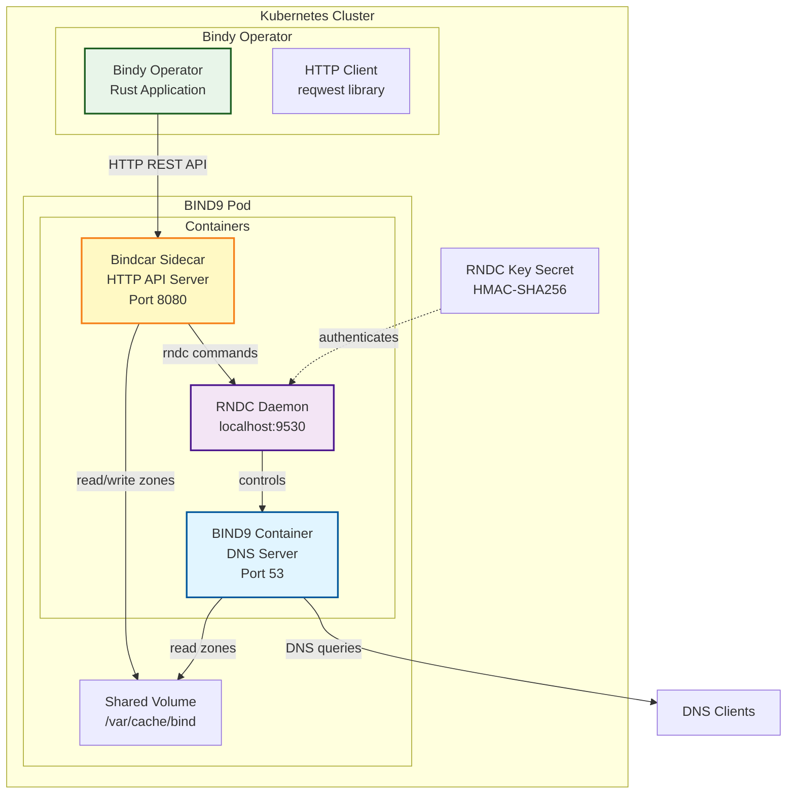
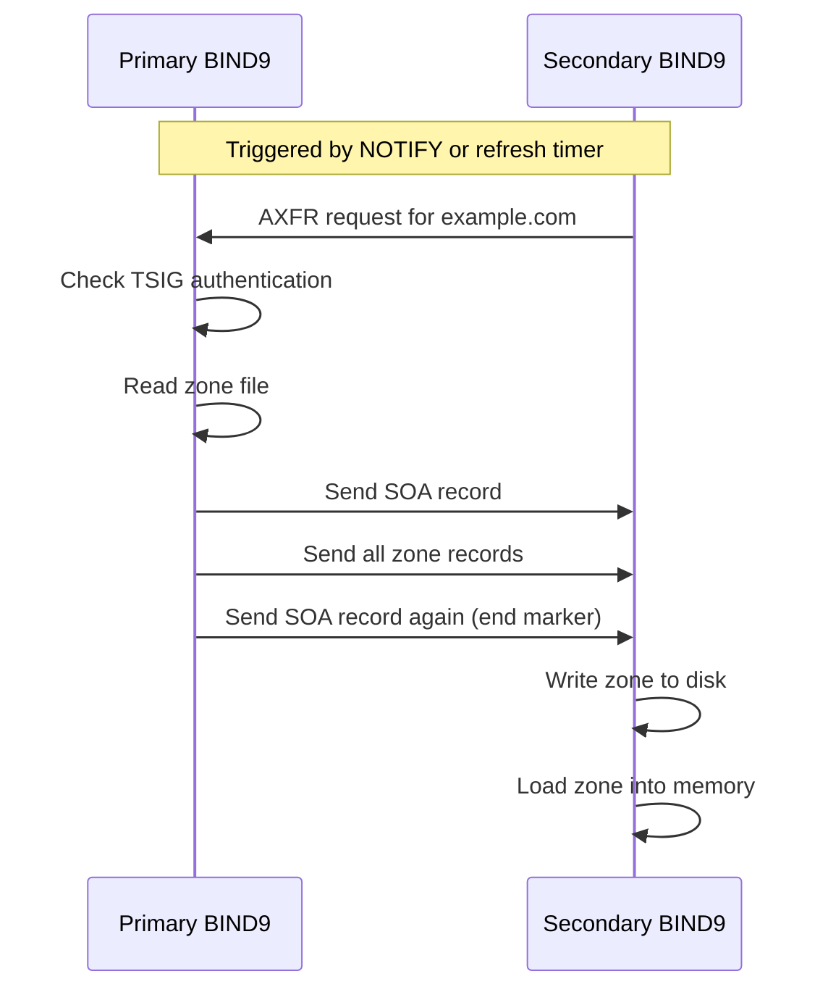
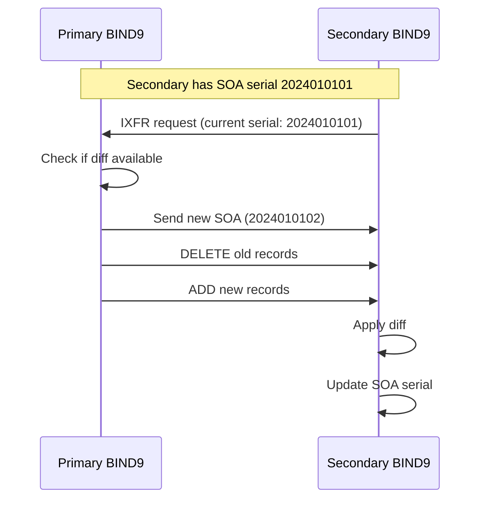

# Communication Protocols Architecture

This document describes how Bindy communicates with BIND9 instances using two complementary protocols: **HTTP API** for zone management and **RNDC** for control plane operations.

## Table of Contents

- [Architecture Overview](#architecture-overview)
- [HTTP API Protocol](#http-api-protocol)
- [RNDC Protocol](#rndc-protocol)
- [DNS Zone Transfer](#dns-zone-transfer)
- [Security](#security)

---

## Architecture Overview

Bindy uses a **sidecar pattern** with an HTTP API server (bindcar) running alongside BIND9 in each pod. The operator communicates via HTTP REST API, and the sidecar executes RNDC commands locally.



**Key Design Decisions:**

1. **HTTP API for Operator Communication**: RESTful interface instead of direct RNDC access
2. **Sidecar Pattern**: API server runs in the same pod as BIND9 (localhost RNDC)
3. **Local RNDC Only**: RNDC communication never leaves the pod (security)
4. **Shared Volume**: Zone files accessible to both containers

---

## HTTP API Protocol

### Overview

The **bindcar** HTTP API provides a RESTful interface for zone management operations. The operator uses this API to create, update, reload, and delete DNS zones.

**API Base URL**: `http://<pod-ip>:8080/api/v1`

### Endpoints

#### 1. Add Zone (`POST /api/v1/zones`)

Creates or updates a DNS zone file and adds it to BIND9 configuration.

**Request:**
```http
POST /api/v1/zones HTTP/1.1
Host: bind9-primary-0.bind9-primary:8080
Content-Type: application/json

{
  "zone_name": "example.com",
  "zone_content": "$ORIGIN example.com.\n$TTL 3600\n@ IN SOA ns1.example.com. admin.example.com. (\n  2024010101 ; serial\n  3600       ; refresh\n  1800       ; retry\n  604800     ; expire\n  3600 )     ; minimum TTL\n@ IN NS ns1.example.com.\nwww IN A 192.0.2.1\n"
}
```

**Response (Success):**
```http
HTTP/1.1 200 OK
Content-Type: application/json

{
  "status": "success",
  "message": "Zone example.com added and reloaded successfully"
}
```

**Response (Error):**
```http
HTTP/1.1 500 Internal Server Error
Content-Type: application/json

{
  "status": "error",
  "message": "Failed to reload zone: rndc: 'reload' failed: not found"
}
```

**What Happens:**
1. Bindcar writes zone content to `/var/cache/bind/db.example.com`
2. Bindcar executes `rndc addzone example.com '{type master; file "/var/cache/bind/db.example.com"; allow-update {none;};};'`
3. BIND9 loads the zone
4. Zone becomes active and serves DNS queries

#### 2. Reload Zone (`POST /api/v1/zones/<zone_name>/reload`)

Reloads an existing zone after updating its content.

**Request:**
```http
POST /api/v1/zones/example.com/reload HTTP/1.1
Host: bind9-primary-0.bind9-primary:8080
```

**Response:**
```http
HTTP/1.1 200 OK
Content-Type: application/json

{
  "status": "success",
  "message": "Zone example.com reloaded successfully"
}
```

**What Happens:**
1. Bindcar executes `rndc reload example.com`
2. BIND9 re-reads the zone file from disk
3. Updated records become active

#### 3. Delete Zone (`DELETE /api/v1/zones/<zone_name>`)

Removes a zone from BIND9 configuration and deletes its zone file.

**Request:**
```http
DELETE /api/v1/zones/example.com HTTP/1.1
Host: bind9-primary-0.bind9-primary:8080
```

**Response:**
```http
HTTP/1.1 200 OK
Content-Type: application/json

{
  "status": "success",
  "message": "Zone example.com deleted successfully"
}
```

**What Happens:**
1. Bindcar executes `rndc delzone example.com`
2. BIND9 removes zone from configuration
3. Bindcar deletes `/var/cache/bind/db.example.com`

#### 4. Zone Status (`GET /api/v1/zones/<zone_name>/status`)

Checks if a zone is loaded and serving.

**Request:**
```http
GET /api/v1/zones/example.com/status HTTP/1.1
Host: bind9-primary-0.bind9-primary:8080
```

**Response:**
```http
HTTP/1.1 200 OK
Content-Type: application/json

{
  "status": "success",
  "zone_loaded": true,
  "serial": 2024010101
}
```

### HTTP Client Configuration

The operator's HTTP client is configured for reliability:

```rust
// Operator HTTP client configuration
let client = reqwest::Client::builder()
    .timeout(Duration::from_secs(30))
    .connect_timeout(Duration::from_secs(10))
    .pool_max_idle_per_host(10)
    .build()?;
```

**Timeouts:**
- **Connect timeout**: 10 seconds (time to establish TCP connection)
- **Request timeout**: 30 seconds (total time including RNDC execution)

**Retries:**
- Automatic retry on network errors (exponential backoff)
- No retry on HTTP 4xx errors (client errors)
- Retry on HTTP 5xx errors (server errors)

---

## RNDC Protocol

### Overview

**RNDC (Remote Name Daemon Control)** is BIND9's native control protocol. Bindcar uses RNDC locally to execute zone management commands.

**Protocol**: TCP
**Port**: 9530 (localhost only)
**Authentication**: HMAC-SHA256 shared secret
**Communication**: Command-response text protocol

### RNDC Commands

#### 1. `addzone`

Adds a new zone to BIND9 dynamically (without restart).

**Command:**
```bash
rndc addzone example.com '{type master; file "/var/cache/bind/db.example.com"; allow-update {none;};};'
```

**Response (Success):**
```
zone 'example.com' added
```

**Response (Error):**
```
rndc: 'addzone' failed: already exists
```

**Use Case**: Called when DNSZone CR is created

#### 2. `reload`

Reloads a zone from disk (picks up file changes).

**Command:**
```bash
rndc reload example.com
```

**Response (Success):**
```
zone reload up-to-date
```

**Response (Error):**
```
rndc: 'reload' failed: not found
```

**Use Case**: Called when DNSZone CR is updated

#### 3. `delzone`

Removes a zone from BIND9 dynamically.

**Command:**
```bash
rndc delzone example.com
```

**Response (Success):**
```
zone 'example.com' removed
```

**Response (Error):**
```
rndc: 'delzone' failed: not found
```

**Use Case**: Called when DNSZone CR is deleted (finalizer cleanup)

#### 4. `notify`

Manually triggers NOTIFY to secondary servers (forces zone transfer).

**Command:**
```bash
rndc notify example.com
```

**Response:**
```
zone notify queued
```

**Use Case**: After zone update to ensure secondaries sync immediately

#### 5. `freeze` / `thaw`

Freezes/unfreezes dynamic zones for manual editing.

**Commands:**
```bash
rndc freeze example.com  # Stops accepting dynamic updates
rndc thaw example.com    # Resumes accepting dynamic updates
```

**Use Case**: Rarely used - Bindy manages zones statically

### RNDC Authentication

RNDC uses HMAC-SHA256 for authentication. Keys are stored as Kubernetes Secrets.

**Key Format (rndc.key):**
```
key "rndc-key" {
    algorithm hmac-sha256;
    secret "base64-encoded-256-bit-key";
};
```

**Secret Example:**
```yaml
apiVersion: v1
kind: Secret
metadata:
  name: bind9-primary-rndc-key
  namespace: dns-system
type: Opaque
stringData:
  rndc.key: |
    key "rndc-key" {
        algorithm hmac-sha256;
        secret "VGhpc0lzQVNlY3JldEtleUZvclJOREMxMjM0NTY3ODkw";
    };
```

**Security Properties:**
- **HMAC-SHA256**: Cryptographically secure message authentication
- **256-bit key**: Sufficient key strength (32 bytes of entropy)
- **Kubernetes Secret**: Encrypted at rest in etcd
- **Localhost-only**: RNDC never exposed outside pod

---

## DNS Zone Transfer

### AXFR (Full Zone Transfer)

**AXFR** transfers the entire zone from primary to secondary.



**When Used:**
- Initial zone transfer (secondary doesn't have the zone yet)
- After IXFR fails (fallback to full transfer)
- When SOA serial jumped backward (zone recreated)

### IXFR (Incremental Zone Transfer)

**IXFR** transfers only the changes since the last transfer (efficient).



**When Used:**
- After zone updates (NOTIFY triggers IXFR)
- Periodic refresh checks (if serial changed)

**Efficiency:**
- Only changed records transferred
- Reduces bandwidth and load
- Faster than full AXFR

### TSIG Authentication for Zone Transfers

Zone transfers are authenticated with **TSIG (Transaction Signature)** using HMAC-SHA256.

**Configuration (Primary):**
```
key "transfer-key" {
    algorithm hmac-sha256;
    secret "base64-secret";
};

zone "example.com" {
    type master;
    file "/var/cache/bind/db.example.com";
    allow-transfer { key transfer-key; };
    also-notify { 10.0.1.2; 10.0.1.3; };
};
```

**Configuration (Secondary):**
```
key "transfer-key" {
    algorithm hmac-sha256;
    secret "base64-secret";  # Same key as primary
};

zone "example.com" {
    type slave;
    masters { 10.0.1.1 key transfer-key; };
    file "/var/cache/bind/db.example.com";
};
```

**Security Properties:**
- **HMAC-SHA256**: Message authentication code
- **Replay protection**: Timestamps prevent replay attacks
- **Mutual authentication**: Both sides verify the key
- **Per-zone keys**: Different keys for different zones (optional)

---

## Security

### Threat Model

**Threats Addressed:**

1. **Unauthorized Zone Modifications**
   - **Mitigation**: RNDC key authentication (HMAC-SHA256)
   - **Mitigation**: HTTP API runs in pod (no external access)

2. **Zone Transfer Interception**
   - **Mitigation**: TSIG authentication on transfers
   - **Mitigation**: Network policies restrict pod-to-pod traffic

3. **RNDC Key Exposure**
   - **Mitigation**: Kubernetes Secrets (encrypted at rest)
   - **Mitigation**: RBAC limits secret access to operator ServiceAccount
   - **Mitigation**: Keys auto-generated per instance (unique keys)

4. **Man-in-the-Middle**
   - **Mitigation**: RNDC uses localhost (no network exposure)
   - **Mitigation**: HTTP API in-pod (no external network)
   - **Future**: mTLS for HTTP API (planned)

### Best Practices

**1. Rotate RNDC Keys Regularly**
```bash
# Generate new RNDC key
dnssec-confgen -a hmac-sha256 -k rndc-key

# Update Kubernetes Secret
kubectl create secret generic bind9-primary-rndc-key \
  --from-file=rndc.key \
  --dry-run=client -o yaml | kubectl apply -f -

# Restart BIND9 pods to pick up new key
kubectl rollout restart deployment/bind9-primary
```

**2. Use NetworkPolicies**
```yaml
apiVersion: networking.k8s.io/v1
kind: NetworkPolicy
metadata:
  name: bind9-primary-policy
spec:
  podSelector:
    matchLabels:
      app: bind9-primary
  ingress:
  - from:
    - podSelector:
        matchLabels:
          app: bindy-operator
    ports:
    - protocol: TCP
      port: 8080  # HTTP API
  - from:
    - podSelector:
        matchLabels:
          app: bind9-secondary
    ports:
    - protocol: TCP
      port: 53    # Zone transfer
```

**3. Limit Secret Access**
```yaml
apiVersion: rbac.authorization.k8s.io/v1
kind: Role
metadata:
  name: bindy-operator-secrets
  namespace: dns-system
rules:
- apiGroups: [""]
  resources: ["secrets"]
  resourceNames: ["bind9-*-rndc-key"]
  verbs: ["get", "list"]
```

### Compliance

- **FIPS 140-2**: HMAC-SHA256 is FIPS-approved
- **NIST SP 800-53**: AC-4 (Information Flow Enforcement), SC-8 (Transmission Confidentiality)
- **PCI-DSS**: Requirement 4.1 (Strong cryptography for transmission)

---

## Performance Considerations

### HTTP API Latency

**Typical Operation Times:**
- `POST /api/v1/zones`: 100-500ms (zone file write + RNDC addzone)
- `POST /api/v1/zones/<zone>/reload`: 50-200ms (RNDC reload)
- `DELETE /api/v1/zones/<zone>`: 50-150ms (RNDC delzone + file delete)

**Optimization:**
- Connection pooling (10 idle connections per host)
- Keep-alive enabled (reuse TCP connections)
- Async/await in operator (non-blocking I/O)

### Zone Transfer Performance

**AXFR Performance:**
- **Small zone** (< 100 records): < 1 second
- **Medium zone** (100-10,000 records): 1-10 seconds
- **Large zone** (> 10,000 records): 10-60 seconds

**IXFR Performance:**
- **Small change** (1-10 records): < 1 second
- **Medium change** (10-100 records): 1-5 seconds
- **Large change** (> 100 records): May fall back to AXFR

### Bottlenecks

1. **Disk I/O**: Zone file writes on NFS/EBS can be slow
   - **Mitigation**: Use local SSD or high-IOPS volumes
2. **RNDC Serial Execution**: Commands execute sequentially
   - **Mitigation**: Operator batches zone updates
3. **DNS NOTIFY Storms**: Many zones updating simultaneously
   - **Mitigation**: Rate limiting in operator

---

## Troubleshooting

### HTTP API Errors

**Error: "Connection refused (os error 111)"**
- **Cause**: Bindcar sidecar not running
- **Check**: `kubectl logs <pod> -c bindcar`
- **Fix**: Restart pod or check sidecar image

**Error: "Request timeout"**
- **Cause**: RNDC command hung or BIND9 not responding
- **Check**: `kubectl exec <pod> -c bindcar -- rndc status`
- **Fix**: Restart BIND9 container

### RNDC Errors

**Error: "rndc: connection to remote host closed"**
- **Cause**: RNDC daemon not running in BIND9
- **Check**: `named` process status
- **Fix**: Restart BIND9

**Error**: "rndc: bad auth"**
- **Cause**: RNDC key mismatch between named.conf and rndc.conf
- **Check**: Compare keys in both files
- **Fix**: Regenerate secret and restart pods

### Zone Transfer Issues

**Secondary not syncing:**
- **Check**: `dig @<secondary-ip> example.com SOA` (compare serial)
- **Check**: `rndc notify example.com` on primary
- **Check**: BIND9 logs for transfer errors
- **Fix**: Verify TSIG keys match on primary and secondary

---

## See Also

- [Architecture Overview](./architecture.md) - High-level system architecture
- [Reconciler Hierarchy](../architecture/reconciler-hierarchy.md) - How reconcilers work
- [Security Architecture](../security/architecture.md) - Security controls
- [High Availability](../advanced/ha.md) - Multi-primary setup
