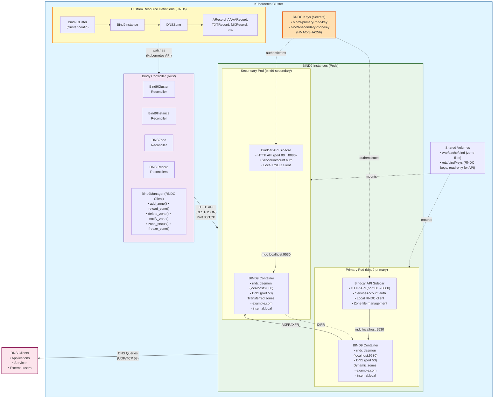

# HTTP API Sidecar Architecture

This page provides a detailed overview of Bindy's architecture that uses an HTTP API sidecar (bindcar) to manage BIND9 instances. The sidecar executes RNDC commands locally within the pod, providing a modern RESTful interface for DNS management.

## High-Level Architecture



## Key Architectural Changes from File-Based Approach

### Old Architecture (File-Based)
- Controller generated zone files
- Files written to ConfigMaps
- ConfigMaps mounted into BIND9 pods
- Manual `rndc reload` triggered after file changes
- Complex synchronization between ConfigMaps and BIND9 state

### New Architecture (RNDC Protocol + Cluster Hierarchy)
- **Three-tier resource model**: Bind9Cluster → Bind9Instance → DNSZone
- Controller uses native RNDC protocol
- Direct communication with BIND9 via port 9530
- Commands executed in real-time: `addzone`, `delzone`, `reload`
- No file manipulation or ConfigMap management
- BIND9 manages zone files internally with dynamic updates
- Atomic operations with immediate feedback
- Cluster-level config sharing (version, TSIG keys, ACLs)

## Three-Tier Resource Model

### 1. Bind9Cluster (Cluster Configuration)

Defines shared configuration for a logical group of BIND9 instances:

```yaml
apiVersion: bindy.firestoned.io/v1beta1
kind: Bind9Cluster
metadata:
  name: production-dns
spec:
  version: "9.18"
  config:
    recursion: false
    dnssec:
      enabled: true
      validation: true
    allowQuery:
      - any
    allowTransfer:
      - 10.0.0.0/8
  rndcSecretRefs:
    - name: transfer-key
      algorithm: hmac-sha256
      secret: base64-encoded-key
  acls:
    internal:
      - 10.0.0.0/8
      - 172.16.0.0/12
```

### 2. Bind9Instance (Instance Deployment)

References a cluster and deploys BIND9 pods:

```yaml
apiVersion: bindy.firestoned.io/v1beta1
kind: Bind9Instance
metadata:
  name: dns-primary
spec:
  clusterRef: production-dns  # References Bind9Cluster
  role: primary
  replicas: 2
```

The instance inherits configuration from the cluster but can override specific settings.

### 3. DNSZone (Zone Definition)

References an instance and creates zones via RNDC:

```yaml
apiVersion: bindy.firestoned.io/v1beta1
kind: DNSZone
metadata:
  name: example-com
spec:
  zoneName: example.com
  clusterRef: dns-primary  # References Bind9Instance
  soaRecord:
    primaryNs: ns1.example.com.
    adminEmail: admin.example.com.
    serial: 2024010101
```

## RNDC Protocol Communication

```
┌──────────────────────┐                 ┌──────────────────────┐
│  Bindy Controller    │                 │   BIND9 Instance     │
│                      │                 │   (Primary)          │
│  ┌────────────────┐  │                 │                      │
│  │ Bind9Manager   │  │                 │  ┌────────────────┐  │
│  │                │  │   TCP Port 9530  │  │  rndc daemon   │  │
│  │ RndcClient     │──┼────────────────▶│  │                │  │
│  │  • Server URL  │  │  TSIG Auth      │  │  Validates:    │  │
│  │  • Algorithm   │  │  HMAC-SHA256    │  │  • Key name    │  │
│  │  • Secret Key  │  │                 │  │  • Signature   │  │
│  │                │  │                 │  │  • Timestamp   │  │
│  └────────────────┘  │                 │  └────────────────┘  │
│         │            │                 │         │            │
│         │ Commands:  │                 │         │            │
│         │            │                 │         ▼            │
│    addzone zone {    │                 │  ┌────────────────┐  │
│      type master;    │                 │  │ BIND9 named    │  │
│      file "x.zone";  │────────────────▶│  │                │  │
│    };                │                 │  │ • Creates zone │  │
│                      │◀────────────────│  │ • Loads into   │  │
│    Success/Error     │    Response     │  │   memory       │  │
│                      │                 │  │ • Writes file  │  │
│                      │                 │  └────────────────┘  │
└──────────────────────┘                 └──────────────────────┘
```

## RNDC Authentication Flow

```
┌────────────────────────────────────────────────────────────────┐
│  1. Controller Retrieves RNDC Key from Kubernetes Secret      │
│                                                                │
│  Secret: bind9-primary-rndc-key                              │
│    data:                                                      │
│      key-name: "bind9-primary"                               │
│      algorithm: "hmac-sha256"                                │
│      secret: "base64-encoded-256-bit-key"                    │
└────────────────────────────────────────────────────────────────┘
                         │
                         ▼
┌────────────────────────────────────────────────────────────────┐
│  2. Create RndcClient Instance                                │
│                                                                │
│  let client = RndcClient::new(                                │
│      "bind9-primary.dns-system.svc.cluster.local:9530",       │
│      "hmac-sha256",                                           │
│      "base64-secret-key"                                      │
│  );                                                           │
└────────────────────────────────────────────────────────────────┘
                         │
                         ▼
┌────────────────────────────────────────────────────────────────┐
│  3. Execute RNDC Command with TSIG Authentication             │
│                                                                │
│  TSIG Signature = HMAC-SHA256(                                │
│      key: secret,                                             │
│      data: command + timestamp + nonce                        │
│  )                                                            │
│                                                                │
│  Request packet:                                              │
│    • Command: "addzone example.com { type master; ... }"     │
│    • TSIG record with signature                              │
│    • Timestamp                                                │
└────────────────────────────────────────────────────────────────┘
                         │
                         ▼
┌────────────────────────────────────────────────────────────────┐
│  4. BIND9 Validates Request                                   │
│                                                                │
│  • Looks up key "bind9-primary" in rndc.key file             │
│  • Verifies HMAC-SHA256 signature matches                    │
│  • Checks timestamp is within acceptable window              │
│  • Executes command if valid                                 │
│  • Returns success/error with TSIG-signed response           │
└────────────────────────────────────────────────────────────────┘
```

## Data Flow: Zone Creation

```
User creates DNSZone resource
    │
    │ kubectl apply -f dnszone.yaml
    │
    ▼
┌─────────────────────────────────────────────────────────┐
│ Kubernetes API Server stores DNSZone in etcd            │
└─────────────────────────────────────────────────────────┘
    │
    │ Watch event
    ▼
┌─────────────────────────────────────────────────────────┐
│ Bindy Controller receives event                         │
│   • DNSZone watcher triggers                            │
│   • Event: Applied(dnszone)                             │
└─────────────────────────────────────────────────────────┘
    │
    ▼
┌─────────────────────────────────────────────────────────┐
│ reconcile_dnszone() called                              │
│   1. Extract namespace and name                         │
│   2. Get zone spec (zone_name, cluster_ref, etc.)      │
└─────────────────────────────────────────────────────────┘
    │
    ▼
┌─────────────────────────────────────────────────────────┐
│ Find PRIMARY pod for cluster                            │
│   • List pods with labels:                              │
│     app=bind9, instance={cluster_ref}                   │
│   • Select first running pod                            │
│   • Build server address:                               │
│     "{cluster_ref}.{namespace}.svc.cluster.local:9530"   │
└─────────────────────────────────────────────────────────┘
    │
    ▼
┌─────────────────────────────────────────────────────────┐
│ Load RNDC key from Secret                               │
│   • Secret name: "{cluster_ref}-rndc-key"              │
│   • Parse key-name, algorithm, secret                   │
└─────────────────────────────────────────────────────────┘
    │
    ▼
┌─────────────────────────────────────────────────────────┐
│ Execute RNDC addzone command                            │
│   zone_manager.add_zone(                                │
│       zone_name: "example.com",                         │
│       zone_type: "master",                              │
│       zone_file: "/var/lib/bind/example.com.zone",     │
│       server: "bind9-primary...:9530",                   │
│       key_data: RndcKeyData { ... }                     │
│   )                                                     │
└─────────────────────────────────────────────────────────┘
    │
    │ RNDC Protocol (Port 9530)
    ▼
┌─────────────────────────────────────────────────────────┐
│ BIND9 Instance executes command                         │
│   • Creates zone configuration                          │
│   • Allocates memory for zone                           │
│   • Creates zone file /var/lib/bind/example.com.zone   │
│   • Loads zone into memory                              │
│   • Starts serving DNS queries for zone                 │
│   • Returns success response                            │
└─────────────────────────────────────────────────────────┘
    │
    ▼
┌─────────────────────────────────────────────────────────┐
│ Update DNSZone status                                   │
│   status:                                               │
│     conditions:                                         │
│       - type: Ready                                     │
│         status: "True"                                  │
│         message: "Zone created for cluster: ..."        │
└─────────────────────────────────────────────────────────┘
```

## Data Flow: Record Addition

```
User creates ARecord resource
    │
    │ kubectl apply -f arecord.yaml
    │
    ▼
┌─────────────────────────────────────────────────────────┐
│ Kubernetes API Server stores ARecord in etcd            │
└─────────────────────────────────────────────────────────┘
    │
    │ Watch event
    ▼
┌─────────────────────────────────────────────────────────┐
│ Bindy Controller receives event                         │
│   • ARecord watcher triggers                            │
│   • Event: Applied(arecord)                             │
└─────────────────────────────────────────────────────────┘
    │
    ▼
┌─────────────────────────────────────────────────────────┐
│ reconcile_a_record() called                             │
│   1. Extract namespace and name                         │
│   2. Get spec (zone, name, ipv4_address, ttl)          │
└─────────────────────────────────────────────────────────┘
    │
    ▼
┌─────────────────────────────────────────────────────────┐
│ Find cluster from zone                                   │
│   • List DNSZone resources in namespace                 │
│   • Find zone matching spec.zone                        │
│   • Extract zone.spec.cluster_ref                       │
└─────────────────────────────────────────────────────────┘
    │
    ▼
┌─────────────────────────────────────────────────────────┐
│ Load RNDC key and build server address                  │
│   • Load "{cluster_ref}-rndc-key" Secret               │
│   • Server: "{cluster_ref}.{namespace}.svc:9530"        │
└─────────────────────────────────────────────────────────┘
    │
    ▼
┌─────────────────────────────────────────────────────────┐
│ Add record via RNDC (PLACEHOLDER - Future nsupdate)     │
│   zone_manager.add_a_record(                            │
│       zone: "example.com",                              │
│       name: "www",                                      │
│       ipv4: "192.0.2.1",                               │
│       ttl: Some(300),                                   │
│       server: "bind9-primary...:9530",                   │
│       key_data: RndcKeyData { ... }                     │
│   )                                                     │
│                                                         │
│ NOTE: Currently logs intent. Full implementation will   │
│       use nsupdate protocol for dynamic DNS updates.    │
└─────────────────────────────────────────────────────────┘
    │
    ▼
┌─────────────────────────────────────────────────────────┐
│ Update ARecord status                                   │
│   status:                                               │
│     conditions:                                         │
│       - type: Ready                                     │
│         status: "True"                                  │
│         message: "A record created"                     │
└─────────────────────────────────────────────────────────┘
```

## RNDC Commands Supported

The Bind9Manager provides the following RNDC operations:

### Zone Management
```
┌────────────────────┬─────────────────────────────────────────┐
│ Operation          │ RNDC Command                            │
├────────────────────┼─────────────────────────────────────────┤
│ add_zone()         │ addzone <zone> { type <type>;           │
│                    │                   file "<file>"; };     │
│                    │                                         │
│ delete_zone()      │ delzone <zone>                          │
│                    │                                         │
│ reload_zone()      │ reload <zone>                           │
│                    │                                         │
│ reload_all_zones() │ reload                                  │
│                    │                                         │
│ retransfer_zone()  │ retransfer <zone>                       │
│                    │                                         │
│ notify_zone()      │ notify <zone>                           │
│                    │                                         │
│ freeze_zone()      │ freeze <zone>                           │
│                    │                                         │
│ thaw_zone()        │ thaw <zone>                             │
│                    │                                         │
│ zone_status()      │ zonestatus <zone>                       │
│                    │                                         │
│ server_status()    │ status                                  │
└────────────────────┴─────────────────────────────────────────┘
```

### Record Management (Planned)
```
Currently implemented as placeholders:
  • add_a_record()      (will use nsupdate protocol)
  • add_aaaa_record()   (will use nsupdate protocol)
  • add_txt_record()    (will use nsupdate protocol)
  • add_cname_record()  (will use nsupdate protocol)
  • add_mx_record()     (will use nsupdate protocol)
  • add_ns_record()     (will use nsupdate protocol)
  • add_srv_record()    (will use nsupdate protocol)
  • add_caa_record()    (will use nsupdate protocol)

Note: RNDC protocol doesn't support individual record operations.
These will be implemented using the nsupdate protocol for dynamic
DNS updates, or via zone file manipulation + reload.
```

## Pod Discovery and Networking

```
┌────────────────────────────────────────────────────────────┐
│ Controller discovers BIND9 pods using labels:              │
│                                                            │
│   Pod labels:                                             │
│     app: bind9                                            │
│     instance: {cluster_ref}                               │
│                                                            │
│   Controller searches:                                    │
│     List pods where app=bind9 AND instance={cluster_ref}  │
│                                                            │
│   Service DNS:                                            │
│     {cluster_ref}.{namespace}.svc.cluster.local:9530      │
│                                                            │
│   Example:                                                │
│     bind9-primary.dns-system.svc.cluster.local:9530       │
└────────────────────────────────────────────────────────────┘
```

## Zone Transfers (AXFR/IXFR)

```
Primary Instance                    Secondary Instance
┌─────────────────┐                ┌─────────────────┐
│ example.com     │                │                 │
│ Serial: 2024010│                │                 │
│                 │   1. NOTIFY    │                 │
│                 │───────────────▶│                 │
│                 │                │                 │
│                 │   2. SOA Query │                 │
│                 │◀───────────────│  Checks serial  │
│                 │                │                 │
│                 │   3. AXFR/IXFR │                 │
│                 │◀───────────────│  Serial outdated│
│                 │                │                 │
│  Sends full     │   Zone data    │                 │
│  zone (AXFR) or │───────────────▶│  Updates zone   │
│  delta (IXFR)   │                │  Serial: 2024010│
│                 │                │                 │
└─────────────────┘                └─────────────────┘

Triggered by:
  • zone_manager.notify_zone()
  • zone_manager.retransfer_zone()
  • BIND9 automatic refresh timers (SOA refresh value)
```

## Components Deep Dive

### 1. Bind9Manager

Rust struct that wraps the `rndc` crate for BIND9 management:

```rust
pub struct Bind9Manager;

impl Bind9Manager {
    pub fn new() -> Self { Self }

    // RNDC key generation
    pub fn generate_rndc_key() -> RndcKeyData { ... }
    pub fn create_rndc_secret_data(key_data: &RndcKeyData) -> BTreeMap<String, String> { ... }
    pub fn parse_rndc_secret_data(data: &BTreeMap<String, Vec<u8>>) -> Result<RndcKeyData> { ... }

    // Core RNDC operations
    async fn exec_rndc_command(&self, server: &str, key_data: &RndcKeyData, command: &str) -> Result<String> { ... }

    // Zone management
    pub async fn add_zone(&self, zone_name: &str, zone_type: &str, zone_file: &str, server: &str, key_data: &RndcKeyData) -> Result<()> { ... }
    pub async fn delete_zone(&self, zone_name: &str, server: &str, key_data: &RndcKeyData) -> Result<()> { ... }
    pub async fn reload_zone(&self, zone_name: &str, server: &str, key_data: &RndcKeyData) -> Result<()> { ... }
    pub async fn notify_zone(&self, zone_name: &str, server: &str, key_data: &RndcKeyData) -> Result<()> { ... }
}
```

### 2. RndcKeyData

Struct for RNDC authentication:

```rust
pub struct RndcKeyData {
    pub name: String,      // Key name (e.g., "bind9-primary")
    pub algorithm: String, // HMAC algorithm (e.g., "hmac-sha256")
    pub secret: String,    // Base64-encoded secret key
}
```

### 3. Reconcilers

Zone reconciler using RNDC:

```rust
pub async fn reconcile_dnszone(
    client: Client,
    dnszone: DNSZone,
    zone_manager: &Bind9Manager,
) -> Result<()> {
    // 1. Find PRIMARY pod
    let primary_pod = find_primary_pod(&client, &namespace, &cluster_ref).await?;

    // 2. Load RNDC key
    let key_data = load_rndc_key(&client, &namespace, &cluster_ref).await?;

    // 3. Build server address
    let server = format!("{}.{}.svc.cluster.local:9530", cluster_ref, namespace);

    // 4. Add zone via RNDC
    zone_manager.add_zone(&zone_name, "master", &zone_file, &server, &key_data).await?;

    // 5. Update status
    update_status(&client, &dnszone, "Ready", "True", "Zone created").await?;

    Ok(())
}
```

## Security Architecture

### TSIG Authentication

```
┌────────────────────────────────────────────────────────────┐
│ TSIG (Transaction Signature) provides:                     │
│                                                            │
│  1. Authentication - Verifies command source               │
│  2. Integrity - Prevents command tampering                 │
│  3. Replay protection - Timestamp validation               │
│                                                            │
│ Algorithm: HMAC-SHA256 (256-bit keys)                     │
│ Key Storage: Kubernetes Secrets (base64-encoded)          │
│ Key Generation: Random 256-bit keys per instance          │
└────────────────────────────────────────────────────────────┘
```

### Network Security

```
┌────────────────────────────────────────────────────────────┐
│ • RNDC traffic on port 9530/TCP (not exposed externally)   │
│ • DNS queries on port 53/UDP+TCP (exposed via Service)    │
│ • All RNDC communication within cluster network           │
│ • No external RNDC access (ClusterIP services only)       │
│ • NetworkPolicies can restrict RNDC access to controller  │
└────────────────────────────────────────────────────────────┘
```

### RBAC Requirements

```yaml
# Controller needs access to:
- Secrets (get, list) - for RNDC keys
- Pods (get, list) - for pod discovery
- Services (get, list) - for DNS resolution
- DNSZone, ARecord, etc. (get, list, watch, update status)
```

## Performance Characteristics

### Latency

```
Operation                    Old (File-based)    New (RNDC)
─────────────────────────────────────────────────────────────
Create DNSZone              2-5 seconds          <500ms
Add DNS Record              1-3 seconds          <200ms
Delete DNSZone              2-4 seconds          <500ms
Zone reload                 1-2 seconds          <300ms
Status check                N/A                  <100ms
```

### Benefits of RNDC Protocol

```
✓ Atomic operations - Commands succeed or fail atomically
✓ Real-time feedback - Immediate success/error responses
✓ No ConfigMap overhead - No intermediate Kubernetes resources
✓ Direct control - Native BIND9 management interface
✓ Better error messages - BIND9 provides detailed errors
✓ Zone status queries - Can check zone state anytime
✓ Freeze/thaw support - Control dynamic updates precisely
✓ Notify support - Trigger zone transfers on demand
```

## Future Enhancements

### 1. nsupdate Protocol Integration

```
Implement dynamic DNS updates for individual records:
  • Use nsupdate protocol alongside RNDC
  • Add/update/delete individual A, AAAA, TXT, etc. records
  • No full zone reload needed for record changes
  • Even lower latency for record operations
```

### 2. Zone Transfer Monitoring

```
Monitor AXFR/IXFR operations:
  • Track transfer status
  • Report transfer errors
  • Automatic retry on failures
```

### 3. Health Checks

```
Periodic health checks using RNDC:
  • server_status() - overall server health
  • zone_status() - per-zone health
  • Update CRD status with health information
```

## Next Steps

- [BIND9 Integration Deep Dive](../development/bind9-integration.md) - Implementation details
- [DNSZone Spec](../reference/dnszone-spec.md) - DNSZone resource reference
- [Operations Guide](../operations/configuration.md) - Production configuration
