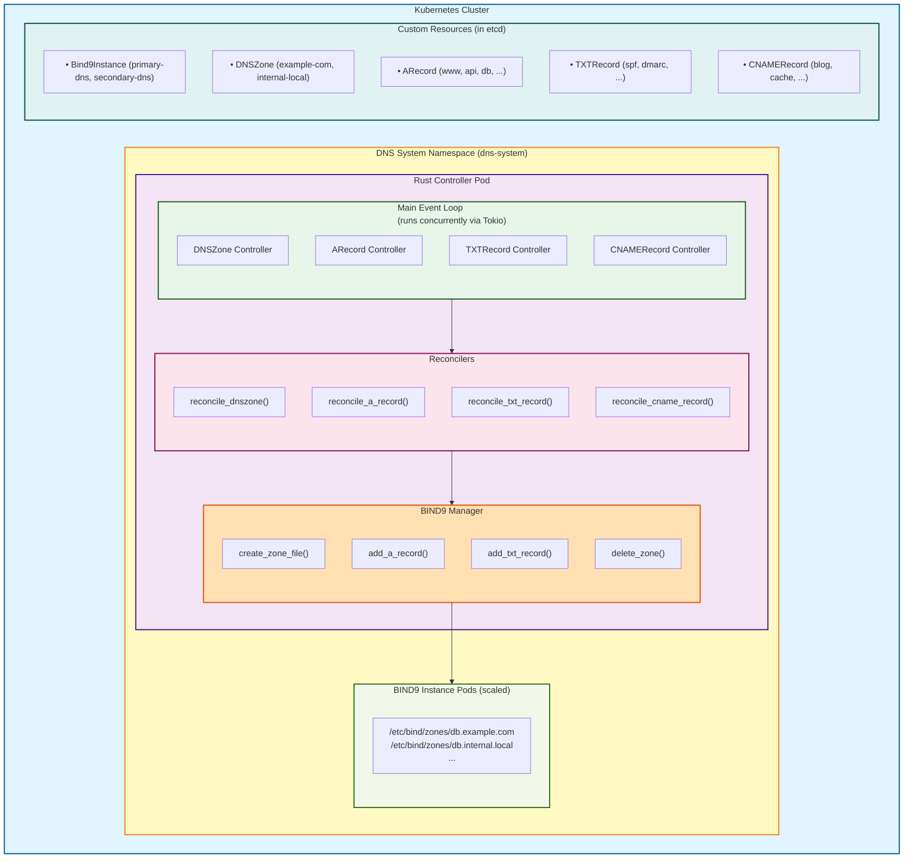
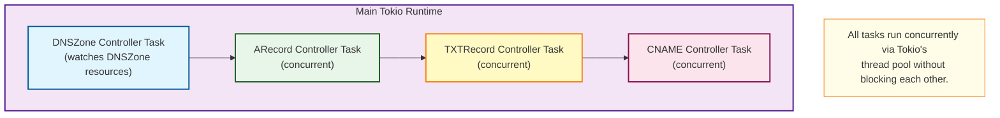

# Technical Architecture

## System Overview



## Control Flow

### 1. DNSZone Creation Flow

```
User creates DNSZone
    ↓
Kubernetes API Server stores in etcd
    ↓
Watch event triggered
    ↓
Controller receives event (via kube-rs runtime)
    ↓
reconcile_dnszone_wrapper() called
    ↓
reconcile_dnszone() logic:
  1. Extract DNSZone spec
  2. Evaluate instanceSelector against Bind9Instance labels
  3. Find matching instances (e.g., 2 matching)
  4. Call zone_manager.create_zone_file()
  5. Zone file created in /etc/bind/zones/db.example.com
  6. Update DNSZone status with "Ready" condition
    ↓
Status Update (via API)
    ↓
Done, requeue after 5 minutes
```

### 2. Record Creation Flow

```
User creates ARecord
    ↓
Kubernetes API Server stores in etcd
    ↓
Watch event triggered
    ↓
Controller receives event
    ↓
reconcile_a_record_wrapper() called
    ↓
reconcile_a_record() logic:
  1. Extract ARecord spec (zone, name, ip, ttl)
  2. Call zone_manager.add_a_record()
  3. Record appended to zone file
  4. Update ARecord status with "Ready" condition
    ↓
Status Update (via API)
    ↓
Done, requeue after 5 minutes
```

## Concurrency Model



## Data Structures

### CRD Type Hierarchy

```
trait CustomResource (from kube-derive)
    │
    ├─→ Bind9Instance
    │       └─ spec: Bind9InstanceSpec
    │       └─ status: Bind9InstanceStatus
    │
    ├─→ DNSZone
    │       └─ spec: DNSZoneSpec
    │       │        ├─ zone_name: String
    │       │        ├─ instance_selector: LabelSelector
    │       │        └─ soa_record: SOARecord
    │       └─ status: DNSZoneStatus
    │
    ├─→ ARecord
    │       └─ spec: ARecordSpec
    │       └─ status: RecordStatus
    │
    ├─→ TXTRecord
    │       └─ spec: TXTRecordSpec
    │       └─ status: RecordStatus
    │
    └─→ CNAMERecord
            └─ spec: CNAMERecordSpec
            └─ status: RecordStatus
```

### Label Selector

```
LabelSelector
    ├─ match_labels: Option<BTreeMap<String, String>>
    │       └─ "dns-role": "primary"
    │       └─ "environment": "production"
    │
    └─ match_expressions: Option<Vec<LabelSelectorRequirement>>
            ├─ key: "dns-role"
            │  operator: "In"
            │  values: ["primary", "secondary"]
            │
            └─ key: "environment"
               operator: "In"
               values: ["production", "staging"]
```

## Zone File Generation

```
Input: DNSZone resource
    │
    ├─ zone_name: "example.com"
    ├─ soa_record:
    │   ├─ primary_ns: "ns1.example.com."
    │   ├─ admin_email: "admin@example.com"
    │   ├─ serial: 2024010101
    │   ├─ refresh: 3600
    │   ├─ retry: 600
    │   ├─ expire: 604800
    │   └─ negative_ttl: 86400
    │
    └─ ttl: 3600

Processing:
    1. Create file: /etc/bind/zones/db.example.com
    2. Write SOA record header
    3. Add NS record for primary
    4. Set default TTL

Output: /etc/bind/zones/db.example.com
    │
    ├─ $TTL 3600
    ├─ @ IN SOA ns1.example.com. admin.example.com. (
    │       2024010101  ; serial
    │       3600        ; refresh
    │       600         ; retry
    │       604800      ; expire
    │       86400 )     ; minimum
    ├─ @ IN NS ns1.example.com.
    │
    └─ (waiting for record additions)

Then for each ARecord, TXTRecord, etc:
    Append:
    www 300 IN A 192.0.2.1
    @ 3600 IN TXT "v=spf1 include:_spf.example.com ~all"
    blog 300 IN CNAME www.example.com.
```

## Error Handling Strategy

```
Reconciliation Error
    │
    ├─→ Log error with context
    ├─→ Update resource status with error condition
    ├─→ Return error to controller
    │
    └─→ Error Policy Handler:
        ├─ If transient (file not found, etc.)
        │   └─ Requeue after 30 seconds (exponential backoff possible)
        │
        └─ If persistent (validation error, etc.)
            └─ Log and skip (manual intervention needed)
```

## Dependencies Flow

```
main.rs
    ├─→ crd.rs (type definitions)
    │   ├─ Bind9Instance
    │   ├─ DNSZone
    │   ├─ ARecord
    │   ├─ TXTRecord
    │   ├─ CNAMERecord
    │   └─ LabelSelector
    │
    ├─→ bind9.rs (zone management)
    │   └─ Bind9Manager
    │
    ├─→ reconcilers/
    │   ├─ dnszone.rs
    │   │   ├─ reconcile_dnszone()
    │   │   ├─ delete_dnszone()
    │   │   └─ update_status()
    │   │
    │   └─ records.rs
    │       ├─ reconcile_a_record()
    │       ├─ reconcile_txt_record()
    │       └─ reconcile_cname_record()
    │
    └─→ Tokio (async runtime)
        └─ kube-rs (Kubernetes client)
```

## Performance Characteristics

### Memory Layout

```
Rust Controller (typical): ~50MB
    ├─ Binary loaded: ~20MB
    ├─ Tokio runtime: ~10MB
    ├─ In-flight reconciliations: ~5MB
    ├─ Caches/buffers: ~5MB
    └─ Misc overhead: ~10MB

vs Python Operator: ~250MB+
    ├─ Python interpreter: ~50MB
    ├─ Dependencies: ~100MB
    ├─ Kopf framework: ~50MB
    └─ Runtime data: ~50MB+
```

### Latency Profile

```
Operation                    Rust         Python
─────────────────────────────────────────────────
Create DNSZone              <100ms       500-1000ms
Add A Record                <50ms        200-500ms
Evaluate label selector     <20ms        100-300ms
Update status              <30ms        150-300ms
Controller startup         <1s          5-10s
Full zone reconciliation   <500ms       2-5s
```

### Scalability

```
With Rust Controller:
    • 10 zones: <1s reconciliation
    • 100 zones: <5s reconciliation
    • 1000 records: <10s total reconciliation
    • Handles hundreds of events/sec

vs Python Operator:
    • 10 zones: 5-10s reconciliation
    • 100 zones: 50-100s reconciliation
    • 1000 records: 30-60s total reconciliation
    • Struggles with >10 events/sec
```

## RBAC Requirements

```
cluster-role: bind9-controller
    │
    ├─ [get, list, watch] on dnszones
    ├─ [get, list, watch] on arecords
    ├─ [get, list, watch] on txtrecords
    ├─ [get, list, watch] on cnamerecords
    ├─ [get, list, watch] on bind9instances
    │
    └─ [update, patch] on [*/status]
        └─ (for updating status subresources)
```

## State Management

```
Kubernetes etcd (Source of Truth)
    │
    ├─→ Store DNSZone resources
    ├─→ Store Record resources
    ├─→ Store status conditions
    │
    └─→ Controller watches via kube-rs
        │
        ├─→ Detects changes
        ├─→ Triggers reconciliation
        ├─→ Generates zone files
        │
        └─→ BIND9 pod reads zone files
            ├─→ Loads into memory
            └─→ Serves DNS queries
```

## Extension Points

```
Current Implementation:
    • DNSZone → Zone file creation
    • ARecord → A record addition
    • TXTRecord → TXT record addition
    • CNAMERecord → CNAME record addition

Future Extensions (easy to add):
    • AAAARecord → IPv6 support
    • MXRecord → Mail record support
    • NSRecord → Nameserver support
    • SRVRecord → Service record support
    • Health endpoints → Liveness/readiness
    • Metrics → Prometheus integration
    • Webhooks → Custom validation
    • Finalizers → Graceful cleanup
```

---

This architecture provides a clean, performant, and extensible foundation for managing DNS infrastructure in Kubernetes.
