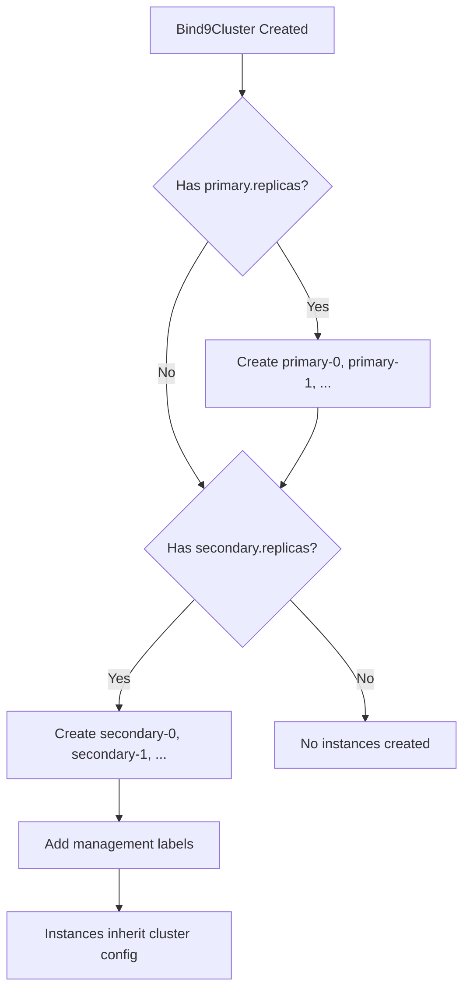
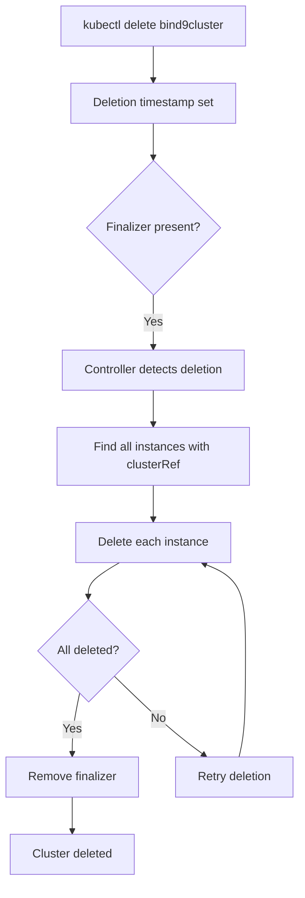
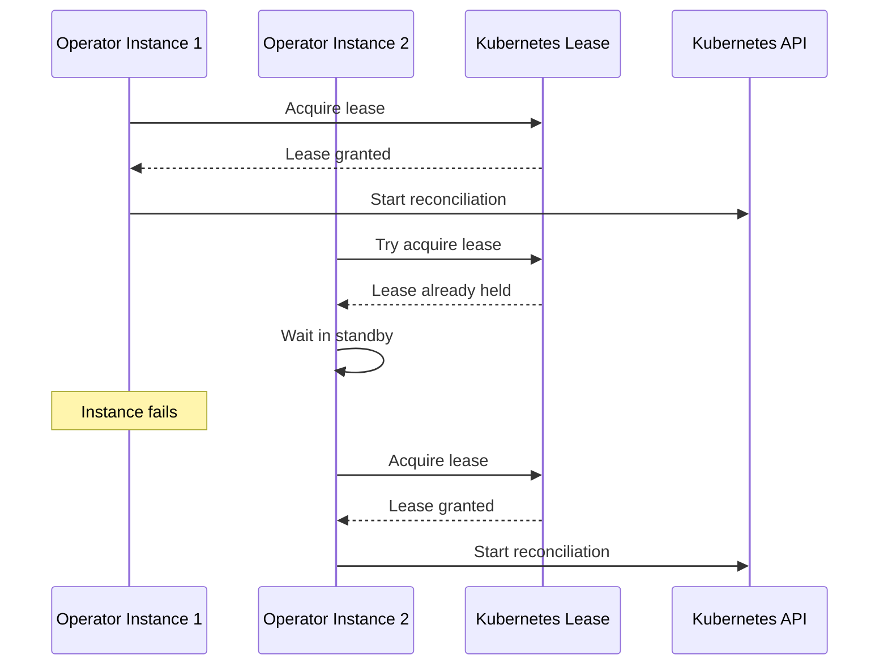

# Architecture Overview

This page provides a detailed overview of Bindy's architecture and design principles.

## High-Level Architecture

```
┌──────────────────────────────────────────────────────────────┐
│                    Kubernetes Cluster                        │
│                                                              │
│  ┌────────────────────────────────────────────────────────┐ │
│  │            Custom Resource Definitions (CRDs)          │ │
│  │  • Bind9Instance  • DNSZone  • ARecord  • MXRecord ... │ │
│  └──────────────────────┬─────────────────────────────────┘ │
│                         │                                    │
│                         │ watches                            │
│                         ▼                                    │
│  ┌────────────────────────────────────────────────────────┐ │
│  │              Bindy Controller (Rust)                   │ │
│  │                                                        │ │
│  │  ┌──────────────┐  ┌──────────────┐  ┌─────────────┐ │ │
│  │  │ Bind9Instance│  │   DNSZone    │  │   Records   │ │ │
│  │  │  Reconciler  │  │  Reconciler  │  │  Reconciler │ │ │
│  │  └──────────────┘  └──────────────┘  └─────────────┘ │ │
│  │                                                        │ │
│  │  ┌──────────────────────────────────────────────────┐ │ │
│  │  │         Zone File Generator                      │ │ │
│  │  └──────────────────────────────────────────────────┘ │ │
│  └──────────────────────────┬─────────────────────────────┘ │
│                             │                                │
│                             │ configures                     │
│                             ▼                                │
│  ┌────────────────────────────────────────────────────────┐ │
│  │              BIND9 Instances                           │ │
│  │                                                        │ │
│  │  ┌──────────┐      ┌──────────┐      ┌──────────┐    │ │
│  │  │ Primary  │ AXFR │Secondary │ AXFR │Secondary │    │ │
│  │  │   DNS    │─────▶│   DNS    │─────▶│   DNS    │    │ │
│  │  │(us-east) │      │(us-west) │      │   (eu)   │    │ │
│  │  └────┬─────┘      └────┬─────┘      └────┬─────┘    │ │
│  └───────┼─────────────────┼─────────────────┼───────────┘ │
└──────────┼─────────────────┼─────────────────┼─────────────┘
           │                 │                 │
           └─────────────────┴─────────────────┘
                             │
                             │ DNS queries (UDP/TCP 53)
                             ▼
                    ┌─────────────────┐
                    │     Clients     │
                    │  • Apps         │
                    │  • Services     │
                    │  • External     │
                    └─────────────────┘
```

## Components

### Bindy Controller

The controller is written in Rust using the kube-rs library. It consists of:

#### 1. Reconcilers

Each reconciler handles a specific resource type:

- **Bind9Instance Reconciler** - Manages BIND9 instance lifecycle
  - Creates StatefulSets for BIND9 pods
  - Configures services and networking
  - Updates instance status

- **Bind9Cluster Reconciler** - Manages cluster-level configuration
  - Manages finalizers for cascade deletion
  - Creates and reconciles managed instances
  - Propagates global configuration to instances
  - Tracks cluster-wide status

- **DNSZone Reconciler** - Manages DNS zones
  - Evaluates label selectors
  - Generates zone files
  - Updates zone configuration
  - Reports matched instances

- **Record Reconcilers** - Manage individual DNS records
  - One reconciler per record type (A, AAAA, CNAME, MX, TXT, NS, SRV, CAA)
  - Validates record specifications
  - Appends records to zone files
  - Updates record status

#### 2. Zone File Generator

Generates BIND9-compatible zone files from Kubernetes resources:

```rust
// Simplified example
pub fn generate_zone_file(zone: &DNSZone, records: Vec<DNSRecord>) -> String {
    let mut zone_file = String::new();

    // SOA record
    zone_file.push_str(&format_soa_record(&zone.spec.soa_record));

    // NS records
    for ns in &zone.spec.name_servers {
        zone_file.push_str(&format_ns_record(ns));
    }

    // Individual records
    for record in records {
        zone_file.push_str(&format_record(record));
    }

    zone_file
}
```

### Custom Resource Definitions (CRDs)

CRDs define the schema for DNS resources:

```yaml
apiVersion: apiextensions.k8s.io/v1
kind: CustomResourceDefinition
metadata:
  name: dnszones.bindy.firestoned.io
spec:
  group: bindy.firestoned.io
  names:
    kind: DNSZone
    plural: dnszones
  scope: Namespaced
  versions:
    - name: v1alpha1
      served: true
      storage: true
```

### BIND9 Instances

BIND9 servers managed by Bindy:

- Deployed as Kubernetes StatefulSets
- Configuration via ConfigMaps
- Zone files mounted from ConfigMaps or PVCs
- Support for primary and secondary architectures

## Data Flow

### Zone Creation Flow

1. **User creates DNSZone resource**
   ```bash
   kubectl apply -f dnszone.yaml
   ```

2. **Controller watches and receives event**
   ```rust
   // Watch stream receives create event
   stream.next().await
   ```

3. **DNSZone reconciler evaluates selector**
   ```rust
   // Find matching Bind9Instances
   let instances = find_matching_instances(&zone.spec.instance_selector).await?;
   ```

4. **Generate zone file for each instance**
   ```rust
   // Create zone configuration
   let zone_file = generate_zone_file(&zone, &records)?;
   ```

5. **Update BIND9 configuration**
   ```rust
   // Apply ConfigMap with zone file
   update_bind9_config(&instance, &zone_file).await?;
   ```

6. **Update DNSZone status**
   ```rust
   // Report success
   update_status(&zone, conditions, matched_instances).await?;
   ```

### Managed Instance Creation Flow

When a Bind9Cluster specifies replica counts, the controller automatically creates instances:



1. **User creates Bind9Cluster with replicas**
   ```yaml
   apiVersion: bindy.firestoned.io/v1alpha1
   kind: Bind9Cluster
   metadata:
     name: production-dns
   spec:
     primary:
       replicas: 2
     secondary:
       replicas: 3
   ```

2. **Bind9Cluster reconciler evaluates replica counts**
   ```rust
   let primary_replicas = cluster.spec.primary.as_ref()
       .and_then(|p| p.replicas).unwrap_or(0);
   ```

3. **Create missing instances with management labels**
   ```rust
   let mut labels = BTreeMap::new();
   labels.insert("bindy.firestoned.io/managed-by", "Bind9Cluster");
   labels.insert("bindy.firestoned.io/cluster", &cluster_name);
   labels.insert("bindy.firestoned.io/role", "primary");
   ```

4. **Instances inherit cluster configuration**
   ```rust
   let instance_spec = Bind9InstanceSpec {
       cluster_ref: cluster_name.clone(),
       version: cluster.spec.version.clone(),
       config: None,  // Inherit from cluster
       // ...
   };
   ```

5. **Self-healing: Recreate deleted instances**
   - Controller detects missing managed instances
   - Automatically recreates them with same configuration

### Cascade Deletion Flow

When a Bind9Cluster is deleted, all its instances are automatically cleaned up:



1. **User deletes Bind9Cluster**
   ```bash
   kubectl delete bind9cluster production-dns
   ```

2. **Finalizer prevents immediate deletion**
   ```rust
   if cluster.metadata.deletion_timestamp.is_some() {
       // Cleanup before allowing deletion
       delete_cluster_instances(&client, &namespace, &name).await?;
   }
   ```

3. **Find and delete all referencing instances**
   ```rust
   let instances: Vec<_> = all_instances.into_iter()
       .filter(|i| i.spec.cluster_ref == cluster_name)
       .collect();

   for instance in instances {
       api.delete(&instance_name, &DeleteParams::default()).await?;
   }
   ```

4. **Remove finalizer once cleanup complete**
   ```rust
   let mut finalizers = cluster.metadata.finalizers.unwrap_or_default();
   finalizers.retain(|f| f != FINALIZER_NAME);
   ```

### Record Addition Flow

1. **User creates DNS record resource**
2. **Controller receives event**
3. **Record reconciler validates zone reference**
4. **Append record to existing zone file**
5. **Reload BIND9 configuration**
6. **Update record status**

## Concurrency Model

Bindy uses Rust's async/await with Tokio runtime:

```rust
#[tokio::main]
async fn main() -> Result<()> {
    // Spawn multiple reconcilers concurrently
    tokio::try_join!(
        run_bind9instance_controller(),
        run_dnszone_controller(),
        run_record_controllers(),
    )?;
    Ok(())
}
```

Benefits:
- **Concurrent reconciliation** - Multiple resources reconciled simultaneously
- **Non-blocking I/O** - Efficient API server communication
- **Low memory footprint** - Async tasks use minimal memory
- **High throughput** - Handle thousands of DNS records efficiently

## Resource Watching

The controller uses Kubernetes watch API with reflector caching:

```rust
let api: Api<DNSZone> = Api::all(client);
let watcher = watcher(api, ListParams::default());

// Reflector caches resources locally
let store = reflector::store::Writer::default();
let reader = store.as_reader();
let reflector = reflector(store, watcher);

// Process events
while let Some(event) = stream.try_next().await? {
    match event {
        Applied(zone) => reconcile_zone(zone).await?,
        Deleted(zone) => cleanup_zone(zone).await?,
        Restarted(_) => refresh_all().await?,
    }
}
```

## Error Handling

Multi-layer error handling strategy:

1. **Validation Errors** - Caught early, reported in status
2. **Reconciliation Errors** - Retried with exponential backoff
3. **Fatal Errors** - Logged and cause controller restart
4. **Status Reporting** - All errors visible in resource status

```rust
match reconcile_zone(&zone).await {
    Ok(_) => update_status(Ready, "Synchronized"),
    Err(e) => {
        log::error!("Failed to reconcile zone: {}", e);
        update_status(NotReady, e.to_string());
        // Requeue for retry
        Err(e)
    }
}
```

## Performance Optimizations

### 1. Incremental Updates
Only regenerate zone files when records change, not on every reconciliation.

### 2. Caching
Local cache of BIND9 instances to avoid repeated API calls.

### 3. Batch Processing
Group related updates to minimize BIND9 reloads.

### 4. Zero-Copy Operations
Use string slicing and references to avoid unnecessary allocations.

### 5. Compiled Binary
Rust compilation produces optimized native code with no runtime overhead.

## Security Architecture

### RBAC

Controller uses least-privilege service account:

```yaml
apiVersion: v1
kind: ServiceAccount
metadata:
  name: bind9-controller
---
apiVersion: rbac.authorization.k8s.io/v1
kind: ClusterRole
metadata:
  name: bind9-controller
rules:
  - apiGroups: ["bindy.firestoned.io"]
    resources: ["dnszones", "arecords", ...]
    verbs: ["get", "list", "watch", "update"]
```

### Non-Root Containers

Controller runs as non-root user:

```dockerfile
USER 65532:65532
```

### Network Policies

Limit controller network access:

```yaml
apiVersion: networking.k8s.io/v1
kind: NetworkPolicy
metadata:
  name: bind9-controller
spec:
  podSelector:
    matchLabels:
      app: bind9-controller
  policyTypes:
    - Egress
  egress:
    - to:
        - namespaceSelector: {}
      ports:
        - protocol: TCP
          port: 443  # API server only
```

## Scalability

### Horizontal Scaling - Operator Leader Election

Multiple controller replicas use Kubernetes Lease-based leader election for high availability:



**Implementation:**

```rust
// Create lease manager with configuration
let lease_manager = LeaseManagerBuilder::new(client.clone(), &lease_name)
    .with_namespace(&lease_namespace)
    .with_identity(&identity)
    .with_duration(Duration::from_secs(15))
    .with_grace(Duration::from_secs(2))
    .build()
    .await?;

// Watch leadership status
let (leader_rx, lease_handle) = lease_manager.watch().await;

// Run controllers with leader monitoring
tokio::select! {
    result = monitor_leadership(leader_rx) => {
        warn!("Leadership lost! Stopping all controllers...");
    }
    result = run_all_controllers() => {
        // Normal controller execution
    }
}
```

**Failover characteristics:**
- **Lease duration:** 15 seconds (configurable)
- **Automatic failover:** ~15 seconds if leader fails
- **Zero data loss:** New leader resumes from Kubernetes state
- **Multiple replicas:** Support for 2-5+ operator instances

### Resource Limits

Recommended production configuration:

```yaml
resources:
  requests:
    cpu: 100m
    memory: 128Mi
  limits:
    cpu: 500m
    memory: 512Mi
```

Can handle:
- **1000+** DNS zones
- **10,000+** DNS records
- **<100ms** average reconciliation time

## Next Steps

- [Custom Resource Definitions](./crds.md) - CRD specifications
- [Controller Design](../development/controller-design.md) - Implementation details
- [Performance Tuning](../advanced/performance.md) - Optimization strategies
