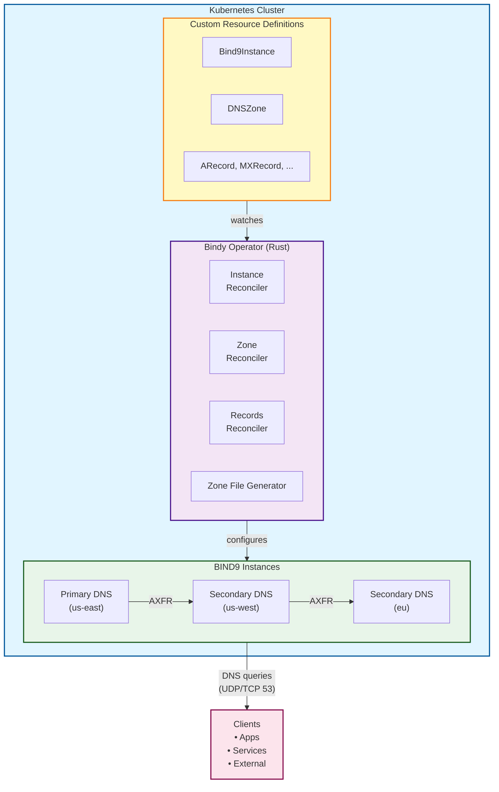
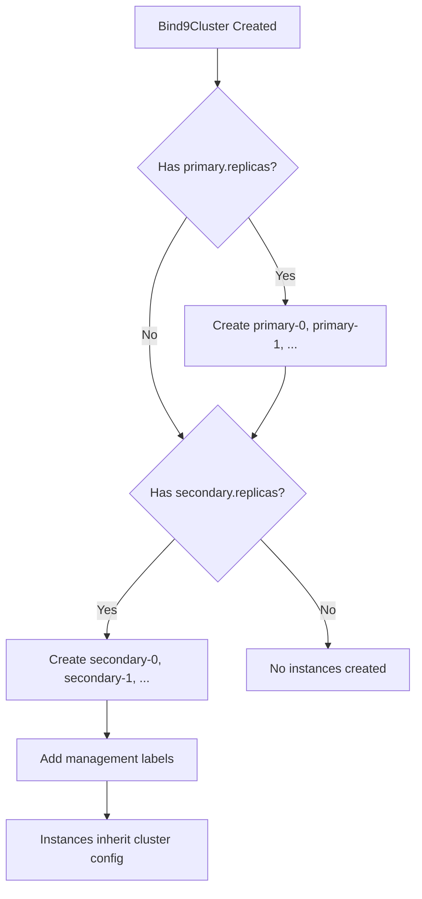
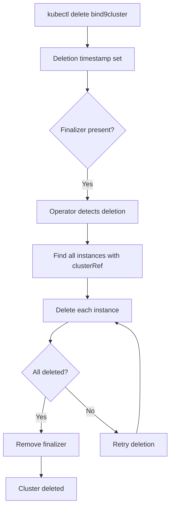
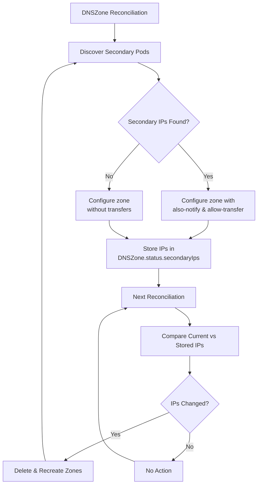
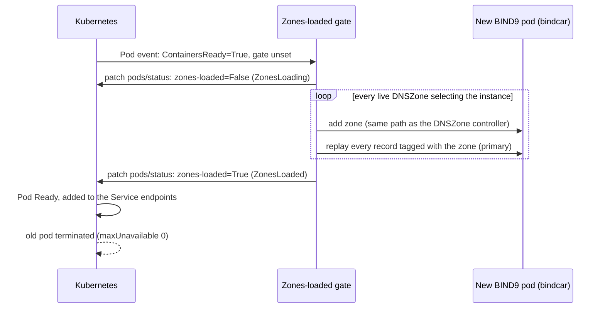
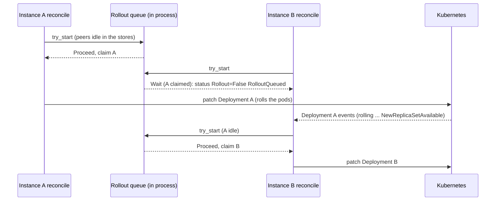
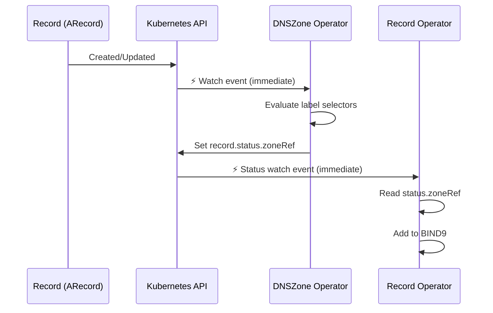
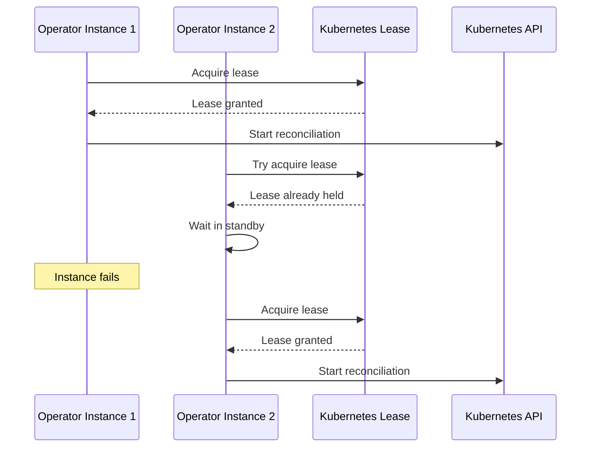

# Architecture Overview

This page provides a detailed overview of Bindy's architecture and design principles.

## High-Level Architecture


```mermaid
graph TB
    subgraph k8s["Kubernetes Cluster"]
        subgraph crds["Custom Resource Definitions"]
            crd1["Bind9Instance"]
            crd2["DNSZone"]
            crd3["ARecord, MXRecord, ..."]
        end

        subgraph operator["Bindy Operator (Rust)"]
            reconciler1["Instance<br/>Reconciler"]
            reconciler2["Zone<br/>Reconciler"]
            reconciler3["Records<br/>Reconciler"]
            zonegen["Zone File Generator"]
        end

        subgraph bind9["BIND9 Instances"]
            primary["Primary DNS<br/>(us-east)"]
            secondary1["Secondary DNS<br/>(us-west)"]
            secondary2["Secondary DNS<br/>(eu)"]
        end
    end

    clients["Clients<br/>• Apps<br/>• Services<br/>• External"]

    crds -->|watches| operator
    operator -->|configures| bind9
    primary -->|AXFR| secondary1
    secondary1 -->|AXFR| secondary2
    bind9 -->|"DNS queries<br/>(UDP/TCP 53)"| clients

    style k8s fill:#e1f5ff,stroke:#01579b,stroke-width:2px
    style crds fill:#fff9c4,stroke:#f57f17,stroke-width:2px
    style operator fill:#f3e5f5,stroke:#4a148c,stroke-width:2px
    style bind9 fill:#e8f5e9,stroke:#1b5e20,stroke-width:2px
    style clients fill:#fce4ec,stroke:#880e4f,stroke-width:2px
```

## Components

### Bindy Operator

The operator is written in Rust using the kube-rs library. It consists of:

#### 1. Reconcilers

Each reconciler handles a specific resource type:

- **Bind9Instance Reconciler** - Manages BIND9 instance lifecycle
  - Creates StatefulSets for BIND9 pods
  - Configures services and networking
  - Updates instance status

- **Bind9Cluster Reconciler** - Manages cluster-level configuration
  - Manages finalizers for cascade deletion
  - Creates and reconciles managed instances
  - Propagates global configuration to instances
  - Tracks cluster-wide status

- **DNSZone Reconciler** - Manages DNS zones (EVENT-DRIVEN)
  - **Watches all 9 record types** (ARecord, AAAARecord, TXTRecord, CNAMERecord, MXRecord, NSRecord, SRVRecord, CAARecord, PTRRecord)
  - Evaluates label selectors when records change
  - Sets `record.status.zoneRef` for matching records
  - Generates zone files
  - Updates zone configuration
  - Triggers zone transfers when records ready

- **Record Reconcilers** - Manage individual DNS records (EVENT-DRIVEN)
  - One reconciler per record type (A, AAAA, CNAME, MX, TXT, NS, SRV, CAA)
  - **Watches for status changes** (specifically `status.zoneRef`)
  - Reacts immediately when selected by a zone
  - Validates record specifications
  - Adds records to BIND9 primaries via nsupdate
  - Updates record status

#### 2. Zone File Generator

Generates BIND9-compatible zone files from Kubernetes resources:

```rust
// Simplified example
pub fn generate_zone_file(zone: &DNSZone, records: Vec<DNSRecord>) -> String {
    let mut zone_file = String::new();

    // SOA record
    zone_file.push_str(&format_soa_record(&zone.spec.soa_record));

    // NS records
    for ns in &zone.spec.name_servers {
        zone_file.push_str(&format_ns_record(ns));
    }

    // Individual records
    for record in records {
        zone_file.push_str(&format_record(record));
    }

    zone_file
}
```

### Custom Resource Definitions (CRDs)

CRDs define the schema for DNS resources:

```yaml
apiVersion: apiextensions.k8s.io/v1
kind: CustomResourceDefinition
metadata:
  name: dnszones.bindy.firestoned.io
spec:
  group: bindy.firestoned.io
  names:
    kind: DNSZone
    plural: dnszones
  scope: Namespaced
  versions:
    - name: v1beta1
      served: true
      storage: true
    - name: v1alpha1
      served: false
      storage: false
      deprecated: true
```

### BIND9 Instances

BIND9 servers managed by Bindy:

- Deployed as Kubernetes StatefulSets
- Configuration via ConfigMaps
- Zone files mounted from ConfigMaps or PVCs
- Support for primary and secondary architectures

## Data Flow

### Zone Creation Flow

1. **User creates DNSZone resource**
   ```bash
   kubectl apply -f dnszone.yaml
   ```

2. **Operator watches and receives event**
   ```rust
   // Watch stream receives create event
   stream.next().await
   ```

3. **DNSZone reconciler evaluates selector**
   ```rust
   // Find matching Bind9Instances
   let instances = find_matching_instances(&zone.spec.instance_selector).await?;
   ```

4. **Generate zone file for each instance**
   ```rust
   // Create zone configuration
   let zone_file = generate_zone_file(&zone, &records)?;
   ```

5. **Update BIND9 configuration**
   ```rust
   // Apply ConfigMap with zone file
   update_bind9_config(&instance, &zone_file).await?;
   ```

6. **Update DNSZone status**
   ```rust
   // Report success
   update_status(&zone, conditions, matched_instances).await?;
   ```

### Managed Instance Creation Flow

When a Bind9Cluster specifies replica counts, the operator automatically creates instances:


```mermaid
flowchart TD
    A[Bind9Cluster Created] --> B{Has primary.replicas?}
    B -->|Yes| C[Create primary-0, primary-1, ...]
    B -->|No| D{Has secondary.replicas?}
    C --> D
    D -->|Yes| E[Create secondary-0, secondary-1, ...]
    D -->|No| F[No instances created]
    E --> G[Add management labels]
    G --> H[Instances inherit cluster config]
```

1. **User creates Bind9Cluster with replicas**
   ```yaml
   apiVersion: bindy.firestoned.io/v1beta1
   kind: Bind9Cluster
   metadata:
     name: production-dns
   spec:
     primary:
       replicas: 2
     secondary:
       replicas: 3
   ```

2. **Bind9Cluster reconciler evaluates replica counts**
   ```rust
   let primary_replicas = cluster.spec.primary.as_ref()
       .and_then(|p| p.replicas).unwrap_or(0);
   ```

3. **Create missing instances with management labels**
   ```rust
   let mut labels = BTreeMap::new();
   labels.insert("bindy.firestoned.io/managed-by", "Bind9Cluster");
   labels.insert("bindy.firestoned.io/cluster", &cluster_name);
   labels.insert("bindy.firestoned.io/role", "primary");
   ```

4. **Instances inherit cluster configuration**
   ```rust
   let instance_spec = Bind9InstanceSpec {
       cluster_ref: cluster_name.clone(),
       version: cluster.spec.version.clone(),
       config: None,  // Inherit from cluster
       // ...
   };
   ```

5. **Self-healing: Recreate deleted instances**
   - Operator detects missing managed instances
   - Automatically recreates them with same configuration

### Cascade Deletion Flow

When a Bind9Cluster is deleted, all its instances are automatically cleaned up:


```mermaid
flowchart TD
    A[kubectl delete bind9cluster] --> B[Deletion timestamp set]
    B --> C{Finalizer present?}
    C -->|Yes| D[Operator detects deletion]
    D --> E[Find all instances with clusterRef]
    E --> F[Delete each instance]
    F --> G{All deleted?}
    G -->|Yes| H[Remove finalizer]
    G -->|No| I[Retry deletion]
    H --> J[Cluster deleted]
    I --> F
```

1. **User deletes Bind9Cluster**
   ```bash
   kubectl delete bind9cluster production-dns
   ```

2. **Finalizer prevents immediate deletion**
   ```rust
   if cluster.metadata.deletion_timestamp.is_some() {
       // Cleanup before allowing deletion
       delete_cluster_instances(&client, &namespace, &name).await?;
   }
   ```

3. **Find and delete all referencing instances**
   ```rust
   let instances: Vec<_> = all_instances.into_iter()
       .filter(|i| i.spec.cluster_ref == cluster_name)
       .collect();

   for instance in instances {
       api.delete(&instance_name, &DeleteParams::default()).await?;
   }
   ```

4. **Remove finalizer once cleanup complete**
   ```rust
   let mut finalizers = cluster.metadata.finalizers.unwrap_or_default();
   finalizers.retain(|f| f != FINALIZER_NAME);
   ```

### Record Addition Flow (Event-Driven)

This flow demonstrates the **immediate, event-driven architecture** with sub-second reaction times:

1. **User creates DNS record resource** with matching labels
   ```bash
   kubectl apply -f arecord.yaml
   ```

2. **DNSZone watch triggers immediately** ⚡
   - DNSZone operator watches all 8 record types
   - Receives event within milliseconds
   - No polling delay

3. **DNSZone evaluates label selectors**
   ```rust
   // Check if record matches spec.recordsFrom
   if matches_selector(&record, &zone.spec.records_from) {
       set_zone_ref(&record, &zone).await?;
   }
   ```

4. **DNSZone sets `record.status.zoneRef`**
   ```yaml
   status:
     zoneRef:
       apiVersion: bindy.firestoned.io/v1beta1
       kind: DNSZone
       name: example-com
       namespace: default
       zoneName: example.com
   ```

5. **Record status watch triggers** ⚡
   - Record operator watches for status changes
   - Reacts immediately to `status.zoneRef` being set
   - No polling delay

6. **Record reconciler adds to BIND9**
   ```rust
   // Read zoneRef from status
   let zone_ref = record.status.zone_ref?;
   let zone = get_zone(&zone_ref).await?;

   // Add record to BIND9 primaries via nsupdate
   add_record_to_bind9(&zone, &record).await?;
   ```

7. **Update record status**
   ```yaml
   status:
     zoneRef: { ... }
     conditions:
       - type: Ready
         status: "True"
         reason: RecordAvailable
   ```

8. **Zone transfer triggered** (when all records ready)
   - DNSZone detects all records have RecordAvailable status
   - Triggers `rndc retransfer` on secondaries
   - Zone synchronized across all instances

**Performance:** Total time from record creation to BIND9 update: **~500ms** ✅
(Old polling approach: 30 seconds to 5 minutes ❌)

### Zone Transfer Configuration Flow

For primary/secondary DNS architectures, zones must be configured with zone transfer settings:


```mermaid
flowchart TD
    A[DNSZone Reconciliation] --> B[Discover Secondary Pods]
    B --> C{Secondary IPs Found?}
    C -->|Yes| D[Configure zone with<br/>also-notify & allow-transfer]
    C -->|No| E[Configure zone<br/>without transfers]
    D --> F[Store IPs in<br/>DNSZone.status.secondaryIps]
    E --> F
    F --> G[Next Reconciliation]
    G --> H[Compare Current vs Stored IPs]
    H --> I{IPs Changed?}
    I -->|Yes| J[Delete & Recreate Zones]
    I -->|No| K[No Action]
    J --> B
    K --> G
```

**Implementation Details:**

1. **Secondary Discovery** - On every reconciliation (see [crates/bindy-controller-zone/src/dnszone.rs](https://github.com/firestoned/bindy/blob/main/crates/bindy-controller-zone/src/dnszone.rs)):
   ```rust
   // Step 1: Get all instances selected for this zone
   let instance_refs = get_instances_from_zone(dnszone, bind9_instances_store)?;

   // Step 2: Filter to only SECONDARY instances by ServerRole
   let secondary_instance_refs = filter_secondary_instances(&client, &instance_refs).await?;

   // Step 3: Get pod IPs from secondary instances
   let secondary_ips = find_secondary_pod_ips_from_instances(&client, &secondary_instance_refs).await?;
   ```

2. **Zone Transfer Configuration** - Secondary IPs are passed to primary zone creation (see [crates/bindy-controller-zone/src/dnszone.rs](https://github.com/firestoned/bindy/blob/main/crates/bindy-controller-zone/src/dnszone.rs)):
   ```rust
   // Configuration includes secondary IPs for also-notify and allow-transfer
   // These are set when creating zones on PRIMARY instances
   let zone_config = ZoneConfig {
       zone_name: dnszone.spec.zone_name.clone(),
       zone_type: ZoneType::Primary,
       also_notify: Some(secondary_ips.clone()),      // Notify these secondaries of changes
       allow_transfer: Some(secondary_ips.clone()),   // Allow these secondaries to AXFR
       // ... other fields ...
   };
   ```

3. **Automatic Reconfiguration** - When secondary IPs change:
   - The reconciliation loop detects changes in the list of selected instances
   - Zones are automatically reconfigured with the new secondary IP list
   - No manual intervention required when secondary pods are rescheduled
   - See [crates/bindy-controller-zone/src/dnszone.rs](https://github.com/firestoned/bindy/blob/main/crates/bindy-controller-zone/src/dnszone.rs) for the full reconciliation flow

**Why This Matters:**
- **Self-healing**: When secondary pods are rescheduled/restarted and get new IPs, zones automatically update
- **No manual intervention**: Primary zones always have correct secondary IPs for zone transfers
- **Automatic recovery**: Zone transfers resume within one reconciliation period (~5-10 minutes) after IP changes
- **Minimal overhead**: Leverages existing reconciliation loop, no additional watchers needed

## Concurrency Model

Bindy uses Rust's async/await with Tokio runtime:

```rust
#[tokio::main]
async fn main() -> Result<()> {
    // Spawn multiple reconcilers concurrently
    tokio::try_join!(
        run_bind9instance_operator(),
        run_dnszone_operator(),
        run_record_operators(),
    )?;
    Ok(())
}
```

Benefits:
- **Concurrent reconciliation** - Multiple resources reconciled simultaneously
- **Non-blocking I/O** - Efficient API server communication
- **Low memory footprint** - Async tasks use minimal memory
- **High throughput** - Handle thousands of DNS records efficiently

## Resource Watching (Event-Driven Architecture)

Bindy watches the Kubernetes API through one **shared watch layer**
(`WatchSet`, in `bindy-controller-sdk`; [ADR-0009](https://github.com/firestoned/bindy/blob/main/docs/adr/0009-workspace-crate-split-and-shared-watch-layer.md) §3).
Each cached kind is watched **once per namespace target** (once in total in
the default cluster-wide mode), and every controller that reacts to that kind
subscribes to the same watch and reads the same cache.

| Kind | Watched by the WatchSet | Subscribed by |
|---|---|---|
| `ClusterBind9Provider` (cluster-scoped, always one watch) | yes | its controller, `Bind9Instance` |
| `Bind9Cluster` | yes | its controller, `ClusterBind9Provider` (owns), `Bind9Instance` |
| `Bind9Instance` | yes | its controller, `Bind9Cluster` (owns), `DNSZone` |
| `Deployment` (only those owned by a `Bind9Instance`) | yes | `Bind9Instance` (owns; and a rollout mapper that wakes instances queued behind a conflicting rollout, ADR-0018) |
| `DNSZone` | yes | its controller, `Bind9Instance`, every record controller |
| The 9 record kinds | yes | their controller, `DNSZone` |
| `Endpoints` of bindy's Services (label `app.kubernetes.io/part-of=bindy`, filtered by the API server) | yes | `DNSZone` (all namespaces) |
| BIND9 `Pod`s (labels `app.kubernetes.io/part-of=bindy,app.kubernetes.io/component=dns-server`, filtered by the API server) | yes | zones-loaded gate (ADR-0017); every BIND9 write, to reach pods the gate still holds out of their Service; staggered rollouts, to wake instances queued behind a pod turning Ready (ADR-0018) |
| Owned `Secret`, `ConfigMap`, `ServiceAccount`, `Service` | no, an ordinary watch | `Bind9Instance` (owns) |

Kinds in the last row are watched by one controller only and never cached;
sharing them would save nothing and would put every `Secret` in the
operator's memory.

A zone can be served by a `Bind9Instance` in another namespace
(cross-namespace targeting). In namespace-restricted mode each namespace's
zone controller therefore subscribes to `Bind9Instance` and `Endpoints`
events from every watched namespace, at no extra watch cost.

How a shared watch behaves:

- Every event (create, update, **delete**) is applied to the cache first and
  then delivered to each subscribed controller. A slow controller slows its
  kind's watch rather than losing events.
- A controller that starts after the cache is warm (for example when this
  replica wins the leader lease) first receives everything already in the
  cache, so existing objects are reconciled at startup.
- A watch that ends is restarted with backoff. The metrics
  `bindy_firestoned_io_watch_events_total`, `_watch_errors_total`,
  `_watch_restarts_total` and `_watch_last_event_timestamp_seconds` (labels
  `kind`, `namespace`) show each watch's health; a timestamp that stops
  advancing while objects change means that kind's cache is stale.

In the default cluster-wide mode the operator holds 19 watch connections (15
shared, 4 ordinary), measured on a kind cluster against the API server's
`apiserver_longrunning_requests` (bindy v0.7.1, before the shared watch layer:
58). The BIND9 Pod watch of the zones-loaded gate (ADR-0017) adds one more
shared watch, 20 in all (computed, not re-measured). In
namespace-restricted mode the namespaced ones are repeated per watched
namespace.

### DNSZone Operator Watches

The zone controller reacts to its own `DNSZone`s, to `Bind9Instance` label
changes (zones select instances by label), to `Endpoints` (a replaced BIND9
pod has lost its zones), and to every record kind (zones select records by
label):

```rust
// The zone's own status writes do not retrigger it: the primary stream passes
// generation, finalizer, label and annotation changes only (ADR-0009 §4).
let primary = ws
    .subscribe::<DNSZone>(target)
    .predicate_filter(primary_predicate(), Default::default());

let controller = Controller::for_stream(primary, ws.store::<DNSZone>(target))
    .watches_stream(ws.subscribe_all::<Endpoints>(), zones_for_endpoints)
    .watches_stream(ws.subscribe_all::<Bind9Instance>(), zones_selecting_instance);
let controller = watch_records::<ARecord>(controller, &ctx, target);
// ... one line for each of the other 8 record kinds
controller
    .graceful_shutdown_on(ctx.shutdown.wait())
    .run(reconcile_dnszone_wrapper, error_policy, ctx)
```

The wiring lives in `crates/bindy-controller-zone/src/watch.rs`. Because the
primary stream drops status-only writes, the zone controller no longer needs
the 2-second rate limiter it used to carry.

### Zones-Loaded Readiness Gate

Every BIND9 pod lists `bindy.firestoned.io/zones-loaded` in
`spec.readinessGates`
([ADR-0017](https://github.com/firestoned/bindy/blob/main/docs/adr/0017-zones-loaded-readiness-gate.md)),
so a new pod, which starts with empty `emptyDir` zone storage, joins its
Service only after the operator says its zones are loaded. A second
controller in the zone crate (`crates/bindy-controller-zone/src/zones_gate.rs`)
owns that condition:


```mermaid
sequenceDiagram
    participant K as Kubernetes
    participant G as Zones-loaded gate
    participant P as New BIND9 pod (bindcar)
    K->>G: Pod event: ContainersReady=True, gate unset
    G->>K: patch pods/status: zones-loaded=False (ZonesLoading)
    loop every live DNSZone selecting the instance
        G->>P: add zone (same path as the DNSZone controller)
        G->>P: replay every record tagged with the zone (primary)
    end
    G->>K: patch pods/status: zones-loaded=True (ZonesLoaded)
    K->>K: Pod Ready, added to the Service endpoints
    K-->>K: old pod terminated (maxUnavailable 0)
```

- **Primary resource:** the label-selected BIND9 Pod watch, filtered on
  `ContainersReady`, the gate condition, the IP and deletion.
- **Also woken by:** a `DNSZone` becoming live, changing its instance
  selectors or being deleted (the gated pods of every instance it selects).
- **Writes reach gated pods:** every BIND9 write (zones, records, replays,
  deletes) targets the Service's ready addresses plus the not-ready
  addresses whose pod is `ContainersReady=True`. EndpointSlice `serving`
  cannot stand in for this: it maps to the pod's `Ready` condition, gates
  included.
- **One-way latch:** once `True` the gate is never re-evaluated for the pod;
  a later zone reaches it through the `DNSZone` controller.
- **Except at termination (amended 2026-10-07):** a pod that gets a
  `deletionTimestamp` with its gate `True` is set `False`
  (`PodTerminating`) in the same Pod event. The pod's `Ready`, and its
  endpoint's `serving`, follow when the kubelet next syncs the pod's status
  (about 18 s on v0.8.0-rc.6), not at once; the handover is kept short by
  the new pod being Ready first and by staggered rollouts (ADR-0018).
- **Never deadlocks on one zone:** a zone that fails to load blocks the pod
  only while another Ready pod of the instance still serves it.

### Bind9Instance Operator Watches

The instance controller owns its Deployment, Service, ConfigMap, Secrets and
ServiceAccount, and watches its `Bind9Cluster`, its `ClusterBind9Provider` and
the `DNSZone`s in its namespace. Every mapper is pure: a `DNSZone` change
enqueues the instances the zone selected, and their reconcile refreshes
`status.zones` with the controller's retries, backoff and metrics. The zone
stream is filtered to changes in what `status.zones` is built from (the
selected instances, the zone name, deletion), so the timestamps record
reconciles write into a zone's status do not fan out into instance
reconciles. (Before ADR-0009 the mapper
spawned a task that patched the instances outside the controller.)

### Staggered Rollouts

A pod-template change (anything under the Deployment's `spec.template`) is
applied only while no instance in the instance's conflict set is
mid-rollout
([ADR-0018](https://github.com/firestoned/bindy/blob/main/docs/adr/0018-staggered-bind9-rollouts.md),
`crates/bindy-controller-instance/src/rollout.rs`). The conflict set is
every instance that serves a zone in common (`DNSZone`
`status.bind9Instances`) or belongs to the same `Bind9Cluster` /
`ClusterBind9Provider`. Creation and replica changes are never staggered.


```mermaid
sequenceDiagram
    participant A as Instance A reconcile
    participant Q as Rollout queue (in process)
    participant B as Instance B reconcile
    participant K as Kubernetes

    A->>Q: try_start (peers idle in the stores)
    Q-->>A: Proceed, claim A
    B->>Q: try_start
    Q-->>B: Wait (A claimed): status Rollout=False RolloutQueued
    A->>K: patch Deployment A (rolls the pods)
    K-->>B: Deployment A events (rolling ... NewReplicaSetAvailable)
    B->>Q: try_start (A idle)
    Q-->>B: Proceed, claim B
    B->>K: patch Deployment B
```

- **Mid-rollout** is read from the Deployment and Pod stores: an unobserved
  generation, a surge pod, fewer updated/ready/available replicas than
  wanted, or a pod not Ready during the rollout. `ProgressDeadlineExceeded`
  does not block; neither does an instance degraded after its rollout
  completed.
- **Ordering:** first come, first served, with claims that close the race
  between two reconciles reading the same idle store. Waiting only ever
  follows strictly earlier queue positions or a rollout Kubernetes is
  driving, so no two instances wait for each other.
- **Wakes (no timer):** a Deployment mapper and a Pod mapper wake the
  waiting instances in the changed instance's conflict set; the queue wakes
  its waiters when a claim is released or a waiter leaves without rolling.
- **Status:** a waiting instance keeps its `Ready` condition and its
  observed generations, and carries `Rollout=False, reason: RolloutQueued`
  naming the instance it waits for.

### Record Operator Watches

Each record controller reacts to its own records and to `DNSZone` status
changes (a zone listing the record as not yet configured):

```rust
Controller::for_stream(ws.subscribe::<ARecord>(target), ws.store::<ARecord>(target))
    .watches_stream(ws.subscribe::<DNSZone>(target), map_zone_to_pending_records)
    .run(reconcile_wrapper, error_policy, ctx)
```

Status-only changes are delivered: the shared watch forwards every change.

### Watch Event Flow


```mermaid
sequenceDiagram
    participant R as Record (ARecord)
    participant K as Kubernetes API
    participant DZ as DNSZone Operator
    participant RC as Record Operator

    R->>K: Created/Updated
    K->>DZ: ⚡ Watch event (immediate)
    DZ->>DZ: Evaluate label selectors
    DZ->>K: Set record.status.zoneRef
    K->>RC: ⚡ Status watch event (immediate)
    RC->>RC: Read status.zoneRef
    RC->>RC: Add to BIND9
```

**Performance Benefits:**
- ⚡ **Immediate reaction**: Sub-second response to changes
- 🔄 **No polling**: Event-driven, with no periodic resync at all (ADR-0016)
- 📉 **Lower API load**: Only reconcile when actual changes occur
- 🎯 **Precise targeting**: Only affected zones reconcile

## Error Handling

Multi-layer error handling strategy:

1. **Validation Errors** - Caught early, reported in status
2. **Reconciliation Errors** - Retried with exponential backoff
3. **Fatal Errors** - Logged and cause operator restart
4. **Status Reporting** - All errors visible in resource status

```rust
match reconcile_zone(&zone).await {
    Ok(_) => update_status(Ready, "Synchronized"),
    Err(e) => {
        log::error!("Failed to reconcile zone: {}", e);
        update_status(NotReady, e.to_string());
        // Requeue for retry
        Err(e)
    }
}
```

## Performance Optimizations

### 1. Incremental Updates
Only regenerate zone files when records change, not on every reconciliation.

### 2. Caching
Local cache of BIND9 instances to avoid repeated API calls.

### 3. Batch Processing
Group related updates to minimize BIND9 reloads.

### 4. Zero-Copy Operations
Use string slicing and references to avoid unnecessary allocations.

### 5. Compiled Binary
Rust compilation produces optimized native code with no runtime overhead.

## Security Architecture

### RBAC

Operator uses least-privilege service account:

```yaml
apiVersion: v1
kind: ServiceAccount
metadata:
  name: bind9-operator
---
apiVersion: rbac.authorization.k8s.io/v1
kind: ClusterRole
metadata:
  name: bind9-operator
rules:
  - apiGroups: ["bindy.firestoned.io"]
    resources: ["dnszones", "arecords", ...]
    verbs: ["get", "list", "watch", "update"]
```

### Non-Root Containers

Operator runs as non-root user:

```dockerfile
USER 65532:65532
```

### Network Policies

Limit operator network access:

```yaml
apiVersion: networking.k8s.io/v1
kind: NetworkPolicy
metadata:
  name: bind9-operator
spec:
  podSelector:
    matchLabels:
      app: bind9-operator
  policyTypes:
    - Egress
  egress:
    - to:
        - namespaceSelector: {}
      ports:
        - protocol: TCP
          port: 443  # API server only
```

## Scalability

### Horizontal Scaling - Operator Leader Election

Multiple operator replicas use Kubernetes Lease-based leader election for high availability:


```mermaid
sequenceDiagram
    participant O1 as Operator Instance 1
    participant O2 as Operator Instance 2
    participant L as Kubernetes Lease
    participant K as Kubernetes API

    O1->>L: Acquire lease
    L-->>O1: Lease granted
    O1->>K: Start reconciliation
    O2->>L: Try acquire lease
    L-->>O2: Lease already held
    O2->>O2: Wait in standby

    Note over O1: Instance fails
    O2->>L: Acquire lease
    L-->>O2: Lease granted
    O2->>K: Start reconciliation
```

**Implementation:**

```rust
// crates/bindy/src/main.rs (abridged)
let (trigger, shutdown) = shutdown::channel();
let ctx = Arc::new(Context::new(client.clone(), NamespaceScope::from_env(), shutdown.clone())?);

// Blocks until this replica holds the lease (bindy_controller_sdk::leader).
let leadership = acquire_leadership(client, &LeaderElectionConfig::from_env()).await?;

// Losing the lease, SIGTERM or SIGINT fire the one shutdown trigger.
tokio::spawn(async move { leadership_lost(leader_rx).await; trigger.fire(); });

// Every controller crate drains on that trigger (graceful_shutdown_on);
// `supervise` turns a controller that stops on its own into an error.
futures::try_join!(
    supervise("Bind9Cluster/ClusterBind9Provider", bindy_controller_cluster::controller(ctx.clone()), shutdown.clone()),
    supervise("Bind9Instance", bindy_controller_instance::controller(ctx.clone()), shutdown.clone()),
    supervise("DNSZone", bindy_controller_zone::controller(ctx.clone()), shutdown.clone()),
    supervise("DNS record", bindy_controller_records::controller(ctx), shutdown),
)?;
```

On SIGTERM the controllers stop taking new work, finish the reconciles in
flight, and the process exits zero. On loss of the lease they drain the same
way and the process exits non-zero, so Kubernetes restarts it as a follower.
There is no separate startup pass: a watcher's initial list enqueues every
existing object, which repairs anything that drifted while no operator ran.

### No periodic resync (ADR-0016)

Every controller is event-driven. A successful reconcile, and a reconcile
that waits on another object (a record no zone has tagged yet, a zone with
no matching instance, a `DuplicateZone` loser), returns `await_change`: the
object is reconciled again only when a watch event arrives for it or for
what it waits on. There is no 5-minute or 30-second timer. A failure is a
retry, not a resync: an API error, a BIND9 write that was rejected or could
not reach a pod, or a `Degraded` zone is retried with per-object capped
backoff (2 s doubling to 60 s; a rejected record write never sooner than
its 30 s cooldown). Two objects schedule one wake for an instant no event
announces: a `Bind9Instance` when its RNDC key falls due for rotation, and a
signed `DNSZone` at its next KSK rollover.

What the operator repairs, and what triggers it:

| Drift | Repaired by |
|---|---|
| A BIND9 pod replaced (rollout, eviction, deletion, rescheduling: zone data lost) | The zones-loaded gate: every live zone and its records are loaded onto the new pod before it is Ready (ADR-0017); the zone's `Endpoints` watch then finds them present. The old pod leaves its Service at the start of its termination (ADR-0017 decision 6) |
| Several instances of a zone or cluster due to roll at once | Staggered: one at a time per conflict set, woken by Deployment and Pod events (ADR-0018) |
| A BIND9 container restarted inside the same pod | Nothing to repair: `named`'s working directory and the zone files are `emptyDir` volumes that live as long as the pod |
| An owned Deployment, Service, Secret, ServiceAccount or instance ConfigMap edited or deleted | The instance controller's owned-object watches |
| A cluster's shared ConfigMap edited or deleted | The instance controller's ConfigMap watch, mapped to the cluster's instances |
| Any custom resource's spec, labels, annotations or finalizers changed | That resource's own watch |
| Anything changed while no operator was running | The initial list when the operator starts |
| A record or zone changed inside BIND9 by hand while the pod keeps running (`nsupdate`, `rndc`, a direct bindcar call) | **Nothing automatic.** Force a repair with the annotation below |

To force a repair of out-of-band drift, change any annotation on the
resource that owns the data. The documented one is
`bindy.firestoned.io/reconcile-trigger`:

```bash
# Re-push one record to every primary
kubectl annotate arecord www -n dns \
  bindy.firestoned.io/reconcile-trigger="$(date +%s)" --overwrite

# Re-check a zone on every instance: a missing zone is re-created and all of
# its records are replayed
kubectl annotate dnszone example-com -n dns \
  bindy.firestoned.io/reconcile-trigger="$(date +%s)" --overwrite
```

**Failover characteristics:**
- **Lease duration:** 15 seconds (configurable)
- **Automatic failover:** ~15 seconds if leader fails
- **Zero data loss:** New leader resumes from Kubernetes state
- **Multiple replicas:** Support for 2-5+ operator instances

### Resource Limits

Recommended production configuration:

```yaml
resources:
  requests:
    cpu: 100m
    memory: 128Mi
  limits:
    cpu: 500m
    memory: 512Mi
```

Can handle:
- **1000+** DNS zones
- **10,000+** DNS records
- **<100ms** average reconciliation time

## Additional Technical Diagrams

For comprehensive visual architecture diagrams including component interactions, data flows, and reconciliation sequences, see:

- [Architecture Diagrams](./architecture-diagrams.md) - Complete visual reference with 20+ Mermaid diagrams

## Next Steps

- [Architecture Diagrams](./architecture-diagrams.md) - Comprehensive visual architecture reference
- [Operator Design](../development/controller-design.md) - Implementation details
- [Reconciler Hierarchy](../architecture/reconciler-hierarchy.md) - Reconciler structure and relationships
- [Performance Tuning](../advanced/performance.md) - Optimization strategies
