# Architecture Overview

This page provides a detailed overview of Bindy's architecture and design principles.

## High-Level Architecture

```mermaid
graph TB
    subgraph k8s["Kubernetes Cluster"]
        subgraph crds["Custom Resource Definitions"]
            crd1["Bind9Instance"]
            crd2["DNSZone"]
            crd3["ARecord, MXRecord, ..."]
        end

        subgraph operator["Bindy Operator (Rust)"]
            reconciler1["Instance<br/>Reconciler"]
            reconciler2["Zone<br/>Reconciler"]
            reconciler3["Records<br/>Reconciler"]
            zonegen["Zone File Generator"]
        end

        subgraph bind9["BIND9 Instances"]
            primary["Primary DNS<br/>(us-east)"]
            secondary1["Secondary DNS<br/>(us-west)"]
            secondary2["Secondary DNS<br/>(eu)"]
        end
    end

    clients["Clients<br/>• Apps<br/>• Services<br/>• External"]

    crds -->|watches| operator
    operator -->|configures| bind9
    primary -->|AXFR| secondary1
    secondary1 -->|AXFR| secondary2
    bind9 -->|"DNS queries<br/>(UDP/TCP 53)"| clients

    style k8s fill:#e1f5ff,stroke:#01579b,stroke-width:2px
    style crds fill:#fff9c4,stroke:#f57f17,stroke-width:2px
    style operator fill:#f3e5f5,stroke:#4a148c,stroke-width:2px
    style bind9 fill:#e8f5e9,stroke:#1b5e20,stroke-width:2px
    style clients fill:#fce4ec,stroke:#880e4f,stroke-width:2px
```



## Components

### Bindy Operator

The operator is written in Rust using the kube-rs library. It consists of:

#### 1. Reconcilers

Each reconciler handles a specific resource type:

- **Bind9Instance Reconciler** - Manages BIND9 instance lifecycle
  - Creates StatefulSets for BIND9 pods
  - Configures services and networking
  - Updates instance status

- **Bind9Cluster Reconciler** - Manages cluster-level configuration
  - Manages finalizers for cascade deletion
  - Creates and reconciles managed instances
  - Propagates global configuration to instances
  - Tracks cluster-wide status

- **DNSZone Reconciler** - Manages DNS zones (EVENT-DRIVEN)
  - **Watches all 8 record types** (ARecord, AAAARecord, TXTRecord, CNAMERecord, MXRecord, NSRecord, SRVRecord, CAARecord)
  - Evaluates label selectors when records change
  - Sets `record.status.zoneRef` for matching records
  - Generates zone files
  - Updates zone configuration
  - Triggers zone transfers when records ready

- **Record Reconcilers** - Manage individual DNS records (EVENT-DRIVEN)
  - One reconciler per record type (A, AAAA, CNAME, MX, TXT, NS, SRV, CAA)
  - **Watches for status changes** (specifically `status.zoneRef`)
  - Reacts immediately when selected by a zone
  - Validates record specifications
  - Adds records to BIND9 primaries via nsupdate
  - Updates record status

#### 2. Zone File Generator

Generates BIND9-compatible zone files from Kubernetes resources:

```rust
// Simplified example
pub fn generate_zone_file(zone: &DNSZone, records: Vec<DNSRecord>) -> String {
    let mut zone_file = String::new();

    // SOA record
    zone_file.push_str(&format_soa_record(&zone.spec.soa_record));

    // NS records
    for ns in &zone.spec.name_servers {
        zone_file.push_str(&format_ns_record(ns));
    }

    // Individual records
    for record in records {
        zone_file.push_str(&format_record(record));
    }

    zone_file
}
```

### Custom Resource Definitions (CRDs)

CRDs define the schema for DNS resources:

```yaml
apiVersion: apiextensions.k8s.io/v1
kind: CustomResourceDefinition
metadata:
  name: dnszones.bindy.firestoned.io
spec:
  group: bindy.firestoned.io
  names:
    kind: DNSZone
    plural: dnszones
  scope: Namespaced
  versions:
    - name: v1beta1
      served: true
      storage: true
    - name: v1alpha1
      served: false
      storage: false
      deprecated: true
```

### BIND9 Instances

BIND9 servers managed by Bindy:

- Deployed as Kubernetes StatefulSets
- Configuration via ConfigMaps
- Zone files mounted from ConfigMaps or PVCs
- Support for primary and secondary architectures

## Data Flow

### Zone Creation Flow

1. **User creates DNSZone resource**
   ```bash
   kubectl apply -f dnszone.yaml
   ```

2. **Operator watches and receives event**
   ```rust
   // Watch stream receives create event
   stream.next().await
   ```

3. **DNSZone reconciler evaluates selector**
   ```rust
   // Find matching Bind9Instances
   let instances = find_matching_instances(&zone.spec.instance_selector).await?;
   ```

4. **Generate zone file for each instance**
   ```rust
   // Create zone configuration
   let zone_file = generate_zone_file(&zone, &records)?;
   ```

5. **Update BIND9 configuration**
   ```rust
   // Apply ConfigMap with zone file
   update_bind9_config(&instance, &zone_file).await?;
   ```

6. **Update DNSZone status**
   ```rust
   // Report success
   update_status(&zone, conditions, matched_instances).await?;
   ```

### Managed Instance Creation Flow

When a Bind9Cluster specifies replica counts, the operator automatically creates instances:


1. **User creates Bind9Cluster with replicas**
   ```yaml
   apiVersion: bindy.firestoned.io/v1beta1
   kind: Bind9Cluster
   metadata:
     name: production-dns
   spec:
     primary:
       replicas: 2
     secondary:
       replicas: 3
   ```

2. **Bind9Cluster reconciler evaluates replica counts**
   ```rust
   let primary_replicas = cluster.spec.primary.as_ref()
       .and_then(|p| p.replicas).unwrap_or(0);
   ```

3. **Create missing instances with management labels**
   ```rust
   let mut labels = BTreeMap::new();
   labels.insert("bindy.firestoned.io/managed-by", "Bind9Cluster");
   labels.insert("bindy.firestoned.io/cluster", &cluster_name);
   labels.insert("bindy.firestoned.io/role", "primary");
   ```

4. **Instances inherit cluster configuration**
   ```rust
   let instance_spec = Bind9InstanceSpec {
       cluster_ref: cluster_name.clone(),
       version: cluster.spec.version.clone(),
       config: None,  // Inherit from cluster
       // ...
   };
   ```

5. **Self-healing: Recreate deleted instances**
   - Operator detects missing managed instances
   - Automatically recreates them with same configuration

### Cascade Deletion Flow

When a Bind9Cluster is deleted, all its instances are automatically cleaned up:


1. **User deletes Bind9Cluster**
   ```bash
   kubectl delete bind9cluster production-dns
   ```

2. **Finalizer prevents immediate deletion**
   ```rust
   if cluster.metadata.deletion_timestamp.is_some() {
       // Cleanup before allowing deletion
       delete_cluster_instances(&client, &namespace, &name).await?;
   }
   ```

3. **Find and delete all referencing instances**
   ```rust
   let instances: Vec<_> = all_instances.into_iter()
       .filter(|i| i.spec.cluster_ref == cluster_name)
       .collect();

   for instance in instances {
       api.delete(&instance_name, &DeleteParams::default()).await?;
   }
   ```

4. **Remove finalizer once cleanup complete**
   ```rust
   let mut finalizers = cluster.metadata.finalizers.unwrap_or_default();
   finalizers.retain(|f| f != FINALIZER_NAME);
   ```

### Record Addition Flow (Event-Driven)

This flow demonstrates the **immediate, event-driven architecture** with sub-second reaction times:

1. **User creates DNS record resource** with matching labels
   ```bash
   kubectl apply -f arecord.yaml
   ```

2. **DNSZone watch triggers immediately** ⚡
   - DNSZone operator watches all 8 record types
   - Receives event within milliseconds
   - No polling delay

3. **DNSZone evaluates label selectors**
   ```rust
   // Check if record matches spec.recordsFrom
   if matches_selector(&record, &zone.spec.records_from) {
       set_zone_ref(&record, &zone).await?;
   }
   ```

4. **DNSZone sets `record.status.zoneRef`**
   ```yaml
   status:
     zoneRef:
       apiVersion: bindy.firestoned.io/v1beta1
       kind: DNSZone
       name: example-com
       namespace: default
       zoneName: example.com
   ```

5. **Record status watch triggers** ⚡
   - Record operator watches for status changes
   - Reacts immediately to `status.zoneRef` being set
   - No polling delay

6. **Record reconciler adds to BIND9**
   ```rust
   // Read zoneRef from status
   let zone_ref = record.status.zone_ref?;
   let zone = get_zone(&zone_ref).await?;

   // Add record to BIND9 primaries via nsupdate
   add_record_to_bind9(&zone, &record).await?;
   ```

7. **Update record status**
   ```yaml
   status:
     zoneRef: { ... }
     conditions:
       - type: Ready
         status: "True"
         reason: RecordAvailable
   ```

8. **Zone transfer triggered** (when all records ready)
   - DNSZone detects all records have RecordAvailable status
   - Triggers `rndc retransfer` on secondaries
   - Zone synchronized across all instances

**Performance:** Total time from record creation to BIND9 update: **~500ms** ✅
(Old polling approach: 30 seconds to 5 minutes ❌)

### Zone Transfer Configuration Flow

For primary/secondary DNS architectures, zones must be configured with zone transfer settings:


**Implementation Details:**

1. **Secondary Discovery** - On every reconciliation (see [src/reconcilers/dnszone.rs:325-373](https://github.com/firestoned/bindy/blob/main/src/reconcilers/dnszone.rs)):
   ```rust
   // Step 1: Get all instances selected for this zone
   let instance_refs = get_instances_from_zone(dnszone, bind9_instances_store)?;

   // Step 2: Filter to only SECONDARY instances by ServerRole
   let secondary_instance_refs = filter_secondary_instances(&client, &instance_refs).await?;

   // Step 3: Get pod IPs from secondary instances
   let secondary_ips = find_secondary_pod_ips_from_instances(&client, &secondary_instance_refs).await?;
   ```

2. **Zone Transfer Configuration** - Secondary IPs are passed to primary zone creation (see [src/reconcilers/dnszone.rs:1340-1360](https://github.com/firestoned/bindy/blob/main/src/reconcilers/dnszone.rs)):
   ```rust
   // Configuration includes secondary IPs for also-notify and allow-transfer
   // These are set when creating zones on PRIMARY instances
   let zone_config = ZoneConfig {
       zone_name: dnszone.spec.zone_name.clone(),
       zone_type: ZoneType::Primary,
       also_notify: Some(secondary_ips.clone()),      // Notify these secondaries of changes
       allow_transfer: Some(secondary_ips.clone()),   // Allow these secondaries to AXFR
       // ... other fields ...
   };
   ```

3. **Automatic Reconfiguration** - When secondary IPs change:
   - The reconciliation loop detects changes in the list of selected instances
   - Zones are automatically reconfigured with the new secondary IP list
   - No manual intervention required when secondary pods are rescheduled
   - See [src/reconcilers/dnszone.rs:1100-1250](https://github.com/firestoned/bindy/blob/main/src/reconcilers/dnszone.rs) for the full reconciliation flow

**Why This Matters:**
- **Self-healing**: When secondary pods are rescheduled/restarted and get new IPs, zones automatically update
- **No manual intervention**: Primary zones always have correct secondary IPs for zone transfers
- **Automatic recovery**: Zone transfers resume within one reconciliation period (~5-10 minutes) after IP changes
- **Minimal overhead**: Leverages existing reconciliation loop, no additional watchers needed

## Concurrency Model

Bindy uses Rust's async/await with Tokio runtime:

```rust
#[tokio::main]
async fn main() -> Result<()> {
    // Spawn multiple reconcilers concurrently
    tokio::try_join!(
        run_bind9instance_operator(),
        run_dnszone_operator(),
        run_record_operators(),
    )?;
    Ok(())
}
```

Benefits:
- **Concurrent reconciliation** - Multiple resources reconciled simultaneously
- **Non-blocking I/O** - Efficient API server communication
- **Low memory footprint** - Async tasks use minimal memory
- **High throughput** - Handle thousands of DNS records efficiently

## Resource Watching (Event-Driven Architecture)

The operator uses Kubernetes watch API with **cross-resource watches** for immediate event-driven reconciliation:

### DNSZone Operator Watches

The DNSZone operator watches **all 8 record types** to react immediately when records are created/updated:

```rust
// DNSZone operator with record watches
let operator = Operator::new(zones_api, default_watcher_config());
let zone_store = operator.store();

// Clone store for each watch (8 record types)
let zone_store_1 = zone_store.clone();
let zone_store_2 = zone_store.clone();
// ... (8 total)

operator
    .watches(arecord_api, default_watcher_config(), move |record| {
        // When ARecord changes, trigger zone reconciliation
        let namespace = record.namespace()?;
        zone_store_1.state().iter()
            .find(|zone| zone.namespace() == namespace)
            .map(|zone| ObjectRef::new(&zone.name_any()).within(&namespace))
    })
    .watches(aaaarecord_api, default_watcher_config(), move |record| {
        // When AAAARecord changes, trigger zone reconciliation
        zone_store_2.state().iter()...
    })
    // ... 6 more watches for TXT, CNAME, MX, NS, SRV, CAA
    .run(reconcile_zone, error_policy, ctx)
    .await
```

### Record Operator Watches

Record operators watch for **status changes** to react when DNSZone sets `status.zoneRef`:

```rust
// Record operator watches ALL changes (spec + status)
Operator::new(arecord_api, default_watcher_config())
    .run(reconcile_arecord, error_policy, ctx)
    .await

// Previously used semantic_watcher_config() (spec only)
// Now uses default_watcher_config() (spec + status)
```

### Watch Event Flow

```mermaid
sequenceDiagram
    participant R as Record (ARecord)
    participant K as Kubernetes API
    participant DZ as DNSZone Operator
    participant RC as Record Operator

    R->>K: Created/Updated
    K->>DZ: ⚡ Watch event (immediate)
    DZ->>DZ: Evaluate label selectors
    DZ->>K: Set record.status.zoneRef
    K->>RC: ⚡ Status watch event (immediate)
    RC->>RC: Read status.zoneRef
    RC->>RC: Add to BIND9
```



**Performance Benefits:**
- ⚡ **Immediate reaction**: Sub-second response to changes
- 🔄 **No polling**: Event-driven eliminates periodic reconciliation delays
- 📉 **Lower API load**: Only reconcile when actual changes occur
- 🎯 **Precise targeting**: Only affected zones reconcile

## Error Handling

Multi-layer error handling strategy:

1. **Validation Errors** - Caught early, reported in status
2. **Reconciliation Errors** - Retried with exponential backoff
3. **Fatal Errors** - Logged and cause operator restart
4. **Status Reporting** - All errors visible in resource status

```rust
match reconcile_zone(&zone).await {
    Ok(_) => update_status(Ready, "Synchronized"),
    Err(e) => {
        log::error!("Failed to reconcile zone: {}", e);
        update_status(NotReady, e.to_string());
        // Requeue for retry
        Err(e)
    }
}
```

## Performance Optimizations

### 1. Incremental Updates
Only regenerate zone files when records change, not on every reconciliation.

### 2. Caching
Local cache of BIND9 instances to avoid repeated API calls.

### 3. Batch Processing
Group related updates to minimize BIND9 reloads.

### 4. Zero-Copy Operations
Use string slicing and references to avoid unnecessary allocations.

### 5. Compiled Binary
Rust compilation produces optimized native code with no runtime overhead.

## Security Architecture

### RBAC

Operator uses least-privilege service account:

```yaml
apiVersion: v1
kind: ServiceAccount
metadata:
  name: bind9-operator
---
apiVersion: rbac.authorization.k8s.io/v1
kind: ClusterRole
metadata:
  name: bind9-operator
rules:
  - apiGroups: ["bindy.firestoned.io"]
    resources: ["dnszones", "arecords", ...]
    verbs: ["get", "list", "watch", "update"]
```

### Non-Root Containers

Operator runs as non-root user:

```dockerfile
USER 65532:65532
```

### Network Policies

Limit operator network access:

```yaml
apiVersion: networking.k8s.io/v1
kind: NetworkPolicy
metadata:
  name: bind9-operator
spec:
  podSelector:
    matchLabels:
      app: bind9-operator
  policyTypes:
    - Egress
  egress:
    - to:
        - namespaceSelector: {}
      ports:
        - protocol: TCP
          port: 443  # API server only
```

## Scalability

### Horizontal Scaling - Operator Leader Election

Multiple operator replicas use Kubernetes Lease-based leader election for high availability:


**Implementation:**

```rust
// Create lease manager with configuration
let lease_manager = LeaseManagerBuilder::new(client.clone(), &lease_name)
    .with_namespace(&lease_namespace)
    .with_identity(&identity)
    .with_duration(Duration::from_secs(15))
    .with_grace(Duration::from_secs(2))
    .build()
    .await?;

// Watch leadership status
let (leader_rx, lease_handle) = lease_manager.watch().await;

// Run operators with leader monitoring
tokio::select! {
    result = monitor_leadership(leader_rx) => {
        warn!("Leadership lost! Stopping all operators...");
    }
    result = run_all_operators() => {
        // Normal operator execution
    }
}
```

**Failover characteristics:**
- **Lease duration:** 15 seconds (configurable)
- **Automatic failover:** ~15 seconds if leader fails
- **Zero data loss:** New leader resumes from Kubernetes state
- **Multiple replicas:** Support for 2-5+ operator instances

### Resource Limits

Recommended production configuration:

```yaml
resources:
  requests:
    cpu: 100m
    memory: 128Mi
  limits:
    cpu: 500m
    memory: 512Mi
```

Can handle:
- **1000+** DNS zones
- **10,000+** DNS records
- **<100ms** average reconciliation time

## Additional Technical Diagrams

For comprehensive visual architecture diagrams including component interactions, data flows, and reconciliation sequences, see:

- [Architecture Diagrams](./architecture-diagrams.md) - Complete visual reference with 20+ Mermaid diagrams

## Next Steps

- [Architecture Diagrams](./architecture-diagrams.md) - Comprehensive visual architecture reference
- [Operator Design](../development/controller-design.md) - Implementation details
- [Reconciler Hierarchy](../architecture/reconciler-hierarchy.md) - Reconciler structure and relationships
- [Performance Tuning](../advanced/performance.md) - Optimization strategies
