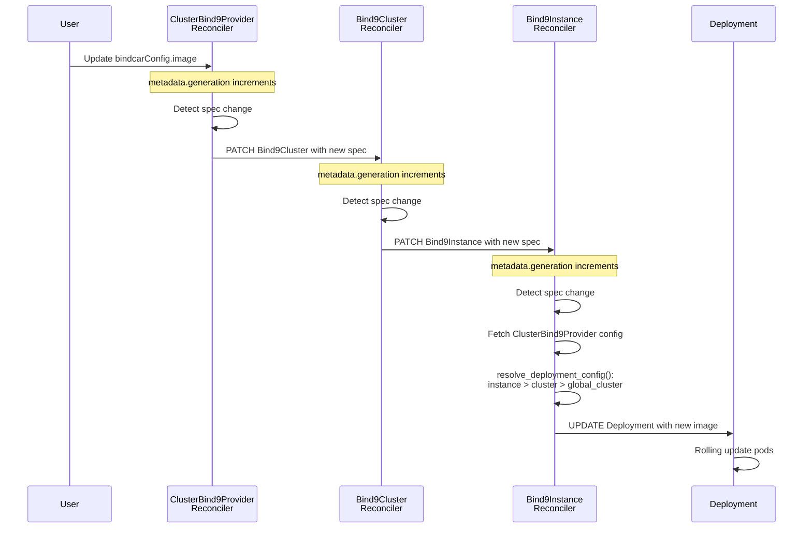

# ClusterBind9Provider

The `ClusterBind9Provider` CRD defines a cluster-scoped logical grouping of BIND9 DNS server instances for platform-managed infrastructure.

## Overview

`ClusterBind9Provider` is a **cluster-scoped** resource (no namespace) designed for platform teams to provide shared DNS infrastructure accessible from all namespaces in the cluster.

### Key Characteristics

- **Cluster-Scoped**: No namespace - visible cluster-wide
- **Platform-Managed**: Typically managed by platform/infrastructure teams
- **Shared Infrastructure**: DNSZones in any namespace can reference it
- **High Availability**: Designed for production workloads
- **RBAC**: Requires ClusterRole + ClusterRoleBinding

## Relationship with Bind9Cluster

Bindy provides two cluster types:

| Feature | Bind9Cluster | ClusterBind9Provider |
|---------|--------------|-------------------|
| **Scope** | Namespace-scoped | Cluster-scoped |
| **Managed By** | Development teams | Platform teams |
| **Visibility** | Single namespace | All namespaces |
| **RBAC** | Role + RoleBinding | ClusterRole + ClusterRoleBinding |
| **Zone Reference** | `clusterRef` | `clusterProviderRef` |
| **Use Case** | Dev/test, team isolation | Production, shared infrastructure |

**Shared Configuration**: Both cluster types use the same `Bind9ClusterCommonSpec` for configuration, ensuring consistency.

## Spec Structure

The `ClusterBind9ProviderSpec` uses the same configuration fields as `Bind9Cluster` through a shared spec:

```yaml
apiVersion: bindy.firestoned.io/v1beta1
kind: ClusterBind9Provider
metadata:
  name: production-dns
  # No namespace - cluster-scoped
spec:
  # BIND9 version
  version: "9.18"

  # Primary instance configuration
  primary:
    replicas: 3
    service:
      type: LoadBalancer
      annotations:
        service.beta.kubernetes.io/aws-load-balancer-type: "nlb"

  # Secondary instance configuration
  secondary:
    replicas: 2

  # Global BIND9 configuration
  global:
    options:
      - "recursion no"
      - "allow-transfer { none; }"
      - "notify yes"

  # Access control lists
  acls:
    trusted:
      - "10.0.0.0/8"
      - "172.16.0.0/12"
    secondaries:
      - "10.10.1.0/24"

  # Volumes for persistent storage
  volumes:
    - name: zone-data
      persistentVolumeClaim:
        claimName: dns-zone-storage

  volumeMounts:
    - name: zone-data
      mountPath: /var/cache/bind
```

For detailed field descriptions, see the [Bind9Cluster Spec Reference](bind9cluster.md) - all fields are identical.

## Status

The status subresource tracks the overall health of the cluster provider:

```yaml
status:
  # Cluster-level conditions
  conditions:
    - type: Ready
      status: "True"
      reason: AllReady
      message: "All 5 instances are ready"
      lastTransitionTime: "2025-01-10T12:00:00Z"

  # Instance tracking (namespace/name format for cluster providers)
  instances:
    - "production/primary-dns-0"
    - "production/primary-dns-1"
    - "production/primary-dns-2"
    - "staging/secondary-dns-0"
    - "staging/secondary-dns-1"

  # Generation tracking
  observedGeneration: 3

  # Instance counts
  instanceCount: 5
  readyInstances: 5
```

**Key Difference from Bind9Cluster**: Instance names include namespace prefix (`namespace/name`) since instances can be in any namespace.

## Usage Patterns

### Pattern 1: Platform-Managed Production DNS

**Scenario**: Platform team provides shared DNS for all production workloads.

```yaml
# Platform team creates cluster provider (ClusterRole required)
apiVersion: bindy.firestoned.io/v1beta1
kind: ClusterBind9Provider
metadata:
  name: shared-production-dns
spec:
  version: "9.18"
  primary:
    replicas: 3
    service:
      type: LoadBalancer
  secondary:
    replicas: 3
  global:
    options:
      - "recursion no"
      - "allow-transfer { none; }"
---
# Application team references cluster provider (Role in their namespace)
apiVersion: bindy.firestoned.io/v1beta1
kind: DNSZone
metadata:
  name: api-zone
  namespace: api-service  # Application namespace
spec:
  zoneName: api.example.com
  clusterProviderRef: shared-production-dns  # References cluster-scoped cluster
  soaRecord:
    primaryNs: ns1.example.com.
    adminEmail: dns-admin.example.com.
    serial: 2025010101
    refresh: 3600
    retry: 600
    expire: 604800
    negativeTtl: 86400
---
# Different application, same cluster provider
apiVersion: bindy.firestoned.io/v1beta1
kind: DNSZone
metadata:
  name: web-zone
  namespace: web-frontend  # Different namespace
spec:
  zoneName: www.example.com
  clusterProviderRef: shared-production-dns  # Same cluster provider
  soaRecord:
    primaryNs: ns1.example.com.
    adminEmail: dns-admin.example.com.
    serial: 2025010101
    refresh: 3600
    retry: 600
    expire: 604800
    negativeTtl: 86400
```

### Pattern 2: Multi-Region Cluster Providers

**Scenario**: Geo-distributed DNS with regional cluster providers.

```yaml
# US East region
apiVersion: bindy.firestoned.io/v1beta1
kind: ClusterBind9Provider
metadata:
  name: dns-us-east
  labels:
    region: us-east-1
    tier: production
spec:
  version: "9.18"
  primary:
    replicas: 3
    service:
      type: LoadBalancer
      annotations:
        service.beta.kubernetes.io/aws-load-balancer-type: "nlb"
  secondary:
    replicas: 2
  acls:
    region-networks:
      - "10.0.0.0/8"
---
# EU West region
apiVersion: bindy.firestoned.io/v1beta1
kind: ClusterBind9Provider
metadata:
  name: dns-eu-west
  labels:
    region: eu-west-1
    tier: production
spec:
  version: "9.18"
  primary:
    replicas: 3
    service:
      type: LoadBalancer
  secondary:
    replicas: 2
  acls:
    region-networks:
      - "10.128.0.0/9"
---
# Application chooses regional cluster
apiVersion: bindy.firestoned.io/v1beta1
kind: DNSZone
metadata:
  name: api-zone-us
  namespace: api-service
spec:
  zoneName: api.us.example.com
  clusterProviderRef: dns-us-east  # US region
  soaRecord: { /* ... */ }
---
apiVersion: bindy.firestoned.io/v1beta1
kind: DNSZone
metadata:
  name: api-zone-eu
  namespace: api-service
spec:
  zoneName: api.eu.example.com
  clusterProviderRef: dns-eu-west  # EU region
  soaRecord: { /* ... */ }
```

### Pattern 3: Tiered DNS Service

**Scenario**: Platform offers different DNS service tiers.

```yaml
# Premium tier - high availability
apiVersion: bindy.firestoned.io/v1beta1
kind: ClusterBind9Provider
metadata:
  name: dns-premium
  labels:
    tier: premium
    sla: "99.99"
spec:
  version: "9.18"
  primary:
    replicas: 5
    service:
      type: LoadBalancer
  secondary:
    replicas: 5
  global:
    options:
      - "minimal-responses yes"
      - "recursive-clients 10000"
---
# Standard tier - balanced cost/availability
apiVersion: bindy.firestoned.io/v1beta1
kind: ClusterBind9Provider
metadata:
  name: dns-standard
  labels:
    tier: standard
    sla: "99.9"
spec:
  version: "9.18"
  primary:
    replicas: 3
  secondary:
    replicas: 2
---
# Economy tier - minimal resources
apiVersion: bindy.firestoned.io/v1beta1
kind: ClusterBind9Provider
metadata:
  name: dns-economy
  labels:
    tier: economy
    sla: "99.0"
spec:
  version: "9.18"
  primary:
    replicas: 2
  secondary:
    replicas: 1
```

## RBAC Requirements

### Platform Team (ClusterRole)

Platform teams need ClusterRole to manage cluster providers:

```yaml
apiVersion: rbac.authorization.k8s.io/v1
kind: ClusterRole
metadata:
  name: platform-dns-admin
rules:
# Manage cluster providers
- apiGroups: ["bindy.firestoned.io"]
  resources: ["bind9globalclusters"]
  verbs: ["get", "list", "watch", "create", "update", "patch", "delete"]

# View cluster provider status
- apiGroups: ["bindy.firestoned.io"]
  resources: ["bind9globalclusters/status"]
  verbs: ["get", "list", "watch"]

# Manage instances across namespaces (for cluster providers)
- apiGroups: ["bindy.firestoned.io"]
  resources: ["bind9instances"]
  verbs: ["get", "list", "watch", "create", "update", "patch", "delete"]
---
apiVersion: rbac.authorization.k8s.io/v1
kind: ClusterRoleBinding
metadata:
  name: platform-team-dns
subjects:
- kind: Group
  name: platform-team
  apiGroup: rbac.authorization.k8s.io
roleRef:
  kind: ClusterRole
  name: platform-dns-admin
  apiGroup: rbac.authorization.k8s.io
```

### Application Teams (Role)

Application teams only need namespace-scoped permissions:

```yaml
apiVersion: rbac.authorization.k8s.io/v1
kind: Role
metadata:
  name: dns-zone-admin
  namespace: api-service
rules:
# Manage DNS zones and records in this namespace
- apiGroups: ["bindy.firestoned.io"]
  resources:
    - "dnszones"
    - "arecords"
    - "mxrecords"
    - "txtrecords"
  verbs: ["get", "list", "watch", "create", "update", "patch", "delete"]

# View resource status
- apiGroups: ["bindy.firestoned.io"]
  resources:
    - "dnszones/status"
    - "arecords/status"
  verbs: ["get", "list", "watch"]

# Note: No permissions for ClusterBind9Provider needed
# Application teams only manage DNSZones, not the cluster itself
---
apiVersion: rbac.authorization.k8s.io/v1
kind: RoleBinding
metadata:
  name: api-team-dns
  namespace: api-service
subjects:
- kind: Group
  name: api-team
  apiGroup: rbac.authorization.k8s.io
roleRef:
  kind: Role
  name: dns-zone-admin
  apiGroup: rbac.authorization.k8s.io
```

## Instance Management

### Creating Instances for Cluster Providers

Instances can be created in any namespace and reference the cluster provider:

```yaml
# Instance in production namespace
apiVersion: bindy.firestoned.io/v1beta1
kind: Bind9Instance
metadata:
  name: primary-dns-0
  namespace: production
spec:
  cluster_ref: shared-production-dns  # References cluster provider
  role: primary
  replicas: 1
---
# Instance in staging namespace
apiVersion: bindy.firestoned.io/v1beta1
kind: Bind9Instance
metadata:
  name: secondary-dns-0
  namespace: staging
spec:
  cluster_ref: shared-production-dns  # Same cluster provider
  role: secondary
  replicas: 1
```

**Status Tracking**: The cluster provider status includes instances from all namespaces:

```yaml
status:
  instances:
    - "production/primary-dns-0"  # namespace/name format
    - "staging/secondary-dns-0"
  instanceCount: 2
  readyInstances: 2
```

## Configuration Inheritance

### How Configuration Flows to Deployments

When you update a `ClusterBind9Provider`, the configuration automatically propagates down to all managed `Deployment` resources. This ensures consistency across your entire DNS infrastructure.

#### Configuration Precedence

Configuration is resolved with the following precedence (highest to lowest):

1. **Bind9Instance** - Instance-specific overrides
2. **Bind9Cluster** - Namespace-scoped cluster defaults
3. **ClusterBind9Provider** - Cluster-scoped global defaults
4. **System defaults** - Built-in fallback values

**Example:**

```yaml
# ClusterBind9Provider defines global defaults
apiVersion: bindy.firestoned.io/v1beta1
kind: ClusterBind9Provider
metadata:
  name: production-dns
spec:
  version: "9.18"  # Global default version
  image:
    image: "internetsystemsconsortium/bind9:9.18"  # Global default image
  global:
    bindcarConfig:
      image: "ghcr.io/company/bindcar:v1.2.0"  # Global bindcar image

---
# Bind9Instance can override specific fields
apiVersion: bindy.firestoned.io/v1beta1
kind: Bind9Instance
metadata:
  name: primary-0
  namespace: production
spec:
  clusterRef: production-dns
  role: Primary
  # version: "9.20"  # Would override global version if specified
  # Uses global version "9.18" and global bindcar image
```

#### Propagation Flow

When you update `ClusterBind9Provider.spec.common.global.bindcarConfig.image`, the change propagates automatically:



#### Inherited Configuration Fields

The following fields are inherited from `ClusterBind9Provider` to `Deployment`:

| Field | Example | Description |
|-------|---------|-------------|
| **image** | `spec.common.image` | Container image configuration |
| **version** | `spec.common.version` | BIND9 version tag |
| **volumes** | `spec.common.volumes` | Pod volumes (PVCs, ConfigMaps, etc.) |
| **volumeMounts** | `spec.common.volumeMounts` | Container volume mounts |
| **bindcarConfig** | `spec.common.global.bindcarConfig` | API sidecar configuration |
| **configMapRefs** | `spec.common.configMapRefs` | Custom ConfigMap references |

**Complete Example:**

```yaml
apiVersion: bindy.firestoned.io/v1beta1
kind: ClusterBind9Provider
metadata:
  name: production-dns
spec:
  version: "9.18"

  # Image configuration - inherited by all instances
  image:
    image: "ghcr.io/mycompany/bind9:9.18-custom"
    imagePullPolicy: Always
    imagePullSecrets:
      - name: ghcr-credentials

  # API sidecar configuration - inherited by all instances
  global:
    bindcarConfig:
      image: "ghcr.io/mycompany/bindcar:v1.2.0"
      port: 8080

  # Volumes - inherited by all instances
  volumes:
    - name: zone-data
      persistentVolumeClaim:
        claimName: dns-zones-pvc
    - name: custom-config
      configMap:
        name: bind9-custom-config

  volumeMounts:
    - name: zone-data
      mountPath: /var/cache/bind
    - name: custom-config
      mountPath: /etc/bind/custom
```

All instances referencing this cluster provider will inherit these configurations in their `Deployment` resources.

#### Verifying Configuration Propagation

To verify configuration is inherited correctly:

```bash
# 1. Check ClusterBind9Provider spec
kubectl get bind9globalcluster production-dns -o yaml | grep -A 5 bindcarConfig

# 2. Check Bind9Instance spec (should be empty if using global config)
kubectl get bind9instance primary-0 -n production -o yaml | grep -A 5 bindcarConfig

# 3. Check Deployment - should show cluster provider's bindcar image
kubectl get deployment primary-0 -n production -o yaml | grep "image:" | grep bindcar
```

**Expected Output:**
```yaml
# Deployment should use cluster provider's bindcar image
containers:
  - name: bindcar
    image: ghcr.io/mycompany/bindcar:v1.2.0  # From ClusterBind9Provider
```

## Reconciliation

### Controller Behavior

The `ClusterBind9Provider` reconciler:

1. **Lists instances across ALL namespaces**
   ```rust
   let instances_api: Api<Bind9Instance> = Api::all(client.clone());
   let all_instances = instances_api.list(&lp).await?;
   ```

2. **Filters instances by `cluster_ref` matching the cluster provider name**
   ```rust
   let instances: Vec<_> = all_instances
       .items
       .into_iter()
       .filter(|inst| inst.spec.cluster_ref == global_cluster_name)
       .collect();
   ```

3. **Calculates cluster status**
   - Counts total and ready instances
   - Aggregates health conditions
   - Formats instance names as `namespace/name`

4. **Updates status**
   - Sets `observedGeneration`
   - Updates `Ready` condition
   - Lists all instances with namespace prefix

### Generation Tracking

The reconciler uses standard Kubernetes generation tracking:

```yaml
metadata:
  generation: 5  # Incremented on spec changes

status:
  observedGeneration: 5  # Updated after reconciliation
```

**Reconciliation occurs only when `metadata.generation != status.observedGeneration`** (spec changed).

## Comparison with Bind9Cluster

### Similarities

- ✓ Identical configuration fields (`Bind9ClusterCommonSpec`)
- ✓ Same reconciliation logic for health tracking
- ✓ Status subresource with conditions
- ✓ Generation-based reconciliation
- ✓ Finalizer-based cleanup

### Differences

| Aspect | Bind9Cluster | ClusterBind9Provider |
|--------|--------------|-------------------|
| **Scope** | Namespace-scoped | Cluster-scoped (no namespace) |
| **API Used** | `Api::namespaced()` | `Api::all()` |
| **Instance Listing** | Same namespace only | All namespaces |
| **Instance Names** | `name` | `namespace/name` |
| **RBAC** | Role + RoleBinding | ClusterRole + ClusterRoleBinding |
| **Zone Reference Field** | `spec.clusterRef` | `spec.clusterProviderRef` |
| **Kubectl Get** | `kubectl get bind9cluster -n <namespace>` | `kubectl get bind9globalcluster` |

## Best Practices

### 1. Use for Production Workloads

Global clusters are ideal for production:

```yaml
apiVersion: bindy.firestoned.io/v1beta1
kind: ClusterBind9Provider
metadata:
  name: production-dns
  labels:
    environment: production
    managed-by: platform-team
spec:
  version: "9.18"
  primary:
    replicas: 3  # High availability
    service:
      type: LoadBalancer
  secondary:
    replicas: 3
```

### 2. Separate Cluster Providers by Environment

```yaml
# Production cluster
apiVersion: bindy.firestoned.io/v1beta1
kind: ClusterBind9Provider
metadata:
  name: dns-production
  labels:
    environment: production
spec: { /* production config */ }
---
# Staging cluster (also global, but separate)
apiVersion: bindy.firestoned.io/v1beta1
kind: ClusterBind9Provider
metadata:
  name: dns-staging
  labels:
    environment: staging
spec: { /* staging config */ }
```

### 3. Label for Organization

Use labels to categorize cluster providers:

```yaml
metadata:
  name: dns-us-east-prod
  labels:
    region: us-east-1
    environment: production
    tier: premium
    team: platform
    cost-center: infrastructure
```

### 4. Monitor Status Across Namespaces

```bash
# View cluster provider status
kubectl get bind9globalcluster dns-production

# See instances across all namespaces
kubectl get bind9globalcluster dns-production -o jsonpath='{.status.instances}'

# Check instance distribution
kubectl get bind9instance -A -l cluster=dns-production
```

### 5. Use with DNSZone Namespace Isolation

Remember: DNSZones are always namespace-scoped, even when referencing cluster providers:

```yaml
# DNSZone in namespace-a
apiVersion: bindy.firestoned.io/v1beta1
kind: DNSZone
metadata:
  name: zone-a
  namespace: namespace-a
spec:
  zoneName: app-a.example.com
  clusterProviderRef: shared-dns
  # Records in namespace-a can ONLY reference this zone
---
# DNSZone in namespace-b
apiVersion: bindy.firestoned.io/v1beta1
kind: DNSZone
metadata:
  name: zone-b
  namespace: namespace-b
spec:
  zoneName: app-b.example.com
  clusterProviderRef: shared-dns
  # Records in namespace-b can ONLY reference this zone
```

## Troubleshooting

### Viewing Cluster Providers

```bash
# List all cluster providers
kubectl get bind9globalclusters

# Describe a specific cluster provider
kubectl describe bind9globalcluster production-dns

# View status
kubectl get bind9globalcluster production-dns -o yaml
```

### Common Issues

**Issue**: Application team cannot create cluster provider

**Solution**: Check RBAC - requires ClusterRole, not Role
```bash
kubectl auth can-i create bind9globalclusters --as=user@example.com
```

**Issue**: Instances not showing in status

**Solution**: Verify instance `cluster_ref` matches cluster provider name
```bash
kubectl get bind9instance -A -o jsonpath='{range .items[*]}{.metadata.namespace}/{.metadata.name}: {.spec.cluster_ref}{"\n"}{end}'
```

**Issue**: DNSZone cannot find cluster provider

**Solution**: Check `clusterProviderRef` field (not `clusterRef`)
```yaml
spec:
  clusterProviderRef: production-dns  # ✓ Correct
  # clusterRef: production-dns      # ✗ Wrong - for namespace-scoped
```

## Next Steps

- [Multi-Tenancy Guide](../guide/multi-tenancy.md) - RBAC setup and examples
- [Choosing a Cluster Type](../guide/choosing-cluster-type.md) - Decision guide
- [Bind9Cluster Reference](bind9cluster.md) - Namespace-scoped alternative
- [Architecture Overview](../guide/architecture.md) - Dual-cluster model
