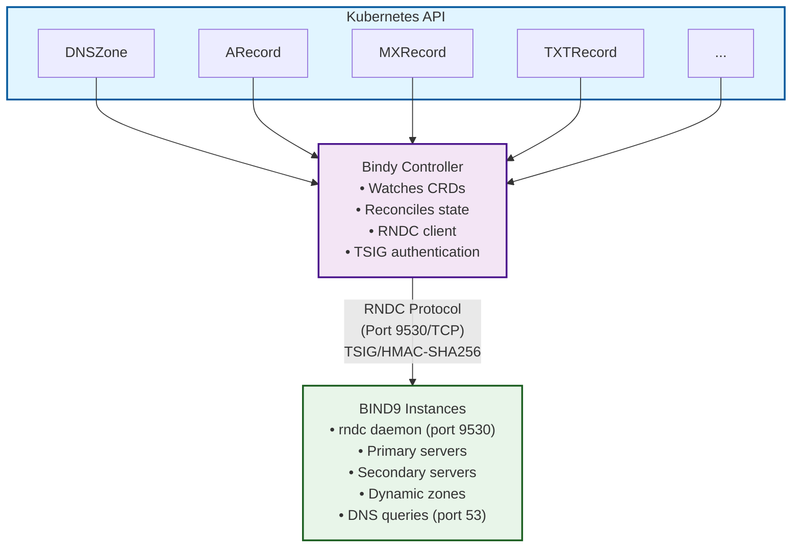
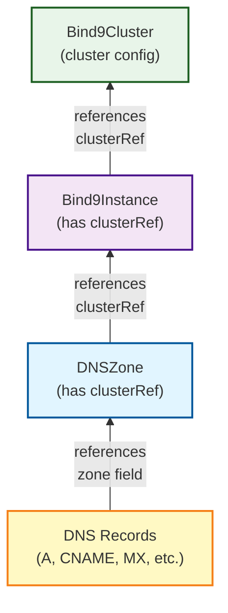
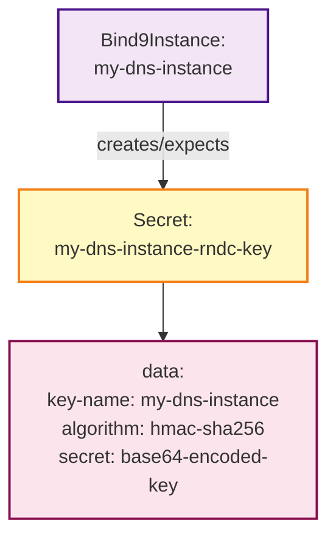

# Basic Concepts

This section introduces the core concepts behind Bindy and how it manages DNS infrastructure in Kubernetes.

## The Kubernetes Way

Bindy follows Kubernetes patterns and idioms:

- **Declarative Configuration** - You declare what DNS records should exist, Bindy makes it happen
- **Custom Resources** - DNS zones and records are Kubernetes resources
- **Controllers** - Bindy watches resources and reconciles state
- **Labels and Selectors** - Target specific BIND9 instances using labels
- **Status Subresources** - Track the health and state of DNS resources

## Core Resources

Bindy introduces these Custom Resource Definitions (CRDs):

### Infrastructure Resources

- **Bind9Cluster** - Cluster-level configuration (version, shared config, TSIG keys, ACLs)
- **[Bind9Instance](./bind9instance.md)** - Individual BIND9 DNS server deployment (inherits from cluster)

### DNS Resources

- **[DNSZone](./dnszone.md)** - Defines a DNS zone with SOA record (references a cluster)
- **[DNS Records](./records.md)** - Individual DNS record types:
  - ARecord (IPv4)
  - AAAARecord (IPv6)
  - CNAMERecord (Canonical Name)
  - MXRecord (Mail Exchange)
  - TXTRecord (Text)
  - NSRecord (Name Server)
  - SRVRecord (Service)
  - CAARecord (Certificate Authority Authorization)

## How It Works



### Reconciliation Loop

1. **Watch** - Controller watches for changes to DNS resources
2. **Discover** - Finds BIND9 instance pods via Kubernetes API
3. **Authenticate** - Loads RNDC key from Kubernetes Secret
4. **Execute** - Sends RNDC commands to BIND9 (addzone, reload, etc.)
5. **Verify** - BIND9 executes command and returns success/error
6. **Status** - Reports success or failure via status conditions

## RNDC Protocol

Bindy uses the native BIND9 Remote Name Daemon Control (RNDC) protocol for managing DNS zones and servers. This provides:

- **Direct Control** - Native BIND9 management without intermediate files
- **Real-time Operations** - Immediate feedback on success or failure
- **Atomic Commands** - Operations succeed or fail atomically
- **Secure Communication** - TSIG authentication with HMAC-SHA256

### RNDC Commands

Common RNDC operations used by Bindy:

- `addzone <zone>` - Dynamically add a new zone
- `delzone <zone>` - Remove a zone
- `reload <zone>` - Reload zone data
- `notify <zone>` - Trigger zone transfer to secondaries
- `zonestatus <zone>` - Query zone status
- `retransfer <zone>` - Force zone transfer from primary

### TSIG Authentication

All RNDC communication is secured using TSIG (Transaction Signature):

- **Authentication** - Verifies command source is authorized
- **Integrity** - Prevents command tampering
- **Replay Protection** - Timestamp validation prevents replay attacks
- **Key Storage** - RNDC keys stored in Kubernetes Secrets
- **Per-Instance Keys** - Each BIND9 instance has unique HMAC-SHA256 key

## Cluster References

Instead of label selectors, zones now reference a specific BIND9 cluster:

```yaml
# DNS Zone references a cluster
spec:
  zoneName: example.com
  clusterRef: my-dns-cluster  # References Bind9Instance name
```

This simplifies:
- **Zone placement** - Direct reference to cluster
- **Pod discovery** - Find instances by cluster name
- **RNDC key lookup** - Keys named `{clusterRef}-rndc-key`

## Resource Relationships



### Three-Tier Hierarchy

1. **Bind9Cluster** - Cluster-level configuration
   - Shared BIND9 version
   - Common config (recursion, DNSSEC, forwarders)
   - TSIG keys for zone transfers
   - ACL definitions

2. **Bind9Instance** - Instance deployment
   - References a Bind9Cluster via `clusterRef`
   - Can override cluster config
   - Has RNDC key for management
   - Manages pods and services

3. **DNSZone** - DNS zone definition
   - References a Bind9Instance via `clusterRef`
   - Contains SOA record
   - Applied to instance via RNDC

4. **DNS Records** - Individual records
   - Reference a DNSZone by name
   - Added to zone via RNDC (planned: nsupdate)

### RNDC Key Secret Relationship



The controller uses this Secret to authenticate RNDC commands to the BIND9 instance.

## Status and Conditions

All resources report their status:

```yaml
status:
  conditions:
    - type: Ready
      status: "True"
      reason: Synchronized
      message: Zone created for 2 instances
      lastTransitionTime: 2024-01-01T00:00:00Z
  observedGeneration: 1
  matchedInstances: 2
```

Status conditions follow Kubernetes conventions:
- **Type** - What aspect (Ready, Synced, etc.)
- **Status** - True, False, or Unknown
- **Reason** - Machine-readable reason code
- **Message** - Human-readable description

## Next Steps

- [RNDC-Based Architecture](./architecture-rndc.md) - Learn about the RNDC protocol architecture
- [Architecture Overview](./architecture.md) - Deep dive into Bindy's architecture
- [Custom Resource Definitions](./crds.md) - Detailed CRD specifications
- [Bind9Instance](./bind9instance.md) - Learn about BIND9 instance resources
- [DNSZone](./dnszone.md) - Learn about DNS zone resources
- [DNS Records](./records.md) - Learn about DNS record types
