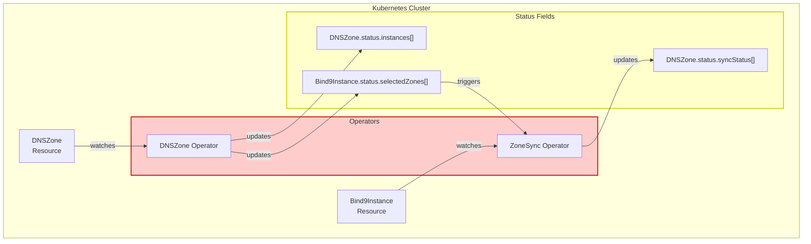
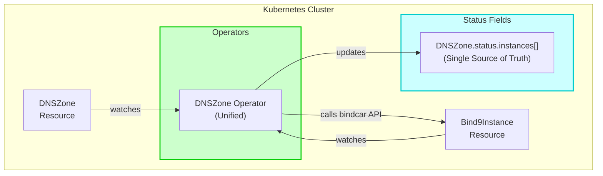
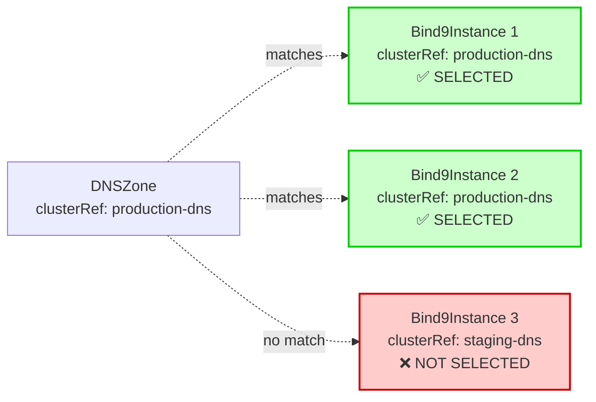
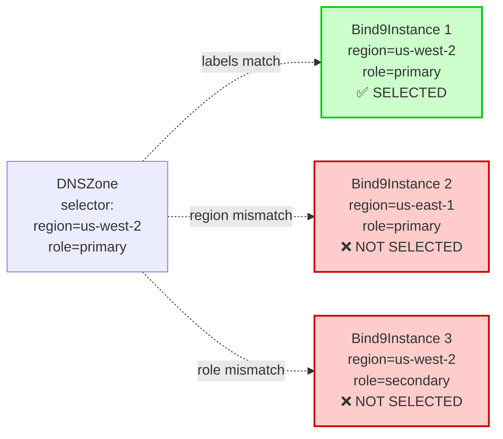
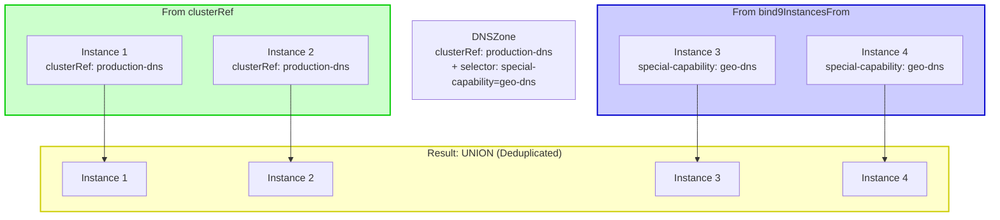
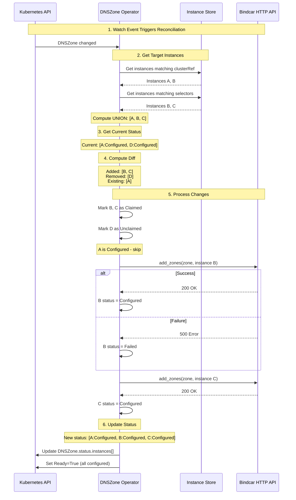
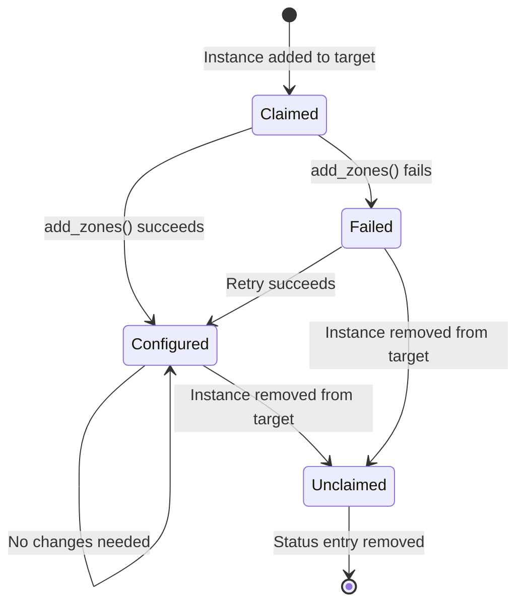

# DNSZone Operator Architecture

This page documents the unified DNSZone operator architecture following the Phase 1-8 consolidation (January 2026).

## Overview

The DNSZone operator is responsible for:
1. Discovering Bind9Instances via `clusterRef` and/or `bind9InstancesFrom` label selectors
2. Synchronizing zone configuration to selected instances
3. Tracking per-instance synchronization status
4. Maintaining the Ready condition based on instance health

## Architecture Evolution

### Before: Dual Operator Architecture (Deprecated)



**Problems:**
- Two operators managing the same resource (DNSZone)
- Circular dependencies: DNSZone → Bind9Instance.status.selectedZones → ZoneSync → DNSZone
- Multiple status fields tracking the same information
- Complex event-driven architecture with multiple reconciliation paths
- ~915 lines of duplicate code

### After: Unified Operator Architecture (Current)



**Benefits:**
- Single operator with clear responsibility
- No circular dependencies
- One status field: `status.instances[]`
- Simplified reconciliation logic
- ~915 lines of code removed

## Instance Selection

DNSZones select Bind9Instances using three methods:

### Method 1: clusterRef (Simple Cluster Reference)

```yaml
apiVersion: bindy.firestoned.io/v1beta1
kind: DNSZone
spec:
  zoneName: example.com
  clusterRef: production-dns  # Selects ALL instances with this clusterRef
```



### Method 2: bind9InstancesFrom (Label Selectors)

```yaml
apiVersion: bindy.firestoned.io/v1beta1
kind: DNSZone
spec:
  zoneName: example.com
  bind9InstancesFrom:
    - selector:
        matchLabels:
          bindy.firestoned.io/region: us-west-2
          bindy.firestoned.io/role: primary
```



### Method 3: Union (Both Together)

```yaml
apiVersion: bindy.firestoned.io/v1beta1
kind: DNSZone
spec:
  zoneName: example.com
  clusterRef: production-dns        # Instances from cluster
  bind9InstancesFrom:               # PLUS instances from selectors
    - selector:
        matchLabels:
          special-capability: geo-dns
```



## Reconciliation Flow



## Status Lifecycle

Each instance in `status.instances[]` goes through this lifecycle:



### Status Enum Values

- **Claimed**: Instance discovered, zone sync pending
- **Configured**: Zone successfully synchronized to instance
- **Failed**: Zone synchronization failed (error in `message` field)
- **Unclaimed**: Instance no longer selected (will be removed)

## Status Schema

```yaml
apiVersion: bindy.firestoned.io/v1beta1
kind: DNSZone
status:
  instances:
    - apiVersion: bindy.firestoned.io/v1beta1
      kind: Bind9Instance
      name: primary-dns-0
      namespace: dns-system
      status: Configured         # Claimed | Configured | Failed | Unclaimed
      lastReconciledAt: "2026-01-06T10:00:00Z"
      message: null              # Error message for Failed status

    - apiVersion: bindy.firestoned.io/v1beta1
      kind: Bind9Instance
      name: secondary-dns-0
      namespace: dns-system
      status: Failed
      lastReconciledAt: "2026-01-06T10:00:05Z"
      message: "HTTP 500: bindcar API unavailable"
  
  conditions:
    - type: Ready
      status: "False"  # True only when ALL instances are Configured
      reason: PartialFailure
      message: "1/2 instances configured"
      lastTransitionTime: "2026-01-06T10:00:05Z"
```

## Breaking Changes from Previous Architecture

### Removed Fields

**DNSZone Status:**
- ❌ `status.syncStatus[]` - Replaced by `status.instances[]`
- ❌ `status.syncedInstancesCount` - Computed from `status.instances[]`
- ❌ `status.totalInstancesCount` - Computed from `status.instances[]`

**Bind9Instance Status:**
- ❌ `status.selectedZones[]` - No longer tracks reverse references
- ❌ `status.selectedZoneCount` - No longer needed

### Migration Path

1. **Before upgrade**: Export all DNSZone resources
   ```bash
   kubectl get dnszones -A -o yaml > dnszones-backup.yaml
   ```

2. **Upgrade**: Apply new CRDs
   ```bash
   kubectl replace --force -f deploy/crds/
   ```

3. **After upgrade**: DNSZone operator repopulates `status.instances[]` automatically

4. **Cleanup**: Old status fields are ignored and garbage collected

## See Also

- [DNSZone Operator Consolidation Roadmap](../../roadmaps/dnszone-consolidation-roadmap.md)
- [Integration Test Plan](../../roadmaps/integration-test-plan.md)
- [API Reference](../reference/api.md)
