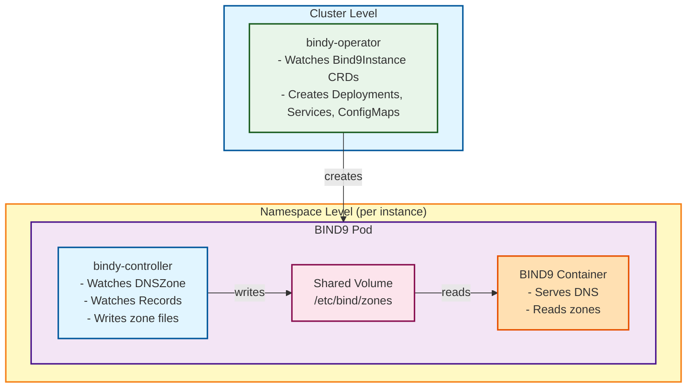

# Bindy Architecture

Bindy uses a two-level operator architecture to manage BIND9 DNS servers in Kubernetes.

## Components

### 1. bindy-operator (Cluster-level)

The **bindy-operator** is a cluster-scoped operator that watches `Bind9Instance` CRDs and manages the lifecycle of BIND9 DNS server deployments.

**Responsibilities:**
- Watches `Bind9Instance` resources across all namespaces
- Creates and manages Kubernetes resources for each BIND9 instance:
  - ConfigMap with BIND9 configuration files
  - Deployment with BIND9 container and bindy-controller sidecar
  - Service for DNS traffic (TCP/UDP port 53)
- Updates instance status based on deployment health

**Deployment:**
- Single replica deployment in `dns-system` namespace
- Uses `bindy-operator` ServiceAccount with cluster-level permissions
- Manages Deployments, Services, and ConfigMaps

### 2. bindy-controller (Namespace-scoped sidecar)

The **bindy-controller** runs as a sidecar container alongside each BIND9 pod. It watches DNS zone and record resources and updates zone files in a shared volume.

**Responsibilities:**
- Watches DNS resources in its namespace:
  - `DNSZone` - Zone definitions with SOA records
  - Record types: `ARecord`, `AAAARecord`, `CNAMERecord`, `MXRecord`, `TXTRecord`, `NSRecord`, `SRVRecord`, `CAARecord`
- Generates and updates BIND9 zone files
- Writes zone files to shared volume mount (`/etc/bind/zones`)
- Updates resource status conditions

**Deployment:**
- Runs as a sidecar container in each BIND9 pod
- Uses `bindy-controller` ServiceAccount with namespace-scoped permissions
- Shares `/etc/bind/zones` volume with BIND9 container

## Data Flow



## Zone Management via RNDC

Bindy manages DNS zones dynamically using BIND9's RNDC (Remote Name Daemon Control) protocol, rather than static zone file configuration.

### How It Works

1. **Startup Configuration**:
   - BIND9 starts with `named.conf` that includes `/etc/bind/zones/named.conf.zones` with the `optional` keyword
   - The `optional` keyword prevents BIND9 from failing if the file doesn't exist on first startup
   - No init containers or external dependencies required

2. **Dynamic Zone Addition**:
   - When a `DNSZone` resource is created, the controller uses RNDC to add the zone
   - BIND9 automatically creates/updates `named.conf.zones` in the writable `/etc/bind/zones/` directory
   - The file is managed entirely by BIND9 via RNDC commands
   - No restart required - zones are loaded dynamically

3. **File Locations**:
   - Zone files: `/etc/bind/zones/` (writable emptyDir volume)
   - Configuration files: `/etc/bind/named.conf`, `/etc/bind/named.conf.options` (read-only from ConfigMap)
   - Zone index: `/etc/bind/zones/named.conf.zones` (created and managed by BIND9)

### Benefits

- **No restarts**: Zones added/updated without restarting BIND9
- **Dynamic configuration**: Changes take effect immediately
- **Kubernetes-native**: Uses standard emptyDir volumes for writable data
- **No external dependencies**: Uses BIND9's `optional` include directive - no init containers or busybox needed
- **Airgap-friendly**: Works in airgapped environments without additional images

## Resource Hierarchy

```yaml
# 1. Operator creates BIND9 instance
apiVersion: bindy.firestoned.io/v1alpha1
kind: Bind9Instance
metadata:
  name: primary-dns
  namespace: dns-system
spec:
  replicas: 2
  version: "9.18"
  config:
    recursion: false
    allowQuery: ["any"]

# 2. Controller (sidecar) watches zones
apiVersion: bindy.firestoned.io/v1alpha1
kind: DNSZone
metadata:
  name: example-com
  namespace: dns-system
spec:
  zoneName: example.com
  instanceSelector:
    matchLabels:
      instance: primary-dns
  soaRecord:
    primaryNs: ns1.example.com.
    adminEmail: admin@example.com
    serial: 2024010101
    refresh: 3600
    retry: 600
    expire: 604800
    negativeTtl: 86400

# 3. Controller (sidecar) watches records
apiVersion: bindy.firestoned.io/v1alpha1
kind: ARecord
metadata:
  name: www-example-com
  namespace: dns-system
spec:
  zone: example-com
  name: www
  ipv4Address: "192.0.2.1"
  ttl: 300
```

## Deployment Architecture

### Operator Deployment

```yaml
apiVersion: apps/v1
kind: Deployment
metadata:
  name: bindy-operator
  namespace: dns-system
spec:
  replicas: 1
  template:
    spec:
      serviceAccountName: bindy-operator
      containers:
      - name: operator
        image: ghcr.io/firestoned/bindy-operator:latest
        env:
        - name: POD_NAMESPACE
          valueFrom:
            fieldRef:
              fieldPath: metadata.namespace
```

### BIND9 Instance Deployment (created by operator)

```yaml
apiVersion: apps/v1
kind: Deployment
metadata:
  name: primary-dns
  namespace: dns-system
spec:
  replicas: 2
  template:
    spec:
      serviceAccountName: bindy-controller
      containers:
      # BIND9 DNS server
      - name: bind9
        image: internetsystemsconsortium/bind9:9.18
        command: ["named"]
        args:
        - "-c"
        - "/etc/bind/named.conf"
        - "-g"  # Run in foreground (required for containers)
        volumeMounts:
        - name: zones
          mountPath: /etc/bind/zones
        - name: config
          mountPath: /etc/bind/named.conf
          subPath: named.conf
        ports:
        - containerPort: 53
          name: dns-tcp
          protocol: TCP
        - containerPort: 53
          name: dns-udp
          protocol: UDP

      # bindy-controller sidecar
      - name: bindy-controller
        image: ghcr.io/firestoned/bindy-controller:latest
        volumeMounts:
        - name: zones
          mountPath: /etc/bind/zones
        env:
        - name: BIND9_ZONES_DIR
          value: /etc/bind/zones
        - name: WATCH_NAMESPACE
          value: dns-system
        - name: BIND9_INSTANCE_NAME
          value: primary-dns

      volumes:
      - name: zones
        emptyDir: {}
      - name: config
        configMap:
          name: primary-dns-config
```

## RBAC

### Operator Permissions (Cluster-scoped)

- `Bind9Instance` - full CRUD + status updates
- `Deployment` - full CRUD
- `Service` - full CRUD
- `ConfigMap` - full CRUD
- `Event` - create, patch

### Controller Permissions (Cluster-scoped, but operates per-namespace)

- `DNSZone` - read, watch, status updates
- All record types - read, watch, status updates
- `Event` - create, patch

## Benefits of This Architecture

1. **Scalability**: Each BIND9 instance has its own controller, reducing contention
2. **Isolation**: Controllers only watch resources in their namespace
3. **Resilience**: If a controller fails, only one BIND9 instance is affected
4. **Performance**: Zone file updates happen locally in the pod without network calls
5. **Simplicity**: Clear separation of concerns between instance management and record management
