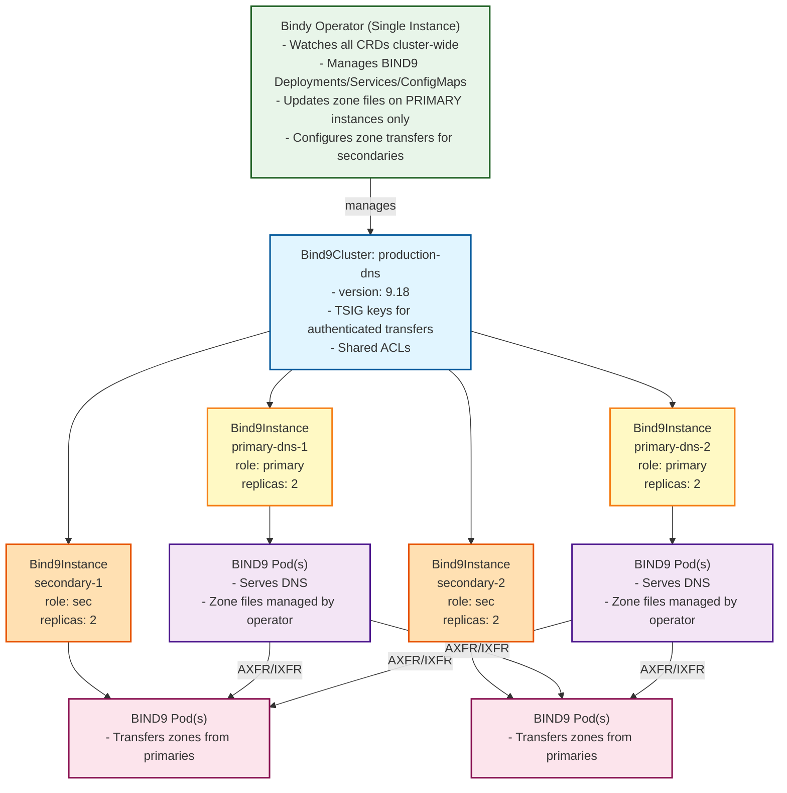

# Bindy Cluster Architecture

## Overview

Bindy uses a **centralized operator** pattern with native BIND9 zone transfer capabilities (AXFR/IXFR). This architecture eliminates the need for multiple controllers and leverages BIND's built-in primary-secondary replication.

## CRD Hierarchy

```
Bind9Cluster (logical DNS cluster)
    ├── Shared BIND9 version
    ├── Shared configuration (recursion, DNSSEC, etc.)
    ├── TSIG keys for authenticated transfers
    └── ACL definitions

Bind9Instance (physical DNS server)
    ├── References parent Bind9Cluster
    ├── Declares role (primary or secondary)
    ├── Replica count
    ├── Instance-specific config overrides
    └── (secondaries) Primary servers to transfer from

DNSZone (DNS zone definition)
    ├── References Bind9Cluster
    ├── Zone name
    ├── SOA record
    └── Default TTL

DNS Records (A, AAAA, CNAME, MX, TXT, NS, SRV, CAA)
    ├── References DNSZone
    ├── Record-specific data
    └── Optional TTL override
```

## Architecture

### Single Centralized Operator



## How It Works

### 1. Cluster Creation

User creates a `Bind9Cluster`:

```yaml
apiVersion: bindy.firestoned.io/v1beta1
kind: Bind9Cluster
metadata:
  name: production-dns
  namespace: dns-system
spec:
  version: "9.18"
  global:
    recursion: false
    dnssec:
      enabled: true
      validation: true
  rndcSecretRefs:
    - name: transfer-key
      algorithm: hmac-sha256
      secret: <base64-encoded-secret>
  acls:
    internal-networks:
      - "10.0.0.0/8"
      - "172.16.0.0/12"
```

### 2. Instance Creation

User creates `Bind9Instance` resources:

```yaml
# Primary instance
apiVersion: bindy.firestoned.io/v1beta1
kind: Bind9Instance
metadata:
  name: primary-dns
  namespace: dns-system
spec:
  clusterRef: production-dns
  role: primary
  replicas: 2
---
# Secondary instance
apiVersion: bindy.firestoned.io/v1beta1
kind: Bind9Instance
metadata:
  name: secondary-dns
  namespace: dns-system
spec:
  clusterRef: production-dns
  role: secondary
  replicas: 2
  primaryServers:
    - primary-dns.dns-system.svc.cluster.local
```

**Operator actions:**
- Creates Deployment with BIND9 pods
- Creates Service for DNS traffic
- Creates ConfigMap with BIND9 configuration
- For primary: Configures to allow zone transfers to secondaries
- For secondary: Configures zone transfer from primaries

### 3. Zone Creation

User creates a `DNSZone`:

```yaml
apiVersion: bindy.firestoned.io/v1beta1
kind: DNSZone
metadata:
  name: example-com
  namespace: dns-system
spec:
  zoneName: example.com
  clusterRef: production-dns
  soaRecord:
    primaryNs: ns1.example.com.
    adminEmail: admin@example.com
    serial: 2024010101
    refresh: 3600
    retry: 600
    expire: 604800
    negativeTtl: 86400
  ttl: 3600
```

**Operator actions:**
- Finds PRIMARY instances in the cluster
- Creates zone file on primary instance pods
- Updates named.conf to include the zone
- Reloads BIND9 configuration
- **BIND9 automatically transfers zone to secondaries via AXFR/IXFR**

### 4. Record Creation

User creates DNS records:

```yaml
apiVersion: bindy.firestoned.io/v1beta1
kind: ARecord
metadata:
  name: www-example-com
  namespace: dns-system
spec:
  zone: example-com
  name: www
  ipv4Address: "192.0.2.1"
  ttl: 300
```

**Operator actions:**
- Finds the zone's cluster
- Finds PRIMARY instances in that cluster
- Updates zone file on primary pods
- Increments SOA serial
- Reloads zone with `rndc reload example.com`
- **BIND9 automatically notifies secondaries and they transfer updated zone**

## Zone File Update Mechanisms

The operator can use several approaches to update zone files on primary instances:

### Option 1: Direct Pod Exec (Simple, works for testing)

```bash
kubectl exec <primary-pod> -- sh -c 'cat > /etc/bind/zones/db.example.com <<EOF
$TTL 3600
@   IN  SOA ns1.example.com. admin.example.com. (
        2024010102  ; serial
        3600        ; refresh
        600         ; retry
        604800      ; expire
        86400 )     ; minimum
    IN  NS  ns1.example.com.
www IN  A   192.0.2.1
EOF'

kubectl exec <primary-pod> -- rndc reload example.com
```

### Option 2: Shared Volume with Init Container (Production-ready)

- Use a PersistentVolumeClaim shared between operator and BIND9 pods
- Operator writes zone files to PVC
- BIND9 pods mount the same PVC
- Use `rndc reload` to notify BIND9 of changes

### Option 3: ConfigMap (For static/small zones)

- Store zone files in ConfigMaps
- Mount ConfigMaps into BIND9 pods
- Update ConfigMap to update zones
- Drawback: ConfigMap size limits (1MB)

### Recommended: Option 2 (Shared PVC)

```yaml
apiVersion: v1
kind: PersistentVolumeClaim
metadata:
  name: bind9-zones-production-dns
  namespace: dns-system
spec:
  accessModes:
    - ReadWriteMany  # Allows operator and multiple BIND9 pods to access
  resources:
    requests:
      storage: 10Gi
```

## Zone Transfer Flow

```
1. User creates/updates DNS record
        ↓
2. Operator updates zone file on PRIMARY pod
        ↓
3. Operator increments SOA serial
        ↓
4. Operator runs: rndc reload zone.com
        ↓
5. PRIMARY BIND9 reloads zone
        ↓
6. PRIMARY sends NOTIFY to secondaries
        ↓
7. Secondaries check SOA serial
        ↓
8. Secondaries initiate IXFR (incremental) or AXFR (full) transfer
        ↓
9. Zone is replicated to all secondaries
```

## Benefits

### 1. Leverage BIND9 Native Capabilities

- No custom replication logic needed
- BIND9 handles zone transfer protocol (AXFR/IXFR)
- BIND9 manages serial numbers and NOTIFY
- Built-in TSIG authentication for secure transfers

### 2. Simpler Operator

- Single operator instance
- Manages infrastructure (pods, services, config)
- Updates zones on primaries only
- BIND9 does the rest

### 3. Standard DNS Behavior

- Works with any DNS client
- Compatible with standard zone transfer tools
- Can integrate with external DNS servers

### 4. Scalability

- Operator only watches CRDs (low overhead)
- Zone transfers happen natively in BIND9
- Can scale to many zones and records

### 5. No "Many Watchers" Problem

- Single operator watching all resources
- No per-pod controllers
- Efficient resource usage

## Configuration Example

### Primary Instance Config

```conf
options {
    directory "/var/cache/bind";
    recursion no;
    allow-query { any; };
    allow-transfer {
        key transfer-key;
        10.0.0.0/8;
    };
    also-notify {
        10.0.1.10;  # secondary-dns service IP
    };
};

key "transfer-key" {
    algorithm hmac-sha256;
    secret "base64-encoded-secret";
};

zone "example.com" {
    type primary;
    file "/etc/bind/zones/db.example.com";
    allow-transfer { key transfer-key; };
};
```

### Secondary Instance Config

```conf
options {
    directory "/var/cache/bind";
    recursion no;
    allow-query { any; };
    allow-transfer { none; };
};

key "transfer-key" {
    algorithm hmac-sha256;
    secret "base64-encoded-secret";
};

zone "example.com" {
    type secondary;
    primaries { 10.0.1.5 key transfer-key; };  # primary-dns service IP
    file "/var/cache/bind/db.example.com";
};
```

## Implementation Priority

1. ✅ **CRD Definitions** - Bind9Cluster, updated Bind9Instance/DNSZone
2. **Centralized Operator** - Single binary watching all CRDs
3. **Instance Reconciliation** - Create/update BIND9 pods for clusters
4. **Zone File Management** - Implement shared PVC approach
5. **Zone Transfer Config** - Configure primary/secondary transfers
6. **Record Reconciliation** - Update zones when records change
7. **RNDC Integration** - Reload zones after updates
8. **Status Updates** - Track reconciliation state
9. **Integration Tests** - Test full workflow
10. **Documentation** - User guide and examples

## Next Steps

This architecture provides a clean, scalable, and BIND9-native approach to DNS management in Kubernetes. The operator handles infrastructure and zone file updates on primaries, while BIND9 itself handles all replication to secondaries using standard DNS protocols.
