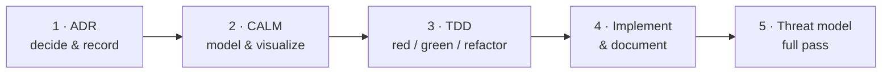

# Developer Guide

Welcome to the Bindy developer guide. Before anything else, understand the one
rule that governs how **all** development happens in this repository:

## ADD — Architecture Driven Development

Bindy follows **ADD (Architecture Driven Development)**: architecture is
designed, recorded, and visualized **before** code is written, and its security
posture is re-verified **after**. ADRs, CALM diagrams, and the threat model are
first-class deliverables — equal in importance to the code and the tests.

ADD layers *on top of* the TDD discipline; it does not replace it. The order is
fixed:



For any **architecturally significant** change, complete each step before
starting the next:

### 1. ADR — decide and record (FIRST)

Write or update an Architecture Decision Record in
[`docs/adr/`](https://github.com/firestoned/bindy/tree/main/docs/adr)
(`NNNN-title.md`, lowercase-hyphen, zero-padded sequential number). Metadata is
a bullet list under the title (`- **Status:**`, `- **Date:**`, …), followed by
**Context**, **Decision**, and **Consequences**. Status runs
Proposed → Accepted (→ Superseded). One decision per ADR; a reversal marks the
old ADR *Superseded* and links forward.

### 2. CALM — model and visualize

Update the [FINOS CALM architecture models](../architecture/calm.md) in
[`calm/`](https://github.com/firestoned/bindy/tree/main/calm) to reflect the
decision, then regenerate and validate:

```bash
make calm-validate    # schema-check the models (CI gate)
make calm-docs        # regenerate the Mermaid architecture pages
make calm-docs-check  # verify committed pages match the models
```

The architecture must be modeled and the diagrams must render cleanly
**before** implementation begins. A change that isn't reflected in CALM isn't
designed yet.

### 3. TDD — red / green / refactor

Only now write code — **tests first**, per the [Testing Guide](testing-guide.md):
failing test → minimum implementation → refactor. Every Rust change must pass
`cargo fmt`, `cargo clippy`, and `cargo test` before it is complete.

### 4. Implement and document

Update the changelog, the affected pages under `docs/src/`, and the examples.
CRD changes regenerate `deploy/operator/crds/` and the API reference. Work that
advanced a roadmap item updates **both** the detail doc in
`.github/community/` and the `ROADMAPS.md` status board, in the same commit.

### 5. Threat model — full pass (LAST)

Once the change is implemented, make a **full pass** over the
[threat model](../security/threat-model.md) — every section, not just the table
that obviously changed — and bump its header stamp. **An ADR is not implemented
until this pass is done.**

### When does ADD apply?

| Change | Process |
|--------|---------|
| New CRDs, controllers/reconcilers, binaries | Full ADD cycle |
| Contract changes (CRD schema, bindcar API, Scout fan-in, RNDC/TSIG) | Full ADD cycle |
| Deploy / GitOps topology, admission policies | Full ADD cycle |
| Security boundaries, RBAC posture, TLS transport, multi-cluster topology | Full ADD cycle |
| Typos, comment/doc tweaks, formatting | TDD only |
| Isolated bug fixes with no architectural impact | TDD only |
| Mechanical refactors preserving behavior and structure | TDD only |

> When unsure whether a change is "architectural," **write the ADR.** A short,
> slightly-redundant ADR costs little; an undocumented architectural decision
> costs the next person a re-derivation.

## Guide contents

- **[Development Setup](setup.md)** — toolchain, IDE, and environment
- **[Building](building.md)** — building the operator from source
- **[Testing Guide](testing-guide.md)** — TDD workflow and test standards
- **[Development Workflow](workflow.md)** — the daily cycle, CRD development
- **[Architecture as Code (CALM)](../architecture/calm.md)** — the models behind
  the diagrams
- **[Contributing](contributing.md)** — how to get changes in
- **[Code Style](code-style.md)** and **[PR Process](pr-process.md)**
