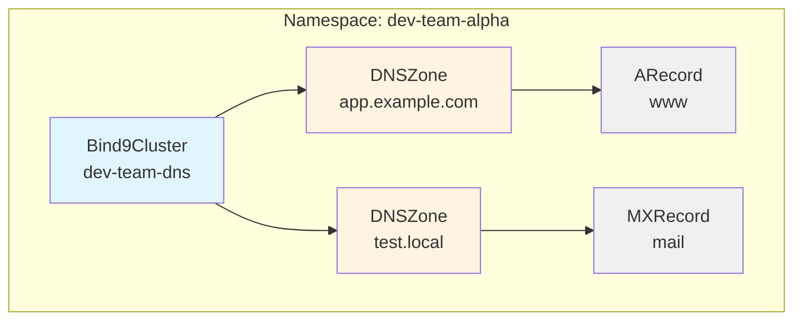
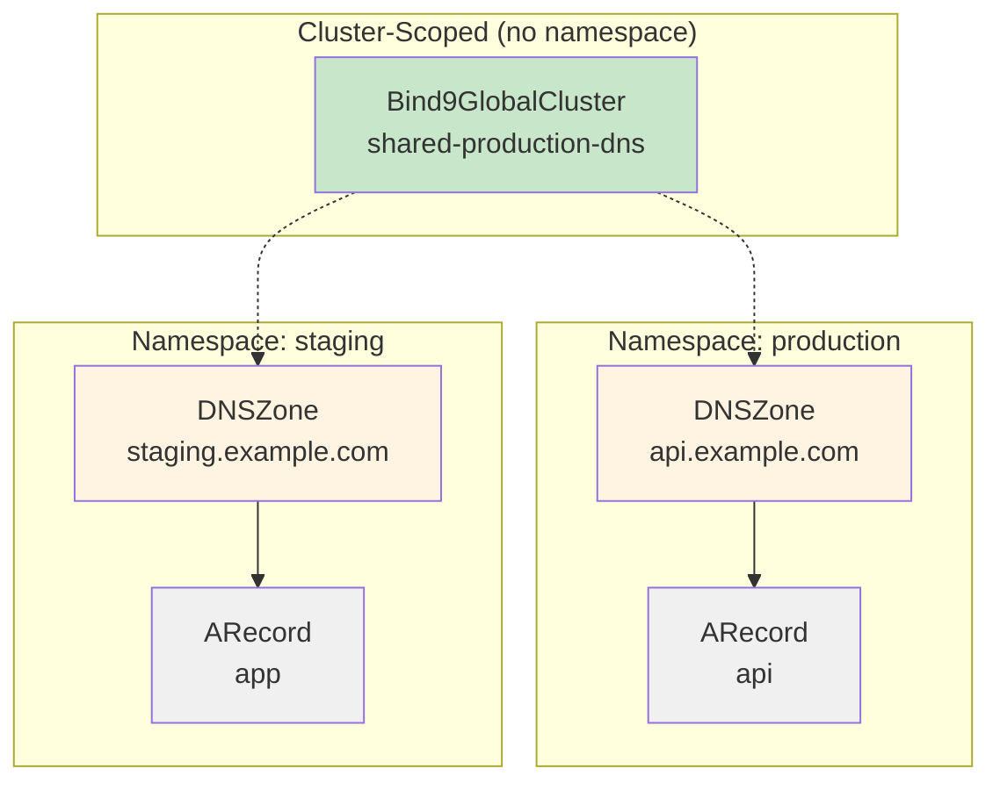
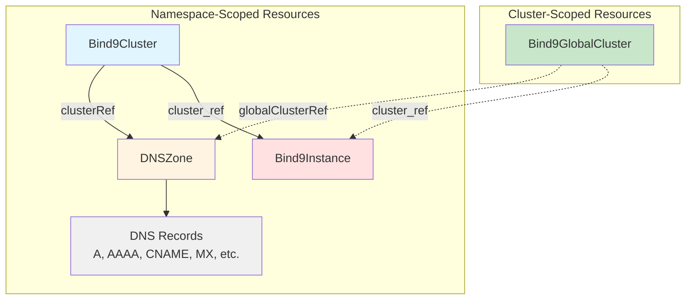
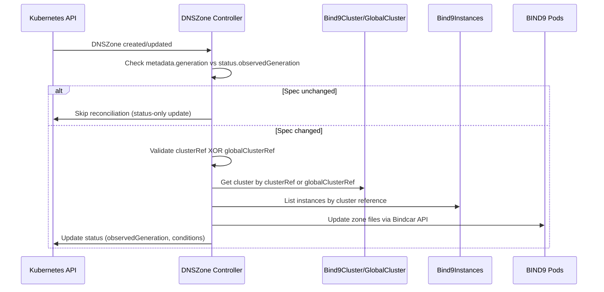
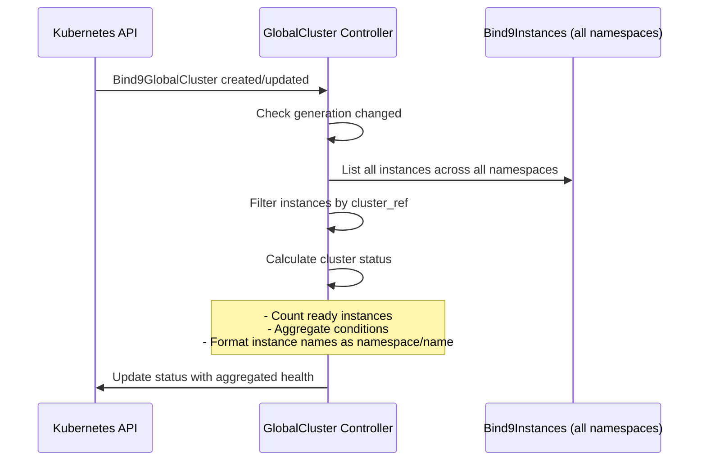
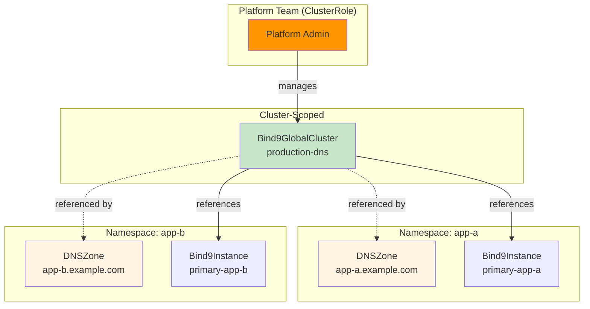
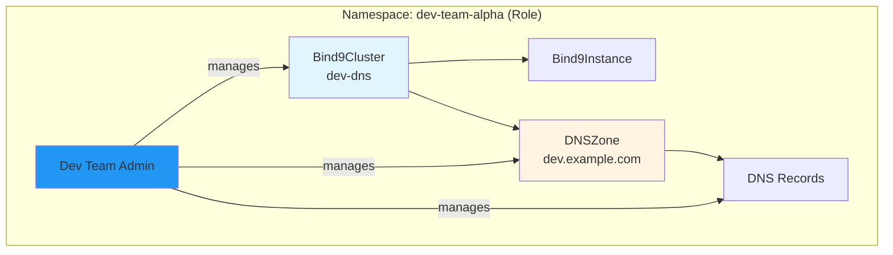
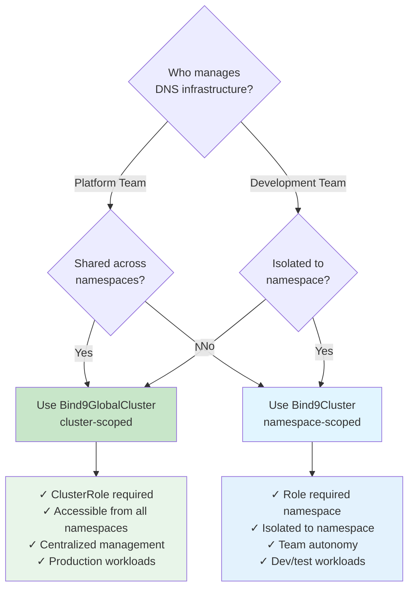

# Architecture Overview

This guide explains the Bindy architecture, focusing on the dual-cluster model that enables multi-tenancy and flexible deployment patterns.

## Table of Contents

- [Architecture Principles](#architecture-principles)
- [Cluster Models](#cluster-models)
- [Resource Hierarchy](#resource-hierarchy)
- [Reconciliation Flow](#reconciliation-flow)
- [Multi-Tenancy Model](#multi-tenancy-model)
- [Namespace Isolation](#namespace-isolation)

## Architecture Principles

Bindy follows Kubernetes controller pattern best practices:

1. **Declarative Configuration**: Users declare desired state via CRDs, controllers reconcile to match
2. **Level-Based Reconciliation**: Controllers continuously ensure actual state matches desired state
3. **Status Subresources**: All CRDs expose status for observability
4. **Finalizers**: Proper cleanup of dependent resources before deletion
5. **Generation Tracking**: Reconcile only when spec changes (using `metadata.generation`)

## Cluster Models

Bindy provides two cluster models to support different organizational patterns:

### Namespace-Scoped Clusters (`Bind9Cluster`)

**Use Case**: Development teams manage their own DNS infrastructure within their namespace.



**Characteristics:**
- Isolated to a single namespace
- Teams manage their own DNS independently
- RBAC scoped to namespace (Role/RoleBinding)
- Cannot be referenced from other namespaces

**YAML Example:**
```yaml
apiVersion: bindy.firestoned.io/v1alpha1
kind: Bind9Cluster
metadata:
  name: dev-team-dns
  namespace: dev-team-alpha
spec:
  version: "9.18"
  primary:
    replicas: 1
  secondary:
    replicas: 1
```

### Cluster-Scoped Clusters (`Bind9GlobalCluster`)

**Use Case**: Platform teams provide shared DNS infrastructure accessible from all namespaces.



**Characteristics:**
- Cluster-wide visibility (no namespace)
- Platform team manages centralized DNS
- RBAC requires ClusterRole/ClusterRoleBinding
- DNSZones in any namespace can reference it

**YAML Example:**
```yaml
apiVersion: bindy.firestoned.io/v1alpha1
kind: Bind9GlobalCluster
metadata:
  name: shared-production-dns
  # No namespace - cluster-scoped resource
spec:
  version: "9.18"
  primary:
    replicas: 3
    service:
      type: LoadBalancer
  secondary:
    replicas: 2
```

## Resource Hierarchy

The complete resource hierarchy shows how components relate:



### Key Relationships

1. **DNSZone → Cluster References**:
   - `spec.clusterRef`: References namespace-scoped `Bind9Cluster` (same namespace)
   - `spec.globalClusterRef`: References cluster-scoped `Bind9GlobalCluster`
   - **Mutual Exclusivity**: Exactly one must be specified

2. **Bind9Instance → Cluster Reference**:
   - `spec.cluster_ref`: Can reference either `Bind9Cluster` or `Bind9GlobalCluster`
   - Controller auto-detects cluster type

3. **DNS Records → Zone Reference**:
   - `spec.zone`: Zone name lookup (searches in same namespace)
   - `spec.zoneRef`: Direct DNSZone resource name (same namespace)
   - **Namespace Isolation**: Records can ONLY reference zones in their own namespace

## Reconciliation Flow

### DNSZone Reconciliation



### Bind9GlobalCluster Reconciliation



## Multi-Tenancy Model

Bindy supports multi-tenancy through two organizational patterns:

### Platform Team Pattern

Platform teams manage cluster-wide DNS infrastructure:



**RBAC Setup:**
```yaml
apiVersion: rbac.authorization.k8s.io/v1
kind: ClusterRole
metadata:
  name: platform-dns-admin
rules:
- apiGroups: ["bindy.firestoned.io"]
  resources: ["bind9globalclusters"]
  verbs: ["*"]
---
apiVersion: rbac.authorization.k8s.io/v1
kind: ClusterRoleBinding
metadata:
  name: platform-team-dns
subjects:
- kind: Group
  name: platform-team
  apiGroup: rbac.authorization.k8s.io
roleRef:
  kind: ClusterRole
  name: platform-dns-admin
  apiGroup: rbac.authorization.k8s.io
```

### Development Team Pattern

Development teams manage namespace-scoped DNS:



**RBAC Setup:**
```yaml
apiVersion: rbac.authorization.k8s.io/v1
kind: Role
metadata:
  name: dns-admin
  namespace: dev-team-alpha
rules:
- apiGroups: ["bindy.firestoned.io"]
  resources: ["bind9clusters", "dnszones", "arecords", "cnamerecords", "mxrecords", "txtrecords"]
  verbs: ["*"]
---
apiVersion: rbac.authorization.k8s.io/v1
kind: RoleBinding
metadata:
  name: dev-team-dns
  namespace: dev-team-alpha
subjects:
- kind: Group
  name: dev-team-alpha
  apiGroup: rbac.authorization.k8s.io
roleRef:
  kind: Role
  name: dns-admin
  apiGroup: rbac.authorization.k8s.io
```

## Namespace Isolation

**Security Principle**: DNSZones and records are always namespace-scoped, even when referencing cluster-scoped resources.

```mermaid
graph TB
    subgraph "Cluster-Scoped"
        GlobalCluster[Bind9GlobalCluster<br/>shared-dns]
    end

    subgraph "Namespace: team-a"
        ZoneA[DNSZone<br/>team-a.example.com]
        RecordA[ARecord<br/>www]
    end

    subgraph "Namespace: team-b"
        ZoneB[DNSZone<br/>team-b.example.com]
        RecordB[ARecord<br/>api]
    end

    GlobalCluster -.-> ZoneA
    GlobalCluster -.-> ZoneB
    ZoneA --> RecordA
    ZoneB --> RecordB

    RecordA -.X|blocked|ZoneB
    RecordB -.X|blocked|ZoneA

    style GlobalCluster fill:#c8e6c9
    style ZoneA fill:#fff4e1
    style ZoneB fill:#fff4e1
```

**Isolation Rules:**

1. **Records can ONLY reference zones in their own namespace**
   - Controller uses `Api::namespaced()` to enforce this
   - Cross-namespace references are impossible

2. **DNSZones are namespace-scoped**
   - Even when referencing `Bind9GlobalCluster`
   - Each team manages their own zones

3. **RBAC controls zone management**
   - Platform team: ClusterRole for `Bind9GlobalCluster`
   - Dev teams: Role for `DNSZone` and records in their namespace

**Example - Record Isolation:**

```yaml
# team-a namespace
apiVersion: bindy.firestoned.io/v1alpha1
kind: ARecord
metadata:
  name: www
  namespace: team-a
spec:
  zoneRef: team-a-zone  # ✅ References zone in same namespace
  name: www
  ipv4Address: "192.0.2.1"
---
# This would FAIL - cannot reference zone in another namespace
apiVersion: bindy.firestoned.io/v1alpha1
kind: ARecord
metadata:
  name: www
  namespace: team-a
spec:
  zoneRef: team-b-zone  # ❌ References zone in team-b namespace - BLOCKED
  name: www
  ipv4Address: "192.0.2.1"
```

## Decision Tree: Choosing a Cluster Model

Use this decision tree to determine which cluster model fits your use case:



## Next Steps

- [Multi-Tenancy Guide](multi-tenancy.md) - Detailed RBAC setup and examples
- [Choosing a Cluster Type](choosing-cluster-type.md) - Decision guide for cluster selection
- [Quickstart Guide](quickstart.md) - Getting started with both cluster types
