# Architecture Overview

This guide explains the Bindy architecture, focusing on the dual-cluster model that enables multi-tenancy and flexible deployment patterns.

## Table of Contents

- [Architecture Principles](#architecture-principles)
- [Cluster Models](#cluster-models)
- [Resource Hierarchy](#resource-hierarchy)
- [Reconciliation Flow](#reconciliation-flow)
- [Multi-Tenancy Model](#multi-tenancy-model)
- [Namespace Isolation](#namespace-isolation)

## Architecture Principles

Bindy follows Kubernetes operator pattern best practices:

1. **Declarative Configuration**: Users declare desired state via CRDs, operators reconcile to match
2. **Level-Based Reconciliation**: Operators continuously ensure actual state matches desired state
3. **Status Subresources**: All CRDs expose status for observability
4. **Finalizers**: Proper cleanup of dependent resources before deletion
5. **Generation Tracking**: Reconcile only when spec changes (using `metadata.generation`)

## Cluster Models

Bindy provides two cluster models to support different organizational patterns:

### Namespace-Scoped Clusters (`Bind9Cluster`)

**Use Case**: Development teams manage their own DNS infrastructure within their namespace.


**Characteristics:**

- Isolated to a single namespace
- Teams manage their own DNS independently
- RBAC scoped to namespace (Role/RoleBinding)
- Cannot be referenced from other namespaces

**YAML Example:**
```yaml
apiVersion: bindy.firestoned.io/v1beta1
kind: Bind9Cluster
metadata:
  name: dev-team-dns
  namespace: dev-team-alpha
spec:
  version: "9.18"
  primary:
    replicas: 1
  secondary:
    replicas: 1
```

### Cluster-Scoped Clusters (`ClusterBind9Provider`)

**Use Case**: Platform teams provide shared DNS infrastructure accessible from all namespaces.


**Characteristics:**

- Cluster-wide visibility (no namespace)
- Platform team manages centralized DNS
- RBAC requires ClusterRole/ClusterRoleBinding
- DNSZones in any namespace can reference it

**YAML Example:**
```yaml
apiVersion: bindy.firestoned.io/v1beta1
kind: ClusterBind9Provider
metadata:
  name: shared-production-dns
  # No namespace - cluster-scoped resource
spec:
  version: "9.18"
  primary:
    replicas: 3
    service:
      type: LoadBalancer
  secondary:
    replicas: 2
```

## Resource Hierarchy

The complete resource hierarchy shows how components relate:


**Relationship Legend:**

- **Solid arrow** (-->) : Direct reference by name
- **Dashed arrow** (-.->): Cluster-scoped reference
- **Bold arrow** (==>) : Label selector-based selection

### Key Relationships

1. **DNSZone → Cluster References** (Optional):
   - `spec.clusterRef`: References namespace-scoped `Bind9Cluster` (same namespace)
   - `spec.clusterProviderRef`: References cluster-scoped `ClusterBind9Provider`
   - **Note**: These are optional - zones can select instances directly via label selectors

2. **DNSZone → Bind9Instance Selection** (Primary):
   - `spec.bind9InstancesFrom`: Label selectors to select instances
   - **Direction**: Zones select instances (NOT instances selecting zones)
   - **Selection Methods**:
     - Via `clusterRef`: All instances with matching `spec.clusterRef`
     - Via `bind9InstancesFrom`: Instances matching label selectors
     - Via BOTH: UNION of instances from both methods (duplicates removed)
   - **Status Tracking**: `status.bind9Instances[]` lists selected instances
   - **Count Field**: `status.bind9InstancesCount` shows number of instances

3. **Bind9Instance → Cluster Reference**:
   - `spec.cluster_ref`: Can reference either `Bind9Cluster` or `ClusterBind9Provider`
   - Operator auto-detects cluster type
   - Used for instance organization and management

4. **DNSZone → DNS Records Association**:
   - `spec.recordsFrom`: Label selectors to select records
   - Records use `metadata.labels` to be selected by zones
   - **Namespace Isolation**: Records can ONLY be selected by zones in their own namespace
   - **Status Tracking**: `status.selectedRecords[]` lists matched records
   - **Count Field**: `status.recordCount` shows number of records

## Reconciliation Flow

### DNSZone Reconciliation

> **Architecture**: Zones select instances via `spec.bind9InstancesFrom` label selectors or `spec.clusterRef` references.


**Key Architectural Points:**

1. **Event-Driven**: Operator reacts to zone changes via Kubernetes watch events
2. **Instance Selection**: Zones select instances (not instances selecting zones)
3. **Batched Status Updates**: All status changes collected in `DNSZoneStatusUpdater`, applied atomically
4. **DIFF Detection**: Status only patched if values actually changed (prevents reconciliation storms)
5. **Automatic Count Computation**: `bind9InstancesCount` computed automatically when instances added/removed
6. **UID-Based Deduplication**: Instances matched by UID prevents duplicates when both selection methods used

### ClusterBind9Provider Reconciliation


## Multi-Tenancy Model

Bindy supports multi-tenancy through two organizational patterns:

### Platform Team Pattern

Platform teams manage cluster-wide DNS infrastructure:


**RBAC Setup:**
```yaml
apiVersion: rbac.authorization.k8s.io/v1
kind: ClusterRole
metadata:
  name: platform-dns-admin
rules:
- apiGroups: ["bindy.firestoned.io"]
  resources: ["clusterbind9providers"]
  verbs: ["*"]
---
apiVersion: rbac.authorization.k8s.io/v1
kind: ClusterRoleBinding
metadata:
  name: platform-team-dns
subjects:
- kind: Group
  name: platform-team
  apiGroup: rbac.authorization.k8s.io
roleRef:
  kind: ClusterRole
  name: platform-dns-admin
  apiGroup: rbac.authorization.k8s.io
```

### Development Team Pattern

Development teams manage namespace-scoped DNS:


**RBAC Setup:**
```yaml
apiVersion: rbac.authorization.k8s.io/v1
kind: Role
metadata:
  name: dns-admin
  namespace: dev-team-alpha
rules:
- apiGroups: ["bindy.firestoned.io"]
  resources: ["bind9clusters", "dnszones", "arecords", "cnamerecords", "mxrecords", "txtrecords"]
  verbs: ["*"]
---
apiVersion: rbac.authorization.k8s.io/v1
kind: RoleBinding
metadata:
  name: dev-team-dns
  namespace: dev-team-alpha
subjects:
- kind: Group
  name: dev-team-alpha
  apiGroup: rbac.authorization.k8s.io
roleRef:
  kind: Role
  name: dns-admin
  apiGroup: rbac.authorization.k8s.io
```

## Namespace Isolation

**Security Principle**: DNSZones and records are always namespace-scoped, even when referencing cluster-scoped resources.


**Isolation Rules:**

1. **Records can ONLY reference zones in their own namespace**
   - Operator uses `Api::namespaced()` to enforce this
   - Cross-namespace references are impossible

2. **DNSZones are namespace-scoped**
   - Even when referencing `ClusterBind9Provider`
   - Each team manages their own zones

3. **RBAC controls zone management**
   - Platform team: ClusterRole for `ClusterBind9Provider`
   - Dev teams: Role for `DNSZone` and records in their namespace

**Example - Record Isolation:**

```yaml
# team-a namespace - DNSZone with selector
apiVersion: bindy.firestoned.io/v1beta1
kind: DNSZone
metadata:
  name: team-a-zone
  namespace: team-a
spec:
  zoneName: team-a.com
  clusterRef: production-dns
  recordsFrom:
    - selector:
        matchLabels:
          zone: team-a.com
  soaRecord:
    primaryNs: ns1.team-a.com.
    adminEmail: admin.team-a.com.
    serial: 2024010101
---
# team-a namespace - Record with matching label
apiVersion: bindy.firestoned.io/v1beta1
kind: ARecord
metadata:
  name: www
  namespace: team-a
  labels:
    zone: team-a.com  # ✅ Matches DNSZone selector in same namespace
spec:
  name: www
  ipv4Addresses:
    - "192.0.2.1"
---
# This would NOT be selected - namespace isolation prevents cross-namespace selection
apiVersion: bindy.firestoned.io/v1beta1
kind: ARecord
metadata:
  name: www-isolated
  namespace: team-a
  labels:
    zone: team-b.com  # ❌ No DNSZone in team-a with this selector
spec:
  name: www
  ipv4Addresses:
    - "192.0.2.1"
```

## Decision Tree: Choosing a Cluster Model

Use this decision tree to determine which cluster model fits your use case:

```mermaid
graph TD
    Start{Who manages<br/>DNS infrastructure?}
    Start -->|Platform Team| PlatformCheck{Shared across<br/>namespaces?}
    Start -->|Development Team| DevCheck{Isolated to<br/>namespace?}

    PlatformCheck -->|Yes| Global[Use ClusterBind9Provider<br/>cluster-scoped]
    PlatformCheck -->|No| Cluster[Use Bind9Cluster<br/>namespace-scoped]

    DevCheck -->|Yes| Cluster
    DevCheck -->|No| Global

    Global --> GlobalDetails[✓ ClusterRole required<br/>✓ Accessible from all namespaces<br/>✓ Centralized management<br/>✓ Production workloads]

    Cluster --> ClusterDetails[✓ Role required namespace<br/>✓ Isolated to namespace<br/>✓ Team autonomy<br/>✓ Dev/test workloads]

    style Global fill:#c8e6c9
    style Cluster fill:#e1f5ff
    style GlobalDetails fill:#e8f5e9
    style ClusterDetails fill:#e3f2fd
```



## Deployment Architecture

### Operator Deployment

The Bindy operator uses a **centralized operator pattern** - a single operator instance manages all BIND9 DNS infrastructure across the cluster.


**Key Deployment Characteristics:**

- **Single Operator Instance**: One operator manages all DNS infrastructure
- **Namespace**: Typically deployed in `dns-system` (configurable)
- **Service Account**: `bindy-operator` with cluster-wide RBAC permissions
- **Event-Driven**: Uses Kubernetes watch API (not polling) for efficient resource monitoring
- **Zone Transfer**: Leverages native BIND9 AXFR/IXFR for primary-secondary replication
- **No Sidecars**: Operator directly manages BIND9 configuration files via HTTP API

### Deployment Components

**1. CRDs (Custom Resource Definitions)**
- Installed cluster-wide before operator deployment
- Define schema for `Bind9Cluster`, `ClusterBind9Provider`, `DNSZone`, record types
- See [CRD Installation](../installation/crds.md)

**2. RBAC (Role-Based Access Control)**
- **ClusterRole**: Grants operator permissions to manage CRDs across all namespaces
- **ServiceAccount**: Identity for operator pod
- **ClusterRoleBinding**: Links ServiceAccount to ClusterRole
- See [RBAC Configuration](../operations/rbac.md) for details

**3. Operator Deployment**
- **Image**: `ghcr.io/firestoned/bindy:latest`
- **Replicas**: 1 (high availability not yet supported - leader election planned)
- **Resources**: 128Mi memory request, 512Mi limit; 100m CPU request, 500m limit
- **Health Checks**: Liveness and readiness probes for pod health monitoring

**4. Managed Resources**
- **Secrets**: RNDC keys for secure BIND9 communication (auto-generated per instance)
- **ConfigMaps**: BIND9 zone files and configuration (generated from DNSZone specs)
- **Deployments**: BIND9 server pods (created from Bind9Instance specs)
- **Services**: DNS endpoints (TCP/UDP port 53, LoadBalancer/NodePort/ClusterIP)

### Deployment Workflow

When you install Bindy, resources are deployed in this order:


**Step-by-Step:**

1. **Deploy CRDs**: Install Custom Resource Definitions (one-time setup)
2. **Deploy RBAC**: Create ServiceAccount, ClusterRole, ClusterRoleBinding
3. **Deploy Operator**: Start Bindy operator pod in `dns-system` namespace
4. **Operator Ready**: Operator starts watching for Bind9Cluster and DNSZone resources
5. **Create Bind9Cluster**: User creates cluster definition (namespace or cluster-scoped)
6. **Create Bind9Instances**: Operator creates BIND9 Deployment/Service/ConfigMap resources
7. **Create DNSZones**: User creates zone definitions referencing cluster
8. **Create DNS Records**: User creates A, CNAME, MX, TXT records
9. **BIND9 Serving DNS**: BIND9 pods respond to DNS queries on port 53

### Zone Synchronization Architecture

Bindy uses native BIND9 zone transfer for high availability:


**Key Points:**

- **Operator Updates Primary Only**: Operator writes zone files to primary BIND9 instances
- **BIND9 Handles Replication**: Native AXFR/IXFR zone transfer to secondaries
- **TSIG Authentication**: Zone transfers secured with HMAC-SHA256 keys
- **Automatic NOTIFY**: Primaries notify secondaries of zone changes
- **Incremental Transfers**: IXFR transfers only changed records (efficient)

### High Availability Considerations

**BIND9 Instance HA:**

- ✅ **Multiple Primaries**: Deploy 2-3 primary instances with `replicas: 2-3`
- ✅ **Multiple Secondaries**: Deploy 2-3 secondary instances in different failure domains
- ✅ **Zone Transfers**: Secondaries sync from all primaries automatically
- ✅ **LoadBalancer Service**: Distribute DNS queries across all instances

**Operator HA:**

- ⚠️ **Single Replica Only**: Operator currently runs as single instance
- 📋 **Leader Election**: Planned for future release (multi-replica support)
- ✅ **Stateless Design**: Operator crashes are safe - all state in Kubernetes etcd

For BIND9 high availability setup, see [High Availability Guide](../advanced/ha.md).

### Resource Requirements

**Operator Pod:**
```yaml
resources:
  requests:
    memory: "128Mi"
    cpu: "100m"
  limits:
    memory: "512Mi"
    cpu: "500m"
```

**BIND9 Pods (default):**
```yaml
resources:
  requests:
    memory: "256Mi"
    cpu: "200m"
  limits:
    memory: "1Gi"
    cpu: "1000m"
```

Adjust based on:
- Number of zones managed
- Query volume (QPS)
- Zone transfer frequency
- DNSSEC signing (if enabled)

## Next Steps

- [Quick Start](../installation/quickstart.md) - Get started with Bindy in 5 minutes
- [Step-by-Step Guide](../installation/step-by-step.md) - Detailed installation for both cluster types
- [Multi-Tenancy Guide](multi-tenancy.md) - Detailed RBAC setup and examples
- [Choosing a Cluster Type](choosing-cluster-type.md) - Decision guide for cluster selection
- [High Availability](../advanced/ha.md) - Production-ready HA configuration
