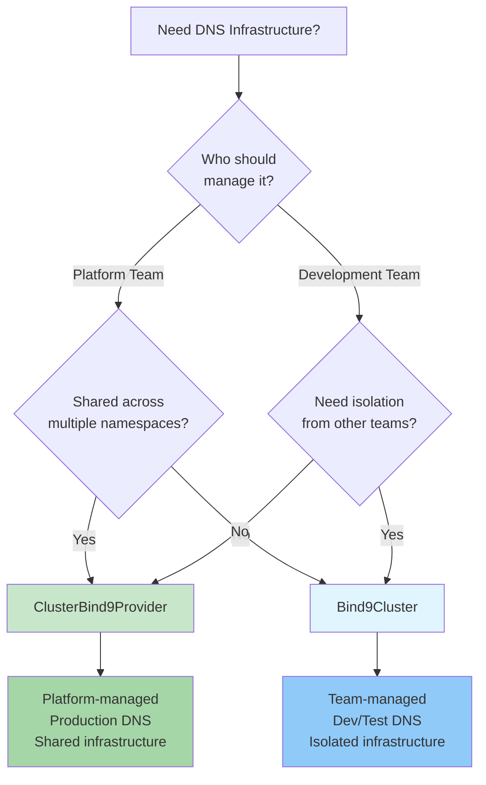
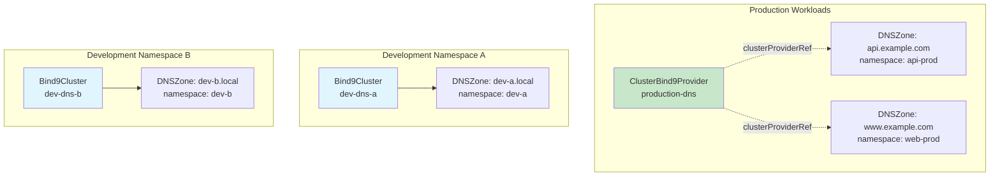

# Choosing a Cluster Type

This guide helps you decide between `Bind9Cluster` (namespace-scoped) and `ClusterBind9Provider` (cluster-scoped) for your DNS infrastructure.

## Quick Decision Matrix

| Factor | Bind9Cluster | ClusterBind9Provider |
|--------|--------------|-------------------|
| **Scope** | Single namespace | Cluster-wide |
| **Who Manages** | Development teams | Platform teams |
| **RBAC** | Role + RoleBinding | ClusterRole + ClusterRoleBinding |
| **Visibility** | Namespace-only | All namespaces |
| **Use Case** | Dev/test environments | Production infrastructure |
| **Zone References** | `clusterRef` | `clusterProviderRef` |
| **Isolation** | Complete isolation between teams | Shared infrastructure |
| **Cost** | Higher (per-namespace overhead) | Lower (shared resources) |

## Decision Tree



## When to Use Bind9Cluster (Namespace-Scoped)

### Ideal For:

✅ **Development and Testing Environments**
- Teams need isolated DNS for development
- Frequent DNS configuration changes
- Short-lived environments

✅ **Multi-Tenant Platforms**
- Each tenant gets their own namespace
- Complete isolation between tenants
- Teams manage their own DNS independently

✅ **Team Autonomy**
- Development teams need full control
- No dependency on platform team
- Self-service DNS management

✅ **Learning and Experimentation**
- Safe environment to learn BIND9
- Can delete and recreate easily
- No impact on other teams

### Example Use Cases:

**1. Development Team Sandbox**
```yaml
apiVersion: bindy.firestoned.io/v1beta1
kind: Bind9Cluster
metadata:
  name: dev-dns
  namespace: dev-team-alpha
spec:
  version: "9.18"
  primary:
    replicas: 1  # Minimal resources for dev
  secondary:
    replicas: 1
  global:
    options:
      - "recursion yes"  # Allow recursion for dev
---
apiVersion: bindy.firestoned.io/v1beta1
kind: DNSZone
metadata:
  name: test-zone
  namespace: dev-team-alpha
spec:
  zoneName: test.local
  clusterRef: dev-dns  # Namespace-scoped reference
  soaRecord:
    primaryNs: ns1.test.local.
    adminEmail: admin.test.local.
    serial: 2025010101
    refresh: 300  # Fast refresh for dev
    retry: 60
    expire: 3600
    negativeTtl: 60
  ttl: 60  # Low TTL for frequent changes
```

**2. CI/CD Ephemeral Environments**
```yaml
# Each PR creates isolated DNS infrastructure
apiVersion: bindy.firestoned.io/v1beta1
kind: Bind9Cluster
metadata:
  name: pr-{{PR_NUMBER}}-dns
  namespace: ci-pr-{{PR_NUMBER}}
  labels:
    pr-number: "{{PR_NUMBER}}"
    environment: ephemeral
spec:
  version: "9.18"
  primary:
    replicas: 1
  # Minimal config for short-lived environment
```

**3. Multi-Tenant SaaS Platform**
```yaml
# Each customer gets isolated DNS in their namespace
apiVersion: bindy.firestoned.io/v1beta1
kind: Bind9Cluster
metadata:
  name: customer-dns
  namespace: customer-{{CUSTOMER_ID}}
  labels:
    customer-id: "{{CUSTOMER_ID}}"
spec:
  version: "9.18"
  primary:
    replicas: 1
  secondary:
    replicas: 1
  # Customer-specific ACLs and configuration
  acls:
    customer-networks:
      - "{{CUSTOMER_CIDR}}"
```

### Characteristics:

**✓ Pros:**
- Complete isolation between teams
- No cross-namespace dependencies
- Teams have full autonomy
- Easy to delete and recreate
- No ClusterRole permissions needed

**✗ Cons:**
- Higher resource overhead (per-namespace clusters)
- Cannot share DNS infrastructure across namespaces
- Each team must manage their own BIND9 instances
- Duplication of configuration

## When to Use ClusterBind9Provider (Cluster-Scoped)

### Ideal For:

✅ **Production Infrastructure**
- Centralized DNS for production workloads
- High availability requirements
- Shared across multiple applications

✅ **Platform Team Management**
- Platform team provides DNS as a service
- Centralized governance and compliance
- Consistent configuration across environments

✅ **Resource Efficiency**
- Share DNS infrastructure across namespaces
- Reduce operational overhead
- Lower total cost of ownership

✅ **Enterprise Requirements**
- Audit logging and compliance
- Centralized monitoring and alerting
- Disaster recovery and backups

### Example Use Cases:

**1. Production DNS Infrastructure**
```yaml
apiVersion: bindy.firestoned.io/v1beta1
kind: ClusterBind9Provider
metadata:
  name: production-dns
  # No namespace - cluster-scoped
spec:
  version: "9.18"

  # High availability configuration
  primary:
    replicas: 3
    service:
      type: LoadBalancer
      annotations:
        service.beta.kubernetes.io/aws-load-balancer-type: "nlb"
        service.beta.kubernetes.io/aws-load-balancer-cross-zone-load-balancing-enabled: "true"

  secondary:
    replicas: 3

  # Production-grade configuration
  global:
    options:
      - "recursion no"
      - "allow-transfer { none; }"
      - "notify yes"
      - "minimal-responses yes"

  # Access control
  acls:
    trusted:
      - "10.0.0.0/8"
      - "172.16.0.0/12"
    secondaries:
      - "10.10.1.0/24"

  # Persistent storage for zone files
  volumes:
    - name: zone-data
      persistentVolumeClaim:
        claimName: dns-zone-storage
  volumeMounts:
    - name: zone-data
      mountPath: /var/cache/bind
```

**Application teams reference the cluster provider:**
```yaml
# Application in any namespace can use the cluster provider
apiVersion: bindy.firestoned.io/v1beta1
kind: DNSZone
metadata:
  name: api-zone
  namespace: api-service  # Different namespace
spec:
  zoneName: api.example.com
  clusterProviderRef: production-dns  # References cluster-scoped cluster
  soaRecord:
    primaryNs: ns1.example.com.
    adminEmail: dns-admin.example.com.
    serial: 2025010101
    refresh: 3600
    retry: 600
    expire: 604800
    negativeTtl: 86400
  ttl: 3600
---
# Another application in a different namespace
apiVersion: bindy.firestoned.io/v1beta1
kind: DNSZone
metadata:
  name: web-zone
  namespace: web-frontend  # Different namespace
spec:
  zoneName: www.example.com
  clusterProviderRef: production-dns  # Same cluster provider
  soaRecord:
    primaryNs: ns1.example.com.
    adminEmail: dns-admin.example.com.
    serial: 2025010101
    refresh: 3600
    retry: 600
    expire: 604800
    negativeTtl: 86400
```

**2. Multi-Region DNS**
```yaml
# Regional cluster providers for geo-distributed DNS
apiVersion: bindy.firestoned.io/v1beta1
kind: ClusterBind9Provider
metadata:
  name: dns-us-east
  labels:
    region: us-east-1
spec:
  version: "9.18"
  primary:
    replicas: 3
    service:
      type: LoadBalancer
  secondary:
    replicas: 2
  acls:
    region-networks:
      - "10.0.0.0/8"
---
apiVersion: bindy.firestoned.io/v1beta1
kind: ClusterBind9Provider
metadata:
  name: dns-eu-west
  labels:
    region: eu-west-1
spec:
  version: "9.18"
  primary:
    replicas: 3
    service:
      type: LoadBalancer
  secondary:
    replicas: 2
  acls:
    region-networks:
      - "10.128.0.0/9"
```

**3. Platform DNS as a Service**
```yaml
# Platform team provides multiple tiers of DNS service
apiVersion: bindy.firestoned.io/v1beta1
kind: ClusterBind9Provider
metadata:
  name: dns-premium
  labels:
    tier: premium
    sla: "99.99"
spec:
  version: "9.18"
  primary:
    replicas: 5  # High availability
    service:
      type: LoadBalancer
  secondary:
    replicas: 5
---
apiVersion: bindy.firestoned.io/v1beta1
kind: ClusterBind9Provider
metadata:
  name: dns-standard
  labels:
    tier: standard
    sla: "99.9"
spec:
  version: "9.18"
  primary:
    replicas: 3
  secondary:
    replicas: 2
```

### Characteristics:

**✓ Pros:**
- Shared infrastructure across namespaces
- Lower total resource usage
- Centralized management and governance
- Consistent configuration
- Platform team controls DNS

**✗ Cons:**
- Requires ClusterRole permissions
- Platform team must manage it
- Less autonomy for application teams
- Single point of management (not necessarily failure)

## Hybrid Approach

You can use **both** cluster types in the same Kubernetes cluster:



**Example Configuration:**

```yaml
# Platform team manages production DNS globally
apiVersion: bindy.firestoned.io/v1beta1
kind: ClusterBind9Provider
metadata:
  name: production-dns
spec:
  version: "9.18"
  primary:
    replicas: 3
---
# Dev teams manage their own DNS per namespace
apiVersion: bindy.firestoned.io/v1beta1
kind: Bind9Cluster
metadata:
  name: dev-dns
  namespace: dev-team-a
spec:
  version: "9.18"
  primary:
    replicas: 1
---
# Production app references cluster provider
apiVersion: bindy.firestoned.io/v1beta1
kind: DNSZone
metadata:
  name: prod-zone
  namespace: production
spec:
  zoneName: app.example.com
  clusterProviderRef: production-dns
  soaRecord: { /* ... */ }
---
# Dev app references namespace-scoped cluster
apiVersion: bindy.firestoned.io/v1beta1
kind: DNSZone
metadata:
  name: dev-zone
  namespace: dev-team-a
spec:
  zoneName: app.dev.local
  clusterRef: dev-dns
  soaRecord: { /* ... */ }
```

## Common Scenarios

### Scenario 1: Startup/Small Team

**Recommendation**: Start with `Bind9Cluster` (namespace-scoped)

**Why:**

- Simpler RBAC (no ClusterRole needed)
- Faster iteration and experimentation
- Easy to recreate if configuration is wrong
- Lower learning curve

**Migration Path:**
When you grow, migrate production to `ClusterBind9Provider` while keeping dev on `Bind9Cluster`.

### Scenario 2: Enterprise with Platform Team

**Recommendation**: Use `ClusterBind9Provider` for production, `Bind9Cluster` for dev

**Why:**

- Platform team provides production DNS as a service
- Development teams have autonomy in their namespaces
- Clear separation of responsibilities
- Resource efficiency at scale

### Scenario 3: Multi-Tenant SaaS

**Recommendation**: Use `Bind9Cluster` per tenant namespace

**Why:**

- Complete isolation between customers
- Tenant-specific configuration
- Easier to delete customer data (namespace deletion)
- No risk of cross-tenant data leaks

### Scenario 4: CI/CD with Ephemeral Environments

**Recommendation**: Use `Bind9Cluster` per environment

**Why:**

- Isolated DNS per PR/branch
- Easy cleanup when PR closes
- No impact on other environments
- Fast provisioning

## Migration Between Cluster Types

### From Bind9Cluster to ClusterBind9Provider

**Steps:**

1. **Create ClusterBind9Provider**:
   ```yaml
   apiVersion: bindy.firestoned.io/v1beta1
   kind: ClusterBind9Provider
   metadata:
     name: shared-dns
   spec:
     # Copy configuration from Bind9Cluster
     version: "9.18"
     primary:
       replicas: 3
     secondary:
       replicas: 2
   ```

2. **Update DNSZone References**:
   ```yaml
   # Before
   apiVersion: bindy.firestoned.io/v1beta1
   kind: DNSZone
   metadata:
     name: my-zone
     namespace: my-namespace
   spec:
     zoneName: example.com
     clusterRef: my-cluster  # namespace-scoped

   # After
   apiVersion: bindy.firestoned.io/v1beta1
   kind: DNSZone
   metadata:
     name: my-zone
     namespace: my-namespace
   spec:
     zoneName: example.com
     clusterProviderRef: shared-dns  # cluster-scoped
   ```

3. **Update RBAC** (if needed):
   - Application teams no longer need permissions for `bind9clusters`
   - Only need permissions for `dnszones` and records

4. **Delete Old Bind9Cluster**:
   ```bash
   kubectl delete bind9cluster my-cluster -n my-namespace
   ```

### From ClusterBind9Provider to Bind9Cluster

**Steps:**

1. **Create Bind9Cluster in Target Namespace**:
   ```yaml
   apiVersion: bindy.firestoned.io/v1beta1
   kind: Bind9Cluster
   metadata:
     name: team-dns
     namespace: my-namespace
   spec:
     # Copy configuration from cluster provider
     version: "9.18"
     primary:
       replicas: 2
   ```

2. **Update DNSZone References**:
   ```yaml
   # Before
   spec:
     clusterProviderRef: shared-dns

   # After
   spec:
     clusterRef: team-dns
   ```

3. **Update RBAC** (if needed):
   - Team needs permissions for `bind9clusters` in their namespace

## Summary

| Choose This | If You Need |
|-------------|-------------|
| **Bind9Cluster** | Team autonomy, complete isolation, dev/test environments |
| **ClusterBind9Provider** | Shared infrastructure, platform management, production DNS |
| **Both (Hybrid)** | Production on global, dev on namespace-scoped |

**Key Takeaway**: There's no "wrong" choice - select based on your organizational structure and requirements. Many organizations use both cluster types for different purposes.

## Next Steps

- [Architecture Overview](architecture.md) - Understand the dual-cluster model
- [Multi-Tenancy Guide](multi-tenancy.md) - RBAC setup and examples
- [Step-by-Step Guide](../installation/step-by-step.md) - Get started with examples
