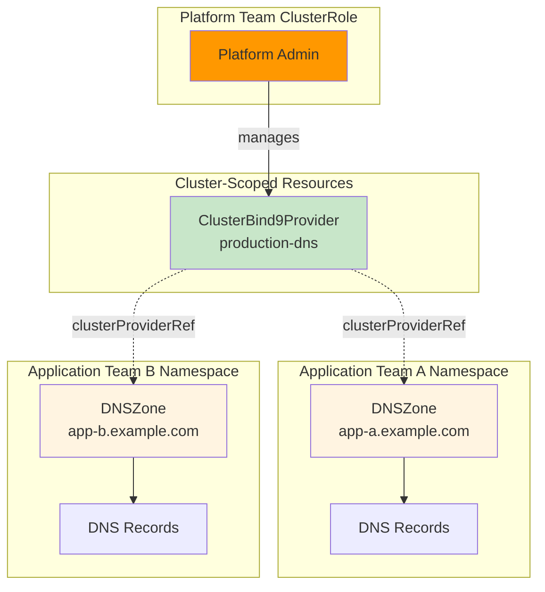
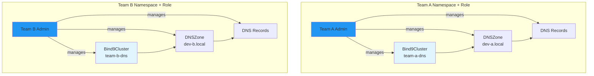
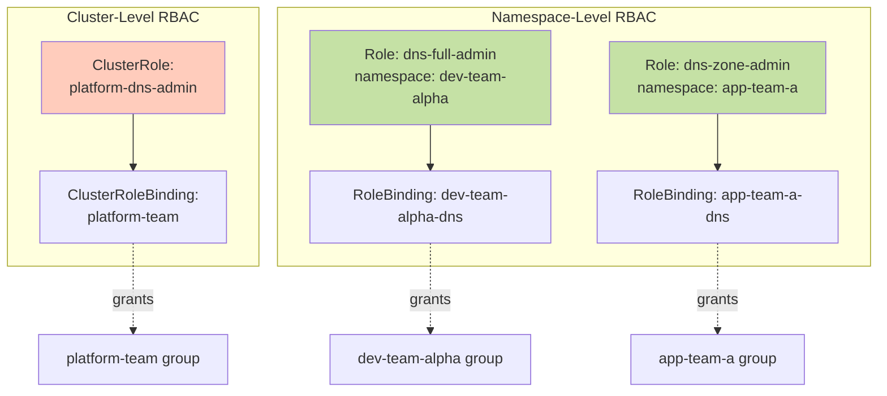

# Multi-Tenancy Guide

This guide explains how to set up multi-tenancy with Bindy using the dual-cluster model, RBAC configuration, and namespace isolation.

## Table of Contents

- [Overview](#overview)
- [Tenancy Models](#tenancy-models)
- [Platform Team Setup](#platform-team-setup)
- [Development Team Setup](#development-team-setup)
- [RBAC Configuration](#rbac-configuration)
- [Security Best Practices](#security-best-practices)
- [Example Scenarios](#example-scenarios)

## Overview

Bindy supports multi-tenancy through two complementary approaches:

1. **Platform-Managed DNS**: Centralized DNS infrastructure managed by platform teams
2. **Tenant-Managed DNS**: Isolated DNS infrastructure managed by development teams

Both can coexist in the same cluster, providing flexibility for different organizational needs.

### Key Principles

- **Namespace Isolation**: DNSZones and records are always namespace-scoped
- **RBAC-Based Access**: Kubernetes RBAC controls who can manage DNS resources
- **Cluster Model Flexibility**: Choose namespace-scoped or cluster-scoped clusters based on needs
- **No Cross-Namespace Access**: Records cannot reference zones in other namespaces

## Tenancy Models

### Model 1: Platform-Managed DNS

**Use Case**: Platform team provides shared DNS infrastructure for all applications.



**Characteristics:**

- Platform team manages `ClusterBind9Provider` (requires ClusterRole)
- Application teams manage `DNSZone` and records in their namespace (requires Role)
- Shared DNS infrastructure, distributed zone management
- Suitable for production workloads

### Model 2: Tenant-Managed DNS

**Use Case**: Development teams run isolated DNS infrastructure for testing/dev.



**Characteristics:**

- Each team manages their own `Bind9Cluster` (namespace-scoped Role)
- Complete isolation between teams
- Teams have full autonomy over DNS configuration
- Suitable for development/testing environments

## Platform Team Setup

### Step 1: Create ClusterRole for Platform DNS Management

```yaml
apiVersion: rbac.authorization.k8s.io/v1
kind: ClusterRole
metadata:
  name: platform-dns-admin
rules:
# Manage cluster-scoped cluster providers
- apiGroups: ["bindy.firestoned.io"]
  resources: ["clusterbind9providers"]
  verbs: ["get", "list", "watch", "create", "update", "patch", "delete"]

# View cluster provider status
- apiGroups: ["bindy.firestoned.io"]
  resources: ["clusterbind9providers/status"]
  verbs: ["get", "list", "watch"]

# Manage bind9 instances across all namespaces (for cluster providers)
- apiGroups: ["bindy.firestoned.io"]
  resources: ["bind9instances"]
  verbs: ["get", "list", "watch", "create", "update", "patch", "delete"]

# View instance status
- apiGroups: ["bindy.firestoned.io"]
  resources: ["bind9instances/status"]
  verbs: ["get", "list", "watch"]
```

### Step 2: Bind ClusterRole to Platform Team

```yaml
apiVersion: rbac.authorization.k8s.io/v1
kind: ClusterRoleBinding
metadata:
  name: platform-team-dns-admin
subjects:
- kind: Group
  name: platform-team  # Your IdP/OIDC group name
  apiGroup: rbac.authorization.k8s.io
# Alternative: Bind to specific users
# - kind: User
#   name: alice@example.com
#   apiGroup: rbac.authorization.k8s.io
roleRef:
  kind: ClusterRole
  name: platform-dns-admin
  apiGroup: rbac.authorization.k8s.io
```

### Step 3: Create ClusterBind9Provider

```yaml
apiVersion: bindy.firestoned.io/v1beta1
kind: ClusterBind9Provider
metadata:
  name: shared-production-dns
  # No namespace - cluster-scoped
spec:
  version: "9.18"

  # Primary instances configuration
  primary:
    replicas: 3
    service:
      type: LoadBalancer
      annotations:
        service.beta.kubernetes.io/aws-load-balancer-type: "nlb"

  # Secondary instances configuration
  secondary:
    replicas: 2

  # Global BIND9 configuration
  global:
    options:
      - "recursion no"
      - "allow-transfer { none; }"
      - "notify yes"

  # Access control lists
  acls:
    trusted:
      - "10.0.0.0/8"
      - "172.16.0.0/12"
```

### Step 4: Grant Application Teams DNS Zone Management

Create a Role in each application namespace:

```yaml
apiVersion: rbac.authorization.k8s.io/v1
kind: Role
metadata:
  name: dns-zone-admin
  namespace: app-team-a
rules:
# Manage DNS zones and records
- apiGroups: ["bindy.firestoned.io"]
  resources:
    - "dnszones"
    - "arecords"
    - "aaaarecords"
    - "cnamerecords"
    - "mxrecords"
    - "txtrecords"
    - "nsrecords"
    - "srvrecords"
    - "caarecords"
  verbs: ["get", "list", "watch", "create", "update", "patch", "delete"]

# View resource status
- apiGroups: ["bindy.firestoned.io"]
  resources:
    - "dnszones/status"
    - "arecords/status"
    - "cnamerecords/status"
    - "mxrecords/status"
    - "txtrecords/status"
  verbs: ["get", "list", "watch"]
---
apiVersion: rbac.authorization.k8s.io/v1
kind: RoleBinding
metadata:
  name: app-team-a-dns
  namespace: app-team-a
subjects:
- kind: Group
  name: app-team-a
  apiGroup: rbac.authorization.k8s.io
roleRef:
  kind: Role
  name: dns-zone-admin
  apiGroup: rbac.authorization.k8s.io
```

### Step 5: Application Teams Create DNSZones

Application teams can now create zones in their namespace:

```yaml
apiVersion: bindy.firestoned.io/v1beta1
kind: DNSZone
metadata:
  name: app-a-zone
  namespace: app-team-a
spec:
  zoneName: app-a.example.com
  clusterProviderRef: shared-production-dns  # References platform cluster
  soaRecord:
    primaryNs: ns1.example.com.
    adminEmail: dns-admin.example.com.
    serial: 2025010101
    refresh: 3600
    retry: 600
    expire: 604800
    negativeTtl: 86400
  ttl: 3600
```

## Development Team Setup

### Step 1: Create Namespace for Team

```yaml
apiVersion: v1
kind: Namespace
metadata:
  name: dev-team-alpha
  labels:
    team: dev-team-alpha
    environment: development
```

### Step 2: Create Role for Full DNS Management

```yaml
apiVersion: rbac.authorization.k8s.io/v1
kind: Role
metadata:
  name: dns-full-admin
  namespace: dev-team-alpha
rules:
# Manage namespace-scoped clusters
- apiGroups: ["bindy.firestoned.io"]
  resources: ["bind9clusters"]
  verbs: ["get", "list", "watch", "create", "update", "patch", "delete"]

# Manage instances
- apiGroups: ["bindy.firestoned.io"]
  resources: ["bind9instances"]
  verbs: ["get", "list", "watch", "create", "update", "patch", "delete"]

# Manage zones and records
- apiGroups: ["bindy.firestoned.io"]
  resources:
    - "dnszones"
    - "arecords"
    - "aaaarecords"
    - "cnamerecords"
    - "mxrecords"
    - "txtrecords"
    - "nsrecords"
    - "srvrecords"
    - "caarecords"
  verbs: ["get", "list", "watch", "create", "update", "patch", "delete"]

# View status for all resources
- apiGroups: ["bindy.firestoned.io"]
  resources:
    - "bind9clusters/status"
    - "bind9instances/status"
    - "dnszones/status"
    - "arecords/status"
  verbs: ["get", "list", "watch"]
```

### Step 3: Bind Role to Development Team

```yaml
apiVersion: rbac.authorization.k8s.io/v1
kind: RoleBinding
metadata:
  name: dev-team-alpha-dns
  namespace: dev-team-alpha
subjects:
- kind: Group
  name: dev-team-alpha
  apiGroup: rbac.authorization.k8s.io
roleRef:
  kind: Role
  name: dns-full-admin
  apiGroup: rbac.authorization.k8s.io
```

### Step 4: Development Team Creates Infrastructure

```yaml
# Namespace-scoped cluster
apiVersion: bindy.firestoned.io/v1beta1
kind: Bind9Cluster
metadata:
  name: dev-dns
  namespace: dev-team-alpha
spec:
  version: "9.18"
  primary:
    replicas: 1
  secondary:
    replicas: 1
---
# DNS zone referencing namespace-scoped cluster
apiVersion: bindy.firestoned.io/v1beta1
kind: DNSZone
metadata:
  name: dev-zone
  namespace: dev-team-alpha
spec:
  zoneName: dev.local
  clusterRef: dev-dns  # References namespace-scoped cluster
  soaRecord:
    primaryNs: ns1.dev.local.
    adminEmail: admin.dev.local.
    serial: 2025010101
    refresh: 3600
    retry: 600
    expire: 604800
    negativeTtl: 300
  ttl: 300
---
# DNS record
apiVersion: bindy.firestoned.io/v1beta1
kind: ARecord
metadata:
  name: test-server
  namespace: dev-team-alpha
  labels:
    zone: dev.local  # Matches DNSZone selector
spec:
  name: test-server
  ipv4Addresses:
    - "10.244.1.100"
  ttl: 60
```

## RBAC Configuration

### ClusterRole vs Role Decision Matrix

| Resource | Scope | RBAC Type | Who Gets It |
|----------|-------|-----------|-------------|
| `ClusterBind9Provider` | Cluster-scoped | ClusterRole + ClusterRoleBinding | Platform team |
| `Bind9Cluster` | Namespace-scoped | Role + RoleBinding | Development teams |
| `Bind9Instance` | Namespace-scoped | Role + RoleBinding | Teams managing instances |
| `DNSZone` | Namespace-scoped | Role + RoleBinding | Application teams |
| DNS Records | Namespace-scoped | Role + RoleBinding | Application teams |

### Example RBAC Hierarchy



### Minimal Permissions for Application Teams

If application teams only need to manage DNS records (not clusters):

```yaml
apiVersion: rbac.authorization.k8s.io/v1
kind: Role
metadata:
  name: dns-record-editor
  namespace: app-team-a
rules:
# Only manage DNS zones and records
- apiGroups: ["bindy.firestoned.io"]
  resources:
    - "dnszones"
    - "arecords"
    - "cnamerecords"
    - "mxrecords"
    - "txtrecords"
  verbs: ["get", "list", "watch", "create", "update", "patch", "delete"]

# Read-only access to status
- apiGroups: ["bindy.firestoned.io"]
  resources:
    - "dnszones/status"
    - "arecords/status"
  verbs: ["get", "list", "watch"]
```

## Security Best Practices

### 1. Namespace Isolation

**Enforce strict namespace boundaries:**

- Records **cannot** reference zones in other namespaces
- This is enforced by the operator using `Api::namespaced()`
- No configuration needed - isolation is automatic

```yaml
# team-a namespace
apiVersion: bindy.firestoned.io/v1beta1
kind: ARecord
metadata:
  name: www
  namespace: team-a
  labels:
    zone: team-a.example.com  # ✅ Matches DNSZone in same namespace
spec:
  name: www
  ipv4Addresses:
    - "192.0.2.1"
---
# This FAILS - cross-namespace reference blocked
# Even if labels match, DNSZone must be in same namespace
apiVersion: bindy.firestoned.io/v1beta1
kind: ARecord
metadata:
  name: www
  namespace: team-a
  labels:
    zone: team-b.example.com  # ❌ No DNSZone in team-a with matching selector
spec:
  name: www
  ipv4Addresses:
    - "192.0.2.1"
```

### 2. Least Privilege RBAC

**Grant minimum necessary permissions:**

```yaml
# ✅ GOOD - Specific permissions
rules:
- apiGroups: ["bindy.firestoned.io"]
  resources: ["dnszones", "arecords"]
  verbs: ["get", "list", "create", "update"]

# ❌ BAD - Overly broad permissions
rules:
- apiGroups: ["bindy.firestoned.io"]
  resources: ["*"]
  verbs: ["*"]
```

### 3. Separate Platform and Tenant Roles

**Keep platform and tenant permissions separate:**

| Role Type | Manages | Scope |
|-----------|---------|-------|
| Platform DNS Admin | `ClusterBind9Provider` | Cluster-wide |
| Tenant Cluster Admin | `Bind9Cluster`, `Bind9Instance` | Namespace |
| Tenant Zone Admin | `DNSZone`, Records | Namespace |
| Tenant Record Editor | Records only | Namespace |

### 4. Audit and Monitoring

**Enable audit logging for DNS changes:**

```yaml
apiVersion: audit.k8s.io/v1
kind: Policy
rules:
# Log all changes to Bindy resources
- level: RequestResponse
  resources:
  - group: bindy.firestoned.io
    resources:
    - clusterbind9providers
    - bind9clusters
    - dnszones
    - arecords
    - mxrecords
  verbs: ["create", "update", "patch", "delete"]
```

### 5. NetworkPolicies for BIND9 Pods

**Restrict network access to DNS pods:**

```yaml
apiVersion: networking.k8s.io/v1
kind: NetworkPolicy
metadata:
  name: bind9-network-policy
  namespace: dns-system
spec:
  podSelector:
    matchLabels:
      app: bind9
  policyTypes:
  - Ingress
  ingress:
  # Allow DNS queries on port 53
  - from:
    - podSelector: {}  # All pods in namespace
    ports:
    - protocol: UDP
      port: 53
    - protocol: TCP
      port: 53
  # Allow Bindcar API access (internal only)
  - from:
    - podSelector:
        matchLabels:
          app: bindy-operator
    ports:
    - protocol: TCP
      port: 8080
```

## Example Scenarios

### Scenario 1: Multi-Region Production DNS

**Requirement**: Platform team manages production DNS across multiple regions.

```yaml
# Platform creates cluster provider per region
apiVersion: bindy.firestoned.io/v1beta1
kind: ClusterBind9Provider
metadata:
  name: production-dns-us-east
spec:
  version: "9.18"
  primary:
    replicas: 3
    service:
      type: LoadBalancer
  secondary:
    replicas: 3
  acls:
    trusted:
      - "10.0.0.0/8"
---
apiVersion: bindy.firestoned.io/v1beta1
kind: ClusterBind9Provider
metadata:
  name: production-dns-eu-west
spec:
  version: "9.18"
  primary:
    replicas: 3
    service:
      type: LoadBalancer
  secondary:
    replicas: 3
  acls:
    trusted:
      - "10.128.0.0/9"
---
# App teams create zones in their namespace
apiVersion: bindy.firestoned.io/v1beta1
kind: DNSZone
metadata:
  name: api-zone-us
  namespace: api-service
spec:
  zoneName: api.example.com
  clusterProviderRef: production-dns-us-east
  soaRecord: { /* ... */ }
---
apiVersion: bindy.firestoned.io/v1beta1
kind: DNSZone
metadata:
  name: api-zone-eu
  namespace: api-service
spec:
  zoneName: api.eu.example.com
  clusterProviderRef: production-dns-eu-west
  soaRecord: { /* ... */ }
```

### Scenario 2: Development Team Sandboxes

**Requirement**: Each dev team has isolated DNS for testing.

```yaml
# Dev Team Alpha namespace
apiVersion: bindy.firestoned.io/v1beta1
kind: Bind9Cluster
metadata:
  name: alpha-dns
  namespace: dev-alpha
spec:
  version: "9.18"
  primary:
    replicas: 1
  secondary:
    replicas: 1
---
apiVersion: bindy.firestoned.io/v1beta1
kind: DNSZone
metadata:
  name: alpha-zone
  namespace: dev-alpha
spec:
  zoneName: alpha.test.local
  clusterRef: alpha-dns
  soaRecord: { /* ... */ }
---
# Dev Team Beta namespace (completely isolated)
apiVersion: bindy.firestoned.io/v1beta1
kind: Bind9Cluster
metadata:
  name: beta-dns
  namespace: dev-beta
spec:
  version: "9.18"
  primary:
    replicas: 1
  secondary:
    replicas: 1
---
apiVersion: bindy.firestoned.io/v1beta1
kind: DNSZone
metadata:
  name: beta-zone
  namespace: dev-beta
spec:
  zoneName: beta.test.local
  clusterRef: beta-dns
  soaRecord: { /* ... */ }
```

### Scenario 3: Hybrid - Platform + Tenant DNS

**Requirement**: Production uses platform DNS, dev teams use their own.

```yaml
# Platform manages production cluster provider
apiVersion: bindy.firestoned.io/v1beta1
kind: ClusterBind9Provider
metadata:
  name: production-dns
spec:
  version: "9.18"
  primary:
    replicas: 3
    service:
      type: LoadBalancer
  secondary:
    replicas: 2
---
# Production app references cluster provider
apiVersion: bindy.firestoned.io/v1beta1
kind: DNSZone
metadata:
  name: app-prod
  namespace: production
spec:
  zoneName: app.example.com
  clusterProviderRef: production-dns  # Platform-managed
  soaRecord: { /* ... */ }
---
# Dev team manages their own cluster
apiVersion: bindy.firestoned.io/v1beta1
kind: Bind9Cluster
metadata:
  name: dev-dns
  namespace: development
spec:
  version: "9.18"
  primary:
    replicas: 1
---
# Dev app references namespace-scoped cluster
apiVersion: bindy.firestoned.io/v1beta1
kind: DNSZone
metadata:
  name: app-dev
  namespace: development
spec:
  zoneName: app.dev.local
  clusterRef: dev-dns  # Team-managed
  soaRecord: { /* ... */ }
```

## Next Steps

- [Architecture Overview](architecture.md) - Understand the dual-cluster model
- [Choosing a Cluster Type](choosing-cluster-type.md) - Decision guide
- [Step-by-Step Guide](../installation/step-by-step.md) - Get started with examples
