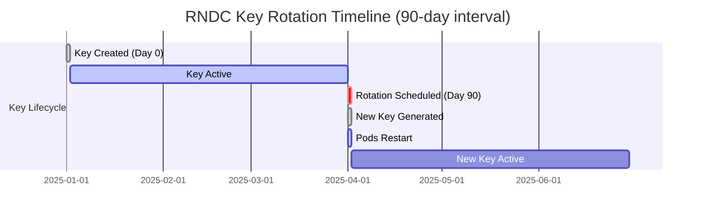

# RNDC Key Auto-Rotation

> **Compliance Feature**: RNDC key auto-rotation is critical for regulated environments (banking, healthcare, government) where credential rotation is mandatory for NIST SP 800-57, PCI DSS, SOC 2, and HIPAA compliance.

## Overview

Bindy supports automatic rotation of RNDC (Remote Name Daemon Control) keys to meet security compliance requirements. RNDC keys are HMAC-based shared secrets used to authenticate administrative commands to BIND9 DNS servers.

**Key Features:**

- **Automatic rotation** based on configurable time intervals (e.g., every 30, 60, or 90 days)
- **Manual rotation triggers** via annotation updates
- **Backward compatibility** with existing deployments
- **Zero-downtime rotation** with automatic pod restarts
- **Audit trail** with rotation timestamps and counts

---

## Why Rotate RNDC Keys?

### Security Best Practices

Long-lived cryptographic keys increase security risk:

- **Key compromise risk**: Longer key lifetime = more exposure to potential compromise
- **Credential sprawl**: Old keys may exist in backups, logs, or forgotten locations
- **Blast radius**: A compromised long-lived key affects all systems using it

**Industry Guidance:**

- NIST SP 800-57 recommends periodic key rotation for cryptographic key management
- PCI DSS 3.2 Requirement 8.2.4 mandates password/key changes at defined intervals
- SOC 2 Trust Service Criteria requires effective access control and key management

### Compliance Requirements

| Compliance Framework | Requirement | Bindy Feature |
|---------------------|-------------|---------------|
| **NIST SP 800-57** | Cryptographic key lifecycle management | Automated rotation with timestamps |
| **NIST SP 800-53 AC-2** | Account management and credential lifecycle | Rotation history and audit trail |
| **PCI DSS 3.2 Requirement 8.2.4** | Automated password/key changes at intervals | Configurable rotation intervals |
| **SOC 2** | Access control and key management | Automated rotation reduces human error |
| **HIPAA Security Rule** | Technical safeguards for secure communication | HMAC-based authentication with rotation |

---

## Configuration

### Basic Auto-Rotation Setup

Add `rndcKey` configuration to your `Bind9Instance` or `Bind9Cluster`:

```yaml
apiVersion: bindy.firestoned.io/v1beta1
kind: Bind9Instance
metadata:
  name: dns-primary
  namespace: dns-system
spec:
  clusterRef: my-cluster
  role: Primary
  rndcKey:
    autoRotate: true          # Enable automatic rotation
    rotateAfter: "2160h"      # Rotate every 90 days (default)
    algorithm: hmac-sha256    # HMAC algorithm (default)
```

### Rotation Intervals

The `rotateAfter` field supports Go-style duration strings:

| Duration | Equivalent | Use Case |
|----------|-----------|----------|
| `720h` | 30 days | **High security**: Frequent rotation |
| `1440h` | 60 days | **Standard**: Balanced security and ops overhead |
| `2160h` | 90 days | **Default**: NIST recommendation |
| `4320h` | 180 days | **Low overhead**: Minimal rotation frequency |

**Format Examples:**
- `24h` - 24 hours
- `720h` - 30 days (720 hours)
- `30d` - 30 days (requires parsing support)
- `12w` - 12 weeks (requires parsing support)

**Minimum**: 1 hour (enforced by rate limiting)
**Recommended**: 30-90 days for production environments

### Algorithm Selection

Supported HMAC algorithms (in order of strength):

```yaml
rndcKey:
  algorithm: hmac-sha512  # Strongest (recommended)
  # algorithm: hmac-sha384
  # algorithm: hmac-sha256  # Default
  # algorithm: hmac-sha224
  # algorithm: hmac-sha1    # Legacy (not recommended)
  # algorithm: hmac-md5     # Legacy (not recommended)
```

**Recommendation**: Use `hmac-sha512` for maximum security, `hmac-sha256` for broad compatibility.

---

## Configuration Precedence

RNDC key configuration follows this precedence order:

1. **Instance level** (`Bind9Instance.spec.rndcKey`) - Highest priority
2. **Role level** (`Bind9Cluster.spec.primary.rndcKey` or `.spec.secondary.rndcKey`)
3. **Default** (auto-generated with `autoRotate: false`)

**No global-level RNDC config**: RNDC keys are instance/role-specific for security isolation.

### Example: Role-Level Configuration

```yaml
apiVersion: bindy.firestoned.io/v1beta1
kind: Bind9Cluster
metadata:
  name: my-cluster
  namespace: dns-system
spec:
  primary:
    rndcKey:
      autoRotate: true
      rotateAfter: "720h"   # Primary: 30 days
      algorithm: hmac-sha512
  secondary:
    rndcKey:
      autoRotate: true
      rotateAfter: "1440h"  # Secondary: 60 days
      algorithm: hmac-sha256
```

### Example: Instance-Level Override

```yaml
apiVersion: bindy.firestoned.io/v1beta1
kind: Bind9Instance
metadata:
  name: dns-primary
  namespace: dns-system
spec:
  clusterRef: my-cluster
  role: Primary
  rndcKey:
    autoRotate: true
    rotateAfter: "360h"     # Override cluster: 15 days
    algorithm: hmac-sha512
```

---

## Three Modes of Operation

### Mode 1: Auto-Generated Keys (Recommended)

Bindy generates and manages RNDC keys automatically:

```yaml
apiVersion: bindy.firestoned.io/v1beta1
kind: Bind9Instance
metadata:
  name: dns-primary
spec:
  clusterRef: my-cluster
  role: Primary
  rndcKey:
    autoRotate: true
    rotateAfter: "2160h"
    algorithm: hmac-sha256
    # No secretRef or secret - operator generates keys
```

**Behavior:**

- Operator creates a Secret: `<instance-name>-rndc`
- Secret contains: `key-name`, `algorithm`, `secret`, `rndc.key`
- Rotation annotations track creation time, rotation time, and count
- Keys rotate automatically based on `rotateAfter` duration

**Use When:**

- ✅ You want fully automated key management
- ✅ You trust the operator to generate secure keys
- ✅ You need automated rotation

### Mode 2: User-Managed Secret Reference

Reference an existing Secret that you manage:

```yaml
apiVersion: bindy.firestoned.io/v1beta1
kind: Bind9Instance
metadata:
  name: dns-primary
spec:
  clusterRef: my-cluster
  role: Primary
  rndcKey:
    secretRef:
      name: my-rndc-secret  # Reference existing Secret
      keyNameKey: key-name
      algorithmKey: algorithm
      secretKey: secret
    # autoRotate is IGNORED for secretRef
```

**Behavior:**

- Operator uses the referenced Secret
- **No automatic rotation** - you must rotate manually
- Useful for externally managed secrets (e.g., HashiCorp Vault, AWS Secrets Manager)

**Use When:**

- ✅ You manage secrets externally
- ✅ You have existing RNDC keys
- ✅ You want manual control over rotation

### Mode 3: Inline Secret with Rotation

Embed a Secret specification with rotation support:

```yaml
apiVersion: bindy.firestoned.io/v1beta1
kind: Bind9Instance
metadata:
  name: dns-primary
spec:
  clusterRef: my-cluster
  role: Primary
  rndcKey:
    autoRotate: true
    rotateAfter: "2160h"
    secret:
      metadata:
        name: custom-rndc-secret
        labels:
          custom-label: value
      type: Opaque
      data:
        key-name: YmluZHktb3BlcmF0b3I=  # base64: bindy-operator
        algorithm: aG1hYy1zaGEyNTY=       # base64: hmac-sha256
        secret: <base64-encoded-secret>
```

**Behavior:**

- Operator creates Secret from inline spec
- Rotation enabled if `autoRotate: true`
- Useful for GitOps workflows with encrypted secrets

**Use When:**

- ✅ You want to version Secret specs in Git
- ✅ You use encrypted GitOps (e.g., Sealed Secrets, SOPS)
- ✅ You want automated rotation with custom Secret metadata

---

## Rotation Lifecycle

### How Rotation Works

1. **Rotation Due Detection**

   - Controller checks `bindy.firestoned.io/rndc-rotate-at` annotation
   - If `current_time >= rotate_at`, rotation is triggered

2. **Key Generation**

   - New HMAC key generated using cryptographically secure random bytes
   - Key size: 256 bits for SHA-256, 512 bits for SHA-512

3. **Secret Update**

   - Old Secret replaced atomically with new key
   - Annotations updated:
     - `rndc-created-at`: Current timestamp
     - `rndc-rotate-at`: `created_at + rotateAfter`
     - `rndc-rotation-count`: Incremented

4. **Pod Restart**

   - Deployment pod template annotation updated: `bindy.firestoned.io/rndc-rotated-at`
   - Kubernetes triggers rolling restart
   - New pods mount updated Secret with new key
   - Old pods gracefully terminated

5. **Status Update**
   - `Bind9Instance.status.rndcKeyRotationStatus` updated with rotation metadata

### Rotation Timeline



### Rate Limiting

**Minimum rotation interval**: 1 hour

If rotation is triggered multiple times within 1 hour (e.g., due to operator restarts), subsequent rotations are skipped to prevent infinite loops.

**Example**: If a Secret was rotated at `10:00 AM`, another rotation will not occur until `11:00 AM`, even if `rotate_at` is in the past.

---

## Monitoring Rotation Status

### View Rotation Metadata

```bash
kubectl get bind9instance dns-primary -n dns-system -o yaml
```

**Output:**

```yaml
status:
  rndcKeyRotationStatus:
    createdAt: "2025-01-01T00:00:00Z"
    rotateAt: "2025-04-01T00:00:00Z"    # 90 days later
    lastRotatedAt: "2025-01-01T00:00:00Z"  # Only if rotation_count > 0
    rotationCount: 5
```

### Check Secret Annotations

```bash
kubectl get secret dns-primary-rndc -n dns-system -o yaml
```

**Annotations:**

```yaml
metadata:
  annotations:
    bindy.firestoned.io/rndc-created-at: "2025-01-01T00:00:00Z"
    bindy.firestoned.io/rndc-rotate-at: "2025-04-01T00:00:00Z"
    bindy.firestoned.io/rndc-rotation-count: "5"
```

### Monitor Rotation Events

```bash
kubectl logs -n dns-system -l app.kubernetes.io/name=bindy-operator | grep "Rotating RNDC Secret"
```

**Expected Logs:**

```
INFO Rotating RNDC Secret dns-system/dns-primary-rndc (rotation #5)
INFO Successfully rotated RNDC Secret dns-system/dns-primary-rndc (rotation #5)
INFO Triggered Deployment dns-system/dns-primary rollout after RNDC rotation
```

---

## Manual Rotation Trigger

To force immediate rotation (e.g., suspected key compromise):

1. **Update the `created-at` annotation to a past timestamp**:

```bash
kubectl annotate secret dns-primary-rndc \
  bindy.firestoned.io/rndc-created-at="2020-01-01T00:00:00Z" \
  --overwrite \
  -n dns-system
```

2. **Wait for next reconciliation** (usually within 30-60 seconds)

3. **Verify rotation occurred**:

```bash
kubectl get secret dns-primary-rndc -n dns-system -o jsonpath='{.metadata.annotations.bindy\.firestoned\.io/rndc-rotation-count}'
```

**Result**: Rotation count increments, new key generated, pods restart.

---

## Troubleshooting

### Rotation Not Occurring

**Symptom**: `rotate_at` is in the past, but no rotation happens.

**Possible Causes:**

1. **Rate limiting**: Check if last rotation was < 1 hour ago
   ```bash
   kubectl get secret dns-primary-rndc -n dns-system -o jsonpath='{.metadata.annotations.bindy\.firestoned\.io/rndc-created-at}'
   ```

2. **Auto-rotation disabled**: Verify `autoRotate: true`
   ```bash
   kubectl get bind9instance dns-primary -n dns-system -o jsonpath='{.spec.rndcKey.autoRotate}'
   ```

3. **Using `secretRef`**: Secret references are NOT rotated automatically

### Pods Not Restarting After Rotation

**Symptom**: Secret rotated, but pods still use old key.

**Check Deployment annotation**:

```bash
kubectl get deployment dns-primary -n dns-system -o jsonpath='{.spec.template.metadata.annotations.bindy\.firestoned\.io/rndc-rotated-at}'
```

If annotation is missing or not updated, check operator logs:

```bash
kubectl logs -n dns-system -l app.kubernetes.io/name=bindy-operator | grep "Triggered Deployment"
```

### Infinite Rotation Loop

**Symptom**: Secret rotates every reconciliation cycle.

**Root Cause**: CRD schema mismatch - `rotateAt` field not persisted in status.

**Fix**:

1. **Verify CRD schema includes rotation status**:
   ```bash
   kubectl get crd bind9instances.bindy.firestoned.io -o yaml | grep -A 10 "rndcKeyRotationStatus"
   ```

2. **Regenerate and apply CRDs if needed**:
   ```bash
   cargo run --bin crdgen
   kubectl replace --force -f deploy/crds/bind9instances.crd.yaml
   ```

---

## Migration from Non-Rotating Keys

See [RNDC Key Rotation Migration Guide](../operations/rndc-key-rotation-migration.md) for detailed migration steps.

**Quick Summary:**

1. Existing instances with `rndcSecretRef` (deprecated field) continue to work
2. Add `rndcKey` configuration to enable rotation
3. Operator migrates seamlessly with backward compatibility

---

## Best Practices

### Production Recommendations

1. **Use 90-day rotation intervals** (`rotateAfter: "2160h"`) for compliance
2. **Use `hmac-sha512` algorithm** for maximum security
3. **Monitor rotation events** with logging/alerting
4. **Test rotation in dev/staging** before production
5. **Document rotation schedule** for audit purposes

### Security Considerations

- ✅ **DO** use auto-generated keys for automated rotation
- ✅ **DO** use `hmac-sha512` or `hmac-sha256` algorithms
- ✅ **DO** monitor rotation logs for audit trails
- ✅ **DO** test manual rotation triggers in non-production
- ❌ **DON'T** use `hmac-md5` or `hmac-sha1` (legacy algorithms)
- ❌ **DON'T** disable rotation in production environments
- ❌ **DON'T** manually edit Secret data during rotation
- ❌ **DON'T** set `rotateAfter` < 24 hours (unnecessary overhead)

### Compliance Auditing

For compliance audits, provide:

1. **Rotation policy documentation**: "All RNDC keys rotate every 90 days"
2. **Configuration evidence**: Show `rndcKey.autoRotate: true` in manifests
3. **Rotation history**: Extract from `status.rndcKeyRotationStatus.rotationCount`
4. **Audit logs**: Operator logs showing rotation events with timestamps

**Example Audit Report**:

```
Instance: dns-primary
Namespace: dns-system
Rotation Policy: Automatic every 90 days (2160h)
Current Key Created: 2025-01-15T10:30:00Z
Next Rotation: 2025-04-15T10:30:00Z
Total Rotations: 12
Compliance: NIST SP 800-57, PCI DSS 3.2, SOC 2
```

---

## Next Steps

- [RNDC Key Rotation Migration Guide](../operations/rndc-key-rotation-migration.md)
- [Compliance Overview](../compliance/overview.md)
- [Security Architecture](../security/architecture.md)
- [Troubleshooting Guide](../operations/troubleshooting.md)
