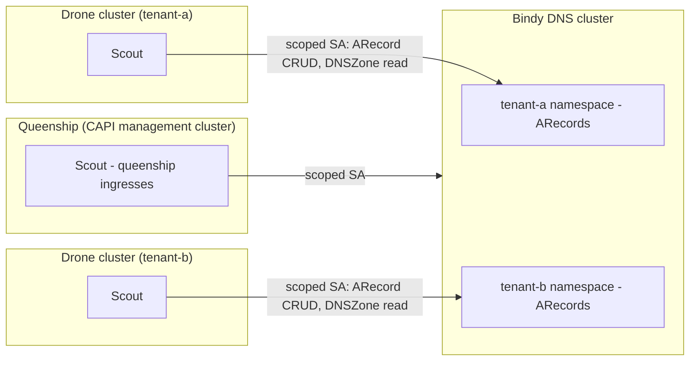

# Scout Deployment Topology (CAPI / k0rdent Fleets)

This page describes how to deploy Scout across a Cluster API (CAPI) or
[k0rdent](https://k0rdent.io/) fleet: one management cluster — the
**queenship** (sometimes called the mothership) — and many child **drone**
clusters, and explains why the recommended topology is **one Scout inside each
drone cluster** rather than a bank of Scouts on the queenship.

> **TL;DR — Recommendation (Option A):** run Scout inside every drone cluster,
> plus exactly one Scout on the queenship for the queenship's own ingresses.
> Never mount a drone's CAPI kubeconfig into a Scout pod on the queenship.

## The fleet model

In a CAPI/k0rdent fleet:

- The **queenship** hosts the CAPI controllers and, with hosted control planes
  (e.g. k0smotron), the drones' API servers themselves.
- Each **tenant namespace** on the queenship can own N drone clusters.
- CAPI stores each drone's **cluster-admin kubeconfig** as a Secret
  (`<cluster>-kubeconfig`) in that tenant namespace on the queenship.

Scout has a *watch side* and a *write side*:

- **Watch side (local client):** Ingresses, LoadBalancer Services, and Gateway
  API routes in the cluster the pod runs in.
- **Write side (remote client, Phase 2):** `ARecord` creation and `DNSZone`
  validation on the Bindy (DNS) cluster, authenticated via the kubeconfig in
  `BINDY_SCOUT_REMOTE_SECRET` — see
  [Scout — Multi-Cluster Mode](scout.md#multi-cluster-mode).

Because the watch side always uses the pod's **local** client, *where Scout
runs determines which cluster credential it must hold* — and that is the whole
security question.

## The two candidate topologies

### Option A — Scout per drone (recommended)

One Scout Deployment inside every drone. Each Scout watches its own cluster
with a narrowly-scoped local ServiceAccount, and the only foreign credential
it holds is a kubeconfig **pointing at the Bindy cluster**, scoped to that
tenant's namespace.

### Option B — Scouts centralized on the queenship (not recommended)

N Scout Deployments per tenant namespace on the queenship, one per drone. To
watch a drone's ingresses from the queenship, each Scout must run with the
drone's CAPI kubeconfig as its primary client — i.e. every one of these pods
mounts a **cluster-admin credential** for a drone.

## Why Option A wins the threat model

The decisive comparison is what a single compromised Scout pod yields:

| | Option A (per drone) | Option B (queenship) |
|---|---|---|
| Credential held by the pod | Bindy-cluster kubeconfig, scopable to one tenant namespace | Drone **cluster-admin** kubeconfig (CAPI-issued, not meaningfully scopable) |
| Blast radius of one compromise | One tenant's DNS records | Full admin of one drone cluster |
| With cluster-wide `secrets: get` (threat model I4) | That drone's Secrets only — and default Scout RBAC has **no** Secret rule | **Every drone kubeconfig of every tenant** on the queenship |
| Tenant isolation boundary | Cluster boundary (hard) | Namespace boundary on a shared cluster (soft) |
| Operational shape | 1 pod per drone, shipped as a fleet add-on | N × tenants pods concentrated on the queenship |
| Network requirement | Drone → Bindy API egress | None new |

Option B's only advantage — no new network path — buys concentration of
cluster-admin credentials for the whole fleet in the single most valuable
cluster you operate. It also inverts the credential direction: Option A holds
*low-privilege* credentials pointing **at** the DNS cluster; Option B holds
*high-privilege* credentials pointing **from** a shared cluster into every
tenant's workload cluster. The queenship is precisely where a Secret-read
compromise is most catastrophic, because its Secrets *are* admin access to
everything else.

With Option A, the worst case is manipulation of one tenant's DNS records —
bounded, attributable, and revocable per drone.

## Hardening checklist for Option A

Option A is only as good as the scoping around it:

1. **No cluster-wide Secret read.** Scout's default RBAC carries no Secret
   rule at all; Phase 2 mode grants a namespaced, `resourceNames`-restricted
   Role for the single remote-kubeconfig Secret. See
   [RBAC for Phase 2 Mode](scout.md#rbac-for-phase-2-multi-cluster-mode) and
   threat model item
   [I4](../security/threat-model.md#i4-scout-cluster-wide-secret-read).
2. **Per-drone identities on the Bindy cluster.** Each drone's Scout gets its
   own ServiceAccount on the Bindy cluster, RBAC-limited to that tenant's
   namespace: `create`/`update`/`delete` on `arecords`, `get`/`list` on
   `dnszones`. Audit logs then attribute every record write to a specific
   drone, and one drone can be revoked without touching the fleet.
3. **Admission policy on the Bindy cluster.** Enforce that tenant-a's Scout
   identity can only write records in tenant-a's zones. This contains the
   residual "compromised Scout hijacks DNS" scenario to the tenant that was
   compromised.
4. **Network egress.** Allow each drone to reach only the Bindy cluster's API
   endpoint — the sole new network path this topology introduces.

## Rolling Scout out to the fleet

Ship Scout to drones as part of the cluster add-on stack rather than by hand:

- In k0rdent, package the Scout Deployment (with its scoped RBAC and the
  Phase 2 Secret) as a **ServiceTemplate**, and target it at drones with a
  **MultiClusterService** so every new drone receives Scout automatically at
  provisioning time.
- The per-drone Bindy-side credential (ServiceAccount + Role + zone admission
  entry) is created on the Bindy cluster when the tenant/drone is onboarded,
  and its kubeconfig is delivered to the drone as the
  `BINDY_SCOUT_REMOTE_SECRET` Secret.
- The queenship's own Scout is an ordinary [same-cluster or Phase 2
  deployment](scout.md#multi-cluster-mode) with no special privileges.

## Decision record

This topology is captured as
[ADR-0002](https://github.com/firestoned/bindy/blob/main/docs/adr/0002-scout-deployment-topology.md)
(Scout Deployment Topology in CAPI/k0rdent Fleets): **Option A accepted**.
