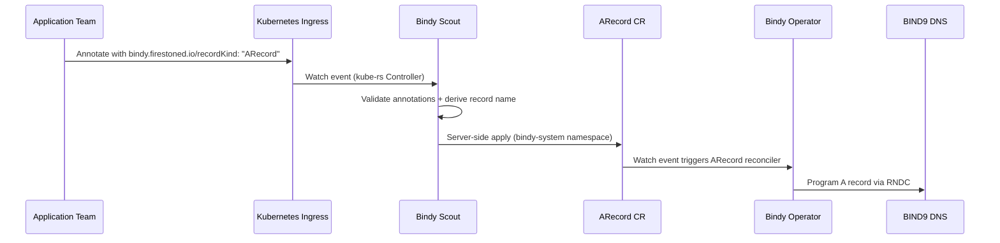

# Bindy Scout

!!! info "Same-Cluster Mode is the Default (Phase 1)"
    When `BINDY_SCOUT_REMOTE_SECRET` is **not set**, Scout and the Bindy operator must run in the **same Kubernetes cluster**. This is the default mode and requires no additional configuration.

    **Phase 2 (remote cluster mode)** is also available: set `BINDY_SCOUT_REMOTE_SECRET` to a Secret containing a kubeconfig for the dedicated Bindy cluster. Scout will use that kubeconfig to create ARecords and validate zones on the remote cluster while still watching local Ingresses.

## The Scout Bee

In a honeybee colony, **scout bees** are the advance team. While the main workers tend the hive, a small number of scouts venture out into the surrounding terrain, find promising flower patches, return to the hive, and communicate their discoveries through the *waggle dance* — a precise, information-rich signal that tells their sisters exactly where the nectar is.

**Bindy Scout** plays the same role in your Kubernetes infrastructure.

The main `bindy run` process is the hive — it manages BIND9 DNS infrastructure and reconciles DNS zones and records from their canonical CRD definitions. But it doesn't know about every application that flies around your cluster. That's where Scout comes in.

Scout is a lightweight, event-driven controller that ventures into your workload namespaces, watches `Ingress` resources, and — when it finds one annotated with the right signal — carries that DNS information back to the bindy cluster and registers an `ARecord` on the application's behalf.

The application team annotates their Ingress. Scout finds it, validates it, derives the correct record name from the DNS zone, and server-side applies the `ARecord` CR in the bindy namespace. From there, the normal `ARecord` reconciler picks it up and programs BIND9. The application never needs to know how DNS works — it just raises a flag and Scout handles the rest.

---

## What Scout Solves

In a multi-team platform, the DNS operator and the application teams live in different worlds:

- The **platform team** owns the `bindy-system` namespace, the `DNSZone` CRs, and the BIND9 instances.
- **Application teams** own their own namespaces, `Deployment` objects, and `Ingress` resources.

Bridging this gap traditionally requires either:

- Manual DNS record management (error-prone, doesn't scale), or
- Granting application teams write access to the `bindy-system` namespace (violates least-privilege).

Scout eliminates both compromises. Application teams annotate their own Ingresses — resources they already own — and Scout does the translation work. No cross-namespace write access required on the application side.

---

## How It Works



1. Scout watches **all Ingress resources** cluster-wide (excluding its own namespace and any configured exclusions).
2. When an Ingress event fires, Scout checks for the `bindy.firestoned.io/recordKind: "ARecord"` annotation.
3. If enabled, Scout reads the zone annotation, derives the DNS record name (e.g. `app.example.com` → record name `app` in zone `example.com`), and resolves the IP from the LoadBalancer status or an explicit annotation override.
4. Scout **server-side applies** an `ARecord` CR in the configured target namespace (default: `bindy-system`), stamped with labels identifying the source cluster, namespace, and Ingress.
5. The main bindy operator's `ARecord` reconciler picks up the new CR and programs BIND9.

---

## Quick Start

### 1. Annotate your Ingress

**Minimal** — when Scout is configured with `--default-zone` and `--default-ips`:

```yaml
apiVersion: networking.k8s.io/v1
kind: Ingress
metadata:
  name: my-app
  namespace: my-app-ns
  annotations:
    bindy.firestoned.io/scout-enabled: "true"
spec:
  rules:
    - host: my-app.example.com
      ...
```

**With overrides** — per-Ingress zone and IP take precedence over Scout defaults:

```yaml
apiVersion: networking.k8s.io/v1
kind: Ingress
metadata:
  name: my-app
  namespace: my-app-ns
  annotations:
    bindy.firestoned.io/scout-enabled: "true"
    # Override the default zone for this Ingress (optional when --default-zone is set)
    bindy.firestoned.io/zone: "example.com"
    # Optional: explicit IP override (overrides --default-ips and LB status)
    # bindy.firestoned.io/ip: "10.0.1.42"
    # Optional: TTL override in seconds (defaults to zone TTL)
    # bindy.firestoned.io/ttl: "300"
spec:
  rules:
    - host: my-app.example.com
      http:
        paths:
          - path: /
            pathType: Prefix
            backend:
              service:
                name: my-app
                port:
                  number: 80
```

Scout will create an `ARecord` named `scout-<cluster>-my-app-ns-my-app-0` in the `bindy-system` namespace, with:

- `spec.name`: `my-app` (derived by stripping the zone suffix from the host)
- `spec.address`: IP from the Ingress LoadBalancer status
- Labels: `bindy.firestoned.io/source-cluster`, `source-namespace`, `source-ingress`, `zone`

### 2. Deploy Scout

```yaml
apiVersion: apps/v1
kind: Deployment
metadata:
  name: bindy-scout
  namespace: bindy-system
spec:
  replicas: 1
  selector:
    matchLabels:
      app: bindy-scout
  template:
    metadata:
      labels:
        app: bindy-scout
    spec:
      serviceAccountName: bindy-scout
      containers:
        - name: scout
          image: ghcr.io/firestoned/bindy:latest
          args: ["scout", "--bind9-cluster-name", "prod"]
          env:
            - name: BINDY_SCOUT_NAMESPACE
              value: "bindy-system"
            - name: POD_NAMESPACE
              valueFrom:
                fieldRef:
                  fieldPath: metadata.namespace
            - name: RUST_LOG
              value: "info"
            - name: RUST_LOG_FORMAT
              value: "json"
```

---

## Annotations Reference

| Annotation | Required | Description |
|---|---|---|
| `bindy.firestoned.io/scout-enabled` | **Yes** (preferred) | Set to `"true"` to opt this Ingress into Scout management. The record kind always defaults to `ARecord`. |
| `bindy.firestoned.io/recordKind` | *(legacy)* | Accepted for backward compatibility. `"ARecord"` opts in. Prefer `scout-enabled: "true"` for new deployments. |
| `bindy.firestoned.io/zone` | **Yes** (unless `--default-zone` is set) | The DNS zone that owns the Ingress hosts (e.g. `example.com`). Overrides the operator's `--default-zone`. Hosts outside the zone are skipped with a warning. |
| `bindy.firestoned.io/ip` | No | Explicit IP address for the A record. When set, overrides both `--default-ips` and the Ingress LoadBalancer status. |
| `bindy.firestoned.io/ttl` | No | TTL override in seconds. When absent, the created `ARecord` inherits the TTL from the `DNSZone` spec. |

---

## Ingress Rules and Record Naming

Scout processes **each rule in the Ingress spec independently**. For a multi-host Ingress:

```yaml
spec:
  rules:
    - host: api.example.com      # → ARecord "scout-prod-ns-name-0"  (name: "api")
    - host: www.example.com      # → ARecord "scout-prod-ns-name-1"  (name: "www")
    - host: other.io             # → skipped (not in zone "example.com")
```

The record name is derived by stripping the zone suffix from the host:

| Host | Zone | Derived record name |
|---|---|---|
| `api.example.com` | `example.com` | `api` |
| `deep.sub.example.com` | `example.com` | `deep.sub` |
| `example.com` | `example.com` | `@` (apex record) |
| `other.io` | `example.com` | *(skipped — not in zone)* |

---

## Labels on Created ARecords

Every `ARecord` created by Scout carries these labels:

| Label | Value | Purpose |
|---|---|---|
| `bindy.firestoned.io/managed-by` | `scout` | Identifies Scout as the manager |
| `bindy.firestoned.io/source-cluster` | `<BINDY_SCOUT_CLUSTER_NAME>` | Cluster where the Ingress lives |
| `bindy.firestoned.io/source-namespace` | Ingress namespace | Source namespace for traceability |
| `bindy.firestoned.io/source-ingress` | Ingress name | Source Ingress name |
| `bindy.firestoned.io/zone` | Zone name | Allows `DNSZone.spec.recordsFrom` label selectors to discover the record |

The `zone` label is particularly important: it lets you configure a `DNSZone` to automatically pull in all ARecords created by Scout for that zone:

```yaml
apiVersion: bindy.firestoned.io/v1beta1
kind: DNSZone
metadata:
  name: example-com
spec:
  zoneName: example.com
  recordsFrom:
    - labelSelector:
        matchLabels:
          bindy.firestoned.io/managed-by: scout
          bindy.firestoned.io/zone: example.com
```

---

## Configuration Reference

### CLI Flags

| Flag | Description |
|---|---|
| `--bind9-cluster-name <NAME>` | **Required** (unless env var set). Logical name of this cluster stamped on all created ARecord labels. Used to distinguish records created by different clusters writing to the same bindy namespace. |
| `--namespace <NS>` | Namespace where ARecords are created. Defaults to `bindy-system`. |
| `--default-zone <ZONE>` | Default DNS zone applied to all Ingresses when no `bindy.firestoned.io/zone` annotation is present (e.g. `example.com`). When combined with `--default-ips`, Ingresses only need `bindy.firestoned.io/scout-enabled: "true"`. |
| `--default-ips <IP[,IP]>` | Comma-separated default IP address(es) used for all Ingresses when no per-Ingress `bindy.firestoned.io/ip` annotation or LoadBalancer status IP is available. Useful for shared-ingress topologies (e.g. Traefik). |

CLI flags take precedence over the corresponding environment variables.

### Environment Variables

| Variable | Default | Description |
|---|---|---|
| `BINDY_SCOUT_CLUSTER_NAME` | — | **Required** when `--bind9-cluster-name` is not set. |
| `BINDY_SCOUT_NAMESPACE` | `bindy-system` | Namespace where ARecords are created. |
| `POD_NAMESPACE` | `default` | Scout's own namespace. Always excluded from Ingress watching to prevent Scout from watching resources in its own namespace. Injected automatically by the Kubernetes downward API. |
| `BINDY_SCOUT_EXCLUDE_NAMESPACES` | — | Comma-separated list of additional namespaces to skip. Useful to exclude system namespaces (`kube-system`, `kube-public`, etc.) that will never have Scout-annotated Ingresses. |
| `BINDY_SCOUT_DEFAULT_ZONE` | — | Default DNS zone for all Ingresses when no `bindy.firestoned.io/zone` annotation is present. Overridden by `--default-zone`. When set alongside `BINDY_SCOUT_DEFAULT_IPS`, Ingresses only need `bindy.firestoned.io/scout-enabled: "true"`. |
| `BINDY_SCOUT_DEFAULT_IPS` | — | Comma-separated default IP address(es) used when no per-Ingress annotation override or LoadBalancer status IP is available. Useful for shared-ingress topologies (e.g. Traefik) where all Ingresses resolve to the same VIP(s). Overridden by `--default-ips`. |
| `BINDY_SCOUT_REMOTE_SECRET` | — | **(Phase 2)** Name of a Secret in the local cluster containing a `kubeconfig` key. When set, Scout targets the remote Bindy cluster for ARecord creation and zone validation. When unset, same-cluster mode is used. |
| `BINDY_SCOUT_REMOTE_SECRET_NAMESPACE` | Scout's own namespace | **(Phase 2)** Namespace of the `BINDY_SCOUT_REMOTE_SECRET`. Defaults to Scout's own namespace (`POD_NAMESPACE`). |
| `RUST_LOG` | `info` | Log level: `trace`, `debug`, `info`, `warn`, `error`. |
| `RUST_LOG_FORMAT` | `text` | Log format: `text` (compact, human-readable) or `json` (structured, for log aggregators). |

### Full Deployment Example with All Variables

```yaml
apiVersion: apps/v1
kind: Deployment
metadata:
  name: bindy-scout
  namespace: bindy-system
spec:
  replicas: 1
  selector:
    matchLabels:
      app.kubernetes.io/name: bindy
      app.kubernetes.io/component: scout
  template:
    metadata:
      labels:
        app.kubernetes.io/name: bindy
        app.kubernetes.io/component: scout
    spec:
      serviceAccountName: bindy-scout
      containers:
        - name: scout
          image: ghcr.io/firestoned/bindy:latest
          args:
            - scout
            # Alternatively: --bind9-cluster-name prod
          env:
            - name: BINDY_SCOUT_CLUSTER_NAME
              value: "prod"
            - name: BINDY_SCOUT_NAMESPACE
              value: "bindy-system"
            - name: POD_NAMESPACE
              valueFrom:
                fieldRef:
                  fieldPath: metadata.namespace
            - name: BINDY_SCOUT_EXCLUDE_NAMESPACES
              value: "kube-system,kube-public,kube-node-lease"
            - name: RUST_LOG
              value: "info"
            - name: RUST_LOG_FORMAT
              value: "json"
          resources:
            requests:
              cpu: "50m"
              memory: "64Mi"
            limits:
              cpu: "200m"
              memory: "128Mi"
```

---

## RBAC Requirements

Scout requires read access to `Ingress` and `DNSZone` resources cluster-wide, and write access to `ARecord` resources in the target namespace.

```yaml
---
apiVersion: v1
kind: ServiceAccount
metadata:
  name: bindy-scout
  namespace: bindy-system
---
apiVersion: rbac.authorization.k8s.io/v1
kind: ClusterRole
metadata:
  name: bindy-scout
rules:
  # Watch Ingresses across all namespaces
  - apiGroups: ["networking.k8s.io"]
    resources: ["ingresses"]
    verbs: ["get", "list", "watch"]
  # Read DNSZones for zone validation
  - apiGroups: ["bindy.firestoned.io"]
    resources: ["dnszones"]
    verbs: ["get", "list", "watch"]
---
apiVersion: rbac.authorization.k8s.io/v1
kind: ClusterRoleBinding
metadata:
  name: bindy-scout
subjects:
  - kind: ServiceAccount
    name: bindy-scout
    namespace: bindy-system
roleRef:
  kind: ClusterRole
  name: bindy-scout
  apiGroup: rbac.authorization.k8s.io
---
# Separate Role for writing ARecords in the target namespace
apiVersion: rbac.authorization.k8s.io/v1
kind: Role
metadata:
  name: bindy-scout-writer
  namespace: bindy-system
rules:
  - apiGroups: ["bindy.firestoned.io"]
    resources: ["arecords"]
    verbs: ["get", "list", "watch", "create", "update", "patch", "delete"]
---
apiVersion: rbac.authorization.k8s.io/v1
kind: RoleBinding
metadata:
  name: bindy-scout-writer
  namespace: bindy-system
subjects:
  - kind: ServiceAccount
    name: bindy-scout
    namespace: bindy-system
roleRef:
  kind: Role
  name: bindy-scout-writer
  apiGroup: rbac.authorization.k8s.io
```

---

## Namespace Exclusions

Scout always excludes its own namespace (`POD_NAMESPACE`) from Ingress watching. This prevents:

- Scout from watching its own Ingresses (if any) and creating circular references.
- Unintended ARecords from platform Ingresses in the bindy namespace.

To exclude additional namespaces:

```yaml
env:
  - name: BINDY_SCOUT_EXCLUDE_NAMESPACES
    value: "kube-system,kube-public,kube-node-lease,monitoring"
```

---

## Roadmap

Scout is currently in **Phase 1 — same-cluster mode**. All features are tracked in
[`docs/roadmaps/bindy-scout-ingress-controller.md`](../../roadmaps/bindy-scout-ingress-controller.md).

| Phase | Status | Description |
|---|---|---|
| Phase 1 | ✅ Current | Same-cluster mode. Scout and bindy run in the same cluster. ARecords are created in the same cluster. |
| Phase 1.5 | ✅ Complete | Finalizer on Ingress. When an annotated Ingress is deleted, Scout removes the corresponding ARecord. |
| Phase 2 | ✅ Complete | Remote cluster mode. Set `BINDY_SCOUT_REMOTE_SECRET` to a Secret containing a kubeconfig for the Bindy cluster. Scout uses it to write ARecords and validate zones remotely. |
