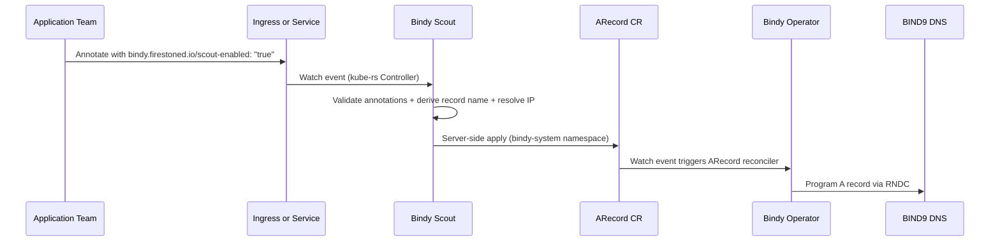
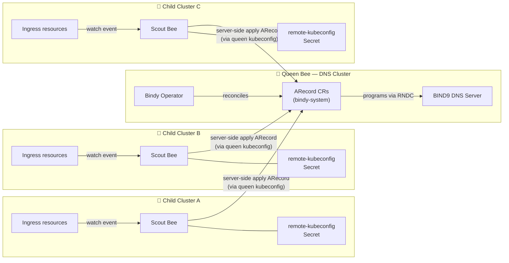
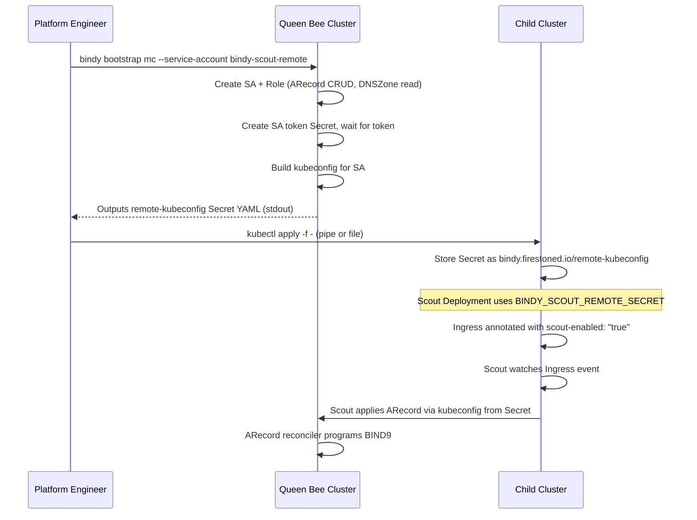

#  Bindy Scout

!!! info "Two Deployment Modes"
    **[Same-cluster mode](#quick-start)** (default): Scout and the Bindy operator run in the same cluster. No extra configuration needed.

    **[Remote cluster mode](#multi-cluster-mode)**: Scout runs on a workload cluster and writes to a dedicated Bindy cluster elsewhere. Set `BINDY_SCOUT_REMOTE_SECRET` to a Secret containing a kubeconfig for the Bindy cluster. Scout will create ARecords and validate zones there while watching local Ingresses and Services.

## The Scout Bee

In a honeybee colony, **scout bees** are the advance team. While the main workers tend the hive, a small number of scouts venture out into the surrounding terrain, find promising flower patches, return to the hive, and communicate their discoveries through the *waggle dance* — a precise, information-rich signal that tells their sisters exactly where the nectar is.

**Bindy Scout** plays the same role in your Kubernetes infrastructure.

The main `bindy run` process is the hive — it manages BIND9 DNS infrastructure and reconciles DNS zones and records from their canonical CRD definitions. But it doesn't know about every application that flies around your cluster. That's where Scout comes in.

Scout is a lightweight, event-driven controller that ventures into your workload namespaces, watches `Ingress` and `LoadBalancer Service` resources, and — when it finds one annotated with the right signal — carries that DNS information back to the bindy cluster and registers an `ARecord` on the application's behalf.

The application team annotates their Ingress or Service. Scout finds it, validates it, derives the correct record name from the DNS zone, and server-side applies the `ARecord` CR in the bindy namespace. From there, the normal `ARecord` reconciler picks it up and programs BIND9. The application never needs to know how DNS works — it just raises a flag and Scout handles the rest.

---

## What Scout Solves

In a multi-team platform, the DNS operator and the application teams live in different worlds:

- The **platform team** owns the `bindy-system` namespace, the `DNSZone` CRs, and the BIND9 instances.
- **Application teams** own their own namespaces, `Deployment` objects, and `Ingress` resources.

Bridging this gap traditionally requires either:

- Manual DNS record management (error-prone, doesn't scale), or
- Granting application teams write access to the `bindy-system` namespace (violates least-privilege).

Scout eliminates both compromises. Application teams annotate their own Ingresses — resources they already own — and Scout does the translation work. No cross-namespace write access required on the application side.

---

## How It Works



1. Scout watches **all `Ingress` and `LoadBalancer Service` resources** cluster-wide (excluding its own namespace and any configured exclusions).
2. When a watch event fires, Scout checks for the `bindy.firestoned.io/scout-enabled: "true"` annotation.
3. If enabled, Scout reads the zone annotation, derives the DNS record name, and resolves the IP — from the LoadBalancer status or an explicit annotation override.
   - **Ingress**: record name derived by stripping the zone suffix from each rule host (e.g. `app.example.com` in zone `example.com` → `app`). One `ARecord` per rule host.
   - **Service**: record name is the Service name. Exactly one `ARecord` per Service.
4. Scout **server-side applies** an `ARecord` CR in the configured target namespace (default: `bindy-system`), stamped with labels identifying the source cluster, namespace, and resource.
5. The main bindy operator's `ARecord` reconciler picks up the new CR and programs BIND9.

---

## Quick Start

### 1. Annotate your Ingress or Service

**Minimal** — when Scout is configured with `--default-zone` and `--default-ips`:

```yaml
apiVersion: networking.k8s.io/v1
kind: Ingress
metadata:
  name: my-app
  namespace: my-app-ns
  annotations:
    bindy.firestoned.io/scout-enabled: "true"
spec:
  rules:
    - host: my-app.example.com
      ...
```

**With overrides** — per-Ingress zone and IP take precedence over Scout defaults:

```yaml
apiVersion: networking.k8s.io/v1
kind: Ingress
metadata:
  name: my-app
  namespace: my-app-ns
  annotations:
    bindy.firestoned.io/scout-enabled: "true"
    # Override the default zone for this Ingress (optional when --default-zone is set)
    bindy.firestoned.io/zone: "example.com"
    # Optional: explicit IP override (overrides --default-ips and LB status)
    # bindy.firestoned.io/ip: "10.0.1.42"
    # Optional: TTL override in seconds (defaults to zone TTL)
    # bindy.firestoned.io/ttl: "300"
spec:
  rules:
    - host: my-app.example.com
      http:
        paths:
          - path: /
            pathType: Prefix
            backend:
              service:
                name: my-app
                port:
                  number: 80
```

Scout will create an `ARecord` named `scout-<cluster>-my-app-ns-my-app-0` in the `bindy-system` namespace, with:

- `spec.name`: `my-app` (derived by stripping the zone suffix from the host)
- `spec.address`: IP from the Ingress LoadBalancer status
- Labels: `bindy.firestoned.io/source-cluster`, `source-namespace`, `source-name`, `zone`

**For a LoadBalancer Service:**

```yaml
apiVersion: v1
kind: Service
metadata:
  name: my-grpc-api
  namespace: my-app-ns
  annotations:
    bindy.firestoned.io/scout-enabled: "true"
    bindy.firestoned.io/zone: "example.com"
spec:
  type: LoadBalancer
  selector:
    app: my-grpc-api
  ports:
    - port: 9090
      targetPort: 9090
```

Scout will create an `ARecord` named `scout-<cluster>-my-app-ns-my-grpc-api` in the `bindy-system` namespace, resolving to `my-grpc-api.example.com`.

### 2. Deploy Scout

```yaml
apiVersion: apps/v1
kind: Deployment
metadata:
  name: bindy-scout
  namespace: bindy-system
spec:
  replicas: 1
  selector:
    matchLabels:
      app: bindy-scout
  template:
    metadata:
      labels:
        app: bindy-scout
    spec:
      serviceAccountName: bindy-scout
      containers:
        - name: scout
          image: ghcr.io/firestoned/bindy:latest
          args: ["scout", "--cluster-name", "prod"]
          env:
            - name: BINDY_SCOUT_NAMESPACE
              value: "bindy-system"
            - name: POD_NAMESPACE
              valueFrom:
                fieldRef:
                  fieldPath: metadata.namespace
            - name: RUST_LOG
              value: "info"
            - name: RUST_LOG_FORMAT
              value: "json"
```

---

## Annotations Reference

These annotations apply to both `Ingress` and `LoadBalancer Service` resources.

| Annotation | Required | Description |
|---|---|---|
| `bindy.firestoned.io/scout-enabled` | **Yes** (preferred) | Set to `"true"` to opt this Ingress or Service into Scout management. The record kind always defaults to `ARecord`. |
| `bindy.firestoned.io/recordKind` | *(legacy, Ingress only)* | Accepted for backward compatibility. `"ARecord"` opts in. Prefer `scout-enabled: "true"` for new deployments. |
| `bindy.firestoned.io/zone` | **Yes** (unless `--default-zone` is set) | The DNS zone for this resource (e.g. `example.com`). Overrides the operator's `--default-zone`. For Ingress: hosts outside the zone are skipped with a warning. |
| `bindy.firestoned.io/ip` | No | Explicit IP address for the A record. When set, overrides both `--default-ips` and the LoadBalancer status IP. |
| `bindy.firestoned.io/ttl` | No | TTL override in seconds. When absent, the created `ARecord` inherits the TTL from the `DNSZone` spec. |

---

## Watched Resources

Scout supports three categories of Kubernetes resources as DNS record sources.

---

### 1. Ingresses (Legacy)

!!! note "Kubernetes Ingress is deprecated"
    The `networking.k8s.io/v1` Ingress API is considered legacy in modern Kubernetes clusters. New deployments should prefer [Gateway API](#3-gateway-api-httproute-and-tlsroute) (HTTPRoute / TLSRoute) where available. Scout continues to support Ingress for backward compatibility.

Scout processes **each rule in the Ingress spec independently**. For a multi-host Ingress:

```yaml
spec:
  rules:
    - host: api.example.com      # → ARecord "scout-prod-ns-name-0"  (name: "api")
    - host: www.example.com      # → ARecord "scout-prod-ns-name-1"  (name: "www")
    - host: other.io             # → skipped (not in zone "example.com")
```

The record name is derived by stripping the zone suffix from the host:

| Host | Zone | Derived record name |
|---|---|---|
| `api.example.com` | `example.com` | `api` |
| `deep.sub.example.com` | `example.com` | `deep.sub` |
| `example.com` | `example.com` | `@` (apex record) |
| `other.io` | `example.com` | *(skipped — not in zone)* |

Opt in with the `bindy.firestoned.io/scout-enabled: "true"` annotation. One `ARecord` CR is created per rule host, named `scout-{cluster}-{namespace}-{ingress}-{idx}`. The IP is resolved from the Ingress LoadBalancer status or the `bindy.firestoned.io/ip` annotation override.

---

### 2. Services (LoadBalancer)

Scout watches `LoadBalancer` Services and automatically creates `ARecord` CRs — no Ingress required. This covers gRPC, TCP, and other non-HTTP workloads exposed directly via a cloud load balancer.

**Opt in** with the same annotation:

```yaml
apiVersion: v1
kind: Service
metadata:
  name: my-grpc-api
  namespace: my-app
  annotations:
    bindy.firestoned.io/scout-enabled: "true"
    bindy.firestoned.io/zone: "example.com"          # required if no --default-zone
    # bindy.firestoned.io/ip: "1.2.3.4"              # optional IP override
    # bindy.firestoned.io/ttl: "300"                  # optional TTL override
spec:
  type: LoadBalancer
  selector:
    app: my-grpc-api
  ports:
    - port: 443
      targetPort: 8443
```

Scout creates an `ARecord` named `scout-{cluster}-{namespace}-{service}` with:

- DNS record name: `{service-name}` (relative to the zone) → resolves to `my-grpc-api.example.com`
- IP: from `bindy.firestoned.io/ip` annotation → `--default-ips` → `status.loadBalancer.ingress[].ip`

**`ClusterIP` and `NodePort` services are silently skipped** — they have no routable external IP.

If no external IP has been assigned yet, Scout logs a warning and re-queues after 30s:

```
WARN scout: service my-app/my-grpc-api has no external IP yet; requeueing in 30s
```

**Comparison with Ingress:**

| | Ingress | Service |
|---|---|---|
| ARecord per rule | Yes (one per `rules[].host`) | No — exactly one record |
| CR name suffix | `...-{idx}` (rule index) | No index |
| IP source | LB status or annotation | LB status or annotation |
| Source label | `source-name` | `source-name` |

Query all Service-sourced ARecords:

```bash
kubectl get arecords -n bindy-system -l bindy.firestoned.io/source-name=<service-name>
```

---

### 3. Gateway API (HTTPRoute and TLSRoute)

Scout watches `HTTPRoute` and `TLSRoute` resources from `gateway.networking.k8s.io/v1` and creates one `ARecord` per hostname in `spec.hostnames[]`. The same opt-in annotation (`bindy.firestoned.io/scout-enabled: "true"`) and zone/IP/TTL annotations apply.

!!! note "IP address required"
    Gateway API routes have no `LoadBalancer` status. The IP must be supplied via the `bindy.firestoned.io/ip` annotation or the `BINDY_SCOUT_DEFAULT_IPS` environment variable. Without one of these Scout will requeue the route until an IP is available.

See [Gateway API Routes](#gateway-api-routes-httproute-and-tlsroute) for the full reference, examples, record naming, labels, and RBAC requirements.

---

## Labels on Created ARecords

Every `ARecord` created by Scout carries these labels:

| Label | Value | Source |
|---|---|---|
| `bindy.firestoned.io/managed-by` | `scout` | All |
| `bindy.firestoned.io/source-cluster` | `<BINDY_SCOUT_CLUSTER_NAME>` | All |
| `bindy.firestoned.io/source-namespace` | Resource namespace | All |
| `bindy.firestoned.io/source-name` | Resource name | All |
| `bindy.firestoned.io/zone` | Zone name | All |

The `zone` label is particularly important: it lets you configure a `DNSZone` to automatically pull in all ARecords created by Scout for that zone:

```yaml
apiVersion: bindy.firestoned.io/v1beta1
kind: DNSZone
metadata:
  name: example-com
spec:
  zoneName: example.com
  recordsFrom:
    - labelSelector:
        matchLabels:
          bindy.firestoned.io/managed-by: scout
          bindy.firestoned.io/zone: example.com
```

---

## Configuration Reference

### CLI Flags

| Flag | Description |
|---|---|
| `--cluster-name <NAME>` | **Required** (unless env var set). Logical name of this cluster stamped on all created ARecord labels. Used to distinguish records created by different clusters writing to the same bindy namespace. |
| `--namespace <NS>` | Namespace where ARecords are created. Defaults to `bindy-system`. |
| `--default-zone <ZONE>` | Default DNS zone applied to all Ingresses and Services when no `bindy.firestoned.io/zone` annotation is present (e.g. `example.com`). When combined with `--default-ips`, resources only need `bindy.firestoned.io/scout-enabled: "true"`. |
| `--default-ips <IP[,IP]>` | Comma-separated default IP address(es) used when no per-resource `bindy.firestoned.io/ip` annotation or LoadBalancer status IP is available. Useful for shared-ingress topologies (e.g. Traefik). |

CLI flags take precedence over the corresponding environment variables.

### Environment Variables

| Variable | Default | Description |
|---|---|---|
| `BINDY_SCOUT_CLUSTER_NAME` | — | **Required** when `--cluster-name` is not set. |
| `BINDY_SCOUT_NAMESPACE` | `bindy-system` | Namespace where ARecords are created. |
| `POD_NAMESPACE` | `default` | Scout's own namespace. Always excluded from Ingress watching to prevent Scout from watching resources in its own namespace. Injected automatically by the Kubernetes downward API. |
| `BINDY_SCOUT_EXCLUDE_NAMESPACES` | — | Comma-separated list of additional namespaces to skip. Useful to exclude system namespaces (`kube-system`, `kube-public`, etc.) that will never have Scout-annotated Ingresses. |
| `BINDY_SCOUT_DEFAULT_ZONE` | — | Default DNS zone for all Ingresses and Services when no `bindy.firestoned.io/zone` annotation is present. Overridden by `--default-zone`. When set alongside `BINDY_SCOUT_DEFAULT_IPS`, resources only need `bindy.firestoned.io/scout-enabled: "true"`. |
| `BINDY_SCOUT_DEFAULT_IPS` | — | Comma-separated default IP address(es) used when no per-resource annotation override or LoadBalancer status IP is available. Useful for shared-ingress topologies (e.g. Traefik) where all resources resolve to the same VIP(s). Overridden by `--default-ips`. |
| `BINDY_SCOUT_REMOTE_SECRET` | — | **(Phase 2)** Name of a Secret in the local cluster containing a `kubeconfig` key. When set, Scout targets the remote Bindy cluster for ARecord creation and zone validation. When unset, same-cluster mode is used. |
| `BINDY_SCOUT_REMOTE_SECRET_NAMESPACE` | Scout's own namespace | **(Phase 2)** Namespace of the `BINDY_SCOUT_REMOTE_SECRET`. Defaults to Scout's own namespace (`POD_NAMESPACE`). |
| `RUST_LOG` | `info` | Log level: `trace`, `debug`, `info`, `warn`, `error`. |
| `RUST_LOG_FORMAT` | `text` | Log format: `text` (compact, human-readable) or `json` (structured, for log aggregators). |

### Full Deployment Example with All Variables

```yaml
apiVersion: apps/v1
kind: Deployment
metadata:
  name: bindy-scout
  namespace: bindy-system
spec:
  replicas: 1
  selector:
    matchLabels:
      app.kubernetes.io/name: bindy
      app.kubernetes.io/component: scout
  template:
    metadata:
      labels:
        app.kubernetes.io/name: bindy
        app.kubernetes.io/component: scout
    spec:
      serviceAccountName: bindy-scout
      containers:
        - name: scout
          image: ghcr.io/firestoned/bindy:latest
          args:
            - scout
            # Alternatively: --cluster-name prod
          env:
            - name: BINDY_SCOUT_CLUSTER_NAME
              value: "prod"
            - name: BINDY_SCOUT_NAMESPACE
              value: "bindy-system"
            - name: POD_NAMESPACE
              valueFrom:
                fieldRef:
                  fieldPath: metadata.namespace
            - name: BINDY_SCOUT_EXCLUDE_NAMESPACES
              value: "kube-system,kube-public,kube-node-lease"
            - name: RUST_LOG
              value: "info"
            - name: RUST_LOG_FORMAT
              value: "json"
          resources:
            requests:
              cpu: "50m"
              memory: "64Mi"
            limits:
              cpu: "200m"
              memory: "128Mi"
```

---

## RBAC Requirements

Scout requires cluster-wide watch access to `Ingress` and `Service` resources, read access to `DNSZone` and `Secret` resources, and write access to `ARecord` resources in the target namespace.

```yaml
---
apiVersion: v1
kind: ServiceAccount
metadata:
  name: bindy-scout
  namespace: bindy-system
---
apiVersion: rbac.authorization.k8s.io/v1
kind: ClusterRole
metadata:
  name: bindy-scout
rules:
  # Watch and mutate Ingresses across all namespaces.
  # patch+update required because kube-rs finalizer patches the main resource.
  - apiGroups: ["networking.k8s.io"]
    resources: ["ingresses"]
    verbs: ["get", "list", "watch", "patch", "update"]
  - apiGroups: ["networking.k8s.io"]
    resources: ["ingresses/finalizers"]
    verbs: ["update"]
  # Watch LoadBalancer Services for external IP → ARecord automation.
  # patch+update required to add/remove the Scout finalizer on Service metadata.
  - apiGroups: [""]
    resources: ["services"]
    verbs: ["get", "list", "watch", "patch", "update"]
  - apiGroups: [""]
    resources: ["services/finalizers"]
    verbs: ["update"]
  # Read DNSZones for zone validation
  - apiGroups: ["bindy.firestoned.io"]
    resources: ["dnszones"]
    verbs: ["get", "list", "watch"]
---
apiVersion: rbac.authorization.k8s.io/v1
kind: ClusterRoleBinding
metadata:
  name: bindy-scout
subjects:
  - kind: ServiceAccount
    name: bindy-scout
    namespace: bindy-system
roleRef:
  kind: ClusterRole
  name: bindy-scout
  apiGroup: rbac.authorization.k8s.io
---
# Separate Role for writing ARecords in the target namespace
apiVersion: rbac.authorization.k8s.io/v1
kind: Role
metadata:
  name: bindy-scout-writer
  namespace: bindy-system
rules:
  - apiGroups: ["bindy.firestoned.io"]
    resources: ["arecords"]
    verbs: ["get", "list", "watch", "create", "update", "patch", "delete"]
---
apiVersion: rbac.authorization.k8s.io/v1
kind: RoleBinding
metadata:
  name: bindy-scout-writer
  namespace: bindy-system
subjects:
  - kind: ServiceAccount
    name: bindy-scout
    namespace: bindy-system
roleRef:
  kind: Role
  name: bindy-scout-writer
  apiGroup: rbac.authorization.k8s.io
```

---

## Gateway API Routes (HTTPRoute and TLSRoute)

In addition to watching `Ingress` resources, Scout also supports **Gateway API** routes: `HTTPRoute` and `TLSRoute` from `gateway.networking.k8s.io/v1`. These resources provide a more modern, flexible alternative to Ingress with better separation of concerns.

Scout treats HTTPRoute and TLSRoute identically to Ingress:

- Watches all HTTPRoute/TLSRoute resources cluster-wide (excluding its own namespace)
- Requires the same `bindy.firestoned.io/scout-enabled: "true"` opt-in annotation
- Uses the same annotation scheme for zone, IP, and TTL configuration
- Creates one `ARecord` per hostname in `spec.hostnames[]` with an index suffix

### Why Use Gateway API Routes?

- **HTTPRoute**: Provides advanced HTTP routing (path-based, method-based, header matching) without the Ingress resource limitations
- **TLSRoute**: For TLS-only traffic (non-HTTP protocols over TLS, gRPC, custom protocols), Scout ensures DNS records are created for all declared hostnames

### Quick Example: HTTPRoute

```yaml
apiVersion: gateway.networking.k8s.io/v1
kind: HTTPRoute
metadata:
  name: api-gateway
  namespace: my-app
  annotations:
    bindy.firestoned.io/scout-enabled: "true"
    bindy.firestoned.io/zone: "api.example.com"
    bindy.firestoned.io/ip: "192.168.1.100"
spec:
  hostnames:
    - api.example.com
    - secure-api.example.com
  parentRefs:
    - name: my-gateway
      namespace: my-app
  rules:
    - backendRefs:
        - name: api-service
          port: 8080
```

Scout will create two ARecords:
- `scout-{cluster}-my-app-api-gateway-0` for `api.example.com`
- `scout-{cluster}-my-app-api-gateway-1` for `secure-api.example.com`

### Quick Example: TLSRoute

```yaml
apiVersion: gateway.networking.k8s.io/v1
kind: TLSRoute
metadata:
  name: grpc-gateway
  namespace: my-app
  annotations:
    bindy.firestoned.io/scout-enabled: "true"
    bindy.firestoned.io/zone: "secure.example.com"
    bindy.firestoned.io/ip: "192.168.1.101"
spec:
  hostnames:
    - secure.example.com
    - grpc.example.com
  parentRefs:
    - name: my-gateway
      namespace: my-app
  rules:
    - backendRefs:
        - name: grpc-service
          port: 5051
```

Scout will create two ARecords:
- `scout-{cluster}-my-app-grpc-gateway-0` for `secure.example.com`
- `scout-{cluster}-my-app-grpc-gateway-1` for `grpc.example.com`

### Record Naming for Gateway Routes

Gateway API routes use `spec.hostnames[]` instead of `spec.rules[].host`. Scout creates one ARecord per hostname with an **index suffix** (0, 1, 2, ...):

| Hostname | Record CR Name |
|---|---|
| `api.example.com` (index 0) | `scout-prod-my-app-api-gateway-0` |
| `secure-api.example.com` (index 1) | `scout-prod-my-app-api-gateway-1` |
| `grpc.example.com` (index 0) | `scout-prod-my-app-grpc-gateway-0` |

The record name within the zone is derived identically to Ingress rules:

| Hostname | Zone | Derived record name |
|---|---|---|
| `api.example.com` | `api.example.com` | `@` (apex record) |
| `secure-api.example.com` | `api.example.com` | `secure-api` |
| `deep.api.example.com` | `api.example.com` | `deep.api` |

### Labels on Gateway Route ARecords

ARecords created from Gateway API routes carry similar labels to Ingress-derived records, with source-specific labels:

| Label | Value | Purpose |
|---|---|---|
| `bindy.firestoned.io/managed-by` | `scout` | Identifies Scout as the manager |
| `bindy.firestoned.io/source-cluster` | `<BINDY_SCOUT_CLUSTER_NAME>` | Cluster where the route lives |
| `bindy.firestoned.io/source-namespace` | Route namespace | Source namespace for traceability |
| `bindy.firestoned.io/source-name` | Route name | Source route name |
| `bindy.firestoned.io/zone` | Zone name | Allows `DNSZone.spec.recordsFrom` label selectors to discover the record |

This allows you to configure a `DNSZone` to pull in all ARecords created by Scout from both Ingress and Gateway API routes:

```yaml
apiVersion: bindy.firestoned.io/v1beta1
kind: DNSZone
metadata:
  name: api-example-com
spec:
  zoneName: api.example.com
  recordsFrom:
    - labelSelector:
        matchLabels:
          bindy.firestoned.io/managed-by: scout
          bindy.firestoned.io/zone: api.example.com
```

### RBAC for Gateway API Routes

Scout requires read access (`get`, `list`, `watch`) to `HTTPRoute` and `TLSRoute` resources. Add these rules to the Scout `ClusterRole`:

```yaml
---
apiVersion: rbac.authorization.k8s.io/v1
kind: ClusterRole
metadata:
  name: bindy-scout
rules:
  # ... existing Ingress and Service rules ...

  # Watch HTTPRoute resources (Gateway API)
  - apiGroups: ["gateway.networking.k8s.io"]
    resources: ["httproutes"]
    verbs: ["get", "list", "watch"]

  # Watch TLSRoute resources (Gateway API)
  - apiGroups: ["gateway.networking.k8s.io"]
    resources: ["tlsroutes"]
    verbs: ["get", "list", "watch"]
```

**Note:** Gateway API routes are read-only for Scout. Scout does NOT add finalizers to routes or mutate them — it only reads hostnames and creates corresponding ARecords in the target namespace.

---

## Namespace Exclusions

Scout always excludes its own namespace (`POD_NAMESPACE`) from Ingress watching. This prevents:

- Scout from watching its own Ingresses (if any) and creating circular references.
- Unintended ARecords from platform Ingresses in the bindy namespace.

To exclude additional namespaces:

```yaml
env:
  - name: BINDY_SCOUT_EXCLUDE_NAMESPACES
    value: "kube-system,kube-public,kube-node-lease,monitoring"
```

---

## Multi-Cluster Mode

In many platform engineering setups, the DNS operator lives on a dedicated infrastructure cluster — isolated from workload traffic, hardened, and controlled by the platform team. Application workloads run on separate clusters that have no direct RBAC access to the DNS cluster. Scout bridges this gap without requiring network tunnels or federated identity.

### The Queen Bee and Her Scouts

Think of the architecture using the same honeybee metaphor:

- The **Queen Bee** is the central Bindy operator running on the dedicated **Queen Bee cluster**. She manages all DNS infrastructure — `DNSZone` CRs, `ARecord` CRs, and the BIND9 instances that serve DNS.
- **Scout Bees** run on each workload cluster. They watch local `Ingress` resources and fly their discoveries back to the Queen, depositing `ARecord` CRs directly into her hive.

Application teams annotate their Ingresses as normal. They never need to know a separate DNS cluster exists.



Each Scout authenticates to the Queen Bee cluster using a **dedicated service account kubeconfig** stored as a Secret in its own cluster. A Scout on Cluster A cannot impersonate or interfere with the Scout on Cluster B — each has its own independently revocable credentials.

---

### How the Multi-Cluster Connection Works



---

### Setup Guide

#### 1. Bootstrap credentials on the Queen Bee cluster

Run `bindy bootstrap mc` **against the Queen Bee cluster** (the cluster running the Bindy operator). It creates a dedicated service account, the minimal RBAC Role and RoleBinding, waits for the SA token, and outputs a `bindy.firestoned.io/remote-kubeconfig` Secret as YAML to **stdout**:

```bash
# Run against the Queen Bee cluster — outputs Secret YAML to stdout
bindy bootstrap mc \
  --service-account bindy-scout-remote \
  --namespace bindy-system
```

Expected output (stderr — progress only):

```
✓ Applied ServiceAccount bindy-scout-remote
✓ Applied Role bindy-scout-remote
✓ Applied RoleBinding bindy-scout-remote
✓ Applied SA token Secret bindy-scout-remote-token
⏳ Waiting for SA token to be populated...
✓ SA token ready

✓ Apply the above Secret to each child cluster:
    bindy bootstrap mc | kubectl --context=<child-cluster> apply -f -
Then set BINDY_SCOUT_REMOTE_SECRET=bindy-scout-remote-kubeconfig on the scout Deployment.
```

The YAML written to **stdout** is a Secret of type `bindy.firestoned.io/remote-kubeconfig` containing a `kubeconfig` key with the Queen Bee cluster credentials.

!!! tip "Use the default service account name"
    The default `--service-account` is `bindy-scout-remote`, which matches the RBAC manifests in `deploy/scout/remote-cluster-rbac.yaml`. Use a unique SA name per child cluster if you want independent credential revocation.

#### 2. Apply the kubeconfig Secret to each child cluster

Pipe directly, or save to a file first:

=== "Pipe directly"

    ```bash
    # Point KUBECONFIG at the Queen Bee cluster first
    export KUBECONFIG=~/.kube/queen-bee.yaml

    bindy bootstrap mc | kubectl --context=child-cluster-a apply -f -
    ```

=== "Save then apply"

    ```bash
    export KUBECONFIG=~/.kube/queen-bee.yaml
    bindy bootstrap mc > /tmp/scout-kubeconfig.yaml

    kubectl --context=child-cluster-a apply -f /tmp/scout-kubeconfig.yaml
    kubectl --context=child-cluster-b apply -f /tmp/scout-kubeconfig.yaml
    # Note: each cluster uses the same credentials (same SA on Queen Bee cluster)
    # Use a unique --service-account per child cluster for independent revocation
    ```

=== "Per-child-cluster (recommended)"

    ```bash
    export KUBECONFIG=~/.kube/queen-bee.yaml

    # Cluster A gets its own SA on the Queen Bee cluster
    bindy bootstrap mc --service-account bindy-scout-remote-cluster-a \
      | kubectl --context=child-cluster-a apply -f -

    # Cluster B gets its own SA
    bindy bootstrap mc --service-account bindy-scout-remote-cluster-b \
      | kubectl --context=child-cluster-b apply -f -
    ```

#### 3. Configure Scout on the child cluster

Set two environment variables on the Scout Deployment to activate remote mode:

```yaml
apiVersion: apps/v1
kind: Deployment
metadata:
  name: bindy-scout
  namespace: bindy-system
spec:
  template:
    spec:
      containers:
        - name: scout
          image: ghcr.io/firestoned/bindy:latest
          args: ["scout", "--cluster-name", "cluster-a"]
          env:
            - name: BINDY_SCOUT_CLUSTER_NAME
              value: "cluster-a"
            - name: BINDY_SCOUT_NAMESPACE
              value: "bindy-system"
            - name: POD_NAMESPACE
              valueFrom:
                fieldRef:
                  fieldPath: metadata.namespace
            # --- Multi-cluster mode ---
            - name: BINDY_SCOUT_REMOTE_SECRET
              value: "bindy-scout-remote-kubeconfig"
            # Optional: if the Secret is in a different namespace than Scout
            # - name: BINDY_SCOUT_REMOTE_SECRET_NAMESPACE
            #   value: "bindy-system"
            - name: RUST_LOG
              value: "info"
```

When `BINDY_SCOUT_REMOTE_SECRET` is set, Scout loads the kubeconfig from that Secret and uses it for all `ARecord` creation and `DNSZone` validation — the Queen Bee cluster, not the local cluster.

#### 4. Verify the connection

```bash
# Check Scout is running on the child cluster
kubectl --context=child-cluster-a get pods -n bindy-system -l app.kubernetes.io/component=scout

# Watch Scout logs — should see "remote mode" startup message
kubectl --context=child-cluster-a logs -n bindy-system -l app.kubernetes.io/component=scout -f

# Annotate an Ingress on the child cluster
kubectl --context=child-cluster-a annotate ingress my-app \
  bindy.firestoned.io/scout-enabled=true \
  bindy.firestoned.io/zone=example.com \
  -n my-app-ns

# Verify the ARecord was created on the Queen Bee cluster
kubectl --context=queen-bee get arecords -n bindy-system -l bindy.firestoned.io/source-cluster=cluster-a
```

---

### RBAC: What `bootstrap mc` Creates

`bindy bootstrap mc` creates three resources on the Queen Bee cluster, all named after the service account:

| Resource | Kind | Permissions |
|---|---|---|
| `bindy-scout-remote` | `ServiceAccount` | — |
| `bindy-scout-remote` | `Role` | `arecords`: get, list, watch, create, update, patch, delete |
| `bindy-scout-remote` | `Role` | `dnszones`: get, list, watch *(for zone validation)* |
| `bindy-scout-remote` | `RoleBinding` | Binds the Role to the SA |

The Role is **namespace-scoped** (defaults to `bindy-system`). Scout cannot read or modify any other namespace on the Queen Bee cluster. It cannot read Secrets, access Pods, or perform any cluster-wide operations.

A separate `ServiceAccount`-type token Secret (`bindy-scout-remote-token`) is created with the `kubernetes.io/service-account.name` annotation so the Kubernetes token controller populates a long-lived token. The token is embedded in the output kubeconfig.

!!! warning "One SA per child cluster (recommended)"
    Using a unique service account per child cluster (`--service-account bindy-scout-remote-cluster-a`) allows you to revoke access for one cluster by simply deleting its SA on the Queen Bee cluster, without affecting other clusters.

---

### Multi-Cluster Configuration Reference

| Variable | Default | Description |
|---|---|---|
| `BINDY_SCOUT_REMOTE_SECRET` | — | Name of a Secret in the **child cluster** containing a `kubeconfig` key. When set, Scout uses that kubeconfig to create `ARecord` CRs and validate `DNSZone` resources on the **Queen Bee cluster** instead of the local cluster. |
| `BINDY_SCOUT_REMOTE_SECRET_NAMESPACE` | Scout's own namespace (`POD_NAMESPACE`) | Namespace where the remote kubeconfig Secret lives. Only set this if the Secret is in a different namespace than Scout itself. |

---

## Changing the Cluster Name

If you restart Scout with a different `--cluster-name` (or `BINDY_SCOUT_CLUSTER_NAME`), Scout automatically cleans up any `ARecord` CRs that were created by the old cluster name.

### How It Works

`ARecord` CRs created by Scout carry a `bindy.firestoned.io/source-cluster` label with the cluster name that created them. The CR name also embeds the cluster name (e.g., `scout-<cluster>-<namespace>-<ingress>-<idx>`).

When Scout reconciles an Ingress under a new cluster name:
1. It creates new `ARecord` CRs under the new cluster name.
2. It selects all `ARecord` CRs for the same Ingress whose `source-cluster` label does **not** match the current cluster name.
3. It deletes those stale records automatically.

This happens on every reconcile, so all stale records are cleaned up on the next controller loop after the restart — no manual intervention required.

### Example

```bash
# Scout was previously running with --cluster-name prod-a
# Rename the cluster:
kubectl set env deployment/bindy-scout BINDY_SCOUT_CLUSTER_NAME=prod-b -n bindy-system

# After the rollout, Scout logs will show:
# Deleted stale ARecord after cluster-name change
#   arecord=scout-prod-a-default-my-app-0
#   old_cluster=prod-a  new_cluster=prod-b
```

!!! warning "One cluster name per scout instance"
    All scouts writing to the same Queen Bee namespace must use **unique** cluster names. Duplicate cluster names cause one scout to overwrite the other's records.

---

## Roadmap

| Feature | Status | Roadmap |
|---|---|---|
| Same-cluster mode | ✅ Complete | [`bindy-scout-ingress-controller.md`](../../roadmaps/bindy-scout-ingress-controller.md) |
| Finalizer on Ingress | ✅ Complete | [`bindy-scout-ingress-controller.md`](../../roadmaps/bindy-scout-ingress-controller.md) |
| Remote cluster mode | ✅ Complete | [`bindy-scout-ingress-controller.md`](../../roadmaps/bindy-scout-ingress-controller.md) |
| LoadBalancer Service → ARecord | ✅ Complete | [`scout-service-watching.md`](../../roadmaps/scout-service-watching.md) |
| SRV records from Service ports and Ingress | 🔲 Planned | [`scout-srv-records.md`](../../roadmaps/scout-srv-records.md) |
| Namespace inclusion/exclusion via label selectors | 🔲 Planned | [`scout-namespace-selectors.md`](../../roadmaps/scout-namespace-selectors.md) |
