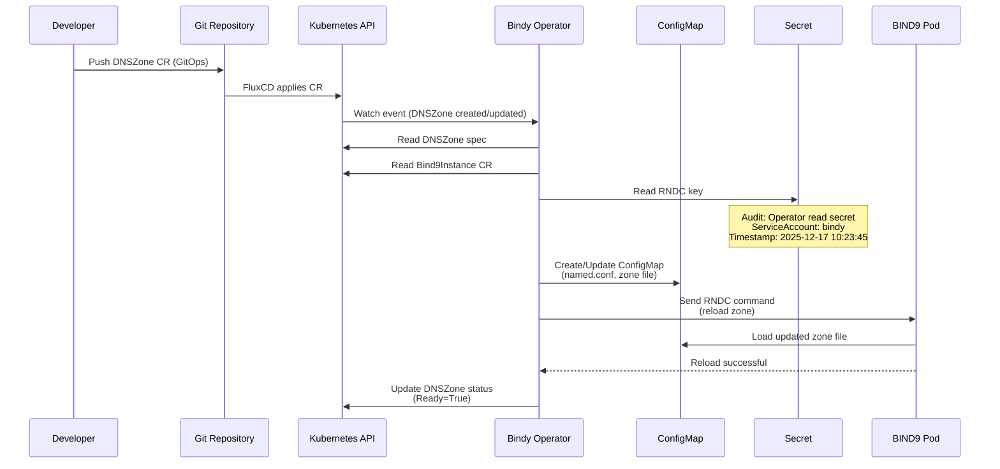
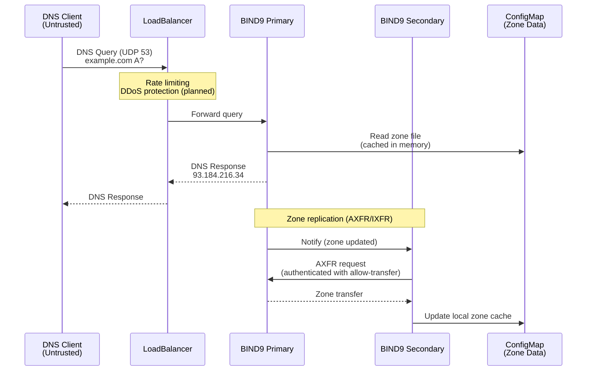
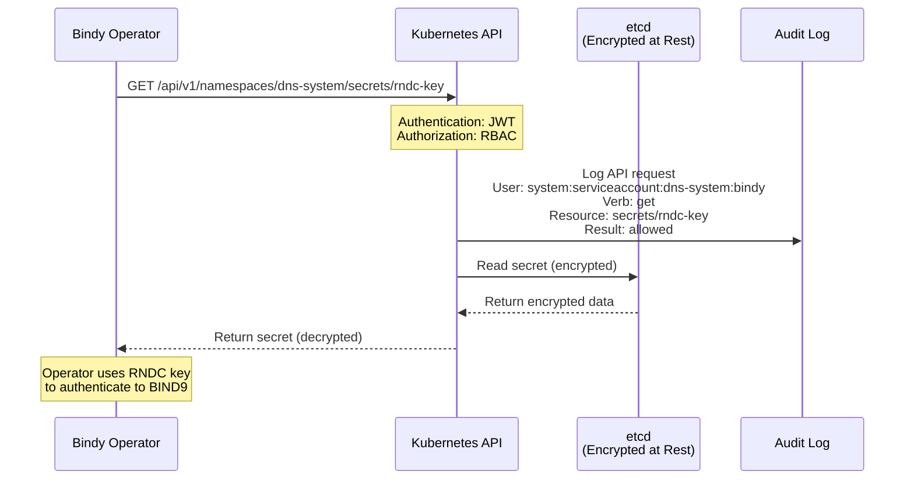
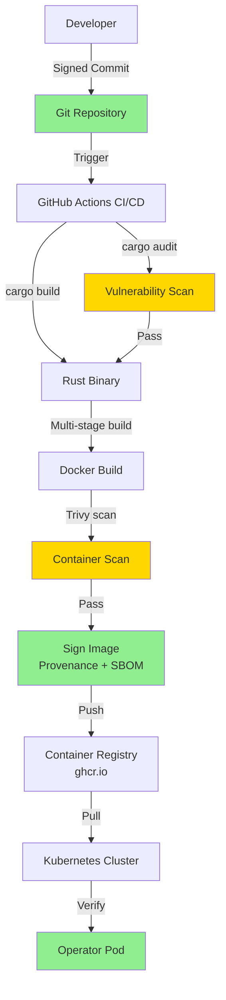
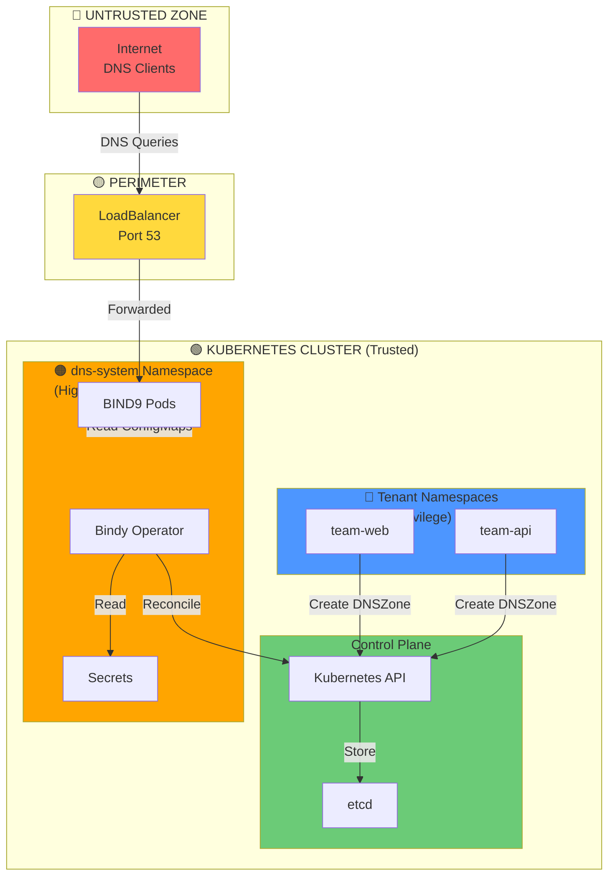
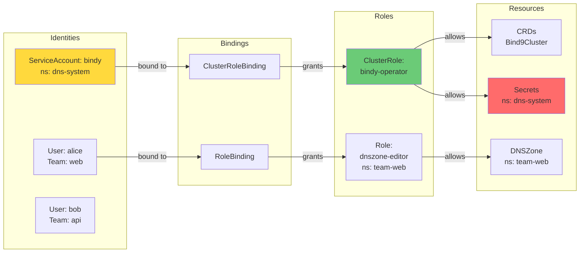
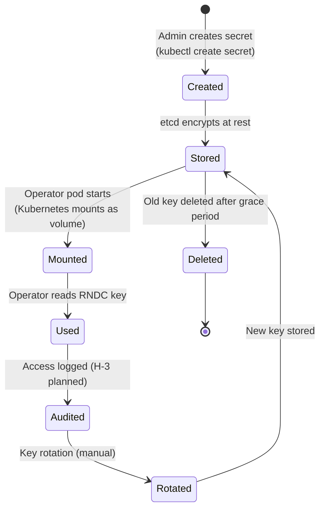
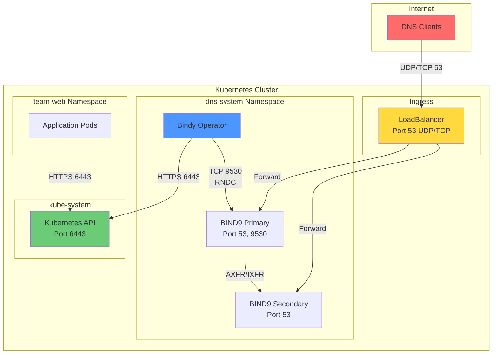
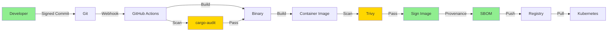

# Security Architecture - Bindy DNS Operator

**Version:** 1.0
**Last Updated:** 2025-12-17
**Owner:** Security Team
**Compliance:** SOX 404, PCI-DSS 6.4.1, Basel III

---

## Table of Contents

- [Overview](#overview)
- [Security Domains](#security-domains)
- [Data Flow Diagrams](#data-flow-diagrams)
- [Trust Boundaries](#trust-boundaries)
- [Authentication & Authorization](#authentication--authorization)
- [Secrets Management](#secrets-management)
- [Network Security](#network-security)
- [Container Security](#container-security)
- [Supply Chain Security](#supply-chain-security)

---

## Overview

This document describes the security architecture of the Bindy DNS Operator, including authentication, authorization, secrets management, network segmentation, and container security. The architecture follows defense-in-depth principles with multiple security layers.

### Security Principles

1. **Least Privilege**: All components have minimal permissions required for their function
2. **Defense in Depth**: Multiple security layers protect against single point of failure
3. **Zero Trust**: No implicit trust within the cluster; all access is authenticated and authorized
4. **Immutability**: Container filesystems are read-only; configuration is declarative
5. **Auditability**: All security-relevant events are logged and traceable

---

## Security Domains

### Domain 1: Development & CI/CD

**Purpose:** Code development, review, build, and release

**Components:**
- GitHub repository (source code)
- GitHub Actions (CI/CD pipelines)
- Container Registry (ghcr.io)
- Developer workstations

**Security Controls:**
- ✅ **Code Signing**: All commits cryptographically signed (GPG/SSH) - C-1
- ✅ **Code Review**: 2+ reviewers required for all PRs
- ✅ **Vulnerability Scanning**: cargo-audit + Trivy in CI/CD - C-3
- ✅ **SBOM Generation**: Software Bill of Materials for all releases
- ✅ **Branch Protection**: Signed commits required, no direct pushes to main
- ✅ **2FA**: Two-factor authentication required for all contributors

**Trust Level:** High (controls ensure code integrity)

---

### Domain 2: Kubernetes Control Plane

**Purpose:** Kubernetes API server, scheduler, operator-manager, etcd

**Components:**
- Kubernetes API server
- etcd (cluster state storage)
- Scheduler
- Operator-manager

**Security Controls:**
- ✅ **RBAC**: Role-Based Access Control enforced for all API requests
- ✅ **Encryption at Rest**: etcd data encrypted (including Secrets)
- ✅ **TLS**: All control plane communication encrypted
- ✅ **Audit Logging**: All API requests logged
- ✅ **Pod Security Admission**: Enforces Pod Security Standards

**Trust Level:** Critical (compromise of control plane = cluster compromise)

---

### Domain 3: dns-system Namespace

**Purpose:** Bindy operator and BIND9 pods

**Components:**
- Bindy operator (Deployment)
- BIND9 primary (StatefulSet)
- BIND9 secondaries (StatefulSet)
- ConfigMaps (BIND9 configuration)
- Secrets (RNDC keys)
- Services (DNS, RNDC endpoints)

**Security Controls:**
- ✅ **RBAC Least Privilege**: Operator has minimal permissions - C-2
- ✅ **Non-Root Containers**: All pods run as uid 1000+
- ✅ **Read-Only Filesystem**: Immutable container filesystems
- ✅ **Pod Security Standards**: Restricted profile enforced
- ✅ **Resource Limits**: CPU/memory limits prevent DoS
- ❌ **Network Policies** (planned - L-1): Restrict pod-to-pod communication

**Trust Level:** High (protected by RBAC, Pod Security Standards)

---

### Domain 4: Tenant Namespaces

**Purpose:** DNS zone management by application teams

**Components:**
- DNSZone custom resources
- DNS record custom resources (ARecord, CNAMERecord, etc.)
- Application pods (may read DNS records)

**Security Controls:**
- ✅ **Namespace Isolation**: Teams cannot access other namespaces
- ✅ **RBAC**: Teams can only manage their own DNS zones
- ✅ **CRD Validation**: OpenAPI v3 schema validation on all CRs
- ❌ **Admission Webhooks** (planned): Additional validation for DNS records

**Trust Level:** Medium (tenants are trusted but isolated)

---

### Domain 5: External Network

**Purpose:** Public internet (DNS clients)

**Components:**
- DNS clients (recursive resolvers, end users)
- LoadBalancer/NodePort services exposing port 53

**Security Controls:**
- ✅ **Rate Limiting**: BIND9 rate-limit directive prevents query floods
- ✅ **AXFR Restrictions**: Zone transfers only to known secondaries
- ❌ **DNSSEC** (planned): Cryptographic signing of DNS responses
- ❌ **Edge DDoS Protection** (planned): CloudFlare, AWS Shield

**Trust Level:** Untrusted (all traffic assumed hostile)

---

## Data Flow Diagrams

### Diagram 1: DNS Zone Reconciliation Flow



**Security Notes:**
- ✅ All API calls authenticated with ServiceAccount token (JWT)
- ✅ RBAC enforced at every step (operator has least privilege)
- ✅ Secret read is audited (H-3 planned)
- ✅ RNDC communication uses HMAC key authentication
- ✅ ConfigMap is immutable (recreated on change, not modified)

---

### Diagram 2: DNS Query Flow



**Security Notes:**
- ✅ DNS port 53 is public (required for DNS service)
- ✅ Rate limiting prevents query floods
- ✅ AXFR restricted to known secondary IPs
- ✅ Zone data is read-only in BIND9 (managed by operator)
- ❌ DNSSEC (planned): Would sign responses cryptographically

---

### Diagram 3: Secret Access Flow



**Security Notes:**
- ✅ Secrets encrypted at rest in etcd
- ✅ Secrets transmitted over TLS (in transit)
- ✅ RBAC limits secret read access to operator only
- ✅ Kubernetes audit log captures all secret access
- ❌ Dedicated secret access audit trail (H-3 planned): More visible tracking

---

### Diagram 4: Container Image Supply Chain



**Security Controls:**
- ✅ **C-1**: All commits signed (GPG/SSH)
- ✅ **C-3**: Vulnerability scanning (cargo-audit + Trivy)
- ✅ **SLSA Level 2**: Build provenance + SBOM
- ✅ **Signed Images**: Docker provenance attestation
- ❌ **M-1** (planned): Pin images by digest (not tags)
- ❌ **Image Verification** (planned): Admission operator verifies signatures

---

## Trust Boundaries

### Boundary Map



**Trust Boundary Rules:**

1. **Untrusted → Perimeter**: All traffic rate-limited, DDoS protection (planned)
2. **Perimeter → dns-system**: Only port 53 allowed, no direct access to operator
3. **dns-system → Control Plane**: Authenticated with ServiceAccount token, RBAC enforced
4. **Tenant Namespaces → Control Plane**: Authenticated with user credentials, RBAC enforced
5. **Secrets Access**: Only operator ServiceAccount can read, audit logged

---

## Authentication & Authorization

### RBAC Architecture



### Operator RBAC Permissions

**Cluster-Scoped Resources:**

| Resource | Verbs | Rationale |
|----------|-------|-----------|
| `bind9clusters.bindy.firestoned.io` | get, list, watch, create, update, patch | Manage cluster topology |
| `bind9instances.bindy.firestoned.io` | get, list, watch, create, update, patch | Manage BIND9 instances |
| ❌ **delete on ANY resource** | **DENIED** | ✅ C-2: Least privilege, prevent accidental deletion |

**Namespaced Resources (dns-system):**

| Resource | Verbs | Rationale |
|----------|-------|-----------|
| `secrets` | get, list, watch | Read RNDC keys (READ-ONLY) |
| `configmaps` | get, list, watch, create, update, patch | Manage BIND9 configuration |
| `deployments` | get, list, watch, create, update, patch | Manage BIND9 deployments |
| `services` | get, list, watch, create, update, patch | Expose DNS services |
| `serviceaccounts` | get, list, watch, create, update, patch | Manage BIND9 ServiceAccounts |
| ❌ **secrets** | ❌ create, update, patch, delete | ✅ PCI-DSS 7.1.2: Read-only access |
| ❌ **delete on ANY resource** | **DENIED** | ✅ C-2: Least privilege |

**Verification:**
```bash
# Run automated RBAC verification
deploy/rbac/verify-rbac.sh
```

---

### User RBAC Permissions (Tenants)

**Example: team-web namespace**

| User | Role | Resources | Verbs | Scope |
|------|------|-----------|-------|-------|
| alice | dnszone-editor | dnszones.bindy.firestoned.io | get, list, watch, create, update, patch | team-web only |
| alice | dnszone-editor | arecords, cnamerecords, ... | get, list, watch, create, update, patch | team-web only |
| alice | ❌ | dnszones in other namespaces | ❌ DENIED | Cannot access team-api zones |
| alice | ❌ | secrets, configmaps | ❌ DENIED | Cannot access BIND9 internals |

---

## Secrets Management

### Secret Types

| Secret | Purpose | Access | Rotation | Encryption |
|--------|---------|--------|----------|------------|
| **RNDC Key** | Authenticate to BIND9 | Operator: read-only | Manual (planned automation) | At rest: etcd, In transit: TLS |
| **TLS Certificates** (future) | HTTPS, DNSSEC | Operator: read-only | Cert-manager (automated) | At rest: etcd, In transit: TLS |
| **ServiceAccount Token** | Kubernetes API auth | Auto-mounted | Kubernetes (short-lived) | JWT signed by cluster CA |

### Secret Lifecycle



### Secret Protection

**At Rest:**
- ✅ etcd encryption enabled (AES-256-GCM)
- ✅ Secrets stored in Kubernetes Secrets (not in code, env vars, or ConfigMaps)

**In Transit:**
- ✅ All Kubernetes API communication over TLS
- ✅ ServiceAccount token transmitted over TLS

**In Use:**
- ✅ Operator runs as non-root (uid 1000+)
- ✅ Read-only filesystem (secrets cannot be written to disk)
- ✅ Memory protection (secrets cleared after use - Rust Drop trait)

**Access Control:**
- ✅ RBAC limits secret read to operator only
- ✅ Kubernetes audit log captures all secret access
- ❌ **H-3** (planned): Dedicated secret access audit trail with alerts

---

## Network Security

### Network Architecture



### Network Policies (Planned - L-1)

**Policy 1: Operator Egress**
```yaml
apiVersion: networking.k8s.io/v1
kind: NetworkPolicy
metadata:
  name: bindy-operator-egress
  namespace: dns-system
spec:
  podSelector:
    matchLabels:
      app.kubernetes.io/name: bindy
  policyTypes:
  - Egress
  egress:
  # Allow: Kubernetes API
  - to:
    - namespaceSelector:
        matchLabels:
          name: kube-system
    ports:
    - protocol: TCP
      port: 6443
  # Allow: BIND9 RNDC
  - to:
    - podSelector:
        matchLabels:
          app.kubernetes.io/name: bind9
    ports:
    - protocol: TCP
      port: 9530
  # Allow: DNS (for cluster DNS resolution)
  - to:
    - namespaceSelector: {}
      podSelector:
        matchLabels:
          k8s-app: kube-dns
    ports:
    - protocol: UDP
      port: 53
```

**Policy 2: BIND9 Ingress**
```yaml
apiVersion: networking.k8s.io/v1
kind: NetworkPolicy
metadata:
  name: bind9-ingress
  namespace: dns-system
spec:
  podSelector:
    matchLabels:
      app.kubernetes.io/name: bind9
  policyTypes:
  - Ingress
  ingress:
  # Allow: DNS queries from anywhere
  - from:
    - namespaceSelector: {}
    ports:
    - protocol: UDP
      port: 53
    - protocol: TCP
      port: 53
  # Allow: RNDC from operator only
  - from:
    - podSelector:
        matchLabels:
          app.kubernetes.io/name: bindy
    ports:
    - protocol: TCP
      port: 9530
  # Allow: AXFR from secondaries only
  - from:
    - podSelector:
        matchLabels:
          app.kubernetes.io/name: bind9
          app.kubernetes.io/component: secondary
    ports:
    - protocol: TCP
      port: 53
```

---

## Container Security

### Container Hardening

**Bindy Operator Pod Security:**

```yaml
apiVersion: v1
kind: Pod
metadata:
  name: bindy-operator
spec:
  serviceAccountName: bindy
  securityContext:
    runAsNonRoot: true
    runAsUser: 1000
    runAsGroup: 1000
    fsGroup: 1000
    seccompProfile:
      type: RuntimeDefault
  containers:
  - name: operator
    image: ghcr.io/firestoned/bindy:latest
    securityContext:
      allowPrivilegeEscalation: false
      readOnlyRootFilesystem: true
      capabilities:
        drop:
        - ALL
      runAsNonRoot: true
      runAsUser: 1000
    resources:
      requests:
        memory: "128Mi"
        cpu: "100m"
      limits:
        memory: "256Mi"
        cpu: "500m"
    volumeMounts:
    - name: tmp
      mountPath: /tmp
      readOnly: false  # Only /tmp is writable
    - name: rndc-key
      mountPath: /etc/bindy/rndc
      readOnly: true
  volumes:
  - name: tmp
    emptyDir:
      sizeLimit: 100Mi
  - name: rndc-key
    secret:
      secretName: rndc-key
```

**Security Features:**
- ✅ Non-root user (uid 1000)
- ✅ Read-only root filesystem (only /tmp writable)
- ✅ No privileged escalation
- ✅ All capabilities dropped
- ✅ seccomp profile (restrict syscalls)
- ✅ Resource limits (prevent DoS)
- ✅ Secrets mounted read-only

---

### Image Security

**Base Image: Chainguard (Zero-CVE)**

```dockerfile
FROM cgr.dev/chainguard/static:latest
COPY --chmod=755 bindy /usr/local/bin/bindy
USER 1000:1000
ENTRYPOINT ["/usr/local/bin/bindy"]
```

**Features:**
- ✅ Chainguard static base (zero CVEs, no package manager)
- ✅ Minimal attack surface (~15MB image size)
- ✅ No shell, no utilities (static binary only)
- ✅ FIPS-ready (if required)
- ✅ Signed image with provenance
- ✅ SBOM included

**Vulnerability Scanning:**
- ✅ Trivy scans on every PR, main push, release
- ✅ CI fails on CRITICAL/HIGH vulnerabilities
- ✅ Daily scheduled scans detect new CVEs

---

## Supply Chain Security

### SLSA Level 2 Compliance

| Requirement | Implementation | Status |
|-------------|----------------|--------|
| **Build provenance** | Signed commits provide authorship proof | ✅ C-1 |
| **Source integrity** | GPG/SSH signatures verify source | ✅ C-1 |
| **Build integrity** | SBOM generated for all releases | ✅ SLSA |
| **Build isolation** | GitHub Actions ephemeral runners | ✅ CI/CD |
| **Parameterless build** | Reproducible builds (same input = same output) | ❌ H-4 (planned) |

### Supply Chain Flow



**Supply Chain Threats Mitigated:**
- ✅ **Code Injection**: Signed commits prevent unauthorized code changes
- ✅ **Dependency Confusion**: cargo-audit verifies dependencies from crates.io
- ✅ **Malicious Dependencies**: Vulnerability scanning detects known CVEs
- ✅ **Image Tampering**: Signed images with provenance attestation
- ❌ **Compromised Build Environment** (partially): Ephemeral runners, but build reproducibility not verified (H-4)

---

## References

- [Kubernetes Security Best Practices](https://kubernetes.io/docs/concepts/security/security-checklist/)
- [Pod Security Standards](https://kubernetes.io/docs/concepts/security/pod-security-standards/)
- [SLSA Framework](https://slsa.dev/)
- [NIST SP 800-204B - Attribute-based Access Control for Microservices](https://csrc.nist.gov/publications/detail/sp/800-204b/final)
- [CIS Kubernetes Benchmark](https://www.cisecurity.org/benchmark/kubernetes)

---

**Last Updated:** 2025-12-17
**Next Review:** 2025-03-17 (Quarterly)
**Approved By:** Security Team
